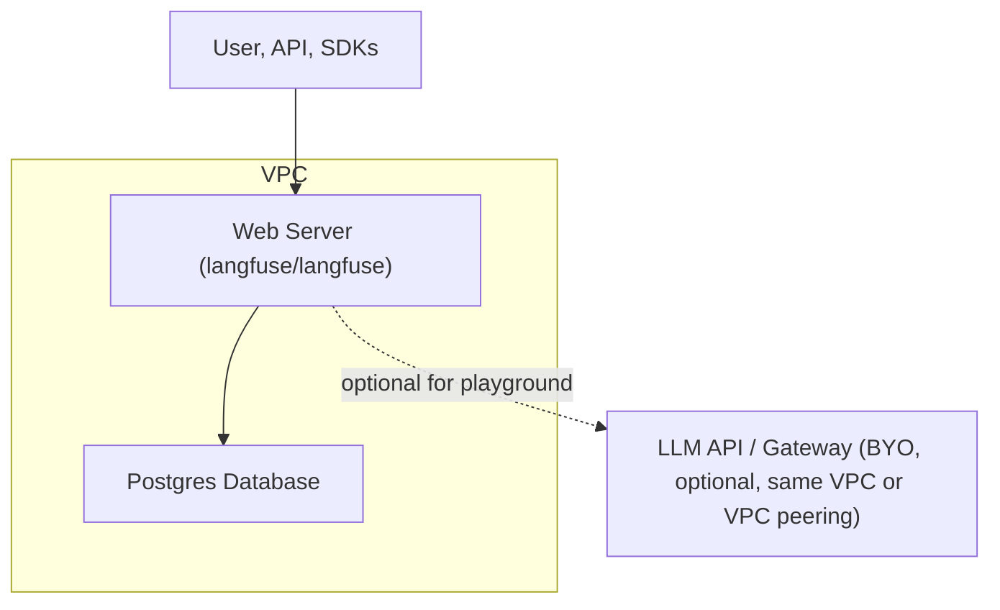

```mermaid
flowchart TB
    User["User, API, SDKs"]
    subgraph vpc["VPC"]
        Web["Web Server (langfuse/langfuse)"]
        Postgres[Postgres Database]
    end
    LLM["LLM API / Gateway (BYO, optional, same VPC or VPC peering)"]

    User --> Web
    Web --> Postgres
    Web -.->|"optional for playground"| LLM
```
