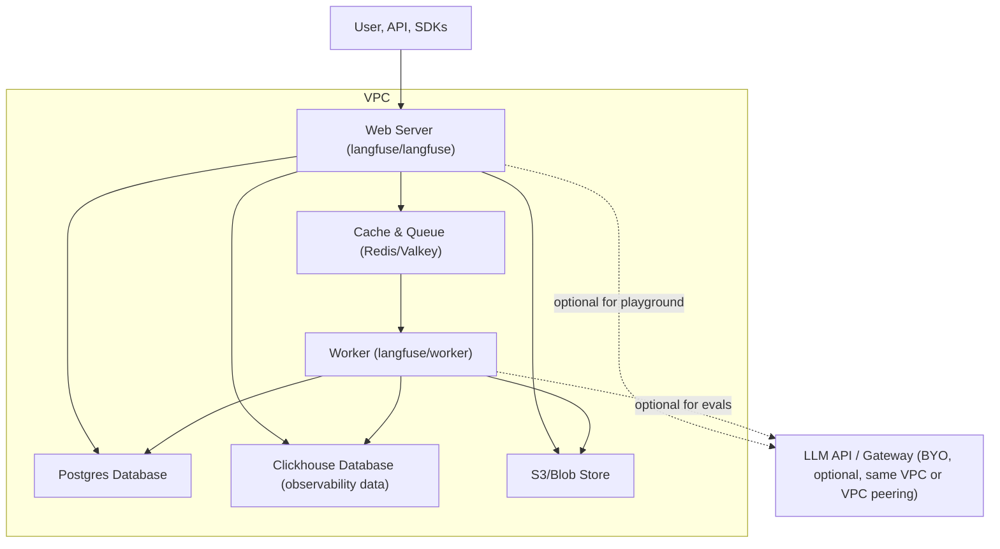

```mermaid
flowchart TB
    User["User, API, SDKs"]
    subgraph vpc["VPC"]
        Web["Web Server (langfuse/langfuse)"]
        Worker["Worker (langfuse/worker)"]
        Postgres[Postgres Database]
        Cache["Cache & Queue (Redis/Valkey)"]
        Clickhouse["Clickhouse Database (observability data)"]
        S3[S3/Blob Store]
    end
    LLM["LLM API / Gateway (BYO, optional, same VPC or VPC peering)"]

    User --> Web
    Web --> S3
    Web --> Postgres
    Web --> Cache
    Web --> Clickhouse
    Web -.->|"optional for playground"| LLM

    Cache --> Worker
    Worker --> Clickhouse
    Worker --> Postgres
    Worker --> S3
    Worker -.->|"optional for evals"| LLM
```
