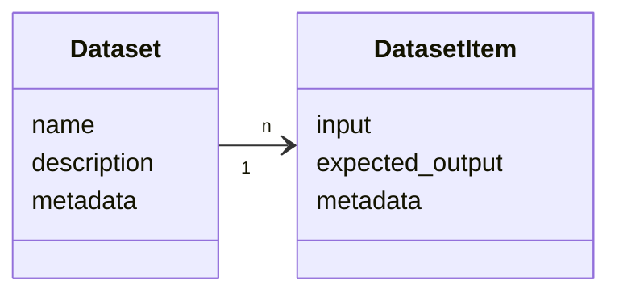
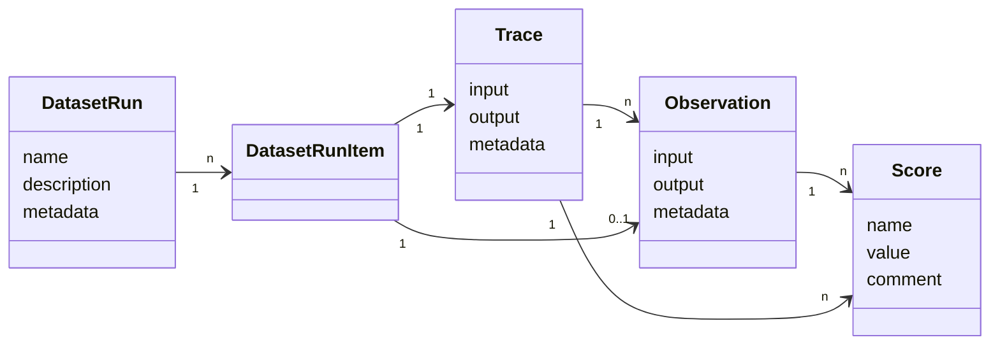
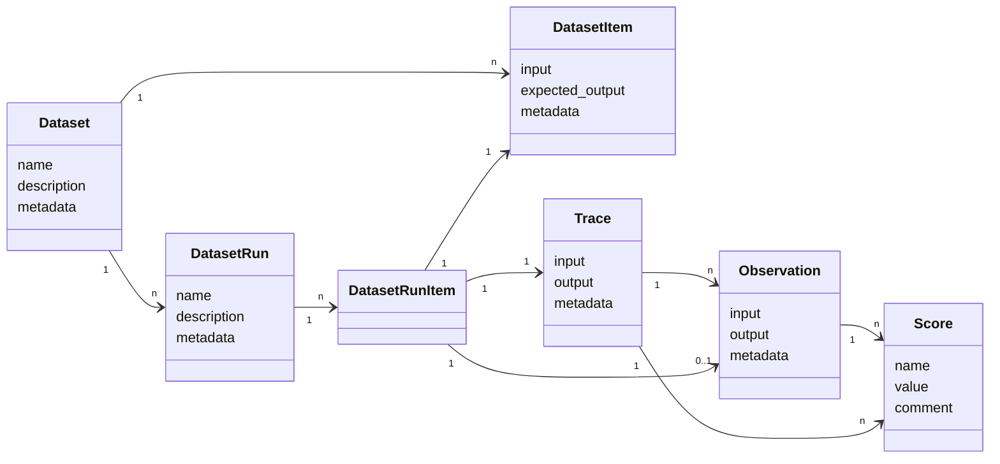

## Dataset

`Dataset` contains a `name`, `description`, and `metadata`. It is a collection of `DatasetItem`s.

`DatasetItem` contains `input`, `expected_output`, and `metadata`.

 

## DatasetRun

`DatasetRun` is an experiment run on a `Dataset`, it is identified by a unique `name`.

`DatasetRunItem` links a `DatasetItem` to a [`Trace`](/docs/observability/data-model#traces) created during an experiment.

Evaluation metrics of a `DatasetRun` are based on [`Scores`](/docs/evaluation/evaluation-methods/data-model) associated with the `Traces` linked to run.

 

## Dataset and DatasetRun relations

One `Dataset` can contain multiple `DatasetRun`s.

Each `DatasetRunItem` links to a `DatasetItem` and a `Trace`.

 

