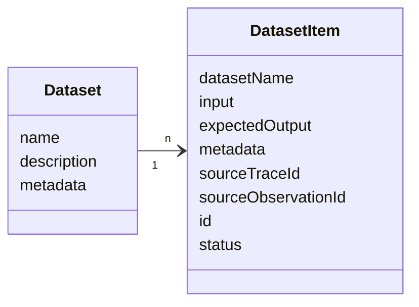
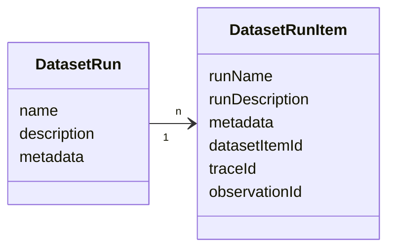
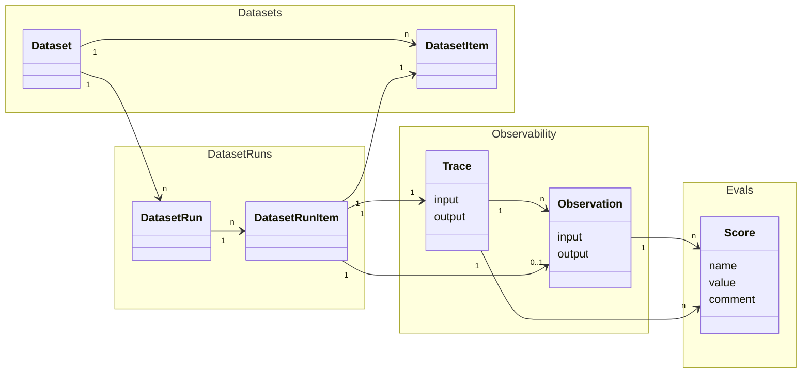

## Datasets
Datasets are a collection of inputs and, optionally, expected outputs that can be during Dataset runs.

`Dataset`s are a collection of `DatasetItem`s. 

### Dataset object

| Attribute     | Type   | Required | Description                                                                 |
| ------------- | ------ | -------- | --------------------------------------------------------------------------- |
| `name`        | string | Yes      | Name of the dataset                                                         |
| `description` | string | No       | Description of the dataset                                                  |
| `metadata`    | object | No       | Additional metadata for the dataset                                         |

### DatasetItem object

| Attribute          | Type           | Required | Description                                                                                                                                                                                               |
| ------------------ | -------------- | -------- | --------------------------------------------------------------------------------------------------------------------------------------------------------------------------------------------------------- |
| `datasetName`      | string         | Yes      | Name of the dataset to add the item to                                                                                                                                                                    |
| `input`            | object         | No       | Input data for the dataset item                                                                                                                                                                           |
| `expectedOutput`   | object         | No       | Expected output data for the dataset item                                                                                                                                                                 |
| `metadata`         | object         | No       | Additional metadata for the dataset item                                                                                                                                                                  |
| `sourceTraceId`    | string         | No       | ID of the source trace to link this dataset item to                                                                                                                                                       |
| `sourceObservationId` | string      | No       | ID of the source observation to link this dataset item to                                                                                                                                                 |
| `id`               | string         | No       | Unique identifier for the dataset item. Dataset items are upserted on their id. Id needs to be unique (project-level) and cannot be reused across datasets.                                              |
| `status`           | DatasetStatus  | No       | Status of the dataset item. Defaults to ACTIVE for newly created items. Possible values: `ACTIVE`, `ARCHIVED`                                                                                            |

## DatasetRun
Dataset runs are used to run a dataset through your LLM application and optionally apply evaluation methods to the results.

 

### DatasetRun object

| Attribute      | Type   | Required | Description                                                                 |
| -------------- | ------ | -------- | --------------------------------------------------------------------------- |
| `datasetName`  | string | Yes      | Name of the dataset                                                         |
| `runName`      | string | Yes      | Name of the dataset run                                                     |

### DatasetRunItem object

| Attribute        | Type   | Required | Description                                                                                                                                                                                               |
| ---------------- | ------ | -------- | --------------------------------------------------------------------------------------------------------------------------------------------------------------------------------------------------------- |
| `runName`        | string | Yes      | Name of the dataset run to add the item to                                                                                                                                                               |
| `runDescription` | string | No       | Description of the run. If run exists, description will be updated                                                                                                                                       |
| `metadata`       | object | No       | Metadata of the dataset run, updates run if run already exists                                                                                                                                           |
| `datasetItemId`  | string | Yes      | ID of the dataset item to link to this run                                                                                                                                                               |
| `observationId`  | string | No       | ID of the observation to link to this run                                                                                                                                                                |
| `traceId`        | string | No       | ID of the trace to link to this run. traceId should always be provided. For compatibility with older SDK versions it can also be inferred from the provided observationId. |

<Callout type="info">
Most of the time, we recommend that DatasetRunItems reference TraceIDs directly. The reference to ObservationID exists for backwards compatibility with older SDK versions. 
</Callout>

## End to end data relations

DataSetRuns can combine a few Langfuse objects:
- `DatasetRuns` are are created by looping through all or selected `DatasetItem`s of a `Dataset` with your LLM application.
- For each `DatasetItem` passed into the LLM application as an Input a `DatasetRunItem` & a `Trace` are created. 
- Optionally `Score`s can be added to the `Trace`s to evaluate the output of the LLM application during the `DatasetRun`. 

 

