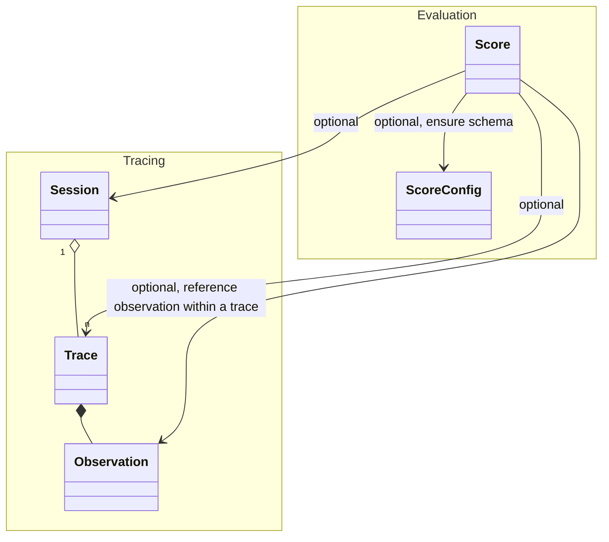

`Scores` serve as objects for storing evaluation metrics in Langfuse.

- Scores can be at the **trace level** or **session level**:
  - **Trace level scores** are used for evaluation of a single interaction and can optionally reference a specific observation within a trace
  - **Session level scores** are used for comprehensive evaluation of conversational experiences across multiple interactions
- They can be **numeric**, **categorical**, or **boolean**
- A `comment` can be added to provide additional context or information about the score
- Optionally, scores can be linked to a `score configuration` to ensure they comply with a specific schema

High-level data model and its relations to the tracing and session data model:

## `Score` object in Langfuse

| Attribute       | Type   | Description                                                                                                                                                                                               |
| --------------- | ------ | --------------------------------------------------------------------------------------------------------------------------------------------------------------------------------------------------------- |
| `name`          | string | Name of the score, e.g. user_feedback, hallucination_eval                                                                                                                                                 |
| `value`         | number | Optional: Numeric value of the score. Always defined for numeric and boolean scores. Optional for categorical scores.                                                                                     |
| `stringValue`   | string | Optional: String equivalent of the score's numeric value for boolean and categorical data types. Automatically set for categorical scores based on the config if the `configId` is provided.              |
| `traceId`       | string | Optional: Id of the trace the score relates to                                                                                                                                                            |
| `observationId` | string | Optional: Observation (e.g. LLM call) the score relates to                                                                                                                                                |
| `sessionId`     | string | Optional: Id of the session the score relates to                                                                                                                                                            |
| `comment`       | string | Optional: Evaluation comment, commonly used for user feedback, eval output or internal notes                                                                                                              |
| `id`            | string | Unique identifier of the score. Auto-generated by SDKs. Optionally can also be used as an indempotency key to update scores.                                                                              |
| `source`        | string | Automatically set based on the souce of the score. Can be either `API`, `EVAL`, or `ANNOTATION`                                                                                                           |
| `dataType`      | string | Automatically set based on the config data type when the `configId` is provided. Otherwise can be defined manually as `NUMERIC`, `CATEGORICAL` or `BOOLEAN`                                               |
| `configId`      | string | Optional: Score config id to ensure that the score follows a specific schema. Can be defined in the Langfuse UI or via API. When provided the score's `dataType` is automatically set based on the config |
