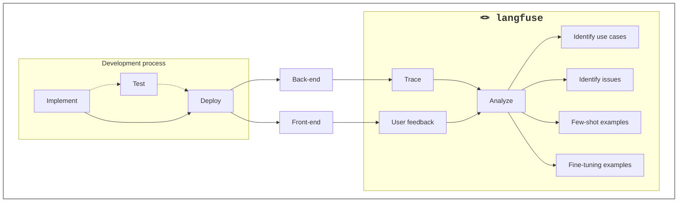

```mermaid
graph
  subgraph Wrapper [" "]
    subgraph "Development process"
      D[Implement] -.-> Z[Test]
      Z -.-> E[Deploy]
      D --> E
    end
    E --> FE[Front-end]
    E --> BE[Back-end]
    BE --> F[Trace]
    FE --> G[User feedback]

    subgraph langfuse ["🪢 langfuse"]
      F --> H[Analyze]
      G --> H
      H --> I[Identify use cases]
      H --> J[Identify issues]
      H --> K[Few-shot examples]
      H --> L[Fine-tuning examples]
    end
  end
  classDef transparent fill:none, stroke:gray, stroke-width:2px;
  class Wrapper transparent;

  classDef title font-weight:bold, font-size:24px, font-family:monospace;
  class langfuse title;
```
