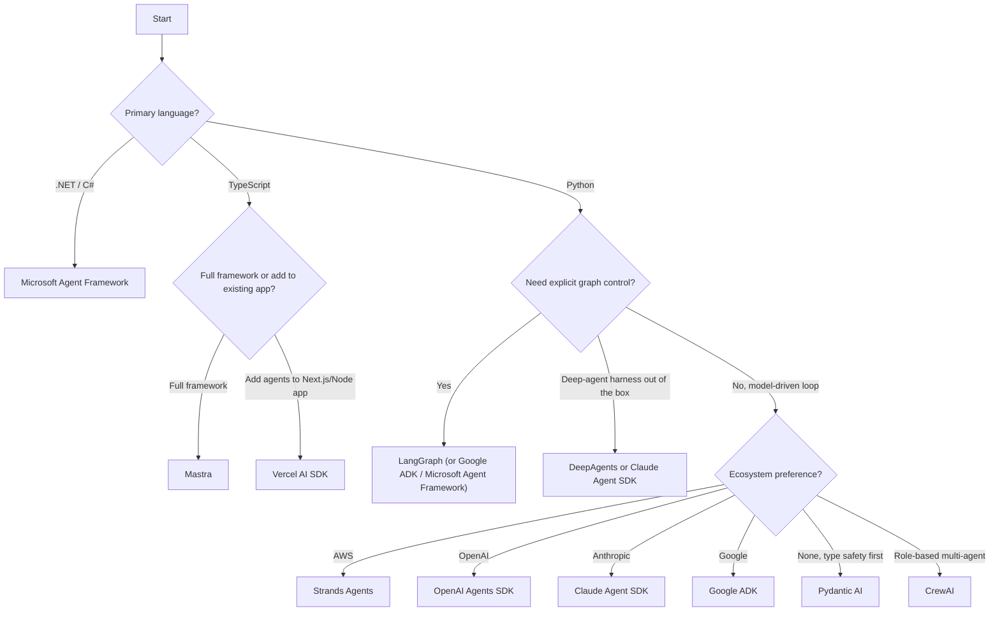

import { BlogHeader } from "@/components/blog/BlogHeader";

<BlogHeader
  title="Open-Source AI Agent Frameworks: Which One Is Right for You?"
  description="Compare the leading open-source AI agent frameworks in 2026, including LangGraph, OpenAI Agents SDK, Claude Agent SDK, Google ADK, Pydantic AI, CrewAI, Strands Agents, Mastra, Vercel AI SDK, and Microsoft Agent Framework. Learn when to use each and how to trace agent behavior with Langfuse."
  date="July 13, 2026"
  authors={["jannikmaierhoefer"]}
/>

Building AI agents used to be a patchwork of scripts, prompt engineering, and trial-and-error. Today, there is a mature landscape of open-source frameworks designed to streamline the process of creating agents that reason, plan, and execute tasks autonomously. This post offers an in-depth look at the leading open-source AI agent frameworks as of July 2026: **LangGraph, LangChain DeepAgents, the OpenAI Agents SDK, the Claude Agent SDK, Google ADK, Pydantic AI, CrewAI, Strands Agents, Mastra, the Vercel AI SDK, Microsoft Agent Framework, Agno, and Smolagents**. By the time you finish reading, you should have a clearer view of each framework's sweet spot, how they differ, and where they excel in real-world development.

One of the biggest challenges in agent development is striking the right balance between giving the AI enough autonomy to handle tasks dynamically and maintaining enough structure for reliability. Each framework has its own philosophy, from explicit graph-based workflows to lightweight model-driven loops. We walk through their core ideas, compare the pairs that teams most often evaluate against each other, and show how to integrate each with monitoring solutions like Langfuse ([GitHub](https://github.com/langfuse/langfuse)) to evaluate and debug them in production.

If you want the short answer before the details:

- **LangGraph** remains the default for complex, stateful workflows where you need explicit control over every step.
- **Pydantic AI** is the strongest choice for Python teams that want type safety and validation without heavy orchestration.
- **Mastra** and the **Vercel AI SDK** are the leading options for TypeScript teams.
- **Strands Agents**, the **OpenAI Agents SDK**, the **Claude Agent SDK**, **Google ADK**, and **Microsoft Agent Framework** are the natural picks if you are committed to the AWS, OpenAI, Anthropic, Google, or Microsoft ecosystems respectively.
- **CrewAI** is the most approachable way to build role-based multi-agent teams.

## LangGraph

[LangGraph](https://github.com/langchain-ai/langgraph) extends the well-known [LangChain](https://github.com/langchain-ai/langchain) ecosystem with a graph-based architecture that treats agent steps like nodes in a directed graph. Each node handles a prompt or sub-task, and edges control data flow and transitions. This is helpful for complex, multi-step tasks where you need precise control over branching and error handling. Since reaching 1.0, LangGraph has focused on production concerns: durable execution that resumes agents exactly where they left off after a failure, human-in-the-loop interrupts, and short-term plus long-term memory. It is available in Python and JavaScript and is used in production by companies including Klarna, Replit, and Elastic (per the project README, July 2026).

<Video src="https://static.langfuse.com/docs-videos/langgraph-overview.mp4" gifStyle aspectRatio={1546 / 1080} />
_[Example trace in Langfuse](https://cloud.langfuse.com/project/cloramnkj0002jz088vzn1ja4/traces/a8b0cc9e-da3b-485f-a642-35431a6f9289)_

[How to trace LangGraph agents with Langfuse →](/guides/cookbook/integration_langgraph)

Developers who prefer to model AI tasks as stateful workflows gravitate toward LangGraph. If your application demands robust task decomposition, parallel branching, or the ability to inject custom logic at specific stages, LangGraph's explicit approach is a good fit.

## LangChain DeepAgents

[DeepAgents](https://github.com/langchain-ai/deepagents) is LangChain's opinionated agent harness built on top of LangGraph. Where LangGraph gives you low-level primitives, DeepAgents ships the batteries: planning, subagents that delegate work into isolated context windows, a filesystem abstraction for reading and writing across local or sandboxed backends, context management that offloads long tool outputs to disk, and middleware for shell access, human-in-the-loop approvals, and reusable skills. It works with any tool-calling model and is available in Python and JavaScript.

<Frame fullWidth>
  
</Frame>

[How to trace DeepAgents with Langfuse →](/integrations/frameworks/langchain-deepagents)

If you want the "deep agent" pattern (a planner with subagents and file-backed memory) without assembling it yourself from LangGraph parts, DeepAgents is the fastest path inside the LangChain ecosystem.

## OpenAI Agents SDK

The [OpenAI Agents SDK](https://github.com/openai/openai-agents-python) packages OpenAI's agent patterns into a small set of primitives: agents (an LLM with instructions and tools), handoffs for delegating between agents, guardrails for validating inputs and outputs, and sessions that manage conversation history automatically. Despite the name, it is provider-agnostic and supports over 100 non-OpenAI models via LiteLLM and any-llm integrations. It also ships built-in tracing and realtime voice agents. The SDK is still on 0.x versions but receives frequent releases (0.18 as of July 2026), and a separate JavaScript/TypeScript version exists.

<Frame fullWidth>
  
</Frame>
_[Example trace in Langfuse](https://cloud.langfuse.com/project/cloramnkj0002jz088vzn1ja4/traces/483a2afb22b41ee49d7d1e5b41b4967a?timestamp=2025-09-30T09%3A01%3A29.194Z&observation=e3e3580728f3fec4)_

[How to trace the OpenAI Agents SDK with Langfuse →](/integrations/frameworks/openai-agents)

If you are already deep in OpenAI's stack and want an officially supported way to build multi-agent workflows with minimal abstraction overhead, the OpenAI Agents SDK is the first stop.

## Claude Agent SDK

The [Claude Agent SDK](https://github.com/anthropics/claude-agent-sdk-python) is Anthropic's framework for building agents on the same harness that powers Claude Code. Instead of writing your own agent loop, you get a production-tested one: the SDK bundles the Claude Code runtime and exposes it programmatically, with hooks that let your code intercept specific points of the agent loop, in-process MCP servers for defining custom tools without subprocess management, and granular tool permission allowlists. It is available for Python (3.10+) and TypeScript.

<Frame fullWidth>
  
</Frame>

[How to trace the Claude Agent SDK with Langfuse →](/integrations/frameworks/claude-agent-sdk)

If your agents are Claude-based and you want file access, shell tools, subagents, and permissioning that have already been hardened in Claude Code, the Claude Agent SDK gives you that loop as a library instead of a framework you assemble yourself.

## Google Agent Development Kit (ADK)

[Google ADK](https://github.com/google/adk-python) is Google's open-source, code-first framework for building, evaluating, and deploying AI agents. Now on 2.x, it centers on a workflow runtime (a graph-based execution engine with routing, loops, retry logic, and nested workflows) and a Task API for structured agent-to-agent delegation with multi-turn and human-in-the-loop support. ADK integrates natively with Gemini models while supporting other providers, and ships an interactive CLI and web UI for local testing.

<Frame fullWidth>
  
</Frame>
_[Example trace in Langfuse](https://cloud.langfuse.com/project/cloramnkj0002jz088vzn1ja4/traces/b82a0bdc1994fc5d1c8576ca032543f7?timestamp=2025-08-28T07:32:30.303Z&display=details)_

[How to trace Google ADK with Langfuse →](/integrations/frameworks/google-adk)

If you are in Google's ecosystem and want built-in multi-agent orchestration alongside Gemini model support, Google ADK is a strong fit. Its session management and runner abstractions handle much of the boilerplate, letting you focus on agent logic.

## Pydantic AI

[Pydantic AI](https://ai.pydantic.dev/) brings Pydantic's type safety and ergonomic developer experience to agent development. You define your agent's inputs, tool signatures, and outputs as Python types, and the framework handles validation plus OpenTelemetry instrumentation under the hood, moving whole categories of errors from runtime to write-time. Since reaching 2.x, it adds durable execution (agents preserve progress across API failures and restarts), a type-hint-driven graph system, and support for virtually every major model provider, including OpenAI, Anthropic, Gemini, DeepSeek, Grok, Cohere, and Mistral.

<Frame fullWidth>
  
</Frame>

_[Example trace in Langfuse](https://cloud.langfuse.com/project/cloramnkj0002jz088vzn1ja4/traces/25f4bdeebaab60e6e1bee7e8469554bc?timestamp=2025-06-06T14%3A39%3A55.786Z&display=details)_

[How to trace Pydantic AI with Langfuse →](/integrations/frameworks/pydantic-ai)

If you are a Python developer who values explicit type contracts, tests, and quick feedback loops, Pydantic AI offers a lightweight yet powerful path to production-ready agents with minimal boilerplate. It brings that FastAPI feeling to agent development.

## CrewAI

[CrewAI](https://github.com/crewAIInc/crewAI) is all about role-based collaboration among multiple agents. You give each agent a distinct role and skillset, then let them cooperate to solve a problem inside a "Crew" that coordinates workflows and shared context. CrewAI is a standalone framework (it is not built on LangChain) and, since 1.0, pairs autonomous Crews with **Flows**: event-driven workflows with conditional branching and state handling that let you wrap agent autonomy inside deterministic business logic. We like CrewAI because it is easy to configure while still letting you attach memory, checkpointing, and structured outputs.

<Frame fullWidth>
  
</Frame>
_[Example trace in Langfuse](https://cloud.langfuse.com/project/cloramnkj0002jz088vzn1ja4/traces/a287bb31e317433610d8827617471140?timestamp=2025-07-11T07:45:13.601Z&display=details)_

[How to trace CrewAI agents with Langfuse →](/integrations/frameworks/crewai)

If your use case calls for a multi-agent approach, like a planner agent delegating to researcher and writer agents, CrewAI makes that easy, and Flows keep the surrounding process under your control.

## Strands Agents

[Strands Agents](https://github.com/strands-agents/sdk-python) is AWS's open-source, model-driven agent framework: you define a model, tools, and a prompt, and the SDK runs the agent loop with context management, guardrails, and execution limits built in. It provides first-class support for Amazon Bedrock (the default), Anthropic, OpenAI, and Google Gemini, with more providers available, and ships SDKs for both Python (3.10+) and TypeScript (Node.js 20+). Strands emphasizes production readiness with OpenTelemetry-based tracing of every step in the loop. It is Apache-2.0 licensed and, as of July 2026, on an actively released 1.x line.

<Frame fullWidth>
  
</Frame>

_[Example trace in Langfuse](https://cloud.langfuse.com/project/cloramnkj0002jz088vzn1ja4/traces/c9d6f01342ca664464b2e56f649d9da4?timestamp=2025-05-17T13%3A22%3A14.561Z&display=details)_

[How to trace Strands Agents with Langfuse →](/integrations/frameworks/strands-agents)

Strands runs anywhere (AWS, other clouds, or on-prem). If you are on AWS you get deep Bedrock integration by default; otherwise you can use any supported provider while still pairing with Langfuse's observability pipeline.

## Mastra

[Mastra](https://github.com/mastra-ai/mastra) is a TypeScript-first agent framework that provides the essential primitives for building AI applications: agents with memory and tool calling, graph-based workflows with `.then()`, `.branch()`, and `.parallel()` control flow, RAG for knowledge integration, and built-in evals and observability. Now on a stable 1.x line, it offers unified model routing across more than 40 providers, suspend-and-resume for human-in-the-loop steps, and integrations with React, Next.js, and Node environments. The core is Apache-2.0 licensed.

<Frame fullWidth>
  
</Frame>

[How to trace Mastra agents with Langfuse →](/integrations/frameworks/mastra)

If you are building agents in TypeScript and want a framework designed from the ground up for the JS/TS ecosystem, with workflows, RAG, and evals in one package, Mastra is a compelling choice.

## Vercel AI SDK

The [Vercel AI SDK](https://github.com/vercel/ai) started as a set of LLM primitives for TypeScript and has grown into a full agent toolkit. AI SDK 7 (current as of July 2026) ships three agent abstractions: `ToolLoopAgent` runs the classic tool-calling loop with configurable stopping conditions and typed runtime context, `HarnessAgent` runs preconfigured harnesses such as Claude Code or Codex instead of building the loop yourself, and `WorkflowAgent` makes each tool execution a durable, automatically retried step via Vercel's Workflow SDK. If your team already uses the AI SDK for LLM calls, you keep the same provider-agnostic model interface and UI streaming helpers and add agents on top.

<Frame fullWidth>
  
</Frame>

[How to trace the Vercel AI SDK with Langfuse →](/integrations/frameworks/vercel-ai-sdk)

If your team builds product features in Next.js or Node and wants agents without adopting a separate framework, the AI SDK lets you add an agent loop to the stack you already have.

## Microsoft Agent Framework

The [Microsoft Agent Framework](https://github.com/microsoft/agent-framework) is Microsoft's consolidated agent framework and the successor to both AutoGen and Semantic Kernel for new agent work. It reached a stable 1.x release and combines AutoGen's multi-agent orchestration patterns with Semantic Kernel's enterprise focus: graph-based workflows (sequential, concurrent, handoff, and group collaboration), a middleware system, YAML-based declarative agent definitions, and consistent APIs across Python and .NET/C#. Observability comes built in through OpenTelemetry, and agents can be deployed to Microsoft Foundry for hosted execution.

Two facts matter if you are choosing within the Microsoft ecosystem (verified July 2026):

- **[AutoGen](https://github.com/microsoft/autogen) is in maintenance mode.** Its README states it "will not receive new features or enhancements and is community managed going forward," and recommends existing users migrate via the official AutoGen-to-Agent-Framework guide. Existing AutoGen apps keep working, and [Langfuse's AutoGen integration](/integrations/frameworks/autogen) remains available.
- **[Semantic Kernel](https://github.com/microsoft/semantic-kernel) still ships releases** and remains a solid library for embedding AI "skills" into .NET applications, but Microsoft's agent investment now flows into Agent Framework, which provides a Semantic Kernel migration guide. Langfuse's [Semantic Kernel integration](/integrations/frameworks/semantic-kernel) continues to work.

<Frame fullWidth>
  
</Frame>
_[Example trace in Langfuse](https://cloud.langfuse.com/project/cloramnkj0002jz088vzn1ja4/traces/8e419d3288419b5d944270505640e183?observation=2406e8343fd49c0e&timestamp=2025-12-17T09:37:37.258Z)_

[How to trace Microsoft Agent Framework with Langfuse →](/integrations/frameworks/microsoft-agent-framework)

If you are in the Microsoft ecosystem, or you need first-class .NET support with Azure integration, Microsoft Agent Framework is now the default choice, and the framework AutoGen and Semantic Kernel teams point new projects toward.

## Agno

[Agno](https://github.com/agno-agi/agno) is a framework and runtime for building agent platforms while keeping ownership of your infrastructure and data. It combines three layers: a Python SDK for building agents, the AgentOS runtime for executing them, and a control plane for management. Agents get sessions, memory, and knowledge stored in your own database, plus more than 100 pre-built tool integrations, human-approval pauses, and built-in OpenTelemetry tracing. Now on 2.x, it targets teams that want to go from local development to a self-hosted, multi-tenant deployment quickly.

<Frame fullWidth>
  
</Frame>
_[Example trace in Langfuse](https://cloud.langfuse.com/project/cloramnkj0002jz088vzn1ja4/traces/080130871f53145aecf7c29d5dfb6e4c?timestamp=2025-06-11T14:01:32.598Z&display=details)_

[How to trace Agno agents with Langfuse →](/integrations/frameworks/agno-agents)

If you want a clean agent API plus an out-of-the-box runtime with production endpoints, Agno strikes a good balance between developer experience and operational convenience.

## Smolagents

Hugging Face's [smolagents](https://github.com/huggingface/smolagents) takes a radically simple, code-centric approach: its core logic is roughly 1,000 lines of code, and its signature `CodeAgent` writes its actions as executable Python instead of JSON tool calls. It is model-agnostic (local Transformers or Ollama models, plus 100+ providers via LiteLLM) and supports sandboxed execution through E2B, Modal, or Docker. Release cadence has slowed compared to the frameworks above, but the project remains maintained as of July 2026.

<Frame fullWidth>
  
</Frame>

_[Example trace in Langfuse](https://cloud.langfuse.com/project/cloramnkj0002jz088vzn1ja4/traces/ce5160f9bfd5a6cd63b07d2bfcec6f54?timestamp=2025-02-11T09%3A25%3A45.163Z&display=details)_

[How to trace smolagents with Langfuse →](/integrations/frameworks/smolagents)

If you value fast setup and want to watch your agent generate and run Python code on the fly, smolagents provides a neat, minimal solution.

## If you would rather not write code

Several low-code and no-code tools now ship agent capabilities and can be a better fit for automation-heavy teams: [LibreChat](https://www.librechat.ai/) for workflow automation with AI agent nodes, [Langflow](/integrations/no-code/langflow) and [Flowise](/integrations/no-code/flowise) for visual agent building, and [Dify](/integrations/no-code/dify) for LLM app development. They trade flexibility for speed, and all of them can send traces to Langfuse, so you keep the same observability whether the agent was coded or clicked together.

## Comparison table

| **Framework**                                                                 | **Language**         | **Core paradigm**                     | **Primary strength**                                | **Best for**                                                         |
| ----------------------------------------------------------------------------- | -------------------- | ------------------------------------- | --------------------------------------------------- | -------------------------------------------------------------------- |
| **[LangGraph](https://www.langchain.com/langgraph)**                          | Python, JS/TS        | Graph-based stateful workflows        | Explicit control, durable execution, ecosystem      | Complex multi-step tasks with branching and error handling           |
| **[DeepAgents](https://github.com/langchain-ai/deepagents)**                  | Python, JS/TS        | Opinionated harness on LangGraph      | Subagents, filesystem memory, skills out of the box | Deep-agent architectures without building the harness yourself       |
| **[OpenAI Agents SDK](https://openai.github.io/openai-agents-python/)**       | Python (JS separate) | Lightweight multi-agent primitives    | Handoffs, guardrails, sessions, built-in tracing    | Teams in the OpenAI ecosystem wanting official, minimal abstractions |
| **[Claude Agent SDK](https://github.com/anthropics/claude-agent-sdk-python)** | Python, TS           | Claude Code harness as a library      | Production-tested loop, hooks, in-process MCP tools | Claude-based agents needing file, shell, and permission handling     |
| **[Google ADK](https://github.com/google/adk-python)**                        | Python               | Workflow runtime + Task API           | Multi-agent delegation, Gemini-native               | Teams in Google's ecosystem building multi-agent applications        |
| **[Pydantic AI](https://ai.pydantic.dev/)**                                   | Python               | Type-safe agent framework             | Validation, durable execution, OTel built in        | Python developers wanting structured, testable agent logic           |
| **[CrewAI](https://www.crewai.com/)**                                         | Python               | Role-based crews + event-driven flows | Approachable multi-agent collaboration              | Tasks requiring multiple specialists inside controlled workflows     |
| **[Strands Agents](https://strandsagents.com)**                               | Python, TS           | Model-driven agent loop               | Multi-provider, OTel tracing, AWS depth             | Provider-flexible agents with production tracing, especially on AWS  |
| **[Mastra](https://mastra.ai)**                                               | TypeScript           | Full-stack TS agent framework         | Workflows, RAG, evals, 40+ model providers          | JS/TS teams wanting one framework for agents and workflows           |
| **[Vercel AI SDK](https://ai-sdk.dev)**                                       | TypeScript           | LLM primitives + agent classes        | ToolLoopAgent, durable WorkflowAgent, UI streaming  | Product teams adding agents to Next.js/Node apps                     |
| **[Microsoft Agent Framework](https://github.com/microsoft/agent-framework)** | Python, .NET/C#      | Graph-based workflows, middleware     | Successor to AutoGen/SK, OTel, Azure integration    | Microsoft ecosystem teams and .NET shops                             |
| **[Agno](https://docs.agno.com/)**                                            | Python               | SDK + AgentOS runtime                 | Self-hosted runtime with API, memory, and tracing   | Teams wanting an agent platform on their own infrastructure          |
| **[Smolagents](https://huggingface.co/docs/smolagents/en/index)**             | Python               | Minimal code-writing agent loop       | Tiny core, agents act via generated code            | Quick automation tasks without orchestration overhead                |

As the table shows, the approaches differ fundamentally. Graph-based solutions like LangGraph and Microsoft Agent Framework give you precise control, model-driven loops like Strands and the OpenAI Agents SDK trade some control for simplicity, and CrewAI's role-based orchestration tackles complex tasks through a cast of specialized agents. Pydantic AI is tailored for type-safe Python environments, while Mastra and the Vercel AI SDK serve the TypeScript world. The Claude Agent SDK and DeepAgents both package the "deep agent" harness pattern, one around Claude Code and one around LangGraph.

## Framework versus framework: common head-to-head decisions

These are the comparisons engineering teams search for and ask about most. Each verdict is based on the frameworks' documented capabilities as of July 2026, not on benchmarks.

### Pydantic AI vs. LangGraph [#pydantic-ai-vs-langgraph]

Choose Pydantic AI when your priority is type-safe, validated agent logic with minimal ceremony; choose LangGraph when your priority is explicit orchestration of long-running, multi-actor workflows. Pydantic AI gives you dependency injection, typed outputs, and durable execution with much less code, which suits single agents and small agent systems embedded in Python services. LangGraph's node-and-edge model costs more upfront structure but pays off when you need branching, checkpointed state, human-in-the-loop interrupts, and replayable execution across many cooperating agents. Both are Python-first, instrument well via OpenTelemetry, and [trace natively to Langfuse](/integrations/frameworks/pydantic-ai).

### Strands Agents vs. LangGraph (and LangChain) [#strands-agents-vs-langgraph]

Strands and LangGraph sit at opposite ends of the control spectrum: Strands is model-driven (define a model, tools, and a prompt, and let the loop run), while LangGraph is workflow-driven (define the graph and let the model act inside it). Choose Strands for faster iteration, first-class AWS and Bedrock support, and built-in OpenTelemetry tracing with less orchestration code. Choose LangGraph when the process itself must be auditable and deterministic, or when you want LangChain's larger ecosystem of integrations around the agent. Compared to plain LangChain, Strands covers the agent loop that LangChain delegates to LangGraph, so the practical comparison is usually Strands vs. LangGraph rather than Strands vs. LangChain.

### Mastra vs. LangChain [#mastra-vs-langchain]

For TypeScript-native teams, Mastra is the more cohesive choice: agents, graph-based workflows, RAG, memory, and evals ship in one TypeScript-first package rather than as a JS port of Python-first designs. LangChain (with LangGraph.js) counters with a substantially larger ecosystem of integrations, more battle-tested production patterns, and better transferability if part of your stack is Python. Choose Mastra if your whole product lives in the JS/TS world and you value integrated workflows and dev tooling; choose LangChain/LangGraph if you need its ecosystem breadth or run mixed Python and TypeScript teams.

### Microsoft Agent Framework vs. LangGraph [#microsoft-agent-framework-vs-langgraph]

Both are graph-based orchestration frameworks, so the decision is mostly ecosystem fit. Microsoft Agent Framework is the natural choice for .NET shops and Azure-centric teams: it is the only major agent framework with first-class C# support, ships OpenTelemetry integration by default, and offers hosted deployment via Microsoft Foundry. LangGraph is the natural choice for Python and JavaScript teams: it is more widely adopted, has a deeper third-party integration catalog through LangChain, and its durable-execution and memory features are more mature. If you are migrating off AutoGen or Semantic Kernel, Agent Framework is the path Microsoft documents and supports.

## When to use each framework

Rather than prescribing a specific tool, it helps to focus on the variables that should guide your decision:

- **Task complexity and workflow structure** determine how much orchestration you need. Complex workflows benefit from explicit graph-based control (LangGraph, Google ADK, Microsoft Agent Framework), whereas simpler tasks are well served by a model-driven loop (Strands, OpenAI Agents SDK, Smolagents).
- **Language and stack** narrow the field quickly. TypeScript teams choose between Mastra and the Vercel AI SDK; .NET teams have one serious option in Microsoft Agent Framework; Python teams have the widest choice.
- **Ecosystem commitments** matter more than they did a year ago, since every major model provider now ships its own framework. Staying aligned with your provider (Claude Agent SDK, OpenAI Agents SDK, Google ADK, Strands on AWS) reduces integration friction, while provider-neutral frameworks preserve optionality.
- **Collaboration and multi-agent needs** favor frameworks with first-class delegation: CrewAI for role-based crews, DeepAgents for planner-plus-subagents, ADK's Task API, and Agent Framework's handoff and group patterns.
- **Performance and scalability** demands, such as durable long-running executions, favor LangGraph, Pydantic AI, or the Vercel AI SDK's WorkflowAgent. Observability becomes crucial here, allowing you to trace agent behavior and optimize over time.

The flowchart below outlines some key decisions. It is not exhaustive, and framework abilities overlap (for example, most single-agent frameworks can also run multi-agent setups).

## Why agent tracing and observability matter

Agent frameworks involve a lot of moving parts. Each agent can call external APIs, retrieve data, or make decisions that branch into new sub-tasks. Keeping track of what happened, why it happened, and how it happened is vital, especially in production.

Observability tools like [Langfuse](/) let you capture, visualize, and analyze agent traces so you can see each prompt, response, and tool call in a structured timeline. Nearly every framework in this post emits OpenTelemetry-based traces, and Langfuse ingests them through native integrations linked in each section above. This insight makes debugging far simpler and helps you refine prompts, measure performance, and ensure your AI behaves as expected. If you'd like to go deeper on evaluating agents, see our guide on [AI agent observability and evaluation](/blog/2024-07-ai-agent-observability-with-langfuse).

## FAQ

### Which AI agent framework is best?

There is no single best framework; the right choice depends on your language, ecosystem, and control requirements. LangGraph is the most common default for complex Python workflows, Pydantic AI for type-safe Python services, Mastra and the Vercel AI SDK for TypeScript, and the provider SDKs (OpenAI Agents SDK, Claude Agent SDK, Google ADK, Strands Agents) when you are committed to one model ecosystem.

### Is AutoGen still maintained?

AutoGen is in maintenance mode as of late 2025: it receives bug fixes and security patches but no new features, and it is community managed going forward. Microsoft recommends the Microsoft Agent Framework as its successor and publishes an official migration guide. Existing AutoGen applications continue to work.

### Which agent framework should TypeScript teams use?

Mastra and the Vercel AI SDK are the two leading TypeScript options, and LangGraph.js is a solid third. Mastra suits teams that want a complete framework with workflows, RAG, and evals; the Vercel AI SDK suits teams adding agent loops to existing Next.js or Node applications. Strands Agents and the Claude Agent SDK also ship TypeScript SDKs.

### Do I need an agent framework at all?

Not always. A single-model tool loop can be written in under a hundred lines with a provider SDK, and for simple use cases that is a fine start. Frameworks earn their place when you need durable state, retries, multi-agent delegation, human-in-the-loop steps, and consistent tracing, the parts that are tedious and error-prone to rebuild yourself.

### How do I compare agent frameworks for my own use case?

Build the same small task in your top two candidates and trace both. Because most frameworks in this post support OpenTelemetry, you can send traces from both prototypes to [Langfuse](/docs/observability/overview), compare cost, latency, and failure modes side by side, and then commit to the framework whose traces you would rather debug for the next year.
