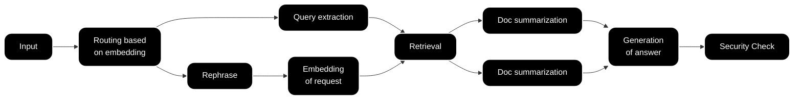
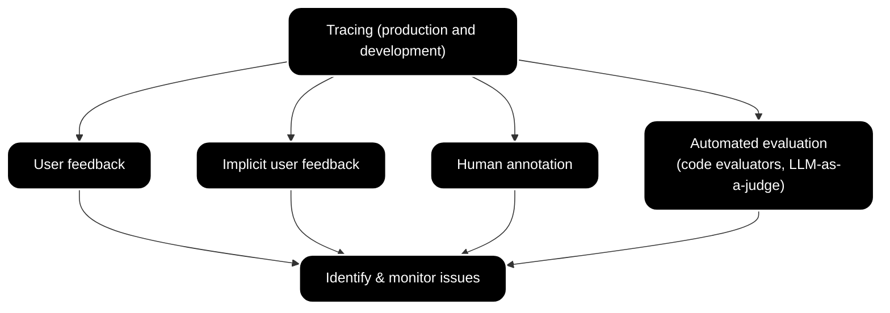

import { BlogHeader } from "@/components/blog/BlogHeader";

<BlogHeader
  title="LLM Evaluation: Methods, Best Practices, and a Practical Roadmap"
  description="What LLM evaluation is and how to do it: offline vs. online evaluation, LLM-as-a-judge, code evaluators, experiments, CI gates, and production monitoring."
  date="November 12, 2025"
  authors={["aabedraba", "jannikmaierhoefer"]}
/>

**LLM evaluation** is the systematic measurement of an LLM application's output quality against criteria you define, such as correctness, faithfulness, helpfulness, and safety. Because generated text rarely has a single correct answer, evaluation combines deterministic code checks, LLM-as-a-judge scoring, human annotation, and user feedback. It happens both **offline**, on test datasets before you ship a change, and **online**, on live production traces.

This guide covers the full workflow: why evaluation is harder than traditional software testing, which evaluation methods to use for which criteria, a step-by-step roadmap from observability to CI gates and production monitoring, and how to adapt it for RAG pipelines, agents, and multi-turn conversations. We updated it in July 2026 to reflect the current evaluation tooling in Langfuse, and the [FAQ](#faq) answers the questions we hear most often from teams building evaluation pipelines.

## Why LLM evaluation is hard [#why-llm-evaluation-is-hard]

LLM evaluation is harder than traditional software testing because outputs are open-ended: the same application can produce answers that are correct, creative, or confidently wrong, and no assertion library can tell those apart on its own. In practice, teams run into five recurring challenges:

- **Defining clear evaluation goals comes first.** Traditional metrics like error rates do not translate well when your application might encounter any question under the sun, so you need to pin down what "good" looks like, whether that is accuracy, helpfulness, or tone, before you measure anything.
- **Subjective interpretation creeps in.** Deciding how to measure factors like clarity or coherence is unreliable without well-defined rubrics that different reviewers (human or model) apply the same way.
- **Cost and latency add up.** Testing at scale with human annotators gets expensive quickly, and automated approaches are faster but not reliable enough on their own.
- **Automated evaluators need ongoing calibration.** LLM judges can drift or fail in unexpected ways, so keeping them aligned with human judgment on a sample of annotated examples takes constant upkeep.
- **Evaluation is a cross-team effort.** Engineers, data scientists, product managers, and domain experts all contribute criteria and reviews, and without a shared process and vocabulary you get chaotic handoffs and scattered efforts.

The challenge compounds in multi-step applications. A typical customer support RAG pipeline looks like this:



Each stage needs its own evaluation criteria. If you only score the final answer, you cannot tell whether a bad response came from routing, retrieval, or generation.

## Traces are the foundation for evaluation [#traces]

Every evaluation method needs structured data to work on, and that data is the **trace**: a detailed record of one interaction with your application, including the input, intermediate steps like retrievals and tool calls, and the final output. Traces let you pinpoint which step failed, compare outputs against expected results, and see which inputs cause the most problems.

In Langfuse, evaluation results are stored as [scores](/docs/evaluation/scores/overview). A score has a name, a value, and a data type (`NUMERIC`, `CATEGORICAL`, `BOOLEAN`, or `TEXT`), and it can be attached to a trace, an individual observation within a trace, a session spanning multiple traces, or a dataset run. This one data object carries the results of every method described below, which means human annotations, judge scores, and code-check results all land in the same tables, dashboards, and alerts.

## Offline vs. online evaluation [#offline-vs-online]

Effective LLM evaluation blends offline and online methods, because each catches errors the other misses.

| Dimension     | Offline evaluation                                        | Online evaluation                                                |
| ------------- | --------------------------------------------------------- | ---------------------------------------------------------------- |
| Runs on       | Curated [datasets](/docs/evaluation/experiments/datasets) | Live production traces                                           |
| When          | Before you ship a change                                  | Continuously in production                                       |
| Catches       | Regressions against known test cases                      | Model drift, unexpected user inputs, new failure modes           |
| Typical tools | Experiments, CI gates                                     | Sampled LLM-as-a-judge, code evaluators, user feedback, monitors |
| Limitation    | Test sets can go stale and stop resembling real traffic   | No ground truth; feedback signals are sparse and noisy           |

The two form a loop: offline experiments validate a change before deployment, online evaluation catches the edge cases your dataset did not cover, and those edge cases go back into the dataset so the next experiment catches them. Langfuse's [core concepts page](/docs/evaluation/core-concepts) walks through this loop in detail.

## Evaluation methods and when to use each [#evaluation-methods]

No single method captures everything about your application's behavior, so most teams mix and match from five families:

| Method            | What it gives you                                             | Cost per result | Scales to production? |
| ----------------- | ------------------------------------------------------------- | --------------- | --------------------- |
| User feedback     | The clearest signal of whether output hit the mark            | Free but sparse | Yes                   |
| Implicit feedback | Behavioral signals (retries, link clicks, abandonment)        | Free but noisy  | Yes                   |
| Human annotation  | Deep, trustworthy judgments from experts                      | High            | No                    |
| Code evaluators   | Deterministic checks (format, regex, exact match, tool calls) | Near zero       | Yes                   |
| LLM-as-a-judge    | Subjective criteria (helpfulness, faithfulness) at scale      | Low             | Yes, with sampling    |

Traces are the underlying thread across all of them: by systematically logging interactions, you create one structured record that every technique draws from.



### Code evaluators for deterministic checks [#code-evaluators]

Code evaluators are the cheapest and most reliable method wherever a check can be expressed as logic: exact match, regex validation, JSON parseability, schema validation, keyword checks, tool-call assertions, and custom business rules. As of July 2026, Langfuse runs [code evaluators](/docs/evaluation/evaluation-methods/code-evaluators) written in Python or TypeScript directly in the platform, on live observations or on experiment results. Each evaluator implements a single `evaluate` function that receives an evaluation context and returns one or more scores:

```python
def evaluate(ctx: EvaluationContext) -> EvaluationResult:
    """Passes when the output exactly matches the expected output."""
    expected_output = (
        ctx.experiment.item_expected_output if ctx.experiment is not None else None
    )
    matches = expected_output is not None and ctx.observation.output == expected_output

    return EvaluationResult(
        scores=[
            Score(
                name="Exact match",
                value=matches,
                data_type="BOOLEAN",
            )
        ]
    )
```

The `EvaluationContext`, `EvaluationResult`, and `Score` types are provided by the Langfuse evaluator runtime; you only author the function body in the UI. Evaluators run without network access, use only the language standard library, and must complete within 2 seconds, which keeps them fast and deterministic. For ten copy-paste starting points, from PII screening to numeric tolerance checks, see our [code evaluator examples](/resources/engineering/code-evaluator-examples).

### LLM-as-a-judge for subjective criteria [#llm-as-a-judge]

[LLM-as-a-judge](/docs/evaluation/evaluation-methods/llm-as-a-judge) uses a capable model to score outputs against a rubric, which makes subjective criteria like helpfulness, faithfulness, or toxicity measurable at scale. In Langfuse you can pick a managed evaluator from a catalog maintained by Langfuse and partners like Ragas (covering dimensions such as hallucination, context relevance, and helpfulness), or write a custom judge prompt with `{{variables}}` mapped to your trace data. Judges return numeric, categorical, or boolean scores together with their reasoning.

Two operational details matter more than most teams expect:

- **Where the judge runs.** Langfuse runs judges on live production observations (the recommended target, evaluated asynchronously within seconds of ingestion), on experiment results, or on full traces (a legacy target; see the [FAQ](#full-trace-evals) for how to evaluate whole workflows today). Sampling controls, for example scoring 5% of matching observations, keep judge cost proportional to what you actually need to see.
- **Judge quality is a calibration exercise.** The judge model must support structured output so scores parse reliably, and every judge execution is itself logged as a trace in Langfuse, so you can debug the judge exactly like you debug your application. Calibrate judges against a small human-annotated sample before trusting their trend lines.

### Human annotation and user feedback [#human-review]

Human judgment stays in the loop even after automation. [Annotation queues](/docs/evaluation/evaluation-methods/annotation-queues) give domain experts a structured workflow to score traces, observations, or entire sessions against defined score configs, which is how most teams build the ground-truth samples that calibrate their automated evaluators. [User feedback](/docs/observability/features/user-feedback), whether explicit (thumbs up/down, ratings) or implicit (did the user rephrase the question?), is the cheapest production signal you can collect, though it needs careful interpretation because it is sparse and noisy.

## A practical evaluation roadmap [#roadmap]

The methods above are a toolkit, not a checklist. This is the order we recommend adopting them in; not every application needs every step, so pick what fits your use case.

<Steps>
## Start with observability [#start-with-observability]


Everything begins with seeing what's happening under the hood. Observability tools log inputs, outputs, latencies, and metadata, turning black-box LLMs into inspectable systems. This isn't optional, it's the foundation for spotting patterns and measuring improvements.

For general apps, track basics like prompt-response pairs and error rates. If your app uses retrieval-augmented generation (RAG) pipelines, layer on RAG-specific metrics: retrieval relevance (does it fetch the right docs?), answer faithfulness (does the output stick to retrieved facts?), and context completeness.

Set this up early to inform later steps like error categorization or testing.

→ **[Start your observability](/docs/observability/get-started)**

→ **[See Observability in RAG pipelines](/blog/2025-10-28-rag-observability-and-evals)**

## Dive into error analysis [#error-analysis]

With observability in place, zoom in on failures. Error analysis involves reviewing traces to classify issues (hallucinations, irrelevance, formatting errors) and uncover root causes. This turns raw logs into actionable insights, prioritizing what to fix next.

For example, filter traces by low user satisfaction scores, tag common failure modes, and cluster similar errors. It's manual at first but scales with automation, feeding directly into testing and experiments. The failure modes you find here are exactly the quality dimensions your automated evaluators should measure, a mapping we cover in depth in [how to build an LLM evaluation strategy](/resources/engineering/llm-evaluation-strategy).

→ **[Error Analysis to Evaluate LLM Applications](https://langfuse.com/academy/monitoring/error-analysis)**

## Set up automated evaluators [#automated-evaluators]

In AI development, iterating quickly is important. Manually annotating outputs after every modification is slow and expensive, especially when you want to integrate evaluations into a CI/CD pipeline.

Automated evaluators solve this problem by providing a scalable way to measure and monitor your application's failure modes, enabling a fast and effective development loop. Use [code evaluators](#code-evaluators) for everything deterministic and reserve [LLM-as-a-judge](#llm-as-a-judge) for criteria that need semantic judgment; stacking a cheap code pre-screen in front of a judge is a common pattern to cut evaluation cost.

→ **[Automated Evaluations of LLM Applications](/blog/2025-09-05-automated-evaluations)**

## Build a testing foundation [#testing]

Now that you've identified pain points, formalize tests to prevent regressions. Testing LLM apps blends deterministic checks (e.g., output format) with probabilistic ones (e.g., semantic accuracy via LLM judges).

Testing isn't exhaustive: focus on high-impact areas. It complements observability by running offline, and once thresholds are stable you can wire the same experiments into CI so a pull request fails when scores regress. Langfuse ships [`langfuse/experiment-action`](https://github.com/langfuse/experiment-action) for GitHub Actions: your experiment script raises `RegressionError` when a run-level score drops below your threshold, and the action fails the job and posts the scores as a PR comment. See [experiments in CI/CD](/docs/evaluation/experiments/experiments-ci-cd) for the workflow setup and [LLM regression testing](/resources/engineering/llm-regression-testing) for a complete worked gate.

→ **[Testing LLM Applications](/blog/2025-10-21-testing-llm-applications)**

## Scale with synthetic datasets [#synthetic-datasets]

Real data is ideal, but it's often limited. Synthetic datasets fill the gaps: Use LLMs to generate diverse inputs, amplifying your test coverage without waiting for users.

For instance, prompt a model to create query variations, including adversarial ones. This powers robust testing and error simulation, closing the loop from analysis to prevention. As production traffic grows, curate the best real failure cases into a maintained test set; our guide to [golden dataset evaluation](/resources/engineering/golden-dataset-evaluation) covers how to build and keep one fresh.

→ **[Synthetic Dataset Generation for LLM Evaluation](/guides/cookbook/example_synthetic_datasets)**

## Run experiments and interpret results [#experiments]


To quantify progress, compare variants: prompts, models, or pipelines. Experiments run your application against a dataset, score every output, and let you compare runs side by side. With the Langfuse SDK this is a single function call:

```python
from langfuse import get_client, Evaluation
from langfuse.openai import OpenAI

langfuse = get_client()

def my_task(*, item, **kwargs):
    response = OpenAI().chat.completions.create(
        model="gpt-4.1", messages=[{"role": "user", "content": item.input}]
    )
    return response.choices[0].message.content

def accuracy_evaluator(*, input, output, expected_output, **kwargs):
    if expected_output and expected_output.lower() in output.lower():
        return Evaluation(name="accuracy", value=1.0)
    return Evaluation(name="accuracy", value=0.0)

dataset = langfuse.get_dataset("my-evaluation-dataset")

result = dataset.run_experiment(
    name="Prompt v2 test",
    description="Compare the new prompt against our golden dataset",
    task=my_task,
    evaluators=[accuracy_evaluator],
)
print(result.format())
```

The runner handles concurrent execution, tracing, and error isolation, and the run appears in Langfuse for comparison against previous runs. You can also [run experiments from the UI](/docs/evaluation/experiments/experiments-via-ui) by selecting a dataset and a prompt version, which lets non-engineers iterate on prompts without writing code.

Interpretation is key: don't just note "Variant B is 10% better", analyze why, linking back to error patterns or observability data.

→ **[Experiments via SDK](/docs/evaluation/experiments/experiments-via-sdk)**

→ **[Experiment Interpretation](/blog/2025-11-06-experiment-interpretation)**

## Monitor production and alert on regressions [#production-monitoring]

Offline gates cannot catch what production sends you, so the last step is watching your evaluation scores continuously. In Langfuse, [score analytics](/docs/evaluation/scores/score-analytics) and [custom dashboards](/docs/metrics/features/custom-dashboards) trend every score over time, and [monitors](/docs/metrics/features/monitors) fire an alert through Slack, webhooks, or GitHub Actions when a metric leaves the range you expect, for example when average cost per trace crosses a ceiling or a quality score falls below your bar.

As of July 2026, dashboards and monitors also support boolean scores: the average of a boolean score is the share of `true` results, so you can chart a hallucination-detection rate or a policy-check pass rate and alert when it crosses a threshold.

→ **[Monitors and Alerts](/docs/metrics/features/monitors)**

</Steps>

## Evaluating RAG, agents, and conversations [#complex-apps]

For apps beyond one-shot queries, extend the basics. The methods stay the same; what changes is which parts of the trace you score and which criteria matter.

### RAG pipelines [#rag]

Because a RAG system has a retrieval step and a generation step, measure them separately: retrieval relevance and precision for the document-fetching stage, then generation-side metrics on the answer. The two metrics that carry most RAG evaluations are **faithfulness** (does the answer stick to the retrieved context?) and **answer relevance** (does the answer actually address the question?). We cover judge design and runnable code for both in [RAG faithfulness evaluation](/resources/engineering/rag-faithfulness-evaluation) and [answer relevance evaluation](/resources/engineering/answer-relevance-evaluation), and when ungrounded output is your main worry, [hallucination detection](/resources/engineering/hallucination-detection) walks through a taxonomy and evaluator setup. Langfuse also integrates with [RAGAS](/guides/cookbook/evaluation_of_rag_with_ragas) for specialized RAG metrics.

### AI agents [#agents]

Agents add layers like tool use and planning, so evaluation moves beyond final-output quality to the **trajectory**: did the agent choose the right tools, pass the right arguments, and complete the task? In Langfuse, evaluators can map an observation's recorded tool calls (name, arguments, order) as input, which makes tool-call assertions a natural code-evaluator use case. Structure agent outputs, for example with Pydantic models, to make scoring easier, and A/B test agent configurations with experiments. Our guide to [AI agent evaluation](/resources/engineering/ai-agent-evaluation) covers trajectory, tool-call, and task-completion metrics in depth.

→ **[Agent Evaluation Guide (cookbook)](/guides/cookbook/example_pydantic_ai_mcp_agent_evaluation)**

### Multi-turn conversations and sessions [#multi-turn]


Conversational apps require evals that preserve context across turns: coherence, memory, and whether the conversation reached a resolution. In Langfuse, traces that share a session ID group into a session, scores can attach directly to a session via the SDK or API, and annotation queues accept whole sessions for human review. To test safely before launch, simulate user-AI exchanges and score the full dialogues.

→ **[Evaluating Multi-Turn Conversations](/guides/cookbook/example_evaluating_multi_turn_conversations)**

→ **[Simulated Multi-Turn Conversations](/guides/cookbook/example_simulated_multi_turn_conversations)**

### Voice agents [#voice-agents]

Voice applications combine speech recognition, synthesis, and interactive dialogue, so evaluation covers both conversational quality and audio processing performance. See our dedicated guide, [Evaluating and Monitoring Voice AI Agents](/blog/2025-01-22-evaluating-voice-ai-agents), for the metrics and setup.

## Where to go deeper [#go-deeper]

Each stage of this roadmap has a dedicated deep dive:

- [How to build an LLM evaluation strategy](/resources/engineering/llm-evaluation-strategy) turns the roadmap into a team-level rollout with quality dimensions, release gates, and review loops.
- [Golden dataset evaluation](/resources/engineering/golden-dataset-evaluation) shows how to build test sets from production traces and keep them fresh.
- [LLM regression testing](/resources/engineering/llm-regression-testing) walks through failing CI on score regressions end to end.
- [10 code evaluator examples](/resources/engineering/code-evaluator-examples) gives you copy-paste deterministic checks.
- [AI agent evaluation](/resources/engineering/ai-agent-evaluation) covers trajectory, tool calls, and task completion.
- [RAG faithfulness evaluation](/resources/engineering/rag-faithfulness-evaluation), [answer relevance evaluation](/resources/engineering/answer-relevance-evaluation), and [hallucination detection](/resources/engineering/hallucination-detection) cover the main RAG quality metrics.

## FAQ [#faq]

### How do I evaluate a full agent workflow instead of a single LLM call? [#full-trace-evals]

Target the root observation of the workflow: with current Langfuse SDKs, the root observation records the overall input and output of an application or agent invocation, so an observation-level evaluator on the root sees the end-to-end result. If the judge needs intermediate context (for example, which documents were retrieved), write that context onto the root observation from your application code. Trace-level LLM-as-a-judge evaluators still exist but are legacy; observation-level evaluators complete in seconds instead of minutes, and there is a [migration guide](/faq/all/llm-as-a-judge-migration) for moving over.

### Can I run evaluations on production traces without re-running the LLM? [#evals-without-rerun]

Yes. Online evaluators (LLM-as-a-judge and code evaluators) score the data already recorded on your traces at ingestion time; they never re-execute your application or its LLM calls. You can also backfill scores on historical data by selecting traces in the traces table and running an evaluator on them retroactively, which is useful when you create a new evaluator after the traffic already happened.

### How much does LLM-as-a-judge cost, and how do I keep it under control? [#judge-cost]

Cost depends on the judge model and the size of the evaluated inputs; a typical evaluation costs $0.01-0.10 per assessment. The three main levers are sampling (score, say, 5% of matching observations instead of all of them), targeting specific observations rather than whole traces so the judge reads less text, and using cheaper judge models for simpler criteria. Deterministic pre-checks with code evaluators, which are effectively free, can filter what reaches the judge at all.

### Which model should I use as a judge, and how do I configure it? [#judge-model]

Capable instruction-following models (GPT-4o, Claude Sonnet, or Gemini Pro class) are the common choice, and the judge must support structured output so scores can be parsed reliably. In Langfuse you set a default evaluation model via [LLM connections](/docs/administration/llm-connection) and can pin a different model per evaluator. Whatever you pick, calibrate it against a small human-annotated sample; strong judges reach 80-90% agreement with human reviewers on many criteria, which is comparable to agreement between two humans.

### Can I evaluate whole sessions or multi-turn conversations? [#session-evals]

Yes. Scores can be attached directly to a session by passing only the session ID via the SDK or API, and annotation queues accept sessions so human reviewers score the full conversation rather than individual turns. For automated multi-turn evaluation, run a judge over the assembled conversation, as shown in the [multi-turn evaluation cookbook](/guides/cookbook/example_evaluating_multi_turn_conversations).

### Can I run pairwise comparisons between two prompt or model variants? [#pairwise-evals]

Langfuse does not ship a built-in pairwise judge. The standard pattern is to run two experiments on the same dataset and compare them side by side in the UI, where per-item outputs and scores line up across runs. If you specifically want preference-style scoring, write an SDK experiment evaluator that fetches the baseline output for each item, presents both candidates to a judge model, and records the preference as a score.

### How do I block a deployment when evaluation scores regress? [#ci-gating]

Run an experiment in CI and fail the job on a threshold violation. With [`langfuse/experiment-action`](https://github.com/langfuse/experiment-action), your experiment script raises `RegressionError` when a run-level score falls below your bar, and the action fails the workflow and posts the scores to the pull request; the action requires Python SDK v4.6.0+ or JS SDK v5.3.0+. On other CI systems, the same `run_experiment` call works inside pytest or Vitest with a plain assertion, as described in [experiments in CI/CD](/docs/evaluation/experiments/experiments-ci-cd).

### Can I manage evaluators as code in Git? [#evals-as-code]

Partially, as of July 2026. SDK experiment evaluators are plain functions in your repository, so they version like any other code. For evaluators that Langfuse executes (LLM-as-a-judge and code evaluators), there are public API endpoints for creating evaluators and evaluation rules programmatically, which lets you sync definitions from a repository or CI pipeline; these endpoints are currently marked unstable and may change, so pin your automation to their versioned behavior and watch the [API reference](https://api.reference.langfuse.com/#tag/unstableevaluators).

## Takeaway

Evaluating LLM applications is a journey, not a destination. Start with observability to illuminate your system, then layer in error analysis, automated evaluators, testing, synthetic data, and experiments, and keep monitors watching your scores in production. Tailor these steps to your app's complexity, whether it's a simple Q&A tool or a multi-turn agent.

Start your evaluation journey with [Langfuse](/docs/evaluation/overview) today and turn insights into impact.
