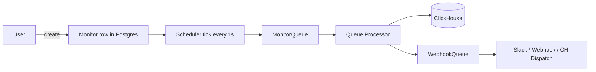
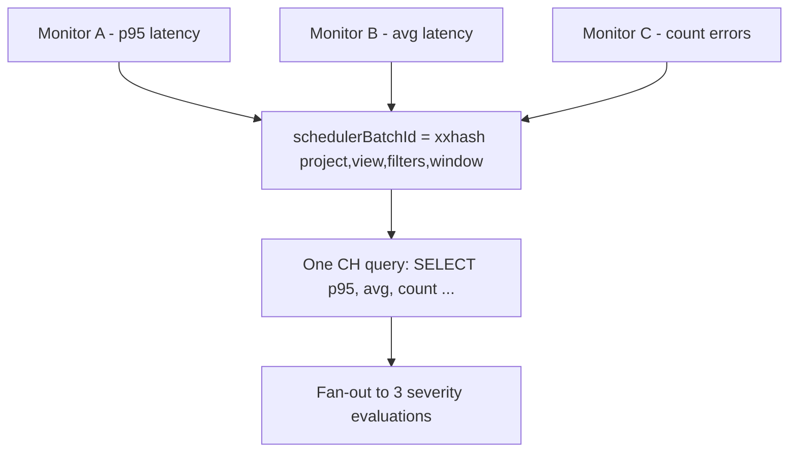
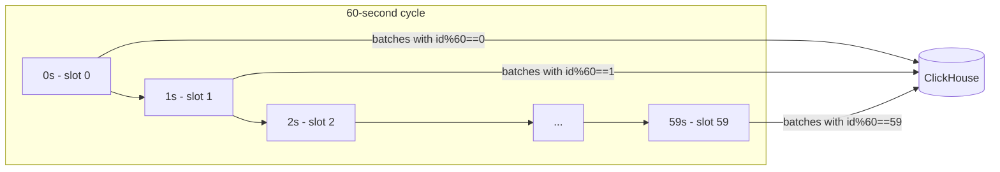
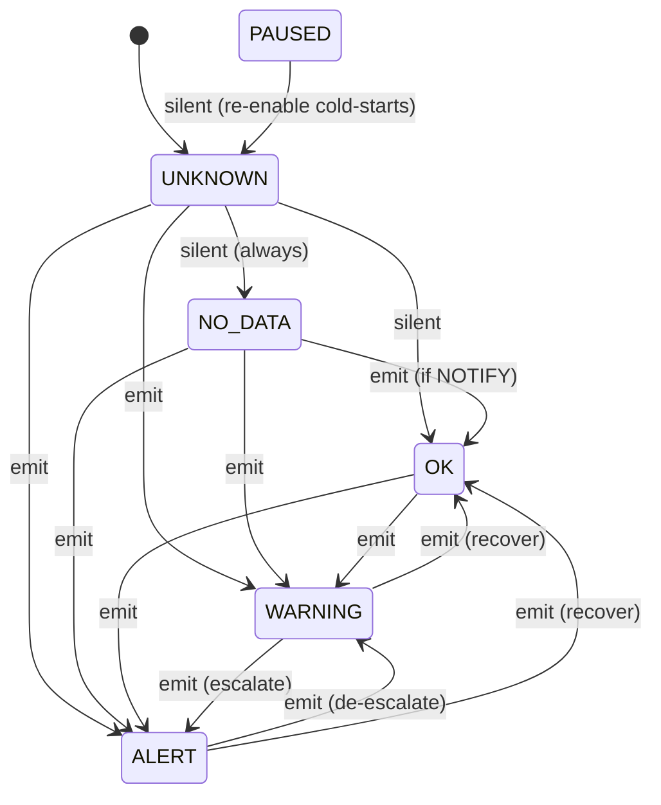
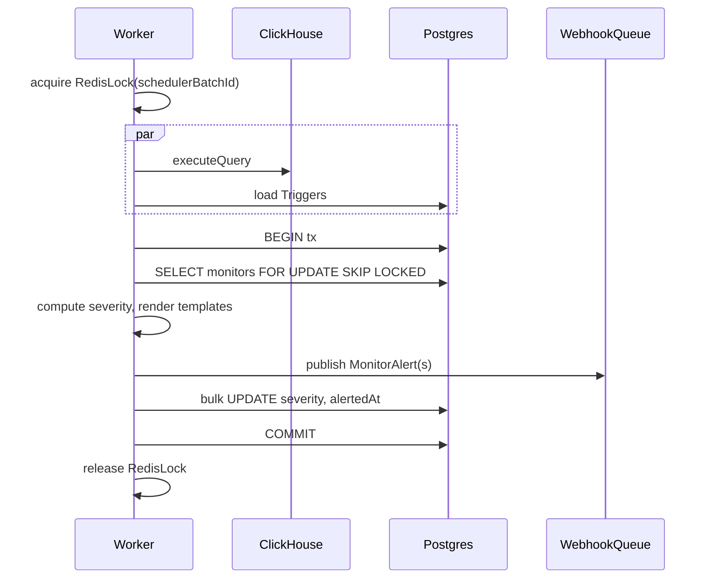
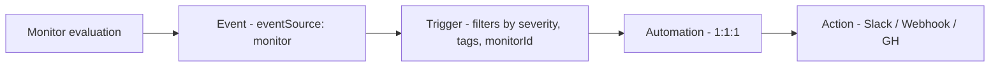

import { BlogHeader } from "@/components/blog/BlogHeader";

<BlogHeader
  title="Designing monitors at 10,000-per-region: what we got wrong on the whiteboard"
  description="Seven non-obvious design decisions from building Monitors & Alerting in Langfuse."
  authors={["maxdeichmann"]}
  date="May 30, 2026"
/>

We're adding **Monitors** to Langfuse: scheduled point-in-time evaluations of a metric over a rolling window that emit alerts through Slack, webhooks, and GitHub Dispatch. The user-facing pitch is one sentence. The implementation was not.

What follows is the design we landed on, with emphasis on the parts where our first instinct turned out to be wrong.

## The brief



Target envelope for v1: **10,000 monitors per region**, **p99 < 5 minutes** from evaluation tick to notification, **~167 ClickHouse QPS** at worst case. The worst case assumes every monitor is on the 1-minute cadence tier; daily and weekly tiers contribute trivially.

That envelope is what forced most of the design decisions below.

## Surprise 1: the unit of work is the query shape, not the monitor

The naive scheduler runs one ClickHouse query per monitor per cadence tick. 10k monitors on a 1-minute cadence is 10k queries per minute. ClickHouse is fine with that until it isn't, and the cost model says "isn't" arrives faster than you'd think.

The insight: **the only thing that varies between two monitors with the same `(projectId, view, filters, window)` is which aggregation they want from the same underlying data**. Aggregations are cheap to run side-by-side in one query. So we shard work by query shape, not by monitor.

```ts
schedulerBatchId = xxhash(projectId | view | sortedCanonicalize(filters) | window)
```

Notes that aren't obvious:

- `filters` is canonicalized (sorted) before hashing so `[A,B]` and `[B,A]` hash to the same batch. We do this server-side, not client-side, because clients lie.
- `metric` is **not** in the hash. Two monitors on the same view with different aggregations (p95 latency vs. avg latency) share a batch and a CH query — the worker fans the resulting columns out to N monitors after the fact.
- This collapses workload from "monitors × cadence" to roughly "distinct query shapes × cadence". For multi-tenant deployments with templated monitors, the compression is large.



## Surprise 2: the scheduler ticks every second, not every minute

If 10k monitors all wake up at `:00`, you get a cliff: ClickHouse sees a thousand queries land in the same second and then idle for 59. Bad p99, bad capacity planning.

So we spread the load by deriving each batch's second-of-minute slot deterministically from `schedulerBatchId`:

```ts
const offsetMs = Number(schedulerBatchId % 60n) * 1_000;
return new Date(nextMinuteMs - offsetMs);
```

The scheduler ticks every second and only picks up batches whose slot matches. Same code path handles every cadence (1 min, 30 min, 48 h) — slow tiers just don't show up at most ticks.



A nice property falls out: monitors created at different timestamps but sharing a `schedulerBatchId` **converge onto the same slot after one cadence advance**. Add a monitor at 14:23:17, its first run is within the next minute, and after that it's locked into the slot of its query shape. No drift.

## Surprise 3: cadence is derived from window, not user-configurable

We started with cadence and window as independent fields, the way Datadog and most others do it. We took it out.

```ts
function monitorWindowCadenceMs(windowMs: bigint): bigint {
  if (windowMs >= 7n * DAY) return 48n * HOUR;   // weekly+   → twice daily
  if (windowMs >= 1n * DAY) return 30n * MINUTE; // daily     → every 30 min
  return 1n * MINUTE;                            // hourly-   → every minute
}
```

The reason is operational: independent fields let users create "rolling 2-month window, evaluated every 1 minute." That's a 60 GB query per minute per project that does nothing useful — the window dominates the cadence by four orders of magnitude. We were going to write a guardrail. Instead we removed the field.

The trade-off: someone with a real reason to evaluate a 24-hour window every 5 minutes can't. We're betting that population is empty, and we'll re-introduce the option behind a feature flag if it isn't.

`cadence` is then denormalized into a Postgres column on every write, even though it's a pure function of `window`. This is so the scheduler's hot tick query can do `next_run_at + cadence` directly instead of paying for a `CASE` expression per row.

## Surprise 4: cold-start is its own severity

We assumed three states: `OK`, `WARNING`, `ALERT`. Add `NO_DATA` for the obvious case. Done.

Then we hit the first-evaluation case. A monitor has just been created. The first tick fires. ClickHouse returns no rows. What do we emit?

- If we treat first-eval-no-data as `NO_DATA → NOTIFY`, every newly-created monitor pages the on-call before it's even configured.
- If we treat it as `OK`, you can't distinguish "never evaluated" from "evaluated and healthy" in the UI.

The fix is a fifth severity: `UNKNOWN`, which is the default at row insert and never emits to a channel. The state machine has a hard rule that `UNKNOWN → NO_DATA` is **silent regardless of `noData.mode`** — without prior state, "first eval found nothing" looks identical to "lost data," and you can't page on that ambiguity.



`PAUSED → UNKNOWN` on re-enable forces a cold-start. Without that step, re-enabling a paused monitor whose underlying data has drifted away would emit a recovery alert from stale state. We'd rather suppress one alert than emit a wrong one.

## Surprise 5: publish to the queue *before* committing the transaction

The worker's order of operations looks like this:



The unusual choice is line 9: we publish the alert to `WebhookQueue` **before** the Postgres commit. The conventional order is commit-then-publish: emit the side-effect only after the durable state change succeeds.

We inverted it on purpose. The failure modes are:

- **Publish, then commit fails:** the alert fires, but `alertedAt` and `severity` don't update. The next tick recomputes severity, sees it's already at `ALERT`, and (without renotify) stays quiet. Net effect: one extra alert. Sometimes two.
- **Commit, then publish fails:** state thinks it alerted. Next tick stays quiet. The alert is **lost forever**.

For monitoring, "at least once" beats "at most once" every time. A pager that fires twice for the same incident is a paper cut. A pager that doesn't fire is the reason you bought a pager.

This also explains the Redis lock. It's acquired **before any ClickHouse or Postgres call**, not just before the write. If we'd held a Postgres row lock through the multi-second ClickHouse query, we'd be blocking PG connection-pool slots on CH latency. Cheap lock first, expensive query inside, transactional state update at the very end.

## Surprise 6: monitors aren't a new entity in the alerting graph

The instinct was to model Monitors → Alerts → Channels with new tables for each edge. The existing system already has `Trigger → Automation → Action` for prompt-change notifications. We extended it instead of duplicating it.



`Trigger` gets a new `eventSource: "monitor"` value and a discriminated-union of filter columns. That's it. We then inherit:

- **Per-channel routing** (Slack channel A for `severity:ALERT`, channel B for `tag:env:prod`).
- **Auto-disable-on-4-failures** (already implemented for prompt webhooks; a 404 webhook disables one Automation, not the underlying Monitor).
- **1:1:1 Trigger / Automation / Action enforcement**, mirrored from the prompt path.

Triggers are matched in-process via `InMemoryFilterService` inside the worker, rather than at the queue routing layer. The alternative — emitting onto an `EntityChangeQueue` that the trigger system already consumes — was explicitly skipped to cut latency and to avoid retrofitting that pipeline for monitor-specific filter columns.

## Surprise 7: the failure policy splits on cadence, not on error type

BullMQ retry defaults are `attempts: 6, exponential backoff (5 min)`. That's right for the daily and weekly tiers. It's wrong for the 1-minute tier:

- A 1-min-cadence job that throws and gets retried in 5 minutes is racing the next 4 ticks that would have produced the same job. By the time the retry runs, the data is stale and the scheduler is already past it.

So we wrap the worker:

```
if (job throws) and (window is 1-min cadence):
  ACK the job, log, do nothing
  the scheduler will re-publish naturally on next tick
else:
  re-throw → BullMQ retries with backoff
```

The scheduler picks the fast-cadence retry back up "for free" via the 5-minute TTL on `last_published_run_at`. Long-cadence jobs aren't getting another bite for hours, so BullMQ's retry actually means something.

Deadlettering anything at all points to a systemic problem and pages us via Datadog. It's not a routine failure mode.

## What we deferred

These are interesting and we're not doing them yet:

- **Dimension rollup** (one monitor evaluating across `env`, `model`, `region` and alerting per cell). Complicates batch execution and severity diffing in non-trivial ways. v1 forces "one monitor per dimension value."
- **Anomaly / % change thresholds.** Requires an expression language and historical state. Threshold-only for v1.
- **Compound conditions** (AND/OR across metrics). Same expression-language problem.
- **Region-wide batching.** We batch within a project. Cross-project batching multiplies the blast radius of a slow query and complicates tenant isolation.
- **Project-wide batching** (UNION ALL across query shapes for one project). High-priority follow-up; the savings depend on how much filter-shape overlap real customer monitors have. Needs measurement.

## What the numbers look like

| Concern | v1 target |
| --- | --- |
| Monitors per region | 10,000 |
| ClickHouse QPS | ~167 (worst case, all 1-min cadence) |
| Postgres QPS | ~337 (scheduler + queue processors) |
| Events per second | ~334 (monitor event + alert) |
| p99 latency (tick → notification) | < 5 minutes |

The 167 CH QPS figure assumes zero batching benefit (every monitor is its own query shape). Real-world batching from shared filter shapes should pull this down materially, but the design holds even if it doesn't.

## The bigger lesson

Most of the surprises share a shape: the obvious design optimizes for a single monitor and breaks at population scale. The fixes — batching by query shape, slot-spread scheduling, cadence-from-window, redis-lock-before-PG — all push complexity off the per-monitor path and onto the per-batch or per-tick path, where there's room for it.

The state machine and the publish-before-commit choice are different. Those are admissions that monitoring is a domain where the cheap failure mode is "alert too much" and the expensive one is "miss the page." Whenever we had to pick, we picked the cheap one.
