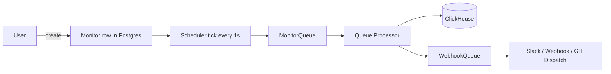
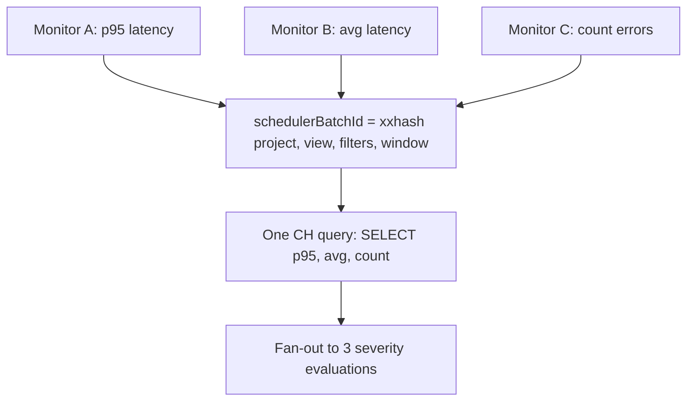
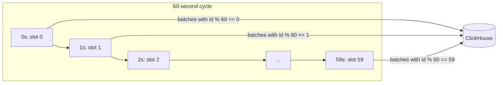
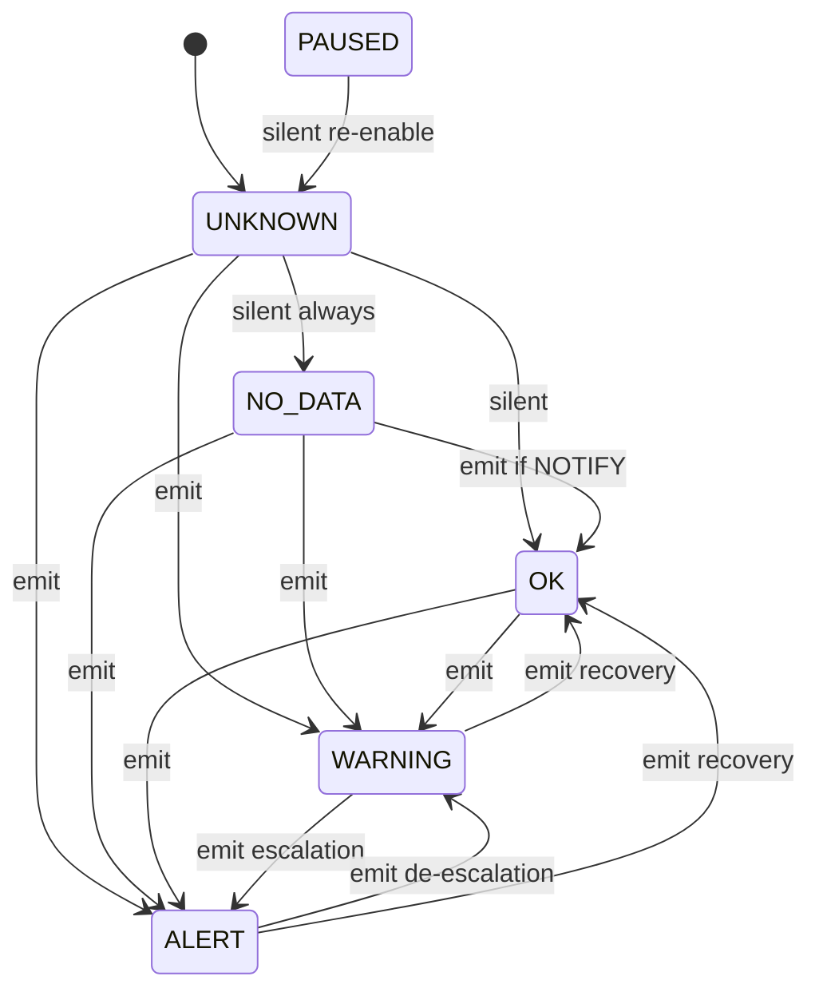
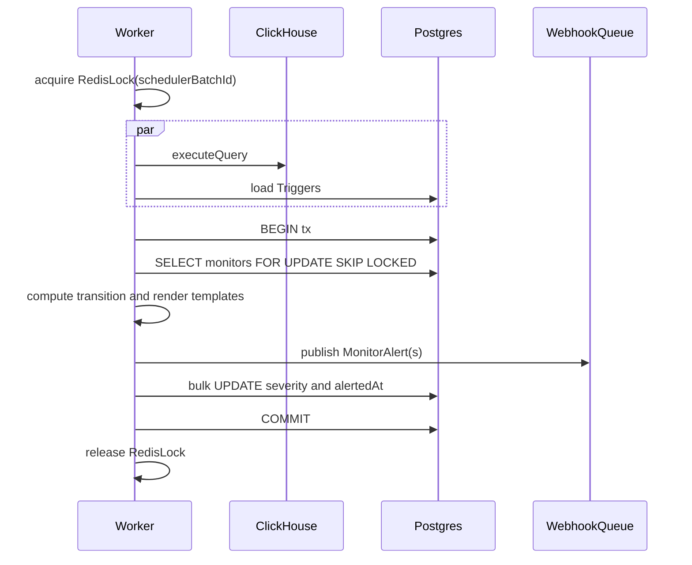
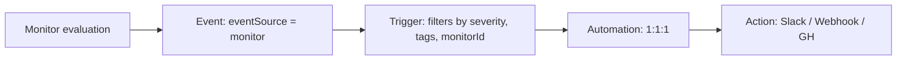

import { BlogHeader } from "@/components/blog/BlogHeader";

<BlogHeader
  title="Designing monitors at 10,000 per region"
  description="How we designed Langfuse Monitors & Alerting around query-shape batching, load-shaped scheduling, explicit alert state, and at-least-once delivery."
  authors={["maxdeichmann"]}
  date="May 30, 2026"
/>

We are adding **Monitors** to Langfuse: scheduled evaluations of a metric over a rolling window that emit alerts through Slack, webhooks, and GitHub Dispatch.

The product concept is simple. A user defines a metric, a time window, a threshold, and a destination. Langfuse evaluates the metric on a cadence and sends an alert when the state changes.

The implementation is less simple because monitors combine three systems that usually want different shapes:

- The query engine wants fewer ClickHouse queries.
- The scheduler wants predictable work per second.
- The alerting layer wants conservative side effects when state is ambiguous.

The design below is the one we landed on for v1.

## Monitors look simple until the workload has shape

The target envelope for v1 is large enough that the naive design fails before any individual query is difficult.

| Concern                                          | v1 target                                |
| ------------------------------------------------ | ---------------------------------------- |
| Monitors per region                              | 10,000                                   |
| ClickHouse QPS                                   | ~167 in the worst case                   |
| Postgres QPS                                     | ~337 from scheduler and queue processors |
| Events per second                                | ~334 monitor and alert events            |
| p99 latency from evaluation tick to notification | < 5 minutes                              |

The ClickHouse number assumes the worst case: every monitor has a sub-daily window and evaluates every minute. Daily and weekly windows contribute much less.

The obvious implementation schedules one job per monitor and runs one ClickHouse query per job. That optimizes for the mental model of a single monitor. The production design has to optimize for shared query shapes, deterministic ticks, explicit state transitions, and failure modes.



## The unit of work is the query shape

If we run one ClickHouse query per monitor per cadence tick, 10,000 monitors on a 1-minute cadence means 10,000 queries per minute. ClickHouse can absorb a lot, but the cost model says this becomes expensive before the feature becomes interesting.

The useful unit is not the monitor. It is the query shape.

Two monitors with the same `(projectId, view, filters, window)` read the same underlying rows. They may want different aggregations, such as p95 latency, average latency, or error count, but those aggregations can run side by side in one query.

```ts
schedulerBatchId = xxhash(projectId | view | sortedCanonicalize(filters) | window);
```

The important details are:

- `filters` are canonicalized before hashing so `[A, B]` and `[B, A]` land in the same batch.
- Canonicalization happens server-side because clients should not be trusted to preserve batching invariants.
- `metric` is not part of the hash because multiple aggregations can share one ClickHouse query.

This changes the workload from "monitors x cadence" to "distinct query shapes x cadence."



This is especially useful for templated monitors. If many projects use the same monitor patterns across environments or services, the scheduler still evaluates by query shape instead of treating each monitor as isolated work.

## The scheduler shapes load before ClickHouse sees it

Batching reduces the number of queries. It does not solve burstiness.

If every monitor wakes up on the minute boundary, ClickHouse sees a cliff at `:00` and then idle time for the rest of the minute. That is bad for p99 latency and bad for capacity planning.

### Batches are spread across every second

The scheduler ticks every second. Each batch gets a deterministic second-of-minute slot derived from `schedulerBatchId`.

```ts
const offsetMs = Number(schedulerBatchId % 60n) * 1_000;
return new Date(nextMinuteMs - offsetMs);
```

On each tick, the scheduler only publishes due batches whose slot matches the current second.



Monitors created at different timestamps but sharing a `schedulerBatchId` converge onto the same slot after one cadence advance. A monitor created at `14:23:17` runs within the next minute, then locks into the slot for its query shape.

### Cadence is derived from the window

We started with `window` and `cadence` as independent fields. That matches how many monitoring systems expose alert configuration, but it also lets users create workloads like "evaluate a 2-month rolling window every minute."

That query is expensive and usually not useful. The window dominates the cadence by orders of magnitude.

For v1, we removed custom cadence and derive it from the window:

```ts
function monitorWindowCadenceMs(windowMs: bigint): bigint {
  if (windowMs >= 7n * DAY) return 48n * HOUR; // weekly+ -> twice daily
  if (windowMs >= 1n * DAY) return 30n * MINUTE; // daily -> every 30 min
  return 1n * MINUTE; // hourly- -> every minute
}
```

This removes a configuration option because the product does not need the operational footgun yet. If we find users who need a 24-hour window evaluated every 5 minutes, we can reintroduce custom cadence behind a guardrail.

`cadence` is still denormalized into a Postgres column on every write. It is a pure function of `window`, but the scheduler's hot query can advance `next_run_at + cadence` directly instead of evaluating a `CASE` expression per row.

## The alert state machine owns notification semantics

The queue processor does not send an alert just because a query returns a value above a threshold. It computes a candidate severity, compares it with prior state, and lets the state machine decide whether a side effect is allowed.

That distinction matters because alerting is where ambiguity becomes user-visible.

### Every evaluation produces a candidate severity

Each batch job runs one ClickHouse query, maps the returned columns back to monitors, and computes a candidate severity for each monitor:

- `OK` means the metric is inside threshold.
- `WARNING` means the metric crossed the warning threshold.
- `ALERT` means the metric crossed the alert threshold.
- `NO_DATA` means the query returned no usable value.

This candidate severity is not enough to notify. The previous state decides whether the transition matters.

### `UNKNOWN` prevents false certainty

The first evaluation is the ambiguous case.

A monitor has just been created. The first tick fires. ClickHouse returns no rows. This could mean the filter is too narrow, the data source is quiet, the monitor is misconfigured, or the monitored system stopped sending data. Without prior state, those cases are indistinguishable.

Treating that first result as `NO_DATA` would page users for newly created monitors. Treating it as `OK` would tell the UI that the monitor evaluated and was healthy.

So new monitors start as `UNKNOWN`. It means "not yet evaluated into a trustworthy state."

The state machine has one hard rule: `UNKNOWN -> NO_DATA` is silent regardless of `noData.mode`. First-evaluation no-data is not enough evidence to page.

`UNKNOWN -> WARNING` and `UNKNOWN -> ALERT` still emit. A threshold violation on the first evaluation is actionable.

`PAUSED -> UNKNOWN` applies the same logic when a monitor is re-enabled. We do not want a stale pre-pause severity to produce a recovery notification after the underlying data changed while the monitor was off.

### Transitions, not severities, send alerts

The current severity alone does not decide notification. The transition does.



An `ALERT` severity is not enough to send another alert. `OK -> ALERT` emits. `WARNING -> ALERT` emits an escalation. `ALERT -> ALERT` stays silent unless `renotify` is enabled for that monitor.

This keeps the monitor edge-triggered by default while still allowing periodic reminders for teams that want them.

### When the state machine emits, delivery is at least once

Once the state machine decides a transition should emit, the worker publishes the alert to `WebhookQueue` before committing the Postgres transaction.



The conventional order is commit, then publish. We inverted it because the failure modes are not equivalent.

| Order                | Failure mode                                                                    | Outcome                                                       |
| -------------------- | ------------------------------------------------------------------------------- | ------------------------------------------------------------- |
| Publish, then commit | The alert leaves, but Postgres does not record the new severity or `alertedAt`. | A duplicate alert can happen on a later tick.                 |
| Commit, then publish | Postgres records the alert, but the queue publish fails.                        | The alert is lost because later ticks think it already fired. |

For monitoring, duplicate alerts are cheaper than lost alerts.

The Redis lock is acquired before any ClickHouse or Postgres work, not just before the final write. Holding a Postgres row lock while waiting on a multi-second ClickHouse query would tie up database resources on analytical latency. The Redis lock gives us cheap per-batch mutual exclusion before the expensive work starts, and the in-transaction row lock becomes a final consistency backstop.

### Routing happens after the state machine

The state machine decides whether a monitor event exists. It does not decide where the event goes.

Langfuse already has `Trigger -> Automation -> Action` for prompt-change notifications. Monitors extend that graph with a new `eventSource: "monitor"` instead of creating a parallel alerting system.



This means monitor alerts inherit existing routing behavior:

- Severity filters can send `ALERT` events to one channel and `WARNING` events to another.
- Tag filters can route `env:prod` separately from `env:dev`.
- Failed destinations can auto-disable one Automation without disabling the underlying Monitor.

We reuse the routing model, not every existing hop. The worker matches monitor triggers in-process with `InMemoryFilterService` and publishes directly to `WebhookQueue`. Sending monitor events through the existing `EntityChangeQueue` would add latency and require that pipeline to understand monitor-specific filter columns.

## Retry policy depends on cadence

BullMQ's default retry policy is appropriate for long-cadence work: `attempts: 6` with exponential backoff. It is not appropriate for 1-minute monitors.

A failed 1-minute job retried 5 minutes later is stale. Four newer scheduler ticks have already had the chance to publish the same batch with fresher data.

So the worker treats failures differently by cadence:

```txt
if job throws and window resolves to 1-minute cadence:
  ACK the job, log the failure, and wait for the next scheduler tick
else:
  rethrow and let BullMQ retry with backoff
```

For fast cadence monitors, the scheduler is the retry mechanism. For daily and weekly monitors, BullMQ retries matter because the next natural evaluation is hours away.

Deadlettering a monitor job is not a routine failure path. It points to a systemic problem and should page us through Datadog.

## What we deliberately did not build in v1

We scoped v1 around scalar threshold monitors because that covers the main alerting use case without introducing an expression language or per-dimension state.

| Deferred                             | Why not v1                                                                                                  | What would make us revisit it                                                |
| ------------------------------------ | ----------------------------------------------------------------------------------------------------------- | ---------------------------------------------------------------------------- |
| Dimension rollup                     | One monitor evaluating across `env`, `model`, or `region` complicates batch execution and severity diffing. | Customers create many near-identical monitors by dimension.                  |
| Anomaly or percent-change thresholds | These need historical state and expression semantics.                                                       | Static thresholds prove insufficient for common production use cases.        |
| Compound conditions                  | `AND` and `OR` across metrics need the same expression-language work.                                       | Users need incident definitions that combine multiple metrics.               |
| Region-wide batching                 | Cross-project batching increases blast radius and complicates tenant isolation.                             | Query-shape overlap is high enough to justify the isolation trade-off.       |
| Project-wide batching                | `UNION ALL` across query shapes looks promising, but the savings depend on real monitor shape overlap.      | Production usage shows enough repeated filters and windows within a project. |

The most likely follow-up is project-wide batching. It has a clear optimization path, but it needs measurement from real monitor configurations before we add the complexity.

## What the numbers mean

The design holds under the pessimistic case where every monitor has a unique query shape:

| Concern                                          | v1 target                                |
| ------------------------------------------------ | ---------------------------------------- |
| Monitors per region                              | 10,000                                   |
| ClickHouse QPS                                   | ~167 worst case                          |
| Postgres QPS                                     | ~337 from scheduler and queue processors |
| Events per second                                | ~334 monitor and alert events            |
| p99 latency from evaluation tick to notification | < 5 minutes                              |

Real workloads should be better than this because shared filter shapes collapse multiple monitors into one ClickHouse query. The design does not depend on that compression to stay within the envelope.

## The design principle

The obvious design optimizes for individual monitors. The production design optimizes for shared query shapes, deterministic ticks, explicit transitions, and at-least-once side effects.

On the execution side, we push complexity from monitors into batches. On the alerting side, we push ambiguity into an explicit state machine before any notification leaves the system.
