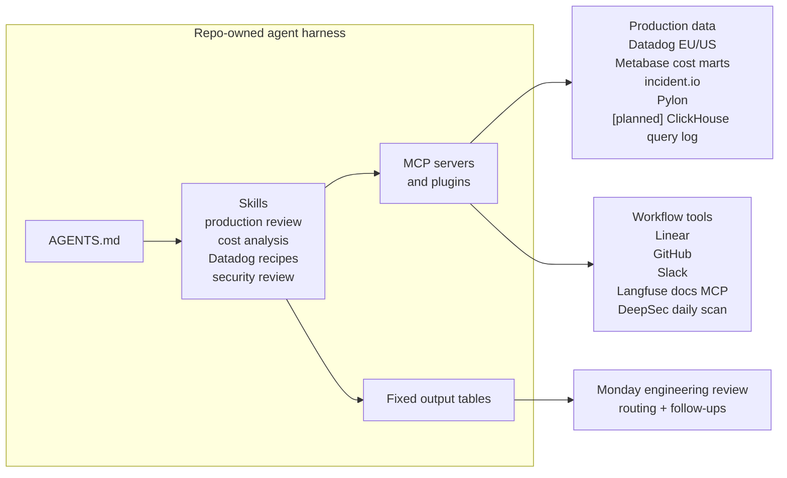

import { BlogHeader } from "@/components/blog/BlogHeader";

<BlogHeader
  title="How we use agents to review production infrastructure"
  description="We use repo-owned agent workflows to review infra cost, production bugs, pages, security diffs, and telemetry without turning engineers into weekly report writers."
  date="June 5, 2026"
  authors={["maxdeichmann"]}
/>

We use agents for data-heavy production engineering work: infra cost analysis, weekly production review, security review, Datadog debugging, and telemetry cleanup. We avoided doing this manually because it would have slowed the team down. Engineers would have spent hours each week collecting evidence from dashboards, tickets, incidents, and logs before deciding what needed action.

The setup started working once the repository told the agent which data sources exist, which queries to run, which tables to return, when it may write back to Linear, and which caveats must be preserved. Engineers still make the judgment calls, but the evidence-gathering layer is cheap enough to run often and discuss in engineering sync.

## We wanted more production visibility without weekly reporting work

We already had Datadog, Linear, incident.io, a public status page, Metabase, GitHub Actions, and ClickHouse. The gap was cross-system review.

For a weekly production review, an engineer needs to answer:

| Question                                                  | Source systems                                          |
| --------------------------------------------------------- | ------------------------------------------------------- |
| What broke for customers?                                 | incident.io, public status page, Linear                 |
| Which monitors paged?                                     | Datadog                                                 |
| Which production bugs were created, fixed, or still open? | Linear                                                  |
| Which infra cost drivers changed?                         | Data warehouse, Metabase, AWS CUR, ClickHouse cost data |
| Which security findings were introduced in PRs?           | GitHub Actions, Semgrep, Claude Code security review    |

These questions matter, but answering them manually is report assembly. We did not want engineers doing that every week before discussing incidents, cost drivers, alerts, and security actions.

## The system combines MCP, repo-owned skills, and fixed tables

The system has four layers:

| Layer               | Purpose                                                                                                                                          |
| ------------------- | ------------------------------------------------------------------------------------------------------------------------------------------------ |
| Queryable data      | Production data must live in systems the agent can query: Datadog, Linear, incident.io, Metabase, GitHub, and eventually ClickHouse query logs.  |
| MCP access          | The agent needs tool access to those systems instead of screenshots, copied dashboards, or stale summaries.                                      |
| Repo-owned skills   | The workflow lives in [`langfuse/langfuse`](https://github.com/langfuse/langfuse/tree/main/.agents), not in one engineer's local prompt history. |
| Fixed output tables | The agent returns the same sections every run, so engineers can scan them quickly and compare runs over time.                                    |

The production review instructions are part of the codebase. Root `AGENTS.md` and `CLAUDE.md` are discovery surfaces, while `.agents/AGENTS.md`, `.agents/config.json`, and `.agents/skills/**` own durable workflow definitions.

The hiring signal is the workflow itself: engineers spend time on systems judgment, not weekly evidence collection. They decide whether a cost driver is acceptable, whether a page was customer-impacting, whether a bug needs an owner, whether a monitor is noisy, and whether a PR introduces a security risk.

## Weekly production review joins incidents, bugs, and pages

The `weekly-production-review` skill produces an event-centric report from Linear bug tickets, Datadog alert/page signals, incident.io incidents, and public status-page events.

The output shape is fixed:

| Table                    | What it answers                                                                                                                                               |
| ------------------------ | ------------------------------------------------------------------------------------------------------------------------------------------------------------- |
| Event-centric view       | What actually broke, what is fixed, what is open, and what needs action.                                                                                      |
| Customer incident table  | What customers saw and how it was communicated.                                                                                                               |
| Linear bug table         | Which bug-labeled issues were created, updated, completed, or still open with production evidence.                                                            |
| Datadog alert/page table | Which production monitors paged, why they alerted, and whether they were incidents, bugs, infra/dependency issues, expected tests, monitor noise, or unknown. |

Fixed tables make the output comparable across runs. Engineers can scan the same columns each time, spot missing evidence, and bring the output into engineering sync without reformatting it.

The skill treats Datadog as evidence, not as the canonical event. A production event is represented by exactly one canonical object: an incident, a Linear bug, or an explicit alert disposition. It is read-only by default and requires human approval before Linear comments, new issues, incident follow-ups, or monitor changes.

We review the output every Monday in an engineering check-in. The team looks at the previous week's production review, agrees which signals need action, and routes follow-ups to the engineers closest to the affected systems.

## Cloud cost analysis depends on warehouse data

Agents need data access before they need better prompts. For cost analysis, this means pushing cost data into the data warehouse, exposing it through Metabase, and making the relevant tables accessible through MCP. The `analyze-cloud-costs` skill does not ask the model to "think about spend." It points the agent at cost marts and forces it to pick a grain before querying:

| Question                   | Data grain                                                                                                  |
| -------------------------- | ----------------------------------------------------------------------------------------------------------- |
| What did we spend per day? | Total cost, AWS cost, ClickHouse cost, tracing events, and cost per 100k events.                            |
| What changed?              | Recent complete UTC days compared with a prior baseline.                                                    |
| What drove the change?     | Provider, service, usage type, operation, account, and day.                                                 |
| What caveats apply?        | Current-day AWS CUR rows can arrive late, and ClickHouse credit labels need care in billing interpretation. |

The agent runs the broad pass: query source tables, identify drivers, preserve caveats, and return the same breakdown every time.

## Security review uses layered automation

For security, one model pass is not enough. We use layers that catch different classes of issues.

| Layer                       | Scope                                     | Purpose                                                                                           |
| --------------------------- | ----------------------------------------- | ------------------------------------------------------------------------------------------------- |
| Semgrep baseline scan       | Pull requests                             | Fails on newly introduced static-analysis findings instead of historical findings.                |
| Claude Code security review | Trusted non-draft same-repo pull requests | Reviews security-relevant code context that static analysis may miss.                             |
| DeepSec daily scan          | Selected repositories                     | Produces recurring findings that can be reviewed, revalidated, and routed to the right engineers. |

Semgrep runs on pull requests with the PR base SHA as a baseline, so the job fails on newly introduced findings instead of historical findings. It uses an explicit ruleset, disables metrics, and runs in a pinned container image. Claude Code security review runs only on trusted non-draft same-repo PRs, pins the action checkout by SHA, disables persisted checkout credentials, and uses a repository secret for the Claude API key.

We also run a daily DeepSec automation over selected repositories. It scans the repository, processes findings with an agent, revalidates high-severity findings, and exports a compact findings table. The routing layer matters: Max can review the table and send concrete findings to the engineers closest to the affected system. DeepSec workspace state and generated reports stay ignored and local.

The model review reasons about code context. The Semgrep baseline is deterministic. The daily DeepSec pass catches repository-level issues outside a single PR's diff.

## Skills need review and iteration

Skills are not done when the first version works. They need review and iteration until engineers can trust them in a recurring workflow.

We review skill output like product behavior: missing evidence, vague summaries, wrong source priority, unstable formatting, and places where the agent stopped too early. Each miss becomes a workflow change.

For example, after a May 31 `Experiment Backfill Missing Logs` alert was missed, we changed the weekly production review workflow to require a full paginated Datadog event sweep before clustering alerts. The final report must confirm that every production monitor title found in the window is represented or explicitly excluded.

The same pattern applies to Datadog investigation. The `datadog-query-recipes` skill documents environment routing across `prod-us`, `prod-eu`, `prod-hipaa`, and `prod-jp`, tenant correlation for public API traces, queue consumer telemetry, span query shapes, and metric names. The agent starts with aggregate queries and fetches raw spans, logs, or traces only after a cluster is identified.

## Next: ClickHouse query-log analysis by feature area

The next step is to connect agents directly to ClickHouse query-log data through MCP. We already started tagging ClickHouse queries with low-cardinality dimensions such as project, feature area, route, service, storage backend, and workload.

Once the ClickHouse MCP has access to the query log, the agent can aggregate query cost and performance by product surface:

| Question                                                   | Query-log signal                                                                    |
| ---------------------------------------------------------- | ----------------------------------------------------------------------------------- |
| Which feature areas consume the most ClickHouse resources? | Group by feature, route, service, storage, workload, and project.                   |
| Which APIs are getting more expensive over time?           | Trend `read_rows`, `read_bytes`, memory usage, and CPU profile events by API route. |
| Which projects drive load for a feature area?              | Group low-cardinality project tags within a specific feature or route.              |
| Which query shapes need engineering review?                | Rank normalized query hashes within a feature area by resource usage.               |

This would let the agent produce a regular ClickHouse cost and performance review with the same fixed-output pattern: top feature areas, fast-growing routes, expensive query shapes, and links back to the query-log evidence.
