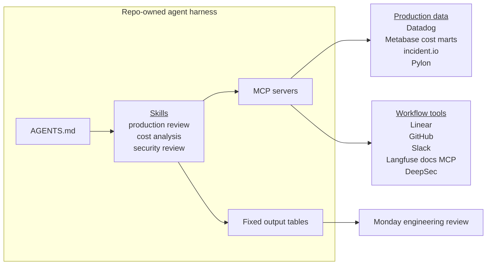

import { BlogHeader } from "@/components/blog/BlogHeader";
import { FileTree } from "@/components/docs";

<BlogHeader
  title="How we use agents to review production infrastructure"
  description="How repo-owned agent workflows help us review incidents, infra cost, security findings, and bugs in production."
  date="June 5, 2026"
  authors={["maxdeichmann"]}
/>

We use agents to turn production data into recurring artifacts for engineering review:

1. A weekly production review surfaces important production signals to act on.
2. Cloud cost analysis explains the main infrastructure spend drivers.
3. Daily repository scans turn security findings into engineering priorities.

With AI, we can generate these reviews without adding bureaucracy for the engineering team. Engineers stay focused on systems judgment instead of weekly evidence collection. They decide whether a cost driver is acceptable, whether a page was customer-impacting, whether a bug needs an owner, whether a monitor is noisy, and whether a DeepSec finding needs an owner.

The data already lived across our tools, like Datadog, Linear, incident.io, and Metabase, spread across four production environments. Nothing pulled the systems together, so reviewing it every week would mean going through each tool and environment by hand.

This post walks through our current setup and how we got there.

## The system combines MCP, repo-owned skills, and fixed output tables

We set up a system with four layers. First, we made the relevant data queryable. Second, we exposed these sources to the agent harness through MCP. Third, we developed and iterated on repo-owned skills. Fourth, each skill defines a stable output table.

The workflow lives in [`langfuse/langfuse`](https://github.com/langfuse/langfuse/tree/main/.agents), not in one engineer's local prompt history.

<FileTree>
  <FileTree.Folder name=".agents" defaultOpen>
    <FileTree.File name="AGENTS.md" />
    <FileTree.Folder name="skills" defaultOpen>
      <FileTree.Folder name="weekly-production-review" defaultOpen>
        <FileTree.File name="SKILL.md" />
      </FileTree.Folder>
      <FileTree.Folder name="analyze-cloud-costs" defaultOpen>
        <FileTree.File name="SKILL.md" />
      </FileTree.Folder>
      <FileTree.Folder name="security-review" defaultOpen>
        <FileTree.File name="SKILL.md" />
      </FileTree.Folder>
    </FileTree.Folder>
  </FileTree.Folder>
</FileTree>

Linear is the deduplication layer across workflows. Before the agent reports an item as new, it searches existing Linear issues and comments. This keeps recurring items from showing up as fresh work every week.

## How each workflow works

### Weekly production review

The `weekly-production-review` skill produces a report from Linear bug tickets, Datadog error signals, and public status-page incidents.

The agent returns tables for Datadog monitor alerts, errored traces, error log patterns, bug-labeled Linear tickets, and public incidents. This gives us one weekly pass over the signals that may need action: bugs to prioritize, incidents to discuss, and Datadog errors that should become follow-up issues.

We iterated heavily on this skill. The agent needs to query each source with the right filters, deduplicate issues across tools, keep regions distinct, and preserve links already attached to Linear tickets.

### Cloud cost analysis depends on warehouse data

Agents need data access before they need better prompts. For cost analysis, we export AWS CUR reports into BigQuery, enrich them with business data using dbt, expose the resulting marts through Metabase, and make the relevant tables accessible through MCP.

The `analyze-cloud-costs` skill does not ask the model to "think about spend." It points the agent at cost marts and asks for the same grain every time: recent complete days versus a baseline, provider/service breakdowns, and cost per 100k ingested billable events.

The agent runs the broad pass: it queries source tables, identifies drivers, preserves caveats such as incomplete current-day AWS CUR rows, and returns the same breakdown every time.

### Security skill turns daily scans into a triage table

The daily security automation runs DeepSec on selected repositories. It scans the repositories, processes findings, revalidates high-severity findings, and exports a compact findings table for review.

Before assigning work, the agent checks Linear for existing issues so the same vulnerability does not get reported every day. After reviewing the table, we ask the agent to create Linear tickets for the relevant findings. Linear Intelligence assigns those tickets to the right engineer.

## Skills need review and iteration

Skills are not done when the first version works. They need review and iteration until engineers can trust them in a recurring workflow.

We review skill output like product behavior: whether the agent found enough evidence, kept formatting stable, and stopped at the right point. Each miss becomes a skill change.

_For example, we initially missed many error cases when searching Datadog for issues. We then updated the skill with the same instructions we would give a coworker: which data to query, how to filter it, and how to link the results. This improved output quality over time._

## Next: ClickHouse query-log analysis by feature area

The next step is to connect agents directly to ClickHouse query-log data through MCP. We already tag ClickHouse queries with dimensions such as project, API route, feature area, query name, and accessed tables. Today, dashboards use these tags to show live resource consumption for each ClickHouse cluster.

Next, we want agents to use the same data to enrich the production review and cost reports. This should let us allocate ClickHouse cost to specific features or projects and find access patterns that caused API performance issues.
