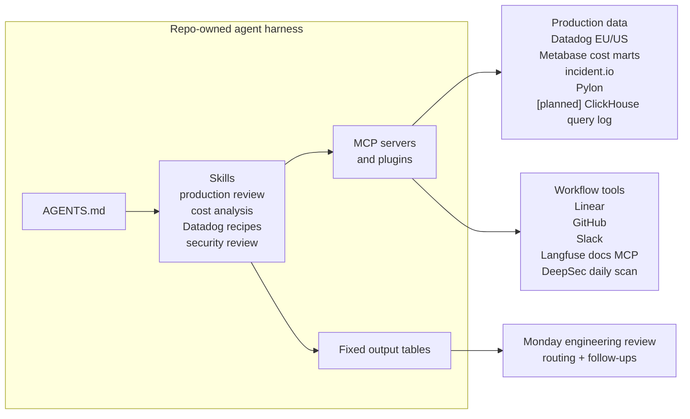

import { BlogHeader } from "@/components/blog/BlogHeader";

<BlogHeader
  title="How we use agents to review production infrastructure"
  description="How repo-owned agent workflows help us review incidents, infra cost, security findings, and production telemetry."
  date="June 5, 2026"
  authors={["maxdeichmann"]}
/>

We use agents to turn production data into recurring engineering review artifacts: weekly incident and bug review, infra cost analysis, security findings, and Datadog investigations.

The pattern is simple: make the data queryable through MCP, keep workflow instructions in the repo, require fixed output tables, and let engineers approve follow-ups. This gives us more production visibility without weekly report-writing work.

## We wanted more production visibility without weekly reporting work

We already had Datadog, Linear, incident.io, a public status page, Metabase, GitHub Actions, and ClickHouse. We also run four production environments: `prod-us`, `prod-eu`, `prod-hipaa`, and `prod-jp`. The gap was cross-system review: connecting customer incidents, monitor pages, production bugs, infra cost drivers, and security findings into one weekly engineering artifact without manually checking every environment and tool.

That review matters, but assembling it manually is report work. We did not want engineers doing that every week before discussing incidents, cost drivers, alerts, and security actions.

## The system combines MCP, repo-owned skills, and fixed tables

The system has four layers: queryable production data, MCP access to that data, repo-owned skills, and fixed output tables. The workflow lives in [`langfuse/langfuse`](https://github.com/langfuse/langfuse/tree/main/.agents), not in one engineer's local prompt history. Root `AGENTS.md` and `CLAUDE.md` are discovery surfaces, while `.agents/AGENTS.md` and `.agents/skills/**` own durable workflow definitions.

Linear is the deduplication layer across workflows. Before the agent reports a finding as new, it searches existing Linear issues and comments. This keeps recurring alerts, bugs, cost regressions, and security findings from showing up as fresh work every week.

This keeps engineers focused on systems judgment, not weekly evidence collection. They decide whether a cost driver is acceptable, whether a page was customer-impacting, whether a bug needs an owner, whether a monitor is noisy, and whether a PR introduces a security risk.

## Weekly production review joins incidents, bugs, and pages

The `weekly-production-review` skill produces an event-centric report from Linear bug tickets, Datadog alert/page signals, incident.io incidents, and public status-page events.

The report has one main section and three evidence sections. The main section is the event view: one row per production issue we may discuss on Monday. If one checkout regression causes two Datadog monitors to page and one Linear bug to be filed, it is still one event.

The evidence sections keep the source data separate. The Linear section lists the underlying bug issues and their status. The Datadog section lists monitor/page signals, including noise and expected tests. The customer incident section lists what was communicated externally. This avoids counting the same breakage once as an incident, again as an alert, and again as a bug.

The workflow is read-only by default. The agent can summarize and deduplicate, but it needs human approval before Linear comments, new issues, incident follow-ups, or monitor changes.

We review the output every Monday in an engineering check-in. The team looks at the previous week's production review, agrees which signals need action, and routes follow-ups to the engineers closest to the affected systems.

## Cloud cost analysis depends on warehouse data

Agents need data access before they need better prompts. For cost analysis, this means pushing cost data into the data warehouse, exposing it through Metabase, and making the relevant tables accessible through MCP. The `analyze-cloud-costs` skill does not ask the model to "think about spend." It points the agent at cost marts and forces it to choose a grain: daily totals, recent complete UTC days versus a baseline, provider and service breakdowns, usage type, operation, account, and cost per 100k tracing events.

The agent runs the broad pass: query source tables, identify drivers, preserve caveats such as incomplete current-day AWS CUR rows, and return the same breakdown every time.

## Security review uses layered automation

For security, one model pass is not enough. We use Semgrep baseline scans for deterministic PR checks, Claude Code security review for trusted non-draft same-repo PRs, and a daily DeepSec automation for selected repositories.

Semgrep uses the PR base SHA as a baseline, so the job fails on newly introduced findings instead of historical findings. It uses an explicit ruleset, disables metrics, and runs in a pinned container image. Claude Code security review pins the action checkout by SHA, disables persisted checkout credentials, and uses a repository secret for the Claude API key.

We also run a daily DeepSec automation over selected repositories. It scans the repository, processes findings with an agent, revalidates high-severity findings, and exports a compact findings table. Before routing a finding, the agent checks Linear for existing issues so the same vulnerability does not get reported every day. DeepSec workspace state and generated reports stay ignored and local.

The model review reasons about code context. The Semgrep baseline is deterministic. The daily DeepSec pass catches repository-level issues outside a single PR's diff.

## Skills need review and iteration

Skills are not done when the first version works. They need review and iteration until engineers can trust them in a recurring workflow.

We review skill output like product behavior: missing evidence, vague summaries, wrong source priority, unstable formatting, and places where the agent stopped too early. Each miss becomes a workflow change.

For example, after a May 31 `Experiment Backfill Missing Logs` alert was missed, we changed the weekly production review workflow to require a full paginated Datadog event sweep before clustering alerts. The final report must confirm that every production monitor title found in the window is represented or explicitly excluded.

The same pattern applies to Datadog investigation. The `datadog-query-recipes` skill documents environment routing across `prod-us`, `prod-eu`, `prod-hipaa`, and `prod-jp`, tenant correlation for public API traces, queue consumer telemetry, span query shapes, and metric names. The agent starts with aggregate queries and fetches raw spans, logs, or traces only after a cluster is identified.

## Next: ClickHouse query-log analysis by feature area

The next step is to connect agents directly to ClickHouse query-log data through MCP. We already started tagging ClickHouse queries with low-cardinality dimensions such as project, API surface, feature area, route, query name, operation, and physical table. We also have dashboards that show live resource consumption per ClickHouse cluster and feature.

Once the ClickHouse MCP has access to the query log, the agent can aggregate query cost and performance by product surface: public API versus tRPC, top feature areas, fast-growing routes, projects driving load within a feature, expensive normalized query hashes, and links back to the query-log evidence.
