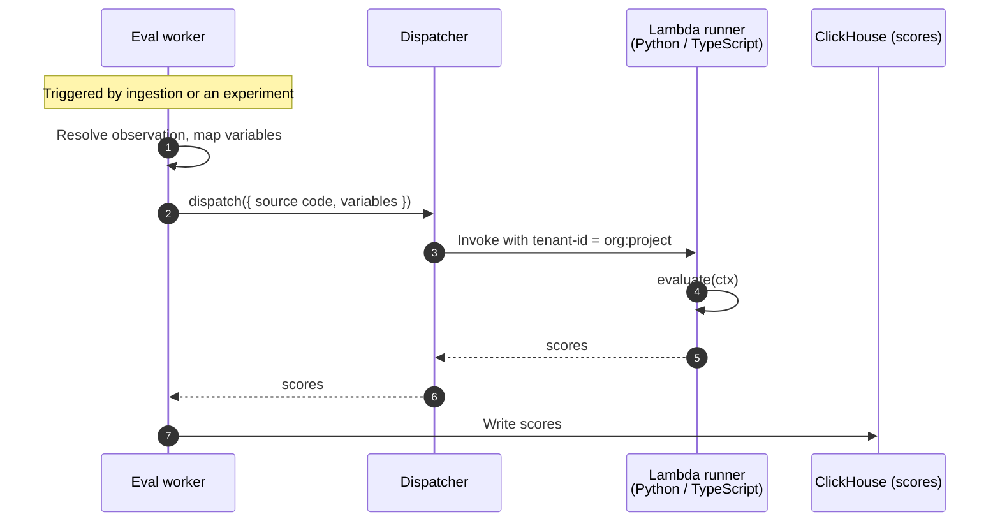

import { BlogHeader } from "@/components/blog/BlogHeader";

<BlogHeader
  title="The week users extracted our AWS credentials — and why we slept fine"
  description="Code evaluators let Langfuse users run their own Python or TypeScript to score incoming LLM observability data. Here is how we safely execute that code across {{TENANT_COUNT}} tenants and {{MONTHLY_RUNS}} monthly runs."
  authors={["tobiaswochinger"]}
/>

Two weeks ago we shipped [code evaluators](/docs/evaluation/evaluation-methods/code-evaluators): you write a small Python or TypeScript function and Langfuse runs it to score your traces. Last week, a few users started probing the boundaries — extracting our AWS credentials from the runtime to find out what an attacker could actually do with them.

We are still sleeping fine. This post is about the system that lets us: how we run our users' code inside our own infrastructure, next to **{{TENANT_COUNT}} other tenants**, at peak around **{{MONTHLY_RUNS}} executions a month**, without it becoming the scariest thing we operate.

<Video
  src="https://static.langfuse.com/docs-videos/2026-05-29-code-evaluator-creation-flow.mp4"
  aspectRatio={1230 / 692}
  gifStyle
/>

## Why code evaluators

Evaluation is how you find out whether your LLM app is actually any good. Reading traces by hand works for the first hundred, then it doesn't. The usual next step is [LLM-as-a-judge](/docs/evaluation/evaluation-methods/llm-as-a-judge): a model scores your outputs for things like helpfulness or tone.

But a lot of what teams want to check is not subjective at all. Is the output valid JSON? Does it match the schema? Did the tool call include the required arguments? Does the answer exactly match the expected value? A model is an expensive, non-deterministic way to answer questions that a few lines of code answer perfectly every time.

That is what code evaluators are: you write a small Python or TypeScript function, it returns one or more scores, and Langfuse runs it for you. "Langfuse runs it for you" is the interesting part. It also means running code we did not write, from people we cannot vouch for, inside our own infrastructure — the kind of sentence that makes an engineer's stomach drop.

## What we were actually building

Before picking any technology, it helped to be precise about the workload, because it is much narrower than it first sounds.

A code evaluator is **short** (it has to finish in two seconds), **deterministic** (same input, same score), and **stateless** (no database, no files to keep, nothing carried between runs). It gets the observation's input, output, and metadata, runs some pure logic, and returns scores.

This matters because "run untrusted user code" immediately makes people think of the agent-sandbox systems that are everywhere right now — long-lived environments with a filesystem, network access, and ~~`pip install`~~ `uv add` at runtime. We needed almost none of that. No long-running state, no package installs, no outbound calls (for now). Recognizing how small the box actually was is what let us avoid building a general-purpose compute platform to run a JSON-schema check.

## Requirements, and the non-requirements that mattered more

The hard requirement was **multi-tenant security**. The test I kept coming back to was simple: I never want to be the person writing the email that tells a user their data may have been leaked.

And the stakes are real. Companies like [SumUp](/customers/sumup) (AI support for four million payment merchants), [Khan Academy](/customers/khan-academy) (its Khanmigo student tutor), and [Merck](/customers/merckgroup) (80+ AI teams) use Langfuse to observe the LLM features they ship to real users. Whatever we built had to assume the code running inside it was hostile.

Around that, we wanted to support **Python and TypeScript** (teams write evaluators in whatever their app is written in), handle **~{{MONTHLY_RUNS}} executions a month**, and not wreck the "easy to self-host" story Langfuse is built on.

Two things were explicitly _non_-requirements for v1 — and that mattered as much as the requirements:

- **Network access and credentials.** There are genuinely good reasons to want them in an evaluator: checking that a cited source URL actually resolves, calling an internal scoring service, looking up a record in your own database. We are not against any of that. But we wanted to ship the deterministic core first, learn how the system behaves under real load, and keep a _clear, safe path_ to adding these capabilities — rather than baking them in before we understood the risk.
- **Latency.** Evaluations run asynchronously, off the request path, so a few hundred milliseconds of cold start is fine. This single fact removes most of the pressure that pushes people toward fragile in-process sandboxes.

## Alternatives we evaluated

We grouped the options by how the isolation works, and each group had a dealbreaker.

**In-process isolation** — V8 isolates, Deno with Pyodide, or `wasmtime`. These are fast (near-zero startup) and cheap, and they were tempting. But for multi-tenant use they are fragile in exactly the wrong way: if the sandbox is breached, the attacker is in the _same process_ as other tenants' data. And a no-egress runtime does not save you — a user who can read another tenant's data can simply funnel it out through the score values and comments they are allowed to return. Hardening the process yourself with a primitive like `seccomp` can absolutely be made secure, but getting a syscall allowlist right across two language runtimes, without leaving a gap or breaking the runtime in subtle ways, is genuinely hard — and it is work we would own forever.

The track record backs this up: n8n's Pyodide sandbox got a [9.9-severity escape](https://www.cyera.com/research/n8scape-pyodide-sandbox-escape-9-9-critical-post-auth-rce-in-n8n-cve-2025-68668) from a leaky blocklist, and even Cloudflare are [open](https://blog.cloudflare.com/mitigating-spectre-and-other-security-threats-the-cloudflare-workers-security-model/) about the continuous investment V8 isolates demand — a problem that is not our core product.

**Your own sandboxing stack** — gVisor, Firecracker, or Kata. The strong end of the spectrum: real isolation, room to grow. The problem is operational. gVisor needs a custom containerd/runsc setup; Firecracker wants KVM. None of it ships as a simple Helm chart, which is a real cost for a project where a lot of users self-host.

**A container per run** — Fargate tasks, or Kubernetes Jobs for self-hosters. We are heavy Fargate users at Langfuse, so this was a natural candidate: isolation is solid and the idea of cheap Spot instances was attractive. But startup is on the order of a minute, and we were nervous about thousands of concurrent tasks spawning in our account and hitting quotas. Heavy for a two-second JSON check.

## The solution: AWS Lambda

AWS Lambda fit the shape of the problem almost exactly. Each invocation runs in an AWS-managed microVM, startup is around 100ms, and it scales to our concurrency without us operating anything.

### The warm-environment gotcha

The first thing to get right is that Lambda reuses execution environments. A "cold" invocation gets a fresh microVM; subsequent "warm" invocations can reuse the same one, including whatever the previous run left behind in memory or in `/tmp`. For most workloads that reuse is a feature. For running untrusted code from different tenants, naively sharing a warm environment between two of them is a data leak waiting to happen.

### Solving warm environments without {{LAMBDA_COUNT}} Lambdas

So how do you stop a warm environment from ever being reused across tenants? The most intuitive answer is to give every tenant its own pair of functions — one Python, one TypeScript. With {{TENANT_COUNT}} tenants, that is more than **{{LAMBDA_COUNT}} Lambdas**.

It would work, but the operational weight is brutal. You provision two functions every time a project is created, tear them down when it is deleted, and — worst of all — keep the small runner harness that lives _inside_ each function in sync across all eleven thousand of them every time you change a line of it. No thanks.

Luckily, AWS shipped a better answer: [tenant isolation](https://docs.aws.amazon.com/lambda/latest/dg/tenant-isolation.html), a relatively new Lambda capability. You pass a tenant ID with each invocation, and Lambda guarantees an execution environment is only ever reused for the _same_ tenant. Different tenant, different environment — enforced by the platform, not by our code.

That collapses eleven thousand functions back down to **two**: one shared Python runner and one shared TypeScript runner. We key the isolation on `organizationId:projectId`, because project is already the primary data-isolation boundary everywhere else in Langfuse. The accepted tradeoff is that two evaluators in the same project (and same language) can land in the same execution environment — but everything in a project is already mutually visible within that project, so that shared boundary exposes nothing a user couldn't already see.

The headroom is comfortable: Lambda allows us roughly 1,250 isolated environments per runner, and the most distinct projects we have ever seen run evaluators in a single hour is a little over 200. Moving to a finer-grained key later is a config change, not a redesign.

### What we send the Lambda

Each invocation carries two things: the user's evaluator **source code** and the **variables** it runs against (the observation's input, output, and metadata, plus any experiment context). The worker reads the source from Postgres, reduces the variables to just what the evaluator mapped, and sends both inline in the invoke payload. Real payloads sit well under Lambda's limits, so there is no object storage in the hot path and no separate code artifact to manage and secure.

We invoke synchronously for now. If open connections or backpressure ever become the bottleneck, the dispatcher can move to an async, queue-based flow without changing a single line of what users write.

### A thin dispatcher seam

You may have noticed a `Dispatcher` sitting between the worker and Lambda in that diagram. The rest of Langfuse does not know or care that the backend is Lambda — it talks to a small interface that models _Langfuse_ concepts, not AWS ones: essentially a single `dispatch({ code, variables })` call scoped to an organization and project. The AWS Lambda dispatcher is one implementation behind it.

That seam is what keeps self-hosting honest. Self-hosters can point the AWS Lambda dispatcher at their own account with their own credentials, or — for non-production setups — use a simple local dispatcher (TypeScript only) that runs evaluators without the Lambda machinery. We are deliberately not promising a marketplace of dispatcher backends today, but the abstraction is there, so adding a GCP, Azure, or Kubernetes runner later is an implementation detail rather than surgery.

### TypeScript in Lambda 😱

Lambda does not run TypeScript. The obvious fix — transpile the user's code in our worker before sending it — was a non-starter: pulling a full TypeScript toolchain into a security-sensitive path to transform untrusted code is exactly the kind of complexity we were trying to avoid.

Instead we support what we call "TS-lite": JavaScript plus erasable type annotations. The runner uses Node's built-in [`stripTypeScriptTypes`](https://nodejs.org/api/module.html#modulestriptypescripttypescode-options) to erase the types inside the Lambda, with no transformation step. Type annotations and interfaces work; features that require real code generation — `enum`, `namespace`, decorators — throw a clear error. A small UX compromise that buys a much smaller attack surface.

## Bringing it to production

A good architecture still needs the boring parts done carefully.

**The runner has nothing worth stealing — by design.** The Lambda execution role can write its own CloudWatch logs and do nothing else: no Langfuse credentials, no access to any other AWS service. Crucially, the execution _trace_ you see in Langfuse is written by the _worker_, not the runner, so the runner never needs Langfuse credentials in the first place. The component running untrusted code is the least privileged thing in the system.

**No network egress.** The runners sit in a dedicated VPC with no route to the internet. The concern here is less data exfiltration — a user can already read their own project's data — and more abuse: we did not want our Lambda capacity turned into a tool for hammering third-party APIs. Because code and variables are passed inline, the runner never needs to make a call out, so a no-egress setup costs us nothing today and leaves room for a controlled, allowlisted proxy later.

**Strict limits everywhere.** A two-second timeout, hard caps on source and payload size, a cap on result size, and validation of every result before it becomes a score. Anything over a limit fails loudly rather than silently truncating.

**Test against real data before going live.** Evaluators are written in an in-app editor with validation as you type, and you can run an evaluator against real observations from your own project before enabling it — so you see exactly what your code receives and returns before it touches live traffic.

Two things made building this a lot less nerve-wracking than it could have been. The first is [floci](https://floci.io/), a local cloud emulator that let us run the Lambda runners end-to-end on our machines and iterate fast through the error cases — malformed code, oversized payloads, timeouts, unsupported TypeScript — without a deploy in the loop each time. The second: with security, a second pair of eyes never hurts, and at Langfuse we have the unfair advantage of access to the ClickHouse security team, who pressure-tested the isolation model and IAM setup before we shipped it.

## The week users tried to steal our credentials

Then the system met its first real audience.

It started with a security researcher reaching out: it was possible to write an evaluator that reads `AWS_ACCESS_KEY_ID` and the other Lambda environment variables straight out of the runtime and returns them in a score comment. Shortly after, someone started trying to actually _use_ a set of those extracted credentials. Whether that was the same person doing a thorough job or someone else entirely, we genuinely can't say.

Here is the thing: nobody on the team got worried, because the model had been designed cleanly from the start. This kind of probing is exactly what you hope to see — it is the only real test of whether a security model is a working system or just a nice diagram. Ours held.

The extracted credentials grant nothing. The execution role is logs-only — it can write its own CloudWatch logs and touch nothing else — so the keys are real and also completely inert. Whoever held them tried `ListFunctions`, then a long list of network and resource calls. Every single one came back `AccessDenied`.

<Frame fullWidth>
  
</Frame>

GuardDuty caught the attempt the moment it happened: credentials created exclusively for the code-eval runner role, suddenly used from an external IP in Kraków — flagged High, and still able to do exactly nothing.

<Frame fullWidth>
  
</Frame>

That quiet wall of `AccessDenied` is the whole point of the design: the component running untrusted code is the least privileged thing we operate, so stealing its credentials gets you a key that opens no doors. The system did precisely what it was built to do.

## Deterministic checks, as agents grow up

Code evaluators are one tool in a larger kit: LLM-as-a-judge for the subjective questions, deterministic code for the ones with a right answer. As agents take on more — and as the cost of running them gets a harder look — teams want to scrutinize what those agents actually do. Letting users run their own code on every observation, without that becoming the scariest system we operate, is the whole point.

These are deliberate v1 choices, not permanent limits. Is one of them blocking you — need network access, a third-party library like `numpy` or `pandas`, or a dispatcher backend other than AWS Lambda? Tell us in [GitHub Discussions](https://github.com/orgs/langfuse/discussions); what we add next is driven by what you run into.

If you want to try code evaluators, the [docs](/docs/evaluation/evaluation-methods/code-evaluators) are the place to start. And if running untrusted code across thousands of tenants sounds like a fun problem, [we are hiring](/careers).
