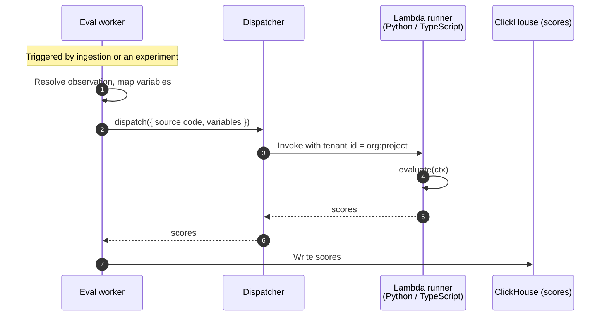

import { BlogHeader } from "@/components/blog/BlogHeader";

<BlogHeader
  title="Designing the runtime for Langfuse code evaluators"
  description="Code evaluators let you score traces with your own Python or TypeScript. A look at the execution model behind them: the requirements, the options we rejected, and the security stance we adopted."
  authors={["tobiaswochinger"]}
  date="June 10, 2026"
/>

> **✍️ SKELETON — not for publishing.** Section structure + raw material from the RFC / implementation plan. Blockquotes like this one mark where prose needs to be written. Alternative titles: "The execution model behind code evaluators", "Running customer code on AWS Lambda with tenant isolation".

In late May we shipped [code evaluators](/docs/evaluation/evaluation-methods/code-evaluators): you write a small Python or TypeScript function and Langfuse runs it to score your traces. by design effectively anybody can run untrusted code in our multitenant SaaS environment. That environment that holds petabytes of critical data by thousands of users. This post is the design doc made public: the requirements, the design space, what we picked, and how it held up.

> **✍️ TODO (intro, 2-3 sentences):** What "Langfuse runs it for you" implies: executing code we did not write, from people we cannot vouch for, inside our own multi-tenant infrastructure. This post is the design doc made public: the requirements, the design space, what we picked, and how it held up. Confident, factual tone — no "scary"/"stomach drop".

<Video
  src="https://static.langfuse.com/docs-videos/2026-05-29-code-evaluator-creation-flow.mp4"
  aspectRatio={1230 / 692}
  gifStyle
/>

## Why code evaluators

Evaluation is how you find out whether your LLM app is actually any good. While we absolutely recommend reviewing some traces by hands (link to loop blogbost by lotte), it simply doesn't scale to millions of traces. The usual state-of-the art practice is to deploy LLM-as-judge evaluators (links) based on the error modes that you derived from your sampled traces: they are great in capturing things like agent helpfulness, conciseness or tone.

But a lot of what teams want to check is not subjective at all. Is the output valid JSON? Does the answer match the expected value? A model is an expensive, non-deterministic way to answer questions that a few lines of code answer perfectly every time.

That is what code evaluators are: you write a small Python or TypeScript function, it returns one or more scores. No need to setup infrastructure on your side - you provide the code, configure when it should be triggered and Langfuse will run it for you at scale.

Below is an example of a typical code evaluator that checks for required fields:

(todo replace with more real example)

```ts
function evaluate({ observation: { output } }: EvaluationContext): EvaluationResult {
  const missing: string[] = [];
  if (!output?.summary?.trim()) missing.push("summary");
  if (!output?.items?.length) missing.push("items");
  if (!output?.sections?.length) missing.push("sections");

  return {
    scores: [{
      name: "has-required-fields",
      value: missing.length === 0,
      dataType: "BOOLEAN",
      comment: missing.length ? `Missing: ${missing.join(", ")}` : "All fields present",
    }],
  };
}
```

## Requirements and non-goals

as you can, see Code evaluators are usually fairly restricted workloads: they are **short** (in the 100s milliseconds region, **deterministic** (same input, same score), and **stateless** (no filesystem, no state between runs).

This is a sharp distinction from agent sandboxing like E2B or Modal) that is currently everywhere: these need long lived environments, file-system access, snapshotting and ~~`pip install`~~ `uv add` at runtime.

So knowing what we don't need (agent sandboxes), we can think about what our users need:

- Security: may it be our Langfuse cloud environments or platform teams hosting langfuse for multiple teams: we need to ensure that tenants can't access each others data
- Scale: we have ingest hundreds of millions of observations per day. Each of them can potentially trigger one ore more code evaluators that will then need to recive the observation to process
- Self-hosting parity: Langfuse is easy to self-host and we want to keep it this way. It shouldn't take an infra team to operate it and secure it.
- Python and TypeScript support: Users want develop in the language they are familiar in. Python as data scientists favorite language and TypeScript as evolving standard as AI application engineers

(and then obviously the obvious ones like operating and maintenance cost)

At Langfuse we're big believers in shipping fast and often: Get sth in the hand of users, learn from their feedback and learn from operating it for them.
Same same with code evaluators which is also why we purposefully kept the initial slice lean and deferred some requirements (network capabilities, third-party library support) to future iterations.

## Options we considered

Sandboxing untrusted code is not a new problem and so we had a variety of options available:

**Making it the user's problem** (probably need to find a nicer title given the previous review comments)

The genius behind tools like Claude Code is that they get rid of an entire category of problems by moving the execution to their users. No tenant isolation that you need to deal with, full access to the users environment. In our case we could have used webhooks to trigger our users infrastructure, expecting the scores as results. While very tempting, it would have made for an awful user experience: every user would have had to set up a webhook target that can potentially serve hundreds of requests per second with payloads that can easily go in the megabytes.

**Offering a custom DSL**

If the checks are all fairly similar and deterministic, why even offering the full power of a programming language? Coulnd't we do a small DSL / query builder that generates only safe code in the background? Use cases for sure a similar but data isn't. While a DSL could for sure serve a majority of workloads, we'd face just as many requests by users who wouldn't fit these narrow boxes and who'd be blocked. Plus, a custom DSL wouldn't be in distribution for humans or agents.

**In process isolation**

Fast startup time, no extra infrastructure components: In process isolation with tools like v8-isolate, wasmtime, seccomp, deno or pyodide would have been the next best solution - especially with our self-hoster requirement in mind. But they are incredible hard to get right and if breached users end up in a critical space with other customer's data. Looking at the effort it takes to keep cloudflare workers safe, or the incident history of tools like N8N, we simply didn't feel comfortable that this would be a solution that would let us sleep soundly.

**Firecracker, gvisor, Kata**

The gold standard solutions. Powering the likes of AWS Lambda, Claude Code on the web or OpenAI code execution. Unfortunately, they are non trivial to deploy as they require KVM (Linux Hardware Virtualization) and or special container runtimes. Doable for us as a on-off but not really something that we want to put on our customers.

**Kubernetes jobs**

Dispatching code evaluations as Kubernetes jobs (or Fargate tasks) in our case would fit the self-hosting story very well and remains probably one of the best options for self hosters that don't want to use one of the Hyper Scalers as backend. However, dispatching one container to run a workload of a few 100 milliseconds is also quite heavy and noise.

## Our runtime of choice: AWS Lambdas

AWS Lambdas turned out to fit the shape of the problem almost exactly. Each invocation runs in an AWS-managed microVM, startup is around 100ms, and literally built for high concurrency workloads.

Having looked at the different options our stance on our self-hoster requirement had also changed. After we spoke to customers at different sizes, it became clear that there wouldnt't be a one size fits all solution - even if would get everyone to run in an K8s compatible environment. Having that in mind we decided to chose AWS Lambda as first cloud native implementation of a extendable dispatcher specification.

```TypeScript
export interface CodeEvalDispatcher {
  name: string;
  dispatch(input: DispatchInput): Promise<DispatchResult>;
}
```

Self-hoster can use that with their own credentials or use the also included insecure local dispatcher for development or trusted environments.

<Callout type="warning">
  The local dispatcher executes evaluator code in-process, without the isolation
  guarantees described in this post. It is not safe against cross-tenant access
  and must not be used in production.
</Callout>

TODO: Add another callout to let us know in the GH discussions if they need a specific new dispatcher backend

### Warm environments, and why naive Lambda is not enough

One major factor for AWS lambdas was that we found that security story very managable. AWS operates under the least privilege principle giving us safe defaults where every decision to widen the capabilities is a conscious ones.

However, there was on gotcha around Lambdas: invocations are not as isolated as you think.
"Cold" invocation gets a fresh microVM; subsequent "warm" invocations can reuse the same one, including whatever the previous run left behind in memory or in `/tmp`. This could potentially lead to leaked data across tenants.

Until late last year your only option would have been to have one lambda function per tenant. There are no restrictions on the amount of lambdas but we would have inherited quite some complexity for the life cycle management: Creating the functions dynamically upon tenant creation, tearing them down if unused or Langfuse project is deleted. And worst: Keeping the our tiny harness within the function in sync.

Luckily, AWS launched tenant isolation (https://aws.amazon.com/about-aws/whats-new/2025/11/aws-lambda-tenant-isolation-mode/). Projects are the current security boundary in Langfuse giving us a good tradeof of tenant key cardinality and security. And best of all: we end up with a fixed number of 2 lambda functions instead of `tenant * 2` (node + python) lambdas that are versioned and deployed via our IaC setup.

### Dispatch: synchronous and inline

Having the operational experience of operating hundred of millions LLM-as-a-judge invocations we felt comfortable starting with the simplest possible setup with lambdas: synchronous invocation with inlined payload (Lambda limit at 6mb). As adoption grows async invocation using AWS SQS combined with signed S3 URLs give us a clear and most importantly non breaking upgrade path.

Upon invocation we send payload and user source code to the lambda. A tiny Langfuse provided harness in the Lambda handles payload parsing and invocation of the user's code.:



### The principle of least privilege

AWS lambdas are giving us the perfect controllable sandbox. All the more important not to mess up things up on the way. For us that meant: religiously following the principle of least privilege. Credentials that you don't pass, actions you don't perform or capabilities that you don't add - all things that can't blow up.

Concretely this meant:

- Only interact with the code on client side or within the lambda. Once it enters our backend we just treat it as random string. This also meant skipping any necessary transpilation step for TypeScript based evaluators. Specifically this means we only allow erasable TypeScript syntax ((https://nodejs.org/api/module.html#modulestriptypescripttypescode-options)) which we can strip upon lambda invocation - a fair compromise given the usual characteristics of code evaluators.
- Minimal lambda permissions: the lambdas executing the code can do one thing only: write cloudwatch logs to a specific logs. No other credentials than these AWS credentials are passed and hence can't be leaked.
- No egress: Lambdas are attached to a separate VPC with its own security group and no access to internal or external networks. For this we weren't so much worried about data leaking but rather abuse of our compute to abuse other parties. Adding rate-limited and allow-list based egress later on can then be its own isolated feature. This
- Strict limits: we have execution limits (2s), memory limits (128MB) and payload limits on source (256KB), inputs and outputs (5.5 MiB) in place to prevent any abuse.

## Meeting real life

We were confident that the implementation was robust - thanks to our extensive planning, threat modelling with our ClickHouse security team and an extensive testing suite based on the excellent Floci AWS simulator (link). but in the end plans are nothing; planning is everything - we know that people would put code evalautors to the test as soon as they were launched. And guess what - they did.

A few days after the release we had a security researcher reaching out claiming that database credentials could be extracted from the code evaluation execution by reading out environment variables and returning the result as score comments. The part about the database credentials was luckily a give aways for AI slob - as said above: we don't pass any credentials to the execution environment.
What held up though was the extraction of the environments variable via score comments - an attack vector we had considered before and planned for.

Admittely, one blind spot on our side was that these environment variables also include the AWS injected reserved credentials (add link to dosc) for the Lambda execution itself. A few hours after the initial reach out bounty hunters started to probe the AWS API using the extracted credentials:

<Frame fullWidth>
  
</Frame>

There is not much you can do about this. The passed credentials are reserved by AWS and scrubbing of things like `os.environ` or `process.env` make things harder but not impossible.
You could of course in-process sandbox things adding defense-in-depth but in the end it always remains one possible vector while adding significant complexity and overhead.

In the end our religious adherence to the principle of least privilege and strictly following AWS best practices (e.g [when it comes to attaching lambdas to VPCs](https://docs.aws.amazon.com/lambda/latest/dg/configuration-vpc.html) payed off: GuardDuty confirmed all requests being denied and attackers eventually gave up. Our plan held up.

<Frame fullWidth>
  
</Frame>

## What's next

We deliberately traded features for properties we could verify: no egress, no dependencies, no credentials in v1 — in exchange for tenant isolation we did not have to build ourselves, a runner whose stolen credentials open nothing and most importantly: getting this in the hands of real users as quickly as possible to open up the feedback stream.

Deterministic checks and LLM-as-a-judge now cover both halves of evaluation; the deferred features come back one at a time, each with the same security bar.

If you want to try code evaluators, the [docs](/docs/evaluation/evaluation-methods/code-evaluators) are the place to start.
Please also let us know if one of the outliend decisions block you - tell us in [GitHub Discussions](https://github.com/orgs/langfuse/discussions); what we add next is driven by what you run into.
And if running untrusted code across thousands of tenants sounds like a fun problem, [we are hiring](/careers).
