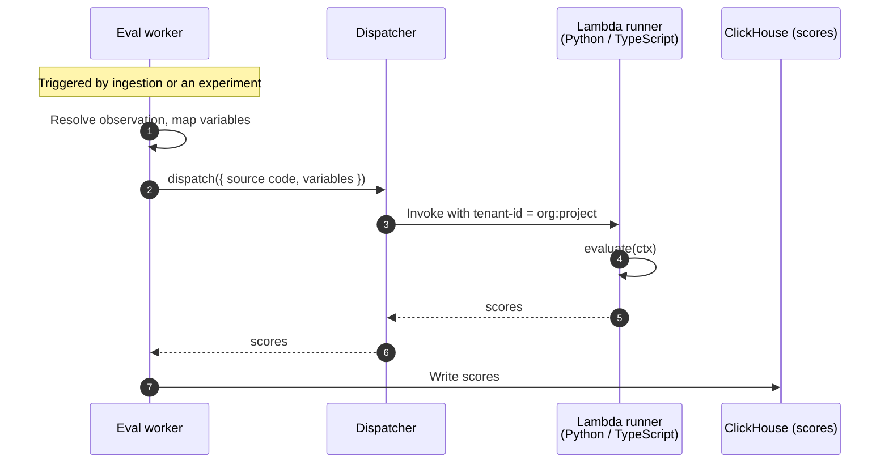

import { BlogHeader } from "@/components/blog/BlogHeader";

<BlogHeader
  title="Designing the runtime for Langfuse code evaluators"
  description="Code evaluators let you score traces with your own Python or TypeScript. A look at the execution model behind them: the requirements, the options we rejected, and the security stance we adopted."
  authors={["tobiaswochinger"]}
  date="June 10, 2026"
/>

> **✍️ SKELETON — not for publishing.** Section structure + raw material from the RFC / implementation plan. Blockquotes like this one mark where prose needs to be written. Alternative titles: "The execution model behind code evaluators", "Running customer code on AWS Lambda with tenant isolation".

In late May we shipped [code evaluators](/docs/evaluation/evaluation-methods/code-evaluators): you write a small Python or TypeScript function and Langfuse runs it to score your traces. by design effectively anybody can run untrusted code in our multitenant SaaS environment. That environment that holds petabytes of critical data by thousands of users. This post is the design doc made public: the requirements, the design space, what we picked, and how it held up.

> **✍️ TODO (intro, 2-3 sentences):** What "Langfuse runs it for you" implies: executing code we did not write, from people we cannot vouch for, inside our own multi-tenant infrastructure. This post is the design doc made public: the requirements, the design space, what we picked, and how it held up. Confident, factual tone — no "scary"/"stomach drop".

<Video
  src="https://static.langfuse.com/docs-videos/2026-05-29-code-evaluator-creation-flow.mp4"
  aspectRatio={1230 / 692}
  gifStyle
/>

## Why code evaluators

Evaluation is how you find out whether your LLM app is actually any good. While we absolutely recommend reviewing some traces by hands (link to loop blogbost by lotte), it simply doesn't scale to millions of traces. The usual state-of-the art practice is to deploy LLM-as-judge evaluators (links) based on the error modes that you derived from your sampled traces: they are great in capturing things like agent helpfulness, conciseness or tone.

But a lot of what teams want to check is not subjective at all. Is the output valid JSON? Does it match the schema? Does the answer match the expected value? A model is an expensive, non-deterministic way to answer questions that a few lines of code answer perfectly every time.

That is what code evaluators are: you write a small Python or TypeScript function, it returns one or more scores. No need to setup infrastructure on your side - you provide the code, configure when it should be triggered and Langfuse will run it for you at scale.

Below is an example of a typical code evaluator that checks for required fields:

(todo replace with more real example)

```ts
function evaluate({ observation: { output } }: EvaluationContext): EvaluationResult {
  const missing: string[] = [];
  if (!output?.summary?.trim()) missing.push("summary");
  if (!output?.items?.length) missing.push("items");
  if (!output?.sections?.length) missing.push("sections");

  return {
    scores: [{
      name: "has-required-fields",
      value: missing.length === 0,
      dataType: "BOOLEAN",
      comment: missing.length ? `Missing: ${missing.join(", ")}` : "All fields present",
    }],
  };
}
```

Code evaluators are usually fairly restricted workloads: an evaluator run is **short** (in the 100s milliseconds region, **deterministic** (same input, same score), and **stateless** (no filesystem, no state between runs).

This is a sharp distinction from agent sandboxing that is currently everywhere: these need long lived environments, file-system access, snapshotting and ~~`pip install`~~ `uv add` at runtime.

## Requirements and non-goals

So knowing what we don't need (agent sandboxes), we can think about what our users need:

- Security: may it be our Langfuse cloud environments or platform teams hosting langfuse for multiple teams: we need to ensure that tenants can't access each others data
- Scale: we have ingest hundreds of millions of observations per day. Each of them can potentially trigger one ore more code evaluators that will then need to recive the observation to process
- Self-hosting parity: Langfuse is easy to self-host and we want to keep it this way. It shouldn't take an infra team to operate it and secure it.
- Python and TypeScript support: Users want develop in the language they are familiar in. Python as data scientists favorite language and TypeScript as evolving standard as AI application engineers
- Transparency: Code that is running automatically upon ingestion of observations is great - but what if its execution fails? Users need to be able to quickly debug any issues

At Langfuse we're big believers in shipping fast and often: Get sth in the hand of users, learn from their feedback and learn from operating it for them.
Same same with code evaluators which is also why we purposefully kept the initial slice lean and deferred some requirements (network capabilities, third-party library support) to future iterations.

## The design space

> **✍️ TODO (1 short lead-in sentence):** We grouped the options by isolation model; each rejected group had a concrete dealbreaker.

| Option                                                                 | Isolation                  | Startup | Why we rejected it                                                                                                                                                                           |
| ---------------------------------------------------------------------- | -------------------------- | ------- | -------------------------------------------------------------------------------------------------------------------------------------------------------------------------------------------- |
| **Webhook dispatch** (user hosts an HTTP endpoint, we POST work to it) | User-side                  | n/a     | High setup friction for someone who wants `output === expected`; user must build queueing/scaling; lost data points get blamed on Langfuse                                                   |
| **Managed sandbox provider** (E2B, Modal, Vercel Sandbox)              | MicroVM                    | Fast    | Third-party dependency on a core workflow; severely complicates self-hosting                                                                                                                 |
| **V8 isolates** (`isolated-vm`)                                        | In-process                 | ~0 ms   | Breach lands the attacker in the same process as other tenants' data; TS only                                                                                                                |
| **Deno + Pyodide**                                                     | In-process                 | Fast    | Same blast-radius problem; n8n's Pyodide sandbox had a [9.9-severity escape](https://www.cyera.com/research/n8scape-pyodide-sandbox-escape-9-9-critical-post-auth-rce-in-n8n-cve-2025-68668) |
| **wasmtime**                                                           | Process                    | Fast    | No C extensions — closes the door on numpy/pandas; escape still lands on a shared machine                                                                                                    |
| **gVisor / Firecracker / Kata**                                        | Syscall-filtered / MicroVM | Fast    | Strongest isolation, but custom containerd/runsc setups and KVM requirements — not shippable as a Helm chart, which breaks self-hosting parity                                               |
| **Container per run** (Fargate, K8s Jobs)                              | Container                  | ~1 min  | Startup measured in minutes for a 2-second job; quota anxiety at thousands of concurrent tasks                                                                                               |
| **Langfuse-managed evaluators only** (no user code)                    | n/a                        | n/a     | Customizability is the entire point; users hit the wall of a curated library quickly                                                                                                         |
| **AWS Lambda** ✅                                                      | MicroVM (AWS-managed)      | ~100 ms | —                                                                                                                                                                                            |

> **✍️ TODO (optional, 1 paragraph):** Expand the in-process row group slightly in prose: hardening with seccomp/blocklists is possible but is permanent security work outside our core product — cite Cloudflare being [open](https://blog.cloudflare.com/mitigating-spectre-and-other-security-threats-the-cloudflare-workers-security-model/) about what V8 isolates demand.

## The chosen design: shared Lambda runners with tenant isolation

> **✍️ TODO (1 paragraph):** Lambda fits the workload's shape: AWS-managed microVM per environment, ~100 ms startup, scales without us operating anything.

### Warm environments, and why naive Lambda is not enough

Keep (condensed from current draft):

- Lambda reuses execution environments. Warm invocations inherit whatever the previous run left in memory or `/tmp`. Fine for normal workloads; a cross-tenant leak for untrusted code.
- Intuitive fix: one function pair (Python + TypeScript) per tenant → tens of thousands of Lambdas, provisioning/teardown lifecycle, and a runner harness to keep in sync across the whole fleet. Operationally brutal.
- Actual fix: [Lambda tenant isolation](https://docs.aws.amazon.com/lambda/latest/dg/tenant-isolation.html) — pass a tenant ID per invocation; AWS guarantees an environment is only ever reused for the same tenant. Two shared runners total.
- Tenant key: `organizationId:projectId` — project is already the data-isolation boundary everywhere else in Langfuse. Accepted tradeoff: evaluators within one project share a runtime boundary, which exposes nothing not already mutually visible in that project.
- Headroom: ~1,250 isolated environments per runner vs. ~200 peak distinct projects running evaluators in any hour. Moving to a finer key is a config change.

### Dispatch: synchronous and inline, on purpose

What an invocation carries: the evaluator **source code** (read from Postgres) plus the **reduced variables** the user mapped (JSONPath/variable mapping happens in the worker). Measured payloads (p95 well under 200 KB) sit comfortably below Lambda's 6 MB sync invoke limit.

Options considered (from the implementation plan — good public material):

| Strategy             | Why / why not                                                                                                                                  |
| -------------------- | ---------------------------------------------------------------------------------------------------------------------------------------------- |
| **Sync + inline** ✅ | Simplest path that's correct: direct result handling, no callback auth or DLQ machinery, and an egress-free runner since nothing is downloaded |
| Sync + S3            | Adds object storage to the hot path for payload outliers we don't have                                                                         |
| Async + inline       | Buys backpressure/retries at the cost of callback auth, idempotent result writes, stale-execution cleanup                                      |
| Async + S3           | The high-volume shape — deliberately not the MVP                                                                                               |

- Over-limit payloads **fail hard** with an actionable error (reduce variable mapping / shorten source) — no silent truncation, no S3 fallback in v1.
- Moving to async later changes nothing in the user-facing contract.



### Code lives in Postgres, not S3

- Source is capped at 256 KiB and stored on the evaluator template; the worker sends it inline on every dispatch.
- This spends invoke-payload budget but eliminates a separate artifact lifecycle to manage and secure — and it is what makes the egress-free runner possible (nothing to download).
- If custom dependencies arrive later, that becomes a build-time artifact problem (code + lockfile → immutable image), not a runtime `pip install`.

### TypeScript without a transpiler

Keep (condensed from current draft):

- Lambda does not run TypeScript. Transpiling untrusted code in our worker pulls a full TS toolchain into a security-sensitive path — rejected.
- "TS-lite" instead: JavaScript plus erasable type annotations via Node's built-in [`stripTypeScriptTypes`](https://nodejs.org/api/module.html#modulestriptypescripttypescode-options), executed inside the Lambda. Annotations and interfaces work; `enum`, `namespace`, decorators throw a clear error.

### The dispatcher seam, and self-hosting

- The worker talks to a small `dispatch({ code, variables })` interface scoped to organization/project — it models Langfuse concepts, not AWS ones. The AWS Lambda dispatcher is one implementation behind it.
- Self-hosters point the AWS Lambda dispatcher at their own account via environment variables. GCP / Azure / Kubernetes backends are an implementation detail behind the same seam, added based on demand.
- For local development and non-production setups there is a local dispatcher (TypeScript only).

<Callout type="warning">
  The local dispatcher executes evaluator code in-process, without the isolation
  guarantees described in this post. It is not safe against cross-tenant access
  and must not be used in production.
</Callout>

## The security stance

> **✍️ TODO (1 lead-in sentence):** Principles, not anecdotes. Every control assumes the code is hostile.

- **The runner is the least-privileged component in the system.** Its execution role can write its own CloudWatch logs and nothing else: no Langfuse credentials, no other AWS service. The execution trace shown in Langfuse is written by the _worker_, so the runner never needs credentials in the first place.
- **No network egress.** Runners sit in a VPC with no internet route. The concern is less exfiltration (users can already read their own project's data) than abuse — Langfuse-funded Lambda capacity hammering third-party APIs. Inline code + variables mean a no-egress setup costs nothing today and leaves room for an allowlisted proxy later.
- **Hard limits that fail loudly.** 2 s timeout, 256 KiB source cap, payload caps, output size caps.
- **Every result is validated** against the score contract before it is ingested.
- **Test before live.** In-app editor with validation; evaluators can run against real observations from your own project before being enabled.

> **✍️ TODO (optional):** One or two sentences on the error taxonomy — user errors (runtime exception, timeout, oversized payload, unsupported TS syntax) surface to the user sanitized and don't retry; infra errors (throttling, transient Lambda failures) retry and alert us. Shows operational thought without bloating the post.

## Validation

> **✍️ TODO (1 short paragraph, dry and confident — this replaces the "week users stole our credentials" narrative):**
>
> - Built and iterated locally against [floci](https://floci.io/), a local cloud emulator — full error-case matrix (malformed code, oversized payloads, timeouts, unsupported TypeScript) without a deploy in the loop.
> - The isolation model and IAM setup were pressure-tested by the ClickHouse security team before launch.
> - In production: shortly after launch, users probed the boundaries — including extracting the runner's AWS credentials from the environment and attempting to use them externally. The credentials grant exactly what the design says: nothing. Every call returned `AccessDenied`, and GuardDuty flagged the external use immediately. (2-3 sentences max, no drama; ASNs in screenshots must be redacted before publishing.)

<Frame fullWidth>
  
</Frame>

## What's next

These are v1 choices, not permanent limits. In rough order of demand:

- **Controlled network egress** through an allowlisting proxy with strict rate limits.
- **Managed dependency environments** (numpy, pandas, common JS utilities) as prebuilt runner variants.
- **More dispatcher backends** (GCP, Azure, Kubernetes) based on self-hoster demand.
- **Async dispatch** if connection lifetimes or backpressure become the bottleneck — invisible to evaluator authors.

If one of these is blocking you, tell us in [GitHub Discussions](https://github.com/orgs/langfuse/discussions).

> **✍️ TODO (closer, 2 sentences):** Try code evaluators ([docs](/docs/evaluation/evaluation-methods/code-evaluators)); hiring link (/careers) if this kind of problem sounds fun.
