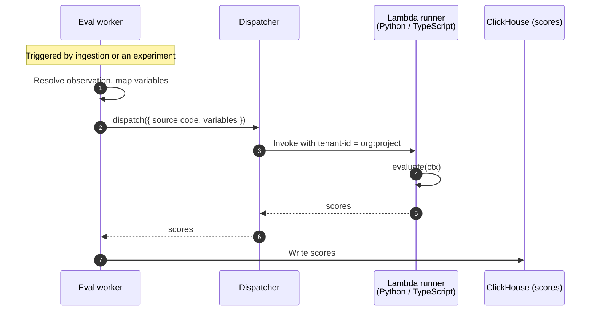

import { BlogHeader } from "@/components/blog/BlogHeader";

<BlogHeader
  title="Designing the runtime for Langfuse code evaluators"
  description="Code evaluators let you score traces with your own Python or TypeScript code. A look at the execution model behind them: the requirements, the options we rejected, and the security stance we adopted."
  authors={["tobiaswochinger"]}
  date="June 12, 2026"
/>

In late May we shipped [code evaluators](/docs/evaluation/evaluation-methods/code-evaluators): you write a small Python or TypeScript function and Langfuse runs it to score your traces. By design, this means effectively anybody can run untrusted code in our multi-tenant SaaS environment: an environment that holds petabytes of critical data from thousands of teams.

This post walks through how we designed the runtime environment for it, the options we ruled out along the way, and what happened when the first people tried to break it.

<Video
  src="https://static.langfuse.com/docs-videos/2026-05-29-code-evaluator-creation-flow.mp4"
  aspectRatio={1230 / 692}
  gifStyle
/>

## Why code evaluators

Evaluation is how you find out whether your LLM app is actually any good. [Reading traces yourself](/blog/2026-06-09-ai-is-eating-ai-engineering) is where your opinion of your application gets formed, and nothing replaces it. But nobody reads millions of traces by hand. [Error analysis](/academy/monitoring/error-analysis) turns that reading into a list of error modes, and the standard move is to encode each one as an [LLM-as-a-judge evaluator](/docs/evaluation/evaluation-methods/llm-as-a-judge) that scores every trace for things like agent helpfulness, conciseness, or tone.

But a lot of what teams want to check is not subjective at all. Is the output valid JSON? Does the answer match the expected value? A model is an expensive, non-deterministic way to answer questions that a few lines of code answer perfectly every time.

That is what code evaluators are: you provide the Python or TypeScript code to evaluate observations, configure when it should be triggered, and Langfuse runs it for you at scale.

Let's look at the example from above as an actual evaluator:

```ts
function evaluate({
  observation: { output },
}: EvaluationContext): EvaluationResult {
  const required = ["summary", "items", "sections"];
  let missing = required;

  try {
    const parsed = typeof output === "string" ? JSON.parse(output) : output;
    missing = required.filter((key) => parsed?.[key] == null);
  } catch {
    // output is not valid JSON, so all fields count as missing
  }

  return {
    scores: [
      {
        name: "has-required-fields",
        value: missing.length === 0,
        dataType: "BOOLEAN",
        comment: missing.length
          ? `Missing: ${missing.join(", ")}`
          : "All fields present",
      },
    ],
  };
}
```

## Small workloads with hard constraints

As the example shows, code evaluators are fairly restricted workloads: they are **short** (typically hundreds of milliseconds), **deterministic** (same input, same score), and **stateless** (no filesystem, no state between runs).

This is a sharp distinction from the agent sandboxes (E2B, Modal) that are everywhere right now: they exist to provide long-lived environments, filesystem access, snapshotting, and ~~`pip install`~~ `uv add` at runtime. Many evaluators need none of that.

What we needed instead:

- **Security:** whether it is our Langfuse Cloud environment or a platform team hosting Langfuse for multiple internal teams, tenants must never be able to access each other's data.
- **Scale:** we ingest hundreds of millions of observations per day, and each of them can trigger one or more code evaluators. Whatever runs them has to be cost-efficient at that volume.
- **Self-hosting parity:** Langfuse is easy to self-host and we want to keep it that way. Operating and securing this feature should not require an infra team.
- **Python and TypeScript support:** users want to develop in the language they already work in. Python is the data scientists' favorite, and TypeScript is the evolving standard among AI application engineers.

At Langfuse we are big believers in **shipping fast and often**: get something into users' hands, learn from their feedback, and learn from operating it for them.

For code evaluators, shipping lean meant explicitly leaving out two things: network access and third-party dependencies. Both have legitimate uses in an evaluator, and we made sure there is a clear path to add them as deliberate, controlled features.

## Options we considered

Sandboxing untrusted code is not a new problem, so we had a variety of options to choose from:

**Dispatching to the user's infrastructure**

Tools like Claude Code sidestep this category of problems entirely by running on the user's machine: no tenant isolation to build, full access to the user's environment. The equivalent for us would have been webhooks: Langfuse calls an endpoint you host and collects scores from the response. The cost lands on the user, though: everyone would have to set up, scale, and monitor a service that handles hundreds of requests per second with megabyte payloads, which is the work the feature is meant to remove.

**Offering a custom DSL**

If the checks are all fairly similar and deterministic why offer the full power of a programming language at all? Couldn't a small domain-specific language (DSL) or query builder generate only safe code? The use cases may be similar, but the data isn't. While a DSL could serve a majority of workloads, the long tail of checks that don't fit its boxes is exactly where users would get stuck, with no escape hatch. And a custom DSL wouldn't be in distribution for humans or agents.

**In-process isolation**

Fast startup and no extra infrastructure components: in-process isolation with tools like V8 isolates, wasmtime, seccomp, Deno, or Pyodide would have been the next best solution, especially with our self-hosting requirement in mind. But these are incredibly hard to get right because the enforcement is software living in the same process as the untrusted code: a single bug in the permission check, the syscall filter, or the runtime itself, and the attacker is inside the environment that holds our service credentials, our network access, and other customers' data. No second boundary. Cloudflare, running this model at scale, layers process sandboxing and a sub-24-hour V8 patch cadence [on top of isolates](https://blog.cloudflare.com/mitigating-spectre-and-other-security-threats-the-cloudflare-workers-security-model/); n8n's Pyodide sandbox was still [escaped via a blocklist bypass](https://www.cyera.com/research/n8scape-pyodide-sandbox-escape-9-9-critical-post-auth-rce-in-n8n-cve-2025-68668) (CVSS 9.9). We were not comfortable owning that risk, and even less comfortable asking self-hosters to.

**Firecracker, gVisor, Kata**

The gold-standard solutions, powering the likes of AWS Lambda (Firecracker) as well as Claude Code on the web and OpenAI's code execution (both gVisor). Unfortunately, they are non-trivial to deploy: Firecracker and Kata require KVM, which means bare metal or nested virtualization, and gVisor brings its own container runtime. Doable for us as a one-off, but not something we want to put on our customers.

**Kubernetes Jobs**

Dispatching code evaluations as Kubernetes Jobs would fit the self-hosting story very well, and it remains one of the best options for self-hosters who don't want a hyperscaler as backend. However, dispatching a whole pod for a workload of a few hundred milliseconds is heavy and noisy: scheduling and container startup add seconds of latency per run, and at hundreds of evaluations per second the Job churn alone becomes a stress test for the control plane. Plain containers also share the host kernel, so truly hostile multi-tenancy would still call for gVisor or Kata underneath.

## Our runtime of choice: AWS Lambda

AWS Lambda turned out to fit the shape of the problem almost exactly. It is Firecracker - the gold standard we had just ruled out operating ourselves - run as a service: every invocation in a microVM, startup around 100 ms, built for highly concurrent workloads.

Looking at the options also changed our stance on self-hosting. Conversations with customers of different sizes made clear there is no one-size-fits-all backend, not even Kubernetes. So instead of designing for the lowest common denominator, we made the backend pluggable and chose AWS Lambda as its first implementation:

```ts
export interface CodeEvalDispatcher {
  name: string;
  dispatch(input: DispatchInput): Promise<DispatchResult>;
}
```

Self-hosters can use it with their own AWS credentials, or fall back to the included local dispatcher for development and trusted environments.

<Callout type="warning">
  The local dispatcher executes evaluator code in-process, without the isolation
  guarantees described in this post. It is not safe against cross-tenant access
  and must not be used in production / untrusted environments.
</Callout>

### Tenant isolation and warm environments

A big part of Lambda's appeal was a security story we found manageable: everything starts closed, and every decision to widen capabilities is a conscious one. It had one gap, though: tenant isolation.

Consecutive Lambda invocations are not truly isolated from each other. A "cold" invocation gets a fresh microVM; subsequent "warm" invocations can reuse the same one, including whatever the previous run left behind in memory or in `/tmp` - opening us up to potential cross-tenant data leaks.

Until late last year, your only option would have been to use one Lambda function per tenant (or in our case even two Lambdas per tenant - one for each language). AWS would allow it, but the lifecycle complexity would be ours: creating functions dynamically on tenant creation, tearing them down when unused or when a Langfuse project is deleted. And worst of all: keeping our tiny harness inside each function in sync.

Luckily, AWS launched [tenant isolation](https://aws.amazon.com/about-aws/whats-new/2025/11/aws-lambda-tenant-isolation-mode/): you pass a tenant key with each invocation, and Lambda guarantees that execution environments are never reused across tenants. We key isolation on the project, which is already the data-isolation boundary in Langfuse. The accepted tradeoff: two evaluators in the same project may share a warm environment, which exposes nothing that isn't already visible within that project.

### The dispatch path: synchronous and inline

Two Lambdas also imply that the user's code is attached to each request - acceptable given that evaluators are small snippets anyway. Operating hundreds of millions of LLM-as-a-judge invocations gave us a good sense of payload sizes and throughput, so we started with the leanest possible setup: synchronous invocation with evaluation payload and source code inlined. As adoption grows, async invocation via SQS combined with pre-signed S3 URLs gives us a clear and, most importantly, non-breaking upgrade path.

A tiny Langfuse-provided harness inside the Lambda handles payload parsing and invokes the user's code:



### The principle of least privilege

Now that we had secure execution environments, all we had to do was not mess things up on the way in. For us that meant strictly following the principle of least privilege: credentials you don't pass, actions you don't perform, and capabilities you don't add are all things that can't blow up.

Concretely:

- **Treat code as data.** We only interact with the code on the client side or inside the Lambda. Once it enters our backend, we treat it as an opaque string. This also meant skipping any transpilation step for TypeScript evaluators: we only allow [erasable TypeScript syntax](https://nodejs.org/api/module.html#modulestriptypescripttypescode-options), which the harness strips inside the Lambda.

- **Minimal Lambda permissions.** The only credentials in the environment are the execution role's own, and that role can write logs and nothing else (technically the role also carries the EC2 permissions Lambda needs to manage our VPC's network interfaces, but [we block those for calls made from inside the execution environment](https://docs.aws.amazon.com/lambda/latest/dg/configuration-vpc.html)).

- **No egress.** The Lambdas are attached to a separate VPC with its own security group and no access to internal or external networks. Here we were less worried about data leaking and more about our compute being abused against other parties. Rate-limited, allowlist-based egress can be added later as a separate feature.

- **Strict limits.** Execution time (2s), source size (256 KB), input payloads (5.5 MB), and results (256 KB) are all capped to prevent abuse.

## Plan meets production

We were confident that the implementation was robust, thanks to extensive planning, threat modeling with the ClickHouse security team, and a thorough test suite built on the excellent [floci](https://floci.io/) AWS simulator. But plans are nothing; planning is everything: we knew people would put code evaluators to the test as soon as they launched. And they did.

A few days after the release, a security researcher reached out claiming that database credentials could be extracted from the evaluator runtime by reading environment variables and returning them as score comments. The database part did not hold up: as described above, we don't pass any credentials into the execution environment. What did hold up was the channel itself. A vector we had considered and accounted for.

Admittedly, there was one blind spot on our side: those environment variables also include the [credentials AWS itself injects](https://docs.aws.amazon.com/lambda/latest/dg/configuration-envvars.html#configuration-envvars-runtime) for the Lambda execution role. A few hours after the initial report, someone started probing the AWS API with the extracted credentials:

<Frame fullWidth>
  
</Frame>

There is not much you can do about the extraction itself: the credentials are reserved by AWS, and scrubbing things like `os.environ` or `process.env` makes it harder but not impossible. You could add in-process sandboxing as defense in depth, but extraction would remain possible while adding significant complexity and overhead.

In the end, least privilege paid off: GuardDuty flagged the runner credentials being used from an external IP within minutes, and confirmed every single request was denied:

<Frame fullWidth>
  
</Frame>

The plan held.

## What's next

We deliberately traded features for properties we could verify: no egress, no dependencies, no credentials in v1. In exchange we got tenant isolation we didn't have to build and a runner whose stolen credentials open nothing. Most importantly, we got the feature into real users' hands quickly - and the feedback flowing.

If you want to try code evaluators, the [docs](/docs/evaluation/evaluation-methods/code-evaluators) are the place to start. If one of the decisions outlined here blocks you, tell us in [GitHub Discussions](https://github.com/orgs/langfuse/discussions): what we add next is driven by what you run into.

And if running untrusted code across thousands of tenants sounds like a fun problem, [we are hiring](/careers).
