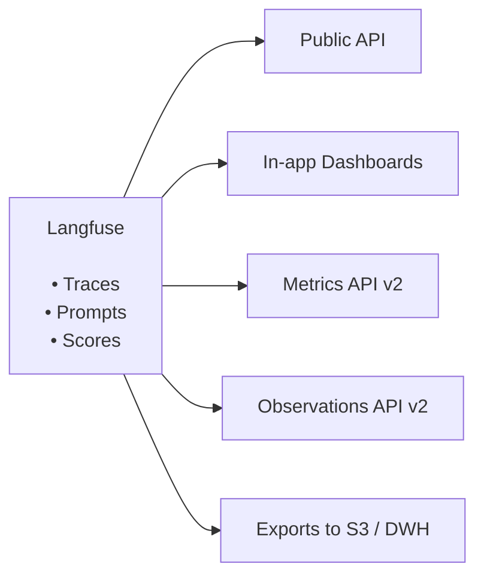

# API & Data Platform

**Langfuse is designed to be open, extensible and flexible** (see [_why langfuse?_](/why)). People using Langfuse are building all kinds of workflows and customizations on top of it. This is powered by our open data platform.

Example use cases:

- Billing based on LLM costs tracked in Langfuse
- Reporting of online evaluations in external dashboards
- Fine-tuning based on raw exports of traces
- Correlation of LLM Evals with observed user behavior in Data Warehouse

## Start here

Choose the data access path based on what you want to build:

| Goal                                                           | Recommended path                                                                   |
| -------------------------------------------------------------- | ---------------------------------------------------------------------------------- |
| Query aggregate cost, usage, latency, volume, or score metrics | [Metrics API v2](/docs/metrics/features/metrics-api#v2)                            |
| Retrieve row-level spans, generations, or events               | [Observations API v2](/docs/api-and-data-platform/features/observations-api#v2)    |
| Use the API from Python or JS/TS                               | [Query via SDKs](/docs/api-and-data-platform/features/query-via-sdk)               |
| Export large volumes on a schedule                             | [Blob Storage Export](/docs/api-and-data-platform/features/export-to-blob-storage) |
| Download a filtered one-off export                             | [Export from UI](/docs/api-and-data-platform/features/export-from-ui)              |
| Manage prompts, datasets, projects, and other resources        | [Public API](/docs/api-and-data-platform/features/public-api)                      |

## Features

import {
  Globe,
  Code,
  LayoutDashboard,
  Activity,
  Download,
  Cloud,
  Blocks,
  BarChart3,
  RefreshCcw,
  ListTree,
} from "lucide-react";

<Cards num={3}>
  <Card
    title="MCP Server"
    href="/docs/api-and-data-platform/features/mcp-server"
    icon={<Blocks />}
    arrow
  />
  <Card
    title="Public API"
    href="/docs/api-and-data-platform/features/public-api"
    icon={<Globe />}
    arrow
  />
  <Card
    title="Query via SDKs"
    href="/docs/api-and-data-platform/features/query-via-sdk"
    icon={<Code />}
    arrow
  />
  <Card
    title="Observations API"
    href="/docs/api-and-data-platform/features/observations-api"
    icon={<ListTree />}
    arrow
  />
  <Card
    title="Metrics API"
    href="/docs/metrics/features/metrics-api"
    icon={<BarChart3 />}
    arrow
  />
  <Card
    title="Upgrade to v2 data APIs"
    href="/docs/api-and-data-platform/features/migrate-to-v2-data-apis"
    icon={<RefreshCcw />}
    arrow
  />
  <Card
    title="Export from UI"
    href="/docs/api-and-data-platform/features/export-from-ui"
    icon={<Download />}
    arrow
  />
  <Card
    title="Export to Blob Storage"
    href="/docs/api-and-data-platform/features/export-to-blob-storage"
    icon={<Cloud />}
    arrow
  />
  <Card
    title="Export to PostHog"
    href="/integrations/analytics/posthog"
    icon={
      

        
      

    }
    arrow
  />
  <Card
    title="Export to Mixpanel"
    href="/integrations/analytics/mixpanel"
    icon={
      

        
      

    }
    arrow
  />
</Cards>
