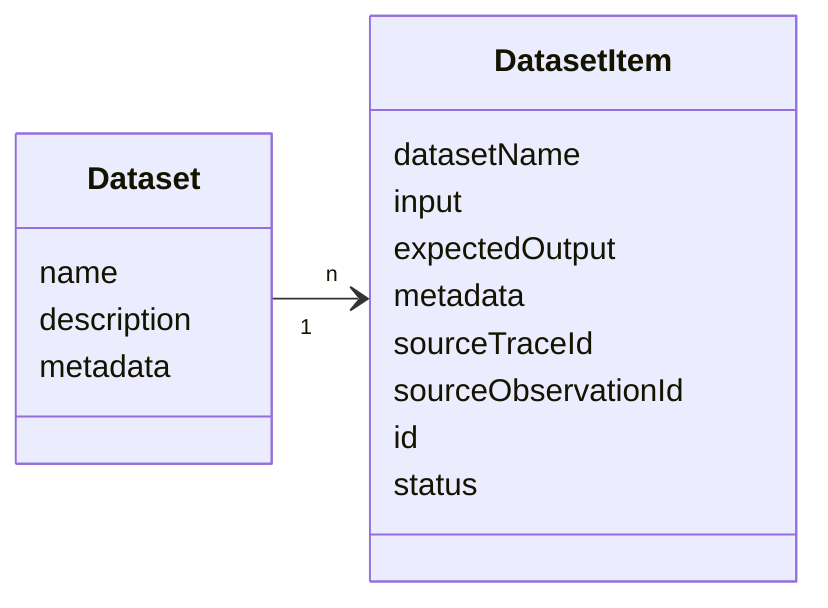
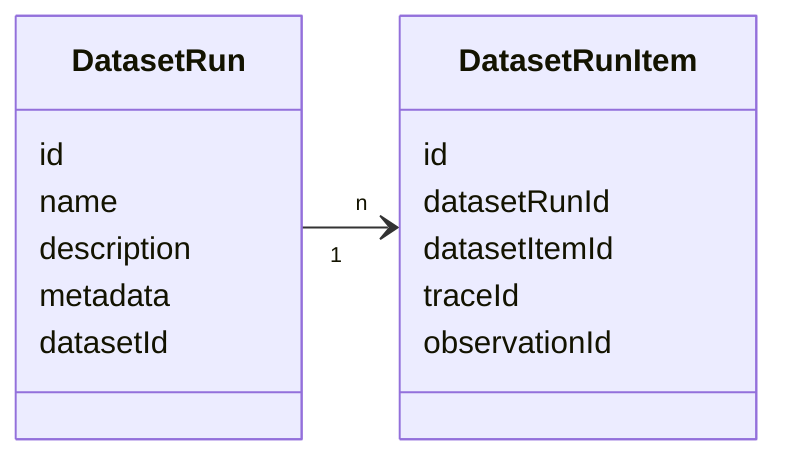
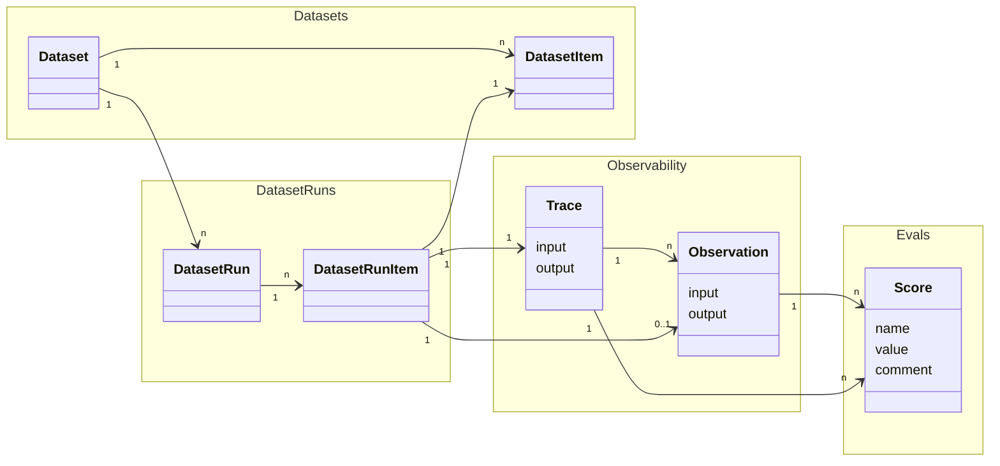

# Experiments Data Model

This page describes the data model for experiment-related objects in Langfuse. For an overview of how these objects work together, see the [Concepts](/docs/evaluation/core-concepts) page. For score and score config objects, see the [Scores data model](/docs/evaluation/scores/data-model).

For detailed reference please refer to
- the [Python SDK reference](https://python.reference.langfuse.com)
- the [JS/TS SDK reference](https://js.reference.langfuse.com)
- the [API reference](https://api.reference.langfuse.com)

## Scores [#scores]

Score object documentation moved to the dedicated [Scores data model](/docs/evaluation/scores/data-model#scores) page. This anchor remains here for backwards compatibility with older deep links.

## Score Config [#score-config]

Score config documentation moved to the dedicated [Scores data model](/docs/evaluation/scores/data-model#score-config) page. This anchor remains here for backwards compatibility with older deep links.

## Objects

### Datasets [#datasets]

Datasets are a collection of inputs and, optionally, expected outputs that can be used during Dataset runs.

`Dataset`s are a collection of `DatasetItem`s.

#### Dataset object [#dataset-object]

| Attribute                 | Type   | Required | Description                                                                 |
| ------------------------- | ------ | -------- | --------------------------------------------------------------------------- |
| `id`                      | string | Yes      | Unique identifier for the dataset                                           |
| `name`                    | string | Yes      | Name of the dataset                                                         |
| `description`             | string | No       | Description of the dataset                                                  |
| `metadata`                | object | No       | Additional metadata for the dataset                                         |
| `remoteExperimentUrl`     | string | No       | Webhook endpoint for triggering experiments                                 |
| `remoteExperimentPayload` | object | No       | Payload for triggering experiments                                 |

#### DatasetItem object [#datasetitem-object]

| Attribute               | Type           | Required | Description                                                                                                                                                                                               |
| ----------------------- | -------------- | -------- | --------------------------------------------------------------------------------------------------------------------------------------------------------------------------------------------------------- |
| `id`                    | string         | Yes      | Unique identifier for the dataset item. Dataset items are upserted on their id. Id needs to be unique (project-level) and cannot be reused across datasets.                                              |
| `datasetId`             | string         | Yes      | ID of the dataset this item belongs to                                                                                                                                                                    |
| `input`                 | object         | No       | Input data for the dataset item                                                                                                                                                                           |
| `expectedOutput`        | object         | No       | Expected output data for the dataset item                                                                                                                                                                 |
| `metadata`              | object         | No       | Additional metadata for the dataset item                                                                                                                                                                  |
| `sourceTraceId`         | string         | No       | ID of the source trace to link this dataset item to                                                                                                                                                       |
| `sourceObservationId`   | string         | No       | ID of the source observation to link this dataset item to                                                                                                                                                 |
| `status`                | DatasetStatus  | No       | Status of the dataset item. Defaults to ACTIVE for newly created items. Possible values: `ACTIVE`, `ARCHIVED`                                                                                            |

### DatasetRun (Experiment Run) [#datasetrun-experiment-run]

Dataset runs are used to run a dataset through your LLM application and optionally apply evaluation methods to the results. This is often referred to as Experiment run.

 

#### DatasetRun object [#datasetrun-object]

| Attribute      | Type   | Required | Description                                                                 |
| -------------- | ------ | -------- | --------------------------------------------------------------------------- |
| `id`           | string | Yes      | Unique identifier for the dataset run                                       |
| `name`         | string | Yes      | Name of the dataset run                                                     |
| `description`  | string | No       | Description of the dataset run                                              |
| `metadata`     | object | No       | Additional metadata for the dataset run                                     |
| `datasetId`    | string | Yes      | ID of the dataset this run belongs to                                       |

#### DatasetRunItem object [#datasetrunitem-object]

| Attribute        | Type   | Required | Description                                                                                                                                                                                               |
| ---------------- | ------ | -------- | --------------------------------------------------------------------------------------------------------------------------------------------------------------------------------------------------------- |
| `id`             | string | Yes      | Unique identifier for the dataset run item                                                                                                                                                               |
| `datasetRunId`   | string | Yes      | ID of the dataset run this item belongs to                                                                                                                                                               |
| `datasetItemId`  | string | Yes      | ID of the dataset item to link to this run                                                                                                                                                               |
| `traceId`        | string | Yes      | ID of the trace to link to this run                                                                                                                                                                      |
| `observationId`  | string | No       | ID of the observation to link to this run                                                                                                                                                                |

<Callout type="info">
Most of the time, we recommend that DatasetRunItems reference TraceIDs directly. The reference to ObservationID exists for backwards compatibility with older SDK versions.
</Callout>

### End to End Data Relations [#end-to-end-data-relations]

An experiment can combine a few Langfuse objects:
- `DatasetRuns` (or Experiment runs) are created by looping through all or selected `DatasetItem`s of a `Dataset` with your LLM application.
- For each `DatasetItem` passed into the LLM application as an Input a `DatasetRunItem` & a `Trace` are created.
- Optionally `Score`s can be added to the `Trace`s to evaluate the output of the LLM application during the `DatasetRun`.

 

See the [Concepts page](/docs/evaluation/core-concepts) for more information on how these objects work together conceptually.
See the [observability core concepts page](/docs/observability/data-model) for more details on traces and observations.
See the [Scores data model](/docs/evaluation/scores/data-model) for more details on score and score config objects.

## Function Definitions [#function-definitions]

When running experiments via the SDK, you define **task** and **evaluator** functions. These are user-defined functions that the experiment runner calls for each dataset item. For more information on how experiments work conceptually, see the [Concepts page](/docs/evaluation/core-concepts).

### Task [#task]

A task is a function that takes a dataset item and returns an output during an experiment run.

See SDK references for function signatures and parameters:
- [Python SDK: `TaskFunction`](https://python.reference.langfuse.com/langfuse/experiment#TaskFunction)
- [JS/TS SDK: `ExperimentTask`](https://js.reference.langfuse.com/types/_langfuse_client.ExperimentTask.html)

### Evaluator [#evaluator]

An evaluator is a function that scores the output of a task for a single dataset item. Evaluators receive the input, output, expected output, and metadata, and return an `Evaluation` object that becomes a Score in Langfuse.

See SDK references for function signatures and parameters:
- [Python SDK: `EvaluatorFunction`](https://python.reference.langfuse.com/langfuse/experiment#EvaluatorFunction)
- [JS/TS SDK: `Evaluator`](https://js.reference.langfuse.com/types/_langfuse_client.Evaluator.html)

### Run Evaluator [#run-evaluator]

A run evaluator is a function that assesses the full experiment results and computes aggregate metrics. When run on Langfuse datasets, the resulting scores are attached to the dataset run.

See SDK references for function signatures and parameters:
- [Python SDK: `RunEvaluatorFunction`](https://python.reference.langfuse.com/langfuse/experiment#RunEvaluatorFunction)
- [JS/TS SDK: `RunEvaluator`](https://js.reference.langfuse.com/types/_langfuse_client.RunEvaluator.html)

<Callout type="info">
For detailed usage examples of tasks and evaluators, see [Experiments via SDK](/docs/evaluation/experiments/experiments-via-sdk).
</Callout>

## Local Datasets [#local-datasets]

Currently, if an [Experiment via SDK](/docs/evaluation/experiments/experiments-via-sdk) is used to run experiments on local datasets, only traces are created in Langfuse - no dataset runs are generated. Each task execution creates an individual trace for observability and debugging.

<Callout type="info">

We have improvements on our roadmap to support similar functionality such as run overviews, comparison views, and more for experiments on local datasets as for Langfuse datasets.

</Callout>
