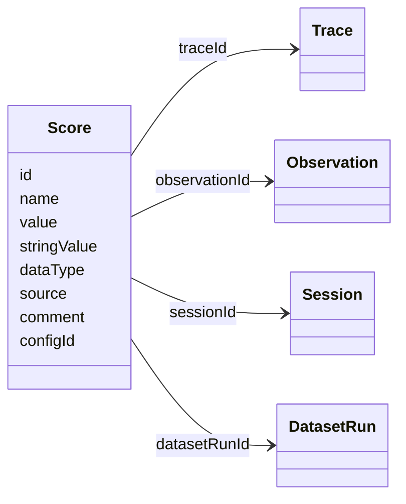
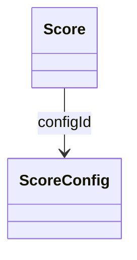

# Scores Data Model

This page describes the data model for score-related objects in Langfuse. For an overview of what scores are and when to use them, see the [Scores overview](/docs/evaluation/scores/overview). For datasets, experiment runs, and function definitions, see the [Experiments data model](/docs/evaluation/experiments/data-model).

For detailed reference please refer to
- the [Python SDK reference](https://python.reference.langfuse.com)
- the [JS/TS SDK reference](https://js.reference.langfuse.com)
- the [API reference](https://api.reference.langfuse.com)

## Scores [#scores]

Scores are the data object to store evaluation results. They are used to assign evaluation scores to traces, observations, sessions, or dataset runs. Scores can be added manually via annotations, programmatically via the SDK/API, or automatically via LLM-as-a-Judge evaluators.

 

Scores have the following properties:
- Each Score references **exactly one** of `Trace`, `Observation`, `Session`, or `DatasetRun`
- Scores are either **numeric**, **categorical**, **boolean**, or **text** (see [Score Types](/docs/evaluation/scores/overview#score-types))
- Scores can **optionally be linked to a `ScoreConfig`** to ensure they comply with a specific schema

### Score object [#score-object]

| Attribute       | Type   | Required | Description                                                                                                                                                                                               |
| --------------- | ------ | -------- | --------------------------------------------------------------------------------------------------------------------------------------------------------------------------------------------------------- |
| `id`            | string | Yes      | Unique identifier of the score. Auto-generated by SDKs. Optionally can also be used as an idempotency key to update scores.                                                                               |
| `name`          | string | Yes      | Name of the score, e.g. user_feedback, hallucination_eval                                                                                                                                                 |
| `value`         | number | No       | Numeric value of the score. Always defined for numeric and boolean scores. Optional for categorical scores. Not used for text scores.                                                                     |
| `stringValue`   | string | No       | String value of the score. Used for categorical, boolean (string equivalent), and text data types. Automatically set for categorical scores based on the config if the `configId` is provided.            |
| `dataType`      | string | No       | Automatically set based on the config data type when the `configId` is provided. Otherwise can be defined manually as `NUMERIC`, `CATEGORICAL`, `BOOLEAN`, or `TEXT`                                               |
| `source`        | string | Yes      | Automatically set based on the source of the score. Can be either `API`, `EVAL`, or `ANNOTATION`                                                                                                           |
| `comment`       | string | No       | Evaluation comment, commonly used for user feedback, eval reasoning output or internal notes                                                                                                              |
| `traceId`       | string | No       | Id of the trace the score relates to                                                                                                                                                                      |
| `observationId` | string | No       | Id of the observation (e.g. LLM call) the score relates to                                                                                                                                                |
| `sessionId`     | string | No       | Id of the session the score relates to                                                                                                                                                                    |
| `datasetRunId`  | string | No       | Id of the dataset run the score relates to                                                                                                                                                                |
| `configId`      | string | No       | Score config id to ensure that the score follows a specific schema. Can be defined in the Langfuse UI or via API.                                                                                         |

### Common Use Cases [#common-use-cases]

| Level       | Description                                                                                                           |
| ----------- | --------------------------------------------------------------------------------------------------------------------- |
| Trace       | Used for evaluation of a single interaction. (most common)                                                            |
| Observation | Used for evaluation of a single observation below the trace level.                                                    |
| Session     | Used for comprehensive evaluation of outputs across multiple interactions.                                            |
| Dataset Run | Used for performance scores of a Dataset Run.                                                                         |

## Score Config [#score-config]

Score configs are used to ensure that your scores follow a specific schema. Using score configs allows you to standardize your scoring schema across your team and ensure that scores are consistent and comparable for future analysis.

You can define a `ScoreConfig` in the Langfuse UI or via our API. Configs are immutable but can be archived (and restored anytime).

A score config includes:
- **Score name**
- **Data type:** `NUMERIC`, `CATEGORICAL`, `BOOLEAN`, `TEXT`
- **Constraints on score value range** (Min/Max for numerical, Custom categories for categorical data types, 1-500 characters for text)

### ScoreConfig object [#scoreconfig-object]

| Attribute     | Type    | Required | Description                                                                                     |
| ------------- | ------- | -------- | ----------------------------------------------------------------------------------------------- |
| `id`          | string  | Yes      | Unique identifier of the score config.                                                          |
| `name`        | string  | Yes      | Name of the score config, e.g. user_feedback, hallucination_eval                                |
| `dataType`    | string  | Yes      | Can be either `NUMERIC`, `CATEGORICAL`, `BOOLEAN`, or `TEXT`                                    |
| `isArchived`  | boolean | No       | Whether the score config is archived. Defaults to false                                         |
| `minValue`    | number  | No       | Sets minimum value for numerical scores. If not set, the minimum value defaults to -∞           |
| `maxValue`    | number  | No       | Sets maximum value for numerical scores. If not set, the maximum value defaults to +∞           |
| `categories`  | list    | No       | Defines categories for categorical scores. List of objects with label value pairs              |
| `description` | string  | No       | Provides further description of the score configuration                                         |
