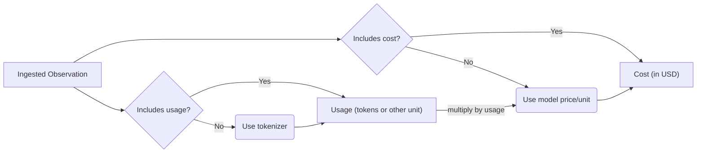

import { Details, Summary } from "@/components/Details";

# Model Usage & Cost Tracking

Langfuse tracks the usage and cost of every LLM call in your application, so you can monitor spend across models, use cases, and over time.

<Frame>
  
</Frame>

For most users, cost tracking works out of the box. Langfuse ships with prices for popular models from OpenAI, Anthropic, and Google, and most [integrations](/integrations) capture usage and cost automatically, so in most cases you don't need to configure anything.

## What you can do with cost data [#use-cost-data]

Once usage and cost are tracked, you can put the data to work:

- **[Create dashboards](/docs/metrics/features/custom-dashboards):** monitor cost across models, tags, or users.
- **[Set up alerts](/docs/metrics/features/alerts):** get notified automatically when spend crosses a threshold.
- **[Query with the Metrics API](/docs/metrics/features/metrics-api):** retrieve aggregated usage and cost, filtered by application type, user, or tags, for analytics, billing, and rate-limiting.

## How cost tracking works [#how-it-works]

For every LLM generation, Langfuse records two things, each broken down by **usage type** (for example `input` and `output`, or more specific types like `cached_tokens` and `audio_tokens` that vary by provider):

- **Usage details**: number of units consumed per usage type
- **Cost details**: USD cost per usage type

<Frame>
  
</Frame>

Both are captured on observations of [type](/docs/observability/features/observation-types) `generation` and `embedding`, and each can be either:

- [**Ingested**](#ingest): you send the usage and cost from the LLM response, via the API, SDKs, or an integration.
- [**Inferred**](#infer): Langfuse works them out from the generation's `model` parameter, using a model definition that stores prices per usage type. Langfuse ships with definitions for popular OpenAI, Anthropic, and Google models, and you can [add your own](#custom-model-definitions).

When both are available, **ingested values take priority** over inferred ones:



## Model definitions and prices [#infer]

When cost is not ingested directly, Langfuse infers it. The `model` parameter of the generation is matched to a **model definition**, which stores a price per usage type. Langfuse then multiplies those prices by the observation's usage to calculate cost. This is especially useful for model providers or self-hosted models that do not include cost in the response.

Langfuse comes with a **list of predefined popular models and their tokenizers** including **OpenAI, Anthropic, Google**. Check out the [full list](https://cloud.langfuse.com/project/~/models) (you need to sign in).

You can manage prices in **Project Settings > Models**, add your own [custom model definitions](#custom-model-definitions), or request official support for new models via [GitHub](/issue).

<Frame>
  
</Frame>

### Usage

If a tokenizer is specified for the model, Langfuse automatically calculates token amounts for ingested generations.

The following tokenizers are currently supported:

| Model     | Tokenizer     | Used package                                                                       | Comment                                                                                                                               |
| --------- | ------------- | ---------------------------------------------------------------------------------- | ------------------------------------------------------------------------------------------------------------------------------------- |
| `gpt-4o`  | `o200k_base`  | [`tiktoken`](https://www.npmjs.com/package/tiktoken)                               |                                                                                                                                       |
| `gpt*`    | `cl100k_base` | [`tiktoken`](https://www.npmjs.com/package/tiktoken)                               |                                                                                                                                       |
| `claude*` | `claude`      | [`@anthropic-ai/tokenizer`](https://www.npmjs.com/package/@anthropic-ai/tokenizer) | According to Anthropic, their tokenizer is not accurate for Claude 3 models. If possible, send us the tokens from their API response. |

### Cost

Model definitions include prices per usage type. Usage types must match exactly with the keys in the `usage_details` object of the generation.

Langfuse automatically calculates cost for ingested generations at the time of ingestion if (1) usage is ingested or inferred, (2) and a matching model definition includes prices.

### Adding custom model definitions [#custom-model-definitions]

You can flexibly add your own model definitions (incl. [pricing tiers](#pricing-tiers)) to Langfuse. This is especially useful for self-hosted or fine-tuned models which are not included in the list of Langfuse maintained models.

<LangTabs items={["Langfuse UI", "API"]}>

<Tab>

To add a custom model definition in the Langfuse UI, you can either click on the "+" sign next to the model name or navigate to the **Project Settings > Models** to add a new model definition.

Then you can add the prices per token type and save the model definition. Now all **new traces** with this model will have the correct token usage and cost inferred.

  <Video
  src="https://static.langfuse.com/docs-videos/2025-10-20-custom-model-definition-169.mp4"
  aspectRatio={16 / 9}
/>
</Tab>

<Tab>

Model definitions can also be managed programmatically via the Models [API](/docs/api):

```bash
GET    /api/public/models
POST   /api/public/models
GET    /api/public/models/{id}
DELETE /api/public/models/{id}
```

</Tab>

</LangTabs>

Models are matched to generations based on:

| Generation Attribute | Model Attribute | Notes                                                                                     |
| -------------------- | --------------- | ----------------------------------------------------------------------------------------- |
| `model`              | `match_pattern` | Uses regular expressions, e.g. `(?i)^(gpt-4-0125-preview)$` matches `gpt-4-0125-preview`. |

User-defined models take priority over models maintained by Langfuse.

<Callout type="info">

When using the `openai` tokenizer, you need to specify the following tokenization config. You can also copy the config from the list of predefined OpenAI models. See the OpenAI [documentation](https://github.com/openai/openai-cookbook/blob/main/examples/How_to_count_tokens_with_tiktoken.ipynb) for further details. `tokensPerName` and `tokensPerMessage` are required for chat models.

```json
{
  "tokenizerModel": "gpt-3.5-turbo", // tiktoken model name
  "tokensPerName": -1, // OpenAI Chatmessage tokenization config
  "tokensPerMessage": 4 // OpenAI Chatmessage tokenization config
}
```

</Callout>

### Pricing Tiers [#pricing-tiers]

Some model providers charge different rates depending on context length or request attributes. For example, Anthropic's Claude Sonnet 4.5 and Google's Gemini 2.5 Pro apply higher pricing when more than 200K input tokens are used, while [OpenAI Fast mode](https://developers.openai.com/api/docs/guides/fast-mode) charges a premium based on the request's `service_tier`.

Langfuse supports **pricing tiers** for models, enabling accurate cost calculation across usage thresholds, model parameters, and metadata.

#### How tier matching works

Each model can have multiple pricing tiers, each with:

| Field          | Description                                            |
| -------------- | ------------------------------------------------------ |
| **Name**       | A descriptive name (e.g., "Standard", "Large Context") |
| **Priority**   | Evaluation order (0 is reserved for default tier)      |
| **Conditions** | Rules that determine when the tier applies             |
| **Prices**     | Cost per usage type for this tier                      |

When calculating cost, Langfuse evaluates tiers in priority order (excluding the default tier). The first tier whose conditions are satisfied is used. If no conditional tier matches, the default tier is applied.

Each condition selects one of these sources:

| Source               | How it matches                                                                                                                                                                                |
| -------------------- | --------------------------------------------------------------------------------------------------------------------------------------------------------------------------------------------- |
| **Usage details**    | Match usage-detail keys with a regex, sum their values, and compare the result with `gt`, `gte`, `lt`, `lte`, `eq`, or `neq`. You can also control whether the key pattern is case-sensitive. |
| **Model parameters** | Match a top-level model-parameter key against one or more exact values.                                                                                                                       |
| **Metadata**         | Match a top-level metadata key against one or more exact values.                                                                                                                              |

For model parameters and metadata, select the source in the pricing-tier editor, enter the **Top-level key**, and add comma-separated exact values. String, number, and boolean values are compared as strings. Nested paths and non-primitive values are not supported. When a tier has multiple conditions, all of them must match.

Examples:

<Tabs items={["Clause Sonnet Large context tier", "OpenAI Fast mode"]}>
<Tab>

The "Large Context" tier for Claude Sonnet 4.5 has a condition: `input > 200000`, meaning it applies when the sum of all usage details matching the pattern "input" exceeds 200,000 tokens.

</Tab>
<Tab>

OpenAI Fast mode tiers match the top-level model parameter `service_tier` against `fast` or `priority`. For GPT-5.6 models, this condition is combined with the input-token threshold to distinguish Standard/Fast and short/long-context prices.

</Tab>
</Tabs>

### Frequently asked questions [#faq]

<Details id="default-model-price-maintenance">
<Summary>How does Langfuse keep default model prices up to date?</Summary>

Langfuse maintains its [default model definitions](https://github.com/langfuse/langfuse/blob/main/worker/src/constants/default-model-prices.json) in the open-source repository. A [daily automated audit](https://github.com/langfuse/langfuse/actions/workflows/model-price-audit.yml) checks official provider sources for changed prices, pricing tiers, usage-key mappings, and newly released major models.

The audit follows an evidence-first workflow:

1. It verifies model IDs, prices, units, usage keys, and pricing tiers against official provider documentation.
2. It makes focused changes only when the provider evidence can be represented safely in Langfuse. Uncertain findings are reported without changing the defaults.
3. It validates the pricing data and any changed model-matching patterns.
4. When changes are needed, a pull request is opened, and the updated prices are deployed shortly after approval.

This process keeps the default definitions current without relying on a third-party pricing aggregator. Because inferred costs are calculated at ingestion time, updated defaults apply only to new generations. If you need support for a model immediately or use private pricing, add a [custom model definition](#custom-model-definitions) or [ingest the cost directly](#ingest).

</Details>

<Details id="cost-inference-for-reasoning-models">
<Summary>Why doesn't Langfuse infer cost for reasoning models like OpenAI o1?</Summary>

Cost inference by tokenizing the LLM input and output is not supported for reasoning models such as the OpenAI o1 model family. That is, if no token counts are ingested, Langfuse cannot infer cost for reasoning models.

Reasoning models take multiple steps to arrive at a response. The result from each step generates reasoning tokens that are billed as output tokens. So the cost-effective output token count is the sum of all reasoning tokens and the token count for the final completion. Since Langfuse does not have visibility into the reasoning tokens, it cannot infer the correct cost for generations that have no token usage provided.

To benefit from Langfuse cost tracking, please provide the token usage when ingesting o1 model generations. When utilizing the [Langfuse OpenAI wrapper](/integrations/model-providers/openai-py) or integrations such as for [Langchain](/integrations/frameworks/langchain), [LlamaIndex](/integrations/frameworks/llamaindex) or [LiteLLM](/integrations/gateways/litellm), token usage is collected and provided automatically for you.

For more details, see [the OpenAI guide](https://platform.openai.com/docs/guides/reasoning) on how reasoning models work.

</Details>

## Ingest usage and cost manually [#ingest]

While Langfuse infers this data automatically (if it unexpectedly doesn't, open an [issue](/issue) on GitHub), you might want to ingest it yourself in some cases, for example custom or self-hosted models Langfuse cannot price, private pricing, or exact provider counts you want recorded verbatim.

<LangTabs items={["Python SDK", "JS/TS SDK"]}>
<Tab>

<Tabs items={["Manual generation", "@observe decorator"]}>
<Tab>

```python
from langfuse import get_client
import anthropic

langfuse = get_client()
anthropic_client = anthropic.Anthropic()

with langfuse.start_as_current_observation(
    as_type="generation",
    name="anthropic-completion",
    model="claude-3-opus-20240229",
    input=[{"role": "user", "content": "Hello, Claude"}]
) as generation:
    response = anthropic_client.messages.create(
        model="claude-3-opus-20240229",
        max_tokens=1024,
        messages=[{"role": "user", "content": "Hello, Claude"}]
    )

    generation.update(
        output=response.content[0].text,
        usage_details={
            "input": response.usage.input_tokens,
            "output": response.usage.output_tokens,
            "cache_read_input_tokens": response.usage.cache_read_input_tokens
            # "total": int,  # if not set, it is derived as the sum of all usage types
        },
        # Optionally, also ingest USD cost. Alternatively, infer it via a model definition in Langfuse.
        cost_details={
            # Here we assume the input and output cost are 1 USD each and half the price for cached tokens.
            "input": 1,
            "cache_read_input_tokens": 0.5,
            "output": 1,
            # "total": float, # if not set, it is derived as the sum of all usage types
        }
    )
```

</Tab>
<Tab>

```python
from langfuse import observe, get_client
import anthropic

langfuse = get_client()
anthropic_client = anthropic.Anthropic()

@observe(as_type="generation")
def anthropic_completion(**kwargs):
  # optional, extract some fields from kwargs
  kwargs_clone = kwargs.copy()
  input = kwargs_clone.pop('messages', None)
  model = kwargs_clone.pop('model', None)
  langfuse.update_current_generation(
      input=input,
      model=model,
      metadata=kwargs_clone
  )

  response = anthropic_client.messages.create(**kwargs)

  langfuse.update_current_generation(
      usage_details={
          "input": response.usage.input_tokens,
          "output": response.usage.output_tokens,
          "cache_read_input_tokens": response.usage.cache_read_input_tokens
        },
      cost_details={
          "input": 1,
          "cache_read_input_tokens": 0.5,
          "output": 1,
      }
  )

  # return result
  return response.content[0].text

@observe()
def main():
  return anthropic_completion(
      model="claude-3-opus-20240229",
      max_tokens=1024,
      messages=[
          {"role": "user", "content": "Hello, Claude"}
      ]
  )

main()
```

</Tab>
</Tabs>

</Tab>
<Tab title="JS/TS SDK">

<Tabs items={["Manual observation", "Context manager", "observe wrapper"]}>
<Tab>

```ts /usageDetails/, /costDetails/
import { startObservation } from "@langfuse/tracing";

const generation = startObservation(
  "llm-call",
  {
    model: "gpt-4",
    input: [{ role: "user", content: "What is the capital of France?" }],
  },
  { asType: "generation" }
);

// ... LLM call logic ...

generation.update({
  usageDetails: {
    input: 10,
    output: 5,
    cache_read_input_tokens: 2,
    some_other_token_count: 10,
    total: 27, // optional, it is derived as the sum of all usage types
  },
  costDetails: {
    // Optional. If omitted, cost is inferred from a model definition.
    input: 1,
    output: 1,
    cache_read_input_tokens: 0.5,
    some_other_token_count: 1,
    total: 3.5,
  },
  output: { content: "The capital of France is Paris." },
});

generation.end();
```

</Tab>
<Tab>

```ts /usageDetails/, /costDetails/
import { startActiveObservation, startObservation } from "@langfuse/tracing";

await startActiveObservation("context-manager", async (span) => {
  span.update({
    input: { query: "What is the capital of France?" },
  });

  const generation = startObservation(
    "llm-call",
    {
      model: "gpt-4",
      input: [{ role: "user", content: "What is the capital of France?" }],
    },
    { asType: "generation" }
  );

  // ... LLM call logic ...

  generation.update({
    usageDetails: { input: 10, output: 5, total: 15 },
    costDetails: { input: 1, output: 1, total: 2 },
    output: { content: "The capital of France is Paris." },
  });

  generation.end();
});
```

</Tab>
<Tab>

```ts /usageDetails/, /costDetails/
import { observe, updateActiveObservation } from "@langfuse/tracing";

async function fetchData(source: string) {
  updateActiveObservation(
    {
      usageDetails: { input: 10, output: 5, total: 15 },
      costDetails: { input: 1, output: 1, total: 2 },
    },
    { asType: "generation" }
  );

  // ... logic to fetch data
  return { data: `some data from ${source}` };
}

const tracedFetchData = observe(fetchData, {
  name: "observe-wrapper",
  asType: "generation",
});

const result = await tracedFetchData("API");
```

</Tab>
</Tabs>

</Tab>
</LangTabs>

You can also update usage and cost later via `generation.update()`.

### Usage types are mutually exclusive buckets [#usage-details-contract]

Langfuse treats every key in `usage_details` as a separate, non-overlapping bucket: each token must be counted in exactly one key. This means that

- `input` excludes any `input_*` values (such as `input_cached_tokens`)
- `output` excludes any `output_*` values (such as `output_reasoning_tokens`)

`total` is the sum of the buckets, not a bucket itself.

If buckets overlap, usage and inferred cost will be counted double, and cost shown in Langfuse overstates what your provider actually charged. Directly ingested `cost_details` are unchanged.

<Callout type="info" title="Be careful with inclusive provider counts">

Some provider counts are inclusive. For example, OpenAI input counts include cached tokens; **Inclusive counts must be converted into exclusive buckets before they are stored.**

For example, an OpenAI-style response with 17,903 prompt tokens (of which 17,817 were cache hits) and 188 completion tokens:

| Provider reports (inclusive)                      | Stored in Langfuse (exclusive) |
| ------------------------------------------------- | ------------------------------ |
| `prompt_tokens: 17903`                            | `input: 86`                    |
| `prompt_tokens_details: { cached_tokens: 17817 }` | `input_cached_tokens: 17817`   |
| `completion_tokens: 188`                          | `output: 188`                  |
| `total_tokens: 18091`                             | `total: 18091`                 |

#### When Langfuse normalizes usage [#usage-details-normalization]

| Usage source                                                                                                  | Handling                                                                            |
| ------------------------------------------------------------------------------------------------------------- | ----------------------------------------------------------------------------------- |
| Langfuse integrations and SDK wrappers, such as the [OpenAI wrapper](/integrations/model-providers/openai-py) | Normalized automatically                                                            |
| OpenTelemetry `gen_ai.usage.*` or `llm.token_count.*`                                                         | Cache reads and writes are subtracted from `input`                                  |
| [OpenAI usage schema](#openai-usage-schema)                                                                   | Normalized only when it contains OpenAI usage fields; extra keys make it flat usage |
| Flat `usage_details` / `usageDetails`, including `langfuse.observation.usage_details`                         | Stored unchanged; values must already be exclusive                                  |

</Callout>

### Compatibility with OpenAI [#openai-usage-schema]

For increased compatibility with OpenAI, you can also use the OpenAI Usage schema. Langfuse maps its fields to its own usage types:

| OpenAI field                  | Langfuse usage type |
| ----------------------------- | ------------------- |
| `prompt_tokens`               | `input`             |
| `completion_tokens`           | `output`            |
| `total_tokens`                | `total`             |
| `prompt_tokens_details.*`     | `input_*`           |
| `completion_tokens_details.*` | `output_*`          |

Since OpenAI reports the detail counts inclusively, Langfuse subtracts them from `input` and `output` respectively, so that the stored buckets are [mutually exclusive](#usage-details-contract).

<Callout type="warning">

Schema recognition is strict: the usage object must contain **only** the OpenAI usage fields shown below. If it includes any additional key (for example, some gateways append a `cost` field), it is not recognized as OpenAI-style usage and is instead stored verbatim as [flat keys](#usage-details-contract) — without the mapping and without the subtraction.

</Callout>

<LangTabs items={["Python SDK", "JS/TS SDK"]}>
<Tab>

```python
from langfuse import get_client

langfuse = get_client()

with langfuse.start_as_current_observation(
    as_type="generation",
    name="openai-style-generation",
    model="gpt-4o"
) as generation:
    # Simulate LLM call
    # response = openai_client.chat.completions.create(...)

    generation.update(
        usage_details={
            # usage (OpenAI-style schema)
            "prompt_tokens": 10,
            "completion_tokens": 25,
            "total_tokens": 35,
            "prompt_tokens_details": {
                "cached_tokens": 5,
                "audio_tokens": 2,
            },
            "completion_tokens_details": {
                "reasoning_tokens": 15,
            },
        }
    )
```

</Tab>
<Tab>

```ts
import { startObservation } from "@langfuse/tracing";

const generation = startObservation(
  "openai-style-generation",
  {
    model: "gpt-4o",
    usageDetails: {
      // usage (OpenAI-style schema)
      prompt_tokens: 10,
      completion_tokens: 25,
      total_tokens: 35,
      prompt_tokens_details: {
        cached_tokens: 5,
        audio_tokens: 2,
      },
      completion_tokens_details: {
        reasoning_tokens: 15,
      },
    },
  },
  { asType: "generation" },
);
generation.end();
```

</Tab>
</LangTabs>

You can also ingest OpenAI-style usage via `generation.update()` and `generation.end()`.

## Troubleshooting

If you don't see cost on your generations, check the following:

- **Usage or cost must be present.** Langfuse can only infer cost if usage is ingested or a tokenizer is available for the model. If neither cost nor usage is ingested and the model has no tokenizer, no cost is calculated.
- **The model must match a definition.** Inferred cost requires a model definition whose `match_pattern` matches the generation's `model` value. If no model matches, add a [custom model definition](#custom-model-definitions).
- **Model definition changes only apply to new generations.** If you change or add a model definition, the updated costs are applied only to generations logged afterward.
- **Only `generation` and `embedding` observations track cost.** Other observation types do not carry usage or cost.
- **Reasoning models require ingested usage.** Langfuse cannot infer cost for reasoning models such as the OpenAI o1 family without token counts. See [cost inference for reasoning models](#cost-inference-for-reasoning-models).
- **Gateways:** If you use [OpenRouter](/integrations/gateways/openrouter#cost-tracking), Langfuse can directly capture the OpenRouter cost information. If you use LiteLLM, Langfuse directly captures the cost information returned in each LiteLLM response.

## GitHub Discussions

import { GhDiscussionsPreview } from "@/components/gh-discussions/GhDiscussionsPreview";

<GhDiscussionsPreview labels={["feat-cost-tracking"]} />
