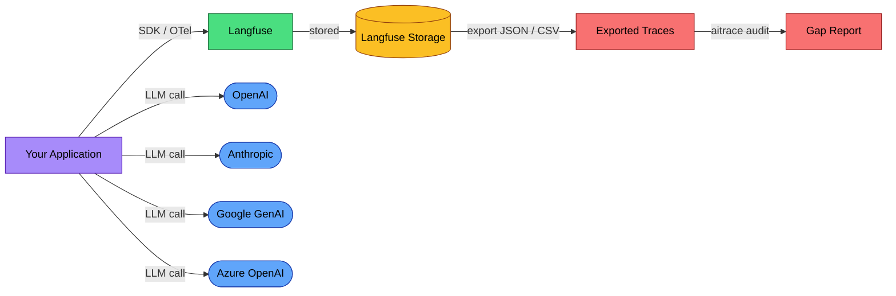

# EU AI Act Compliance Guide for Langfuse Users

Langfuse is an LLM observability platform. If you are using it, you are already collecting most of the data the EU AI Act requires for record-keeping. The gap is not data collection; it is interpreting that data against specific regulatory requirements and filling the 30% that observability alone does not cover.

This guide maps what Langfuse already captures to what the regulation demands, identifies the gaps, and shows how to close them.

## Is your system in scope?

Articles 12, 13, and 14 of the EU AI Act apply only to **high-risk AI systems** as defined in Annex III. Most LLM applications using Langfuse for observability — chatbots, internal tools, content generation, code assistants — are not high-risk and are not subject to these obligations.

Your system is likely high-risk if it is used for:
- **Recruitment or HR decisions** (screening CVs, evaluating candidates, task allocation)
- **Credit scoring or insurance pricing**
- **Law enforcement or border control**
- **Critical infrastructure management** (energy, water, transport)
- **Education assessment** (grading, admissions)
- **Access to essential public services**

If your use case does not fall under Annex III, the high-risk obligations (Articles 9-15) do not apply via the Annex III pathway, though risk classification is context-dependent. **Do not self-classify without legal review.** You may still have obligations under **Article 50** (transparency for chatbots and AI systems interacting directly with users) and **GDPR** (if processing personal data). Focus on Article 50 and GDPR as your baseline. Read those sections below.

## What Langfuse already captures

Langfuse's tracing data model organizes data hierarchically: **Sessions > Traces > Observations**. Each trace represents a single request or operation. Observations (generations, spans, events, tool calls, retrievers, agents, guardrails, embeddings, evaluators, chains) nest within traces and capture the full execution path.

For every generation, Langfuse records:

| Field | What it captures |
|-------|-----------------|
| `model` | Model identifier (e.g., `gpt-4o`, `claude-sonnet-4-20250514`) |
| `input` | Prompt or messages sent to the model |
| `output` | Model response |
| `usage_details` | Token counts: `input`, `output`, `cache_read_input_tokens`, `audio_tokens` |
| `cost_details` | USD costs per usage type, auto-calculated from model pricing tables |
| `model_parameters` | Temperature, max_tokens, top_p, and other generation parameters |
| `start_time` / `end_time` | Timestamps with latency derivable from the delta |
| `metadata` | Arbitrary key-value pairs (environment, version, feature flags) |
| `user_id` | End-user identifier, propagated from trace context |
| `session_id` | Groups related traces into sessions |
| `tags` | Categorization labels (e.g., `[\"production\", \"high-risk\"]`) |
| `level` | Observation level (DEBUG, DEFAULT, WARNING, ERROR) |
| `status_message` | Error or status details |
| `scores` | Numeric, boolean, or categorical evaluations (human or automated) |

This is roughly 70% of what Article 12 requires. The remaining 30% is about retention, governance documentation, and human oversight procedures that no observability tool provides on its own.

## Data flow diagram



Key points:
- Langfuse captures traces from your application via its SDK, OpenTelemetry, or framework integrations (LangChain, LlamaIndex, LiteLLM, Vercel AI SDK).
- LLM calls go directly from your application to providers. Langfuse observes; it does not proxy.
- Each LLM provider is a **processor** under GDPR. Each requires a Data Processing Agreement (Article 28).
- Langfuse itself is a processor when using Langfuse Cloud, or remains under your control when self-hosted.

## Article 12: Record-keeping

Article 12 requires automatic event recording for the lifetime of high-risk AI systems. Here is how Langfuse's existing data maps:

| Article 12 Requirement | Langfuse Feature | Status |
|------------------------|-----------------|--------|
| Event timestamps | `start_time`, `end_time` on every observation | **Covered** |
| Model version tracking | `model` field per generation | **Covered** |
| Input content logging | `input` field on observations | **Covered** |
| Output content logging | `output` field on observations | **Covered** |
| Token consumption | `usage_details` (input, output, cached, audio) | **Covered** |
| Cost tracking | `cost_details`, auto-calculated from model pricing | **Covered** |
| Generation parameters | `model_parameters` (temperature, max_tokens, top_p) | **Covered** |
| Error recording | `level` (ERROR/WARNING) + `status_message` | **Covered** |
| Operation latency | Derived from `end_time - start_time` | **Covered** |
| User identification | `user_id` propagated from trace context | **Covered** |
| Session grouping | `session_id` links related traces | **Covered** |
| Quality evaluations | Scores (human annotations, LLM-as-judge, user feedback) | **Covered** |
| Data retention (6+ months) | Depends on deployment tier and configuration | **Your responsibility** |
| Annex IV technical documentation | System-level docs: capabilities, limitations, intended use | **Not covered** |
| Governance audit trail | Who accessed logs, who reviewed outputs, change history | **Not covered** |

Langfuse covers approximately 80% of Article 12 field-level requirements. The gaps are structural, not data:

1. **Retention policy**: You must configure data retention to meet the 6-month minimum for deployers (Article 26(5)) or 10-year minimum for providers (Article 18). Langfuse Cloud retains data according to your plan tier. Self-hosted deployments require you to manage retention in your database.
2. **Annex IV documentation**: Article 12 logs are evidence; they are not the technical documentation itself. You still need to write system-level docs covering intended purpose, capabilities, limitations, and risk assessment.
3. **Governance trail**: Langfuse tracks what the AI system did. It does not track what humans did with that information: who reviewed outputs, who approved decisions, who changed configurations.

### Configuring compliance-grade logging

Ensure your Langfuse instrumentation captures all required fields:

```python
from langfuse import get_client, propagate_attributes

langfuse = get_client()

# Propagate user and session context to all observations
with propagate_attributes(
    user_id=\"user_12345\",
    session_id=\"session_abc\",
    tags=[\"production\", \"high-risk-hr-screening\"],
):
    with langfuse.start_as_current_observation(
        as_type=\"generation\",
        name=\"candidate-evaluation\",
        model=\"gpt-4o\",
        metadata={
            \"app_version\": \"2.3.1\",
            \"environment\": \"production\",
            \"risk_category\": \"annex-iii-employment\",
            \"deployment_id\": \"hr-screening-eu-west\",
        },
    ) as generation:
        # Your LLM call here
        response = call_llm(prompt, model=\"gpt-4o\")

        generation.update(
            input={\"messages\": prompt},
            output=response.content,
            usage_details={
                \"input\": response.usage.prompt_tokens,
                \"output\": response.usage.completion_tokens,
            },
        )

langfuse.flush()
```

Key practices:
- Always set `user_id` and `session_id` for traceability.
- Tag high-risk traces explicitly (e.g., `\"high-risk-hr-screening\"`) so you can filter and audit them.
- Include `app_version`, `environment`, and `risk_category` in metadata for Annex IV traceability.

## Article 13: Transparency

Deployers must provide users with information about the AI system's capabilities, limitations, and how it reaches decisions. Langfuse contributes to transparency but does not satisfy it alone.

**What Langfuse provides:**
- **Model visibility**: Every generation records which model produced the output, enabling accurate disclosure to users.
- **Cost and usage analytics**: Dashboards show token consumption, cost trends, and model usage patterns across your deployment.
- **Score analytics**: If you run LLM-as-judge evaluations or collect user feedback via Langfuse scores, you have quantitative evidence of output quality over time.
- **Session-level views**: Full execution paths show how a user request was processed, which tools were called, and what the system retrieved before generating a response.

**What you must add:**
- User-facing disclosure that AI is generating or assisting with outputs.
- Documentation of which models are deployed, their known limitations, and training data cutoff dates.
- Explanation of how the system processes inputs (e.g., RAG retrieval steps, tool usage, multi-agent orchestration) at a level understandable to the intended audience.
- If applicable, information about how the system handles uncertainty or low-confidence outputs.

Langfuse dashboards and session replays are useful evidence in an audit. They demonstrate that you can trace any output back to the model, input, and execution path that produced it. But dashboards are operational tooling for developers, not user-facing transparency artifacts.

## Article 14: Human oversight

Article 14 requires high-risk AI systems to be designed so that natural persons can effectively oversee them: interpret outputs correctly, decide not to use a particular output, and intervene or halt the system when necessary. This means human actors in the decision loop, not automated controls.

Langfuse provides **visibility**, not **oversight**. The distinction matters:

| Requirement | What it means | Langfuse's role |
|-------------|---------------|-----------------|
| Human interpretation of outputs | A person reviews what the AI produced before it acts | Langfuse logs the output; reviewing it is your workflow |
| Decision not to use output | A person can reject an AI recommendation | Requires your application layer (approval queue, reject button) |
| Intervention / halt | A person can stop the system mid-operation | Langfuse has no control plane; this is your infrastructure |
| Escalation procedures | Flagged outputs are routed to human review | Langfuse scores can flag; routing logic is yours |
| Audit of oversight actions | Record that a human reviewed and approved/rejected | Langfuse annotation queues record this; integrate with your workflow |

Langfuse's **annotation queues** and **human scoring** features are the closest it comes to Article 14 support. You can create review queues where human reviewers score traces at the trace level, session level, or individual observation level. Those scores are permanently attached to the trace. This provides evidence that human oversight occurred. But the queue design, review criteria, and escalation logic must be built and enforced by your team.

Langfuse's automated evaluations (LLM-as-judge, custom eval functions) fall under Articles 9 (risk management) and 15 (accuracy/robustness). They are useful infrastructure, but automated evaluations are not human oversight under Article 14.

## Article 50: User disclosure

Article 50 applies to **all** AI systems that interact directly with natural persons, not just high-risk ones. If your application generates text, images, audio, or video using AI, you must inform users that the content is AI-generated.

Langfuse does not handle user-facing disclosure. This belongs in your application layer:

```python
# Example: attach disclosure metadata so you can audit compliance later
with langfuse.start_as_current_observation(
    as_type=\"span\",
    name=\"user-response\",
    metadata={
        \"disclosure_shown\": True,
        \"disclosure_type\": \"chatbot-banner\",
        \"disclosure_text\": \"This response was generated by an AI assistant.\",
    },
) as span:
    # Serve the response to the user
    ...
```

By logging disclosure metadata in Langfuse, you create an auditable record that disclosure was provided for each interaction. This does not replace implementing the disclosure in your UI; it proves to auditors that you did.

## GDPR considerations

Langfuse traces will contain personal data if your users' prompts or the model's responses include it. Names, email addresses, health information, financial details: whatever your users type into a prompt becomes part of the trace.

### Langfuse Cloud vs. self-hosted

| Consideration | Langfuse Cloud (EU) | Langfuse Cloud (US) | Self-hosted |
|--------------|--------------------|--------------------|-------------|
| Data residency | Ireland (AWS eu-west-1) | Oregon (AWS us-west-2) | Your infrastructure |
| GDPR-aligned hosting | Yes | Requires SCCs / adequacy decision | Your responsibility |
| DPA available | Yes (Pro/Team plans) | Yes (Pro/Team plans) | N/A (you are controller) |
| SOC 2 Type II | Yes | Yes | Your responsibility |
| Encryption at rest | AES-256 (Aurora, S3, Clickhouse, Redis) | AES-256 | Your configuration |
| Data masking | Available | Available | Available |
| Base URL | `https://cloud.langfuse.com` | `https://us.cloud.langfuse.com` | Your domain |

**For EU-based deployments processing personal data:**
- Use Langfuse Cloud EU (`https://cloud.langfuse.com`) or self-host within the EU.
- Sign the DPA with Langfuse if using their cloud.
- Establish DPAs with every LLM provider your application calls (OpenAI, Anthropic, Google, etc.). These are separate from your Langfuse DPA because the LLM providers process the data directly.

### PII in traces

Langfuse captures inputs and outputs. If a user types \"My name is Maria Garcia and my account number is 12345,\" that is now in your trace database. Consider:

1. **Data minimization**: Use Langfuse's data masking to redact sensitive fields before they reach storage.
2. **Retention limits**: Configure retention periods appropriate to your legal basis. Do not retain PII longer than necessary.
3. **Access controls**: Restrict who can view trace inputs/outputs in Langfuse. Not every developer needs to see user data.
4. **Subject access requests**: You must be able to find and export (or delete) all traces associated with a specific user. Langfuse's `user_id` field and SDK filtering make this possible:

```python
from langfuse import get_client

langfuse = get_client()

# Find all traces for a specific user (GDPR subject access request)
user_traces = langfuse.api.trace.list(
    user_id=\"maria.garcia@example.com\",
    limit=1000,
)

# Export for the data subject
for trace in user_traces.data:
    full_trace = langfuse.api.trace.get(trace.id)
    print(full_trace.json(indent=2))
```

### GDPR Article 30: Record of Processing Activities

Generate a data flow map of your AI system:

```bash
pip install ai-trace-auditor
aitrace flow ./your-application -o data-flows.md
```

This identifies all LLM providers, external services, and data flows in your codebase, which feeds directly into your Article 30 RoPA documentation.

## Compliance workflow: Langfuse to audit

Langfuse collects the data. The compliance question is whether that data satisfies regulatory requirements. The workflow:

```mermaid
graph LR
    LF[Langfuse] -->|export traces| JSON[JSON / CSV / JSONL]
    JSON -->|aitrace audit| GAPS[Gap Report]
    GAPS -->|fix gaps| DOCS[Compliance Package]
    DOCS -->|submit| AUDIT[Regulatory Audit]

    classDef platform fill:#4ade80,stroke:#166534,color:#000
    classDef data fill:#fbbf24,stroke:#92400e,color:#000
    classDef output fill:#f87171,stroke:#991b1b,color:#000
    classDef action fill:#a78bfa,stroke:#5b21b6,color:#000

    class LF platform
    class JSON data
    class GAPS,DOCS output
    class AUDIT action
```



1. **Export traces from Langfuse** (SDK, API, or blob storage integration).
2. **Run `aitrace audit`** against the exported data to identify regulatory gaps.
3. **Address gaps**: add missing documentation, configure retention, build oversight workflows.
4. **Package the result**: trace exports + gap report + remediation evidence = audit-ready.

## Practical example: export and audit

### Step 1: Export traces via the Python SDK

```python
from langfuse import get_client
import json

langfuse = get_client()

# Fetch production traces for the last 30 days
all_traces = []
page = 1
while True:
    traces = langfuse.api.trace.list(
        limit=50,
        page=page,
        tags=[\"production\"],
    )
    all_traces.extend(traces.data)
    if len(traces.data) < 50:
        break
    page += 1

# Export with full observation details
export = []
for trace_summary in all_traces:
    full_trace = langfuse.api.trace.get(trace_summary.id)
    export.append(json.loads(full_trace.json()))

with open(\"langfuse-traces.json\", \"w\") as f:
    json.dump(export, f, indent=2, default=str)

print(f\"Exported {len(export)} traces to langfuse-traces.json\")
```

### Step 2: Run a compliance audit

```bash
pip install ai-trace-auditor

# Audit the exported traces against EU AI Act requirements
aitrace audit langfuse-traces.json -r \"EU AI Act\"

# Generate a full compliance package for your codebase
aitrace comply ./your-application --split -o compliance/
```

The audit identifies:
- Which Article 12 fields are present vs. missing in your traces.
- Whether your traces contain sufficient detail for Annex IV documentation.
- Data flows to external providers that require DPAs.
- PII patterns in trace data that trigger GDPR obligations.

### Alternative: Blob storage export (recommended for large deployments)

For production systems with high trace volumes, use Langfuse's blob storage integration instead of paginating through the API:

1. Configure blob storage export in Langfuse project settings (S3, GCS, or Azure Blob Storage).
2. Set the schedule (hourly, daily, or weekly) and format (JSON or JSONL recommended for audit tooling).
3. Select \"Enriched observations\" as the export source (includes trace-level context on each observation).
4. Point `aitrace audit` at the exported files.

This approach scales to millions of traces and avoids API rate limits. Blob storage export is available on Pro (team add-on), Enterprise, and self-hosted deployments.

## Resources

- [EU AI Act full text](https://artificialintelligenceact.eu/)
- [Langfuse documentation](https://langfuse.com/docs)
- [Langfuse tracing data model](https://langfuse.com/docs/observability/data-model)
- [Langfuse observation types](https://langfuse.com/docs/observability/features/observation-types)
- [Langfuse query via SDK](https://langfuse.com/docs/api-and-data-platform/features/query-via-sdk)
- [Langfuse blob storage export](https://langfuse.com/docs/api-and-data-platform/features/export-to-blob-storage)
- [Langfuse security and data regions](https://langfuse.com/security/data-regions)
- [Langfuse human annotation queues](https://langfuse.com/docs/evaluation/evaluation-methods/annotation)
- [Langfuse token and cost tracking](https://langfuse.com/docs/observability/features/token-and-cost-tracking)
- [AI Trace Auditor](https://github.com/BipinRimal314/ai-trace-auditor) -- open-source EU AI Act compliance scanning

---

*This guide was generated with assistance from [AI Trace Auditor](https://github.com/BipinRimal314/ai-trace-auditor) and reviewed for accuracy. It is not legal advice. Consult a qualified professional for compliance decisions specific to your deployment.*
