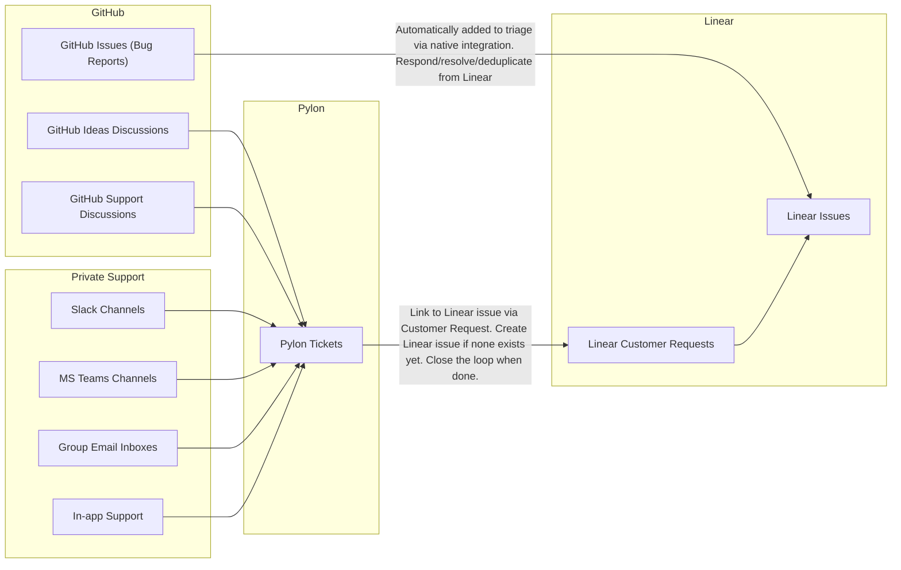

# Product Ops

We maintain an increasingly large product surface area with a small team.
Processes matter in order to fix important bugs fast, and ship highly requested improvements for customers.

## Overview

For product engineering, we use:

- Linear for internal ticketing and collaboration via comments / RFCs
- Pylon for managing support across all channels (in-app, GitHub Discussions Support, Shared Slack Channels, Shared MS Teams Channels, Shared Email inboxes)
- GitHub
  - Issues for bug reports and near term improvements -> use via Linear (no separate inbox)
  - Discussions for feature requests -> use via Pylon (no separate inbox)
  - PR Reviews -> use via Linear PRs (no separate inbox)

We do not use:

- Our individual email inboxes

## Workflow Integration

The following diagram shows how bug reports and feature requests are handled:

