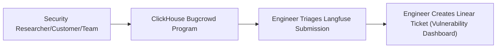
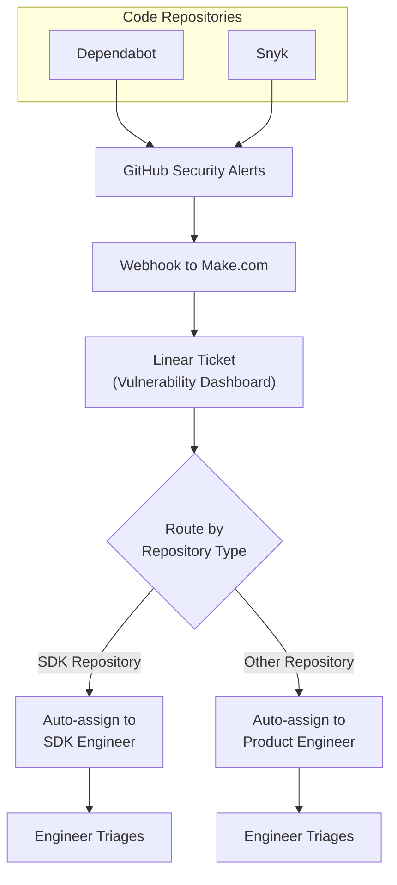

# Vulnerability Handling

We have two different processes for handling security reports. These security reports are always triaged by engineers within 24 hours to act on them promptly if needed.

## Process 1: Manual security reports

Manual vulnerability reports should be submitted through the [ClickHouse Bugcrowd program](https://bugcrowd.com/engagements/clickhouse). Engineering triages Langfuse submissions and creates a Linear ticket in the Vulnerability Dashboard. If a report arrives through support or email, direct the reporter to Bugcrowd rather than requesting sensitive proof-of-concept details in those channels. For reports that suggest active exploitation or customer data exposure, also page engineering on Slack `#security` immediately.

## Process 2: Automated Vulnerability Detection

All Langfuse repositories have Dependabot and Snyk enabled. Vulnerabilities are automatically reported to GitHub, which sends webhooks to Make.com to create Linear tickets and auto-assign to the respective engineer.

