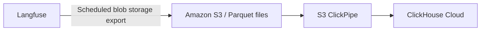

# ClickHouse Data Warehouse

<Callout type="info">
  **Work in progress:** This page outlines the recommended integration path. A
  more detailed setup guide will follow. If you have questions or want to share
  your requirements, [contact support](/support) or [open a GitHub
  issue](https://github.com/langfuse/langfuse-docs/issues/new).
</Callout>

Export Langfuse data to ClickHouse to analyze AI application activity alongside your business and product data. For example, you can combine AI usage and cost with customer account data or explore how agent quality relates to product outcomes.

## Recommended integration: Parquet export and an S3 ClickPipe [#recommended-integration]

Use Langfuse's blob storage export to write Parquet files to Amazon S3, then use an S3 ClickPipe to load those files into ClickHouse Cloud.

1. **Configure Langfuse's blob storage export.** In your project, open **Settings → Integrations → Blob Storage**, configure an S3 destination, and select Parquet as the export format. Choose the export schedule and historical range you need. See [Export to blob storage](/docs/api-and-data-platform/features/export-to-blob-storage) for setup and feature availability.
2. **Create an S3 ClickPipe.** Connect ClickHouse Cloud to the exported Parquet files in your bucket and configure continuous ingestion for subsequent exports. Use the [S3 ClickPipe setup guide](https://clickhouse.com/docs/integrations/clickpipes/object-storage/amazon-s3/get-started) for bucket access, file selection, and ingestion configuration.
3. **Analyze the exported data in ClickHouse.** Use the [Langfuse export field reference](/docs/api-and-data-platform/features/blob-storage-export-fields) to understand the available data and combine it with your other datasets.
