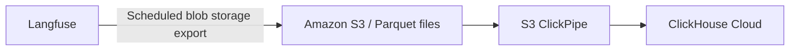

# ClickHouse Data Warehouse

<Callout type="info">
  **Work in progress:** This is the recommended path. A detailed setup guide
  will follow. Questions or requirements? [Contact support](/support) or [open a
  GitHub issue](https://github.com/langfuse/langfuse-docs/issues/new).
</Callout>

Export Langfuse data to ClickHouse to analyze AI activity alongside business and product data — for example, join usage and cost with customer accounts, or relate agent quality to product outcomes.

## Recommended integration: Parquet export and an S3 ClickPipe [#recommended-integration]

Write Parquet files to Amazon S3 with Langfuse's blob storage export, then load them into ClickHouse Cloud with an S3 ClickPipe.

1. **Export from Langfuse.** In **Settings → Integrations → Blob Storage**, configure an S3 destination and choose Parquet. See [Export to blob storage](/docs/api-and-data-platform/features/export-to-blob-storage) for setup and availability.
2. **Create an S3 ClickPipe.** Point ClickHouse Cloud at the exported files and enable continuous ingestion. See the [S3 ClickPipe setup guide](https://clickhouse.com/docs/integrations/clickpipes/object-storage/amazon-s3/get-started).
3. **Analyze in ClickHouse.** Use the [export field reference](/docs/api-and-data-platform/features/blob-storage-export-fields) when joining Langfuse data with your other datasets.
