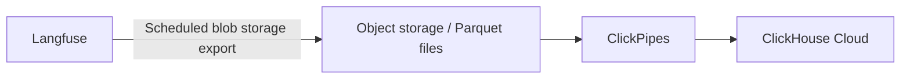

# ClickHouse Data Warehouse

Export Langfuse data to ClickHouse to analyze AI activity alongside business and product data. For example, join usage and cost with customer accounts, or relate agent quality to product outcomes.

For the full setup, follow ClickHouse's [Import Langfuse Cloud trace data](https://clickhouse.com/docs/guides/use-cases/ai-ml/import-langfuse-trace-data) guide. It covers blob storage export, ClickPipe configuration, and querying the imported data.

## Recommended integration: Parquet export and ClickPipes [#recommended-integration]

Write Parquet files to object storage with Langfuse's blob storage export, then load them into ClickHouse Cloud with ClickPipes. Amazon S3, Google Cloud Storage, and Azure Blob Storage ClickPipes are all supported.

```mermaid
flowchart LR
    langfuse["Langfuse"] -->|"Scheduled blob storage export"| storage["Object storage / Parquet files"]
    storage --> pipe["ClickPipes"]
    pipe --> ch["ClickHouse Cloud"]
```

1. **Export from Langfuse.** In **Settings → Integrations → Blob Storage**, configure an S3, GCS, or Azure Blob destination and choose Parquet. See [Export to blob storage](/docs/api-and-data-platform/features/export-to-blob-storage) for setup and availability.
2. **Create one ClickPipe per sub-directory.** Point ClickHouse Cloud at `{prefix}{project-id}/observations_v2/*` and `{prefix}{project-id}/scores/*`. These paths have different schemas, so each needs its own ClickPipe. Enable continuous ingestion. Follow ClickHouse's [import guide](https://clickhouse.com/docs/guides/use-cases/ai-ml/import-langfuse-trace-data) for connection details, sorting keys, and table settings.
3. **Analyze in ClickHouse.** Use the [export field reference](/docs/api-and-data-platform/features/blob-storage-export-fields) when joining Langfuse data with your other datasets.

Adjacent export windows are inclusive on both bounds, so the same record can appear in more than one file. Keep the `time` field group enabled for observation exports so they include `updated_at`. Deduplicate with `ReplacingMergeTree` using `updated_at` as the version column, and query with `FINAL` or `argMax()`.
