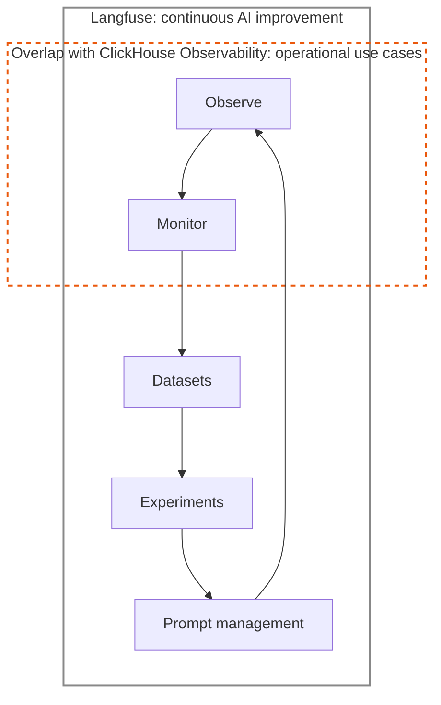
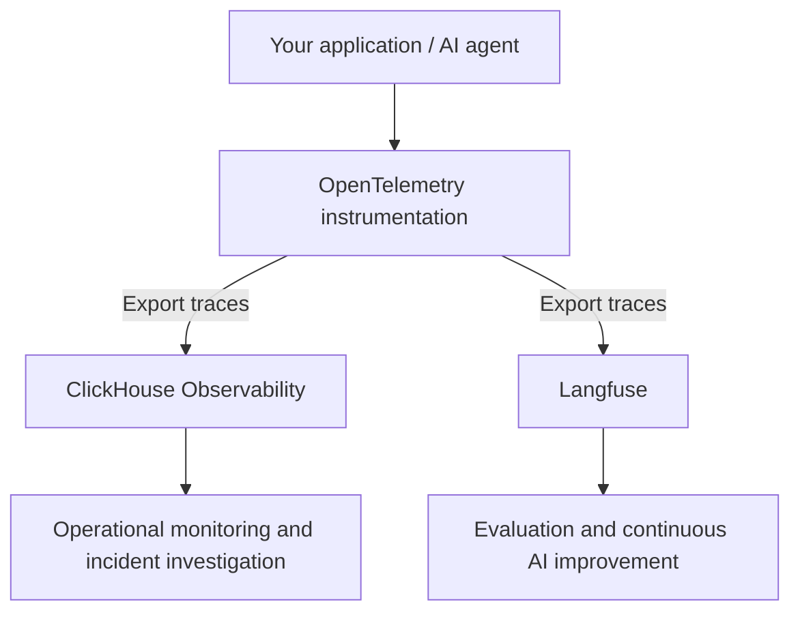

# ClickHouse Observability

Use Langfuse and ClickHouse Observability together to understand how your application runs and improve how your AI agents behave.

[ClickHouse Observability (ClickStack)](https://clickhouse.com/clickstack) brings logs, metrics, and traces together for operational monitoring and debugging. [Langfuse](/docs/observability/overview) adds workflows for understanding AI execution, evaluating outputs, improving prompts, and turning production examples into experiments. Both support OpenTelemetry, so you can send application traces to both destinations.

## Why use both? [#why-use-both]

A slow or unsuccessful agent request can raise different questions. An operations engineer might investigate a failing dependency or an SLO breach. An AI engineer might inspect the prompt, retrieved context, and tool calls to understand why the agent gave an unhelpful answer. Shared trace context helps both teams investigate the same request through the tools they use every day.

Langfuse connects production observations to a continuous improvement loop: observe agent behavior, monitor quality, curate datasets, run experiments, and manage prompts. ClickHouse Observability overlaps with the Observe and Monitor stages for operational use cases.

The highlighted area shows the overlap within this AI workflow. ClickHouse Observability uses these stages to investigate service health and reliability; Langfuse carries the workflow through evaluation, experimentation, and prompt changes, then back to observing the results in production.

|                  | ClickHouse Observability                                                                | Langfuse                                                                                              |
| ---------------- | --------------------------------------------------------------------------------------- | ----------------------------------------------------------------------------------------------------- |
| Typical users    | Operations, SRE, platform, and application engineers                                    | AI engineers, product teams, and domain experts                                                       |
| Main questions   | Is the service healthy? What caused an error or latency spike? Are we meeting our SLOs? | Why did the agent behave this way? How can we improve its quality, cost, and latency?                 |
| Common workflows | Monitor logs, metrics, and traces; configure alerts; investigate incidents              | Inspect prompts and responses; evaluate outputs; curate datasets; run experiments; iterate on prompts |

These workflows often involve different teams, although the same engineer may use both tools. Each team can choose the sampling and retention policies that suit its work. For example, an AI team may keep a broad history of interactions for evaluation, while an operations team chooses policies for incident investigation and reliability analysis. Neither product requires a particular sampling or retention split.

ClickHouse is a foundation for both analytical and observability workloads. [Anthropic](https://clickhouse.com/blog/how-anthropic-is-using-clickhouse-to-scale-observability-for-ai-era) and [OpenAI](https://clickhouse.com/blog/why-openai-uses-clickhouse-for-petabyte-scale-observability) describe using ClickHouse for observability at scale.

## Recommended integration: export to both destinations [#recommended-integration]

Instrument your application with OpenTelemetry and configure export to both a Langfuse project and your ClickHouse Observability environment. Each destination then supports its own analysis and team workflows.

The diagram shows the conceptual flow. Depending on your instrumentation, you can configure export in the application or route telemetry through an OpenTelemetry Collector. Preserve the original trace context across both export paths so that the same request can be identified in each tool. Apply destination-specific sampling after the paths separate if the destinations need different coverage.

Use the following guides to configure each destination:

- **Langfuse:** [OpenTelemetry integration](/integrations/native/opentelemetry) explains the ingestion endpoint and supported instrumentation. Include AI-specific attributes, such as model inputs and outputs, to make traces useful for Langfuse's AI workflows.
- **ClickHouse Observability:** [OpenTelemetry ingestion](https://clickhouse.com/docs/clickstack/ingesting-data/opentelemetry) explains how to send telemetry to its collector. See the [ingestion overview](https://clickhouse.com/docs/clickstack/ingesting-data/overview) for supported sources and deployment patterns.
- **Shared trace context:** [Trace IDs and distributed tracing](/docs/observability/features/trace-ids-and-distributed-tracing) explains how Langfuse handles trace identity across application components.

After configuring export, send a test request and confirm that its trace appears in both tools with the same trace ID. Logs and metrics can continue to flow to ClickHouse Observability alongside your application traces.

## Open source [#open-source]

The open-source project behind ClickHouse Observability is [ClickStack](https://github.com/ClickHouse/ClickStack), which combines ClickHouse, OpenTelemetry, and the HyperDX interface. See the repository for the open-source deployment and contribution guides.

## Roadmap [#roadmap]

The Langfuse and ClickHouse Observability maintainers are working toward deeper cross-linking and integrations for sharing instrumentation and telemetry data. These improvements aim to make it easier to move between the two workflows without duplicating the data.

Interested in these integrations but have questions? [Contact support](/support) or [open a GitHub issue](https://github.com/langfuse/langfuse-docs/issues/new).
