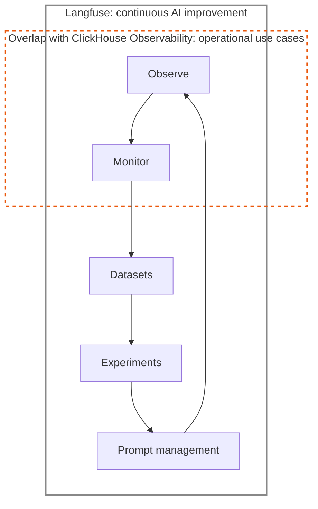
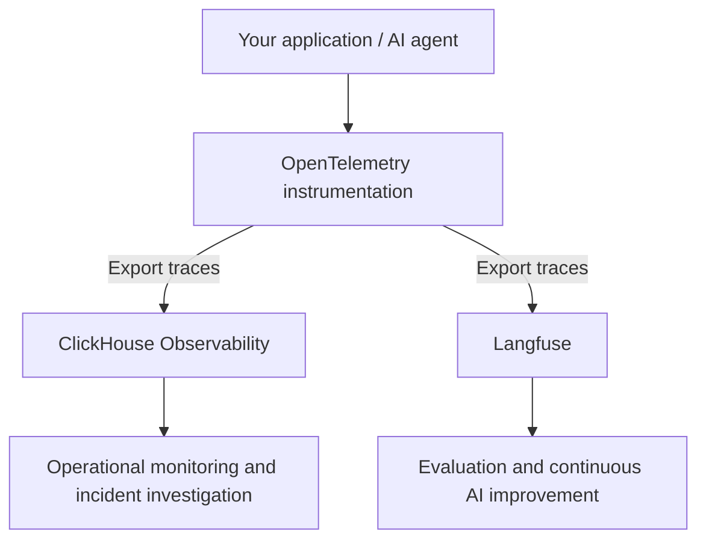

# ClickHouse Observability

[ClickHouse Observability (ClickStack)](https://clickhouse.com/clickstack) brings logs, metrics, and traces together for operational monitoring. [Langfuse](/docs/observability/overview) adds workflows for inspecting AI execution, evaluating outputs, improving prompts, and turning production examples into experiments. Both support OpenTelemetry, so you can send the same traces to both destinations.

## Why use both? [#why-use-both]

A slow or unsuccessful agent request raises different questions. An operations engineer might look for a failing dependency or SLO breach. An AI engineer might inspect the prompt, retrieved context, and tool calls. Shared trace context lets both teams investigate the same request in the tool they already use.

Langfuse connects production observations to a continuous improvement loop. ClickHouse Observability overlaps with the Observe and Monitor stages for operational work.

|                  | ClickHouse Observability                                                                | Langfuse                                                                                              |
| ---------------- | --------------------------------------------------------------------------------------- | ----------------------------------------------------------------------------------------------------- |
| Typical users    | Operations, SRE, platform, and application engineers                                    | AI engineers, product teams, and domain experts                                                       |
| Main questions   | Is the service healthy? What caused an error or latency spike? Are we meeting our SLOs? | Why did the agent behave this way? How can we improve its quality, cost, and latency?                 |
| Common workflows | Monitor logs, metrics, and traces; configure alerts; investigate incidents              | Inspect prompts and responses; evaluate outputs; curate datasets; run experiments; iterate on prompts |

Each team can set its own sampling and retention. An AI team may keep a broad history for evaluation; an operations team may keep what it needs for incidents. Neither product requires a particular split.

[Anthropic](https://clickhouse.com/blog/how-anthropic-is-using-clickhouse-to-scale-observability-for-ai-era) and [OpenAI](https://clickhouse.com/blog/why-openai-uses-clickhouse-for-petabyte-scale-observability) use ClickHouse for observability at scale.

## Recommended integration: export to both destinations [#recommended-integration]

Instrument your application with OpenTelemetry and export to a Langfuse project and your ClickHouse Observability environment.

Export from the application or through an OpenTelemetry Collector. Keep the original trace context on both paths so the same request is identifiable in each tool. Apply destination-specific sampling after the paths split if you need different coverage.

- **Langfuse:** [OpenTelemetry integration](/integrations/native/opentelemetry) for the ingestion endpoint and supported instrumentation. Include AI-specific attributes such as model inputs and outputs.
- **ClickHouse Observability:** [OpenTelemetry ingestion](https://clickhouse.com/docs/clickstack/ingesting-data/opentelemetry) and the [ingestion overview](https://clickhouse.com/docs/clickstack/ingesting-data/overview).
- **Shared trace context:** [Trace IDs and distributed tracing](/docs/observability/features/trace-ids-and-distributed-tracing).

Send a test request and confirm the same trace ID appears in both tools. Logs and metrics can continue to flow to ClickHouse Observability.

## Open source [#open-source]

ClickHouse Observability is built on [ClickStack](https://github.com/ClickHouse/ClickStack): ClickHouse, OpenTelemetry, and the HyperDX interface.

## Roadmap [#roadmap]

We are working on deeper cross-linking and shared instrumentation so you can move between the two workflows without duplicating data.

Questions? [Contact support](/support) or [open a GitHub issue](https://github.com/langfuse/langfuse-docs/issues/new).
