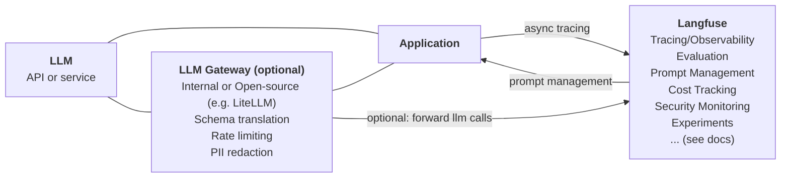

# Langfuse for Enterprise

Langfuse is the leading AI Engineering platform built for enterprise-grade security, scalability, and compliance. Trusted by **19 of the Fortune 50** and **63 of the Fortune 500**, Langfuse addresses key challenges when deploying LLM-based applications within an enterprise environment.

import { Details, Summary } from "@/components/Details";
import { CredibilitySentence } from "@/components/CredibilitySentence";

<CredibilitySentence style="list" />

import { EnterpriseLogos } from "@/components/EnterpriseLogos";

<EnterpriseLogos />

## A complete toolbox to build enterprise LLM applications

Langfuse is a complete platform combining [[1] observability](/docs/observability/overview), [[2] prompt management](/docs/prompt-management/overview), [[3] evaluation](/docs/evaluation/overview), and much more to help teams collaboratively debug, analyze, and iterate on their LLM applications.

All platform features are natively integrated to accelerate the development workflow. **Langfuse is open, self-hostable, and extensible.**

Please refer to our [feature overview](/docs) to learn about all the features and how to get started.

import { FeatureOverview } from "@/components/FeatureOverview";

<FeatureOverview />

import { Button } from "@/components/ui/button";

import EnterpriseCloudScale from "@/components-mdx/enterprise-cloud-scale.mdx";

## Enterprise grade scalability and security

**Langfuse Cloud** is enterprise-ready with SOC 2 Type II and ISO 27001 certifications, GDPR compliance, and HIPAA alignment. For organizations with specific data residency requirements, Langfuse can also be [self-hosted](/self-hosting) as an [open source](/open-source) MIT-licensed project.

<EnterpriseCloudScale />

Langfuse **scales to the largest enterprise use cases** and platform deployment scenarios. Langfuse OSS and Langfuse Enterprise use the same codebase as Langfuse Cloud. Langfuse Cloud currently operates at:

- **\>80M** traces per day
- **\>5B** tracing events per month
- **Thousands of customers** on the same multi-tenant deployment

## Packages & Services

Langfuse is available in two ways:

- **Langfuse Cloud** ([plans and pricing](/pricing)): fully managed, with data regions in the EU, US (including a HIPAA-ready US region), and Japan. Start pay-as-you-go on the public price list, or move to an annual committed-spend agreement: you purchase Langfuse Cloud Credits that draw down against list pricing and get volume discounts, procurement and legal support, and upgraded support.
- **Langfuse Self-Hosted** ([licensing](/pricing-self-host)): Langfuse OSS is free (MIT license) and includes all core platform features. Langfuse Enterprise adds platform-team capabilities via a license key under an annual agreement — one key covers all of your environments.

More details:

- Langfuse can be procured through the [AWS Marketplace](https://aws.amazon.com/marketplace/seller-profile?id=seller-nmyz7ju7oafxu) or per invoice.
- Enterprise agreements include upgraded support and procurement flexibility (custom contracts, vendor onboarding, security and legal reviews).

## Don't take our word for it

import { CustomerCarouselWrapper } from "@/components/customers/CustomerCarouselWrapper";

  <CustomerCarouselWrapper showDots={true} loop={true} className="mt-6" />

## Let's Talk!

Ready to get started with Langfuse Enterprise? We're here to help you find the right solution for your team.

import Link from "next/link";

export function TalkToUsButton() {
  return (
    

      <Button size="lg" asChild>
        <Link href="/talk-to-us">Talk to Enterprise team</Link>
      </Button>
      <Button size="lg" variant="outline" asChild>
        <Link href="mailto:enterprise@langfuse.com">
          Email us: enterprise@langfuse.com
        </Link>
      </Button>
    

  );
}

<TalkToUsButton />

## Additional Resources

### Ways to experience the Product

- [10 minute video overview](/watch-demo) of all Langfuse features
- [Test it yourself with our demo-application](/docs/demo) of the Langfuse platform
- [Create an account on Langfuse Cloud](https://langfuse.com/cloud) for free (no credit card required)
- [Talk to Sales](/talk-to-us) to get a personalized demo

### Product

- [Why customers choose Langfuse](/why)
- [Security and Compliance](/security) - about GDPR, HIPAA, SOC2 and ISO27001 compliance and [related FAQs](/security/security-faq)
- [Technical documentation](/docs)
- [Changelog](/changelog)
- [Roadmap](/docs/roadmap)

### Langfuse Cloud

- [Cloud Pricing](/pricing)
- [Security and Compliance](/security) - includes information on GDPR, HIPAA, SOC2 and ISO27001 compliance

### Self-hosting

- [Deployment Guide](/self-hosting)
- [Open Source Licensing](/open-source)
- [Comparison](/pricing-self-host) of Open Source and Enterprise version
- [Langfuse Self-Hosting: EE](/self-hosting) [Terms and Conditions](/terms)

### Webinars

- [Traces as the core of the LLMOps workflow (webinar + slides)](/guides/videos/webinar-observability-llm-systems)
- [Continuous Agent Evals with Langfuse and AWS Bedrock AgentCore](https://www.youtube.com/watch?v=api-Z4TfDvM)

### Resellers and managed Langfuse deployments

If you want an introduction to our partners, just let us know!

- [Shakudo](https://www.shakudo.io/partners) - managed Langfuse Enterprise self-hosted on behalf of customers on their VPC.
- [GAO](https://www.gao-ai.com/) - our Partner in Japan & APAC that provides professional services, technical support, and payment in local currency in Japan.

## Any questions?

We're here to help you find the right solution for your use case.

<TalkToUsButton />

## FAQ

<Callout type="info" emoji="">
  We collect the most common questions and answers here. If you have questions
  that are not answered, please reach out to us: enterprise@langfuse.com
</Callout>

What deployment options are available for Langfuse?

1. **Langfuse Cloud** (cloud.langfuse.com): fully managed, with data regions in the EU, US (including a HIPAA-ready US region), and Japan. Available pay-as-you-go or via an annual committed-spend agreement. See [Pricing](/pricing) and [Security](/security) for details.
2. **Self-hosted** on your own infrastructure using the standard [deployment templates](/self-hosting); you run Kubernetes yourself. Langfuse OSS is free, and [Langfuse Enterprise](/pricing-self-host) adds enterprise features via a license key. Contact us if you are interested in additional support.

Support SLO for our enterprise customers

Severity levels, coverage hours, and support terms are defined in the [ClickHouse support services policy](https://clickhouse.com/legal/support-services-policy).

First-response targets for Langfuse Cloud Enterprise customers with an annual committed-spend agreement (these also apply to self-hosted Langfuse Enterprise):

- Severity 1: within 1 hour, with 24/7 coverage.
- Severity 2: within 4 business hours.
- Severity 3: within 1 business day.

Enterprise customers on pay-as-you-go receive a first response within 1 business day for Severity 3 requests.

Uptime SLA for our enterprise customers

Our Enterprise Cloud customers get an uptime SLA on Langfuse Cloud:

**Target:** 99.9% Monthly Uptime Percentage.

**Service credits** apply when monthly uptime falls below target:

- Below 99.9% but at or above 99.0% — 5% credit
- Below 99.0% but at or above 95.0% — 10% credit
- Below 95.0% — 25% credit

Langfuse Cloud is considered "Unavailable" for a one-minute interval when at least three authenticated trace-ingestion API requests were made during that interval and none were accepted. Uptime calculations exclude downtime caused by force majeure events, third-party services outside our control, customer misconfiguration or improper use, planned maintenance announced at least 72 hours in advance, and beta or experimental features.

To claim a credit, open a support case within 24 hours of discovering the unavailability and submit the claim by the end of the month following the affected month, including the incident dates, times, and supporting evidence.

See the full [Langfuse Cloud Service Level Agreement](https://clickhouse.com/legal/agreements/langfuse-service-level-agreement) for the authoritative terms.

What is the difference between Langfuse Cloud and the open-source version?

The Langfuse team provides Langfuse Cloud as a managed solution to simplify the initial setup of Langfuse and to minimize the operational overhead of maintaining high availability in production. You can choose to self-host Langfuse on your own infrastructure.

Some features are not available in the open-source version. Please refer to the overview [here](/pricing-self-host).

How does Authentication and RBAC work in Langfuse?

Langfuse offers a list of prebuilt roles which apply on an organizational and project level to restrict access ([RBAC documentation](/docs/rbac)).

If needed, environments (production, staging, development) can be separated into different projects in Langfuse to restrict access to production/sensitive data while making it easier to share development environments with the team and other stakeholders.

SSO with Langfuse is simple. Currently Google, GitHub, Azure AD, Okta, Auth0, AWS Cognito, Keycloak, and JumpCloud are supported. We can easily add additional providers based on your requirements. As an enterprise customer, you can also enforce SSO for your organization.

What is the easiest way to try Langfuse?

The Hobby Plan on [Langfuse Cloud](/cloud) includes enough resources to try Langfuse for free while in a non-production environment, no credit card required.

Alternatively, you can quickly spin up Langfuse on your own machine using `docker compose up` ([docs](/self-hosting/deployment/docker-compose)).

If you require security and compliance features to run a POC, please reach out to us at enterprise@langfuse.com.

Common Enterprise LLM Platform Architecture

Langfuse aims to address the challenges of debugging, monitoring, and continuously improving LLM-based applications. It focuses on observability, evaluation, and prompt management.

Langfuse is often deployed alongside a central LLM Gateway that provides schema translation, rate limiting, and PII redaction. The LLM Gateway can be an internal service or an open-source project like LiteLLM. If you use LiteLLM, you can leverage the native integration ([docs](/integrations/gateways/litellm)).

