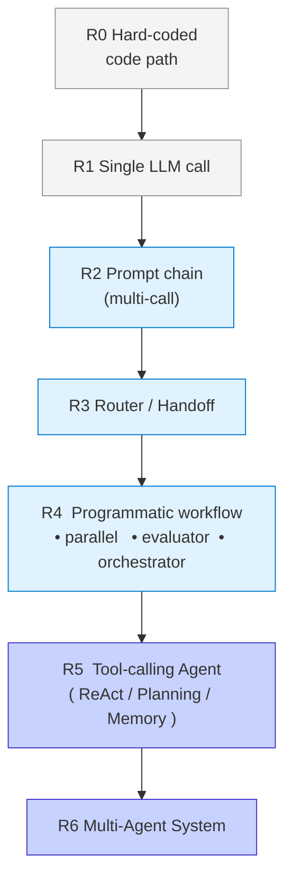

## **Module 2:** Application & Agent Architectures

Designing an LLM application is **not** just about picking a model—it's about picking (and often combining) the *right architecture pattern* along a spectrum that runs from a single LLM call to fully-autonomous multi-agent swarms.  
This choice introduces a fundamental **trade-off between predictability and agency**: the higher you climb, the more freedom your system gains, but the harder it becomes to anticipate or constrain every step.

This chapter unifies the perspectives from three excellent deep-dives:

Below is a distilled map, guidance on when to stop at a workflow vs. when to move to an agent, and concrete patterns you can apply in Langfuse-instrumented projects.

---

### The Architecture Ladder

*Rule of thumb – climb only as high as you **need**:*

* **Workflows (R0-R4)** shine when you value predictability, testability, low latency, and tight context control.
* **Agents (R5-R6)** shine when the path is unknown a-priori, tooling decisions are dynamic, or the user expects open-ended autonomy.

---

### Canonical Patterns

```mermaid
graph TD
  subgraph Workflows
    A[Prompt Chaining] --> B[Routing / Handoff]
    B --> C[Parallelisation]
    C --> D[Evaluator–Optimizer]
    D --> E[Orchestrator–Workers]
  end

  subgraph Agents
    F[Tool-Calling ReAct] --> G[Planning Agent]
    G --> H[Reflection / Self-Critique]
    H --> I[Memory-Augmented Agent]
    I --> J[Multi-Agent Swarm]
  end

  classDef workflows fill:#E0F2FE,stroke:#007acc;
  classDef agents fill:#C7D2FE,stroke:#4338ca;
  class A,B,C,D,E workflows;
  class F,G,H,I,J agents;
```

| Pattern | Typical Use-Case | Key Pros | Key Cons |
| :-- | :-- | :-- | :-- |
| **Prompt Chaining** | Deterministic multi-step doc generation | Easy to debug | Rigid, brittle when input drifts |
| **Routing / Handoff** | Tier-1 support → specialised prompts | Cheap requests go to smaller models | Mis-routing tanks quality |
| **Parallelisation** | Map-reduce summarisation, guardrails | Reduces latency | Cost × N, aggregation complexity |
| **Evaluator–Optimizer** | "Draft → critique → revise" loops | Builds quality offline or online | Adds tokens & delay |
| **Orchestrator–Workers** | Retrieval + synthesis workflows | Clear separation of concerns | Needs robust state passing |
| **Tool-Calling ReAct** | One-shot Q&A with calculator / web | Simple mental model | Parsing / hallucination risk |
| **Planning Agent** | Multi-file code-refactor, research | Deeper reasoning | Planning errors snowball |
| **Reflection** | Self-consistency, safety checks | Cuts hallucinations | Extra calls and $$ |
| **Memory-Augmented** | Long customer sessions | Personalised UX | Memory staleness / cost |
| **Multi-Agent Swarm** | Brainstorming, negotiation sims | Diverse reasoning | Hardest to debug |

### Selecting the Right Approach

1. **Define "good" first.** Accuracy? Cost? Latency? Trust?  
2. Prototype as **R1** (single call). Measure offline with Langfuse datasets.  
3. When metric plateaus, move to **R2 → R3**.  
4. Adopt agents **only** if the task *cannot* be expressed as a bounded graph.

> "The hard part of reliable agents is passing the *right context* at every step." — Harrison Chase

Langfuse provides the tracing you need to see that context. Every node/tool invocation you build becomes a traced span that you can later debug, evaluate, and cost-optimise.

### Implementation Tips

* **Tool schema = prompt.** Document args, edge-cases, examples.
* **Guardrails hierarchy:** JSON schema → allow-list APIs → max-iterations → human-approval.
* **Persist state** (checkpoints) for fault-tolerance and to enable offline re-runs in Langfuse.
* **Add reflection early.** A cheap 2nd-model critique catches many hallucinations.
* **Cost caps.** Track `usage.total_cost` in traces; autonomy creep is real.

The diagram above zooms in on **how an agent-environment loop is executed at runtime**. Notice how each iteration cycles through three checkpoints:
1. **Action** – the agent (LLM call) decides what to do next.
2. **Environment** – the real or simulated world responds.
3. **Feedback / Stop** – the system evaluates whether to continue, hand control back to a human, or terminate.

This micro-loop is the operational core of every architecture at the top of the ladder (R5-R6). It is also where the predictability-vs-agency trade-off materialises in practice: with more agency you allow the loop to run longer and mutate state in unforeseen ways, which demands stronger feedback and stop conditions to stay reliable. In Langfuse each pass through this loop becomes a traced span, giving you the visibility to debug, evaluate, and put guardrails around autonomous behaviour.