## **Module 2:** Application & Agent Architectures

Designing an LLM application is **not** just about picking a model—it's about picking (and often combining) the *right architecture pattern* along a spectrum that runs from a single LLM call to fully-autonomous multi-agent swarms.  

This choice introduces a **trade-off between predictability and agency**: the higher you climb, the more freedom your system gains, but the harder it becomes to anticipate or constrain every step.

<Frame className="my-10" fullWidth>

</Frame>

Below is a distilled map, guidance on when to stop at a workflow vs. when to move to an agent, and concrete patterns you can apply in Langfuse-instrumented projects.

---

### The Architecture Ladder

```mermaid
flowchart LR
  R0["R0  Hard-coded
  code path"]:::low
  R1["R1  Single LLM call"]:::low
  R2["R2  Prompt chain
  (multi-call)"]:::mid
  R3["R3  Router / Handoff"]:::mid
  R4["R4  Programmatic workflow\n• parallel   • evaluator  • orchestrator"]:::mid
  R5["R5  Tool-calling Agent\n( ReAct / Planning / Memory )"]:::high
  R6["R6  Multi-Agent System"]:::high

  R0 --> R1 --> R2 --> R3 --> R4 --> R5 --> R6

classDef low fill:#F3F4F6,stroke:#999;
classDef mid fill:#E0F2FE,stroke:#007acc;
classDef high fill:#C7D2FE,stroke:#4338ca;
```

*Rule of thumb – only go as far to the right as you **need**:*

* **Workflows (R0-R4)** shine when you value predictability, testability, low latency, and tight context control.
* **Agents (R5-R6)** shine when the path is unknown a-priori, tooling decisions are dynamic, or the user expects open-ended autonomy.

<Frame className="my-10" fullWidth>

</Frame>

The diagram above zooms in on **how an agent-environment loop is executed at runtime**. Notice how each iteration cycles through three checkpoints:
1. **Action** – the agent (LLM call) decides what to do next.
2. **Environment** – the real or simulated world responds.
3. **Feedback / Stop** – the system evaluates whether to continue, hand control back to a human, or terminate.

This micro-loop is the operational core of every architecture at the top of the ladder (R5-R6). It is also where the predictability-vs-agency trade-off materialises in practice: with more agency you allow the loop to run longer and mutate state in unforeseen ways, which demands stronger feedback and stop conditions to stay reliable. In Langfuse each pass through this loop becomes a traced span, giving you the visibility to debug, evaluate, and put guardrails around autonomous behaviour.

With this framing in mind, let's zoom in on a **set of canonical patterns** you can lift straight into your own projects. Each pattern is a ready-made blueprint that balances the trade-offs outlined above in a slightly different way — pick the one that maps best to your constraints on cost, latency, and reliability.

---

### Canonical Patterns

A good way to reason about these architectures is to treat them as reusable **patterns** – standard blueprints that describe how LLM calls, tool invocations, and memory slots can be composed to solve a recurring class of problems. Patterns provide a shared vocabulary, speed up design by letting you reuse proven approaches, and make the trade-offs (cost, latency, predictability) explicit when moving from a rigid workflow to a more agentic solution.

| Pattern | Typical Use-Case | Key Pros | Key Cons |
| :-- | :-- | :-- | :-- |
| **Prompt Chaining** | Deterministic multi-step doc generation | Easy to debug | Rigid, brittle when input drifts |
| **Routing / Handoff** | Tier-1 support → specialised prompts | Cheap requests go to smaller models | Mis-routing tanks quality |
| **Parallelisation** | Map-reduce summarisation, guardrails | Reduces latency | Cost × N, aggregation complexity |
| **Evaluator–Optimizer** | "Draft → critique → revise" loops | Builds quality offline or online | Adds tokens & delay |
| **Orchestrator–Workers** | Retrieval + synthesis workflows | Clear separation of concerns | Needs robust state passing |
| **Tool-Calling ReAct** | One-shot Q&A with calculator / web | Simple mental model | Parsing / hallucination risk |
| **Planning Agent** | Multi-file code-refactor, research | Deeper reasoning | Planning errors snowball |
| **Reflection** | Self-consistency, safety checks | Cuts hallucinations | Extra calls and $$ |
| **Memory-Augmented** | Long customer sessions | Personalised UX | Memory staleness / cost |
| **Multi-Agent Swarm** | Brainstorming, negotiation sims | Diverse reasoning | Hardest to debug |

(Source: [Phil Schmid](https://www.philschmid.de/agentic-pattern))

### Selecting the Right Approach

Choosing between a lightweight workflow and a fully-fledged agent is rarely a one-off decision. Instead, think of it as an **iterative search**: start simple, measure, and only add complexity when the data tells you the current architecture has topped out.

1. **Define "good" first.** Accuracy? Cost? Latency? Trust?  
2. Prototype as **R1** (single call). Measure offline with Langfuse datasets.  
3. When metric plateaus, move to **R2 → R3**.  
4. Adopt agents **only** if the task *cannot* be expressed as a bounded graph.

Langfuse provides the tracing you need to see that context. Every node/tool invocation you build becomes a traced span that you can later debug, evaluate, and cost-optimise.

<Callout type="info" emoji="📚">
Further reading:

- **Building Effective Agents**, [blog post](https://www.anthropic.com/research/building-effective-agents), _by Anthropic_
- **Hugging Face Agents Course**, [course](https://huggingface.co/agents-course), _by Hugging Face_
- **How We Built Ellipsis** (or: Lessons from 27 months building LLM coding agents), [blog post](https://www.ellipsis.dev/blog/how-we-built-ellipsis), _by Nick Bradford_
- **Agentic Pattern**, [blog post](https://www.philschmid.de/agentic-pattern), _by Phil Schmid_

</Callout>