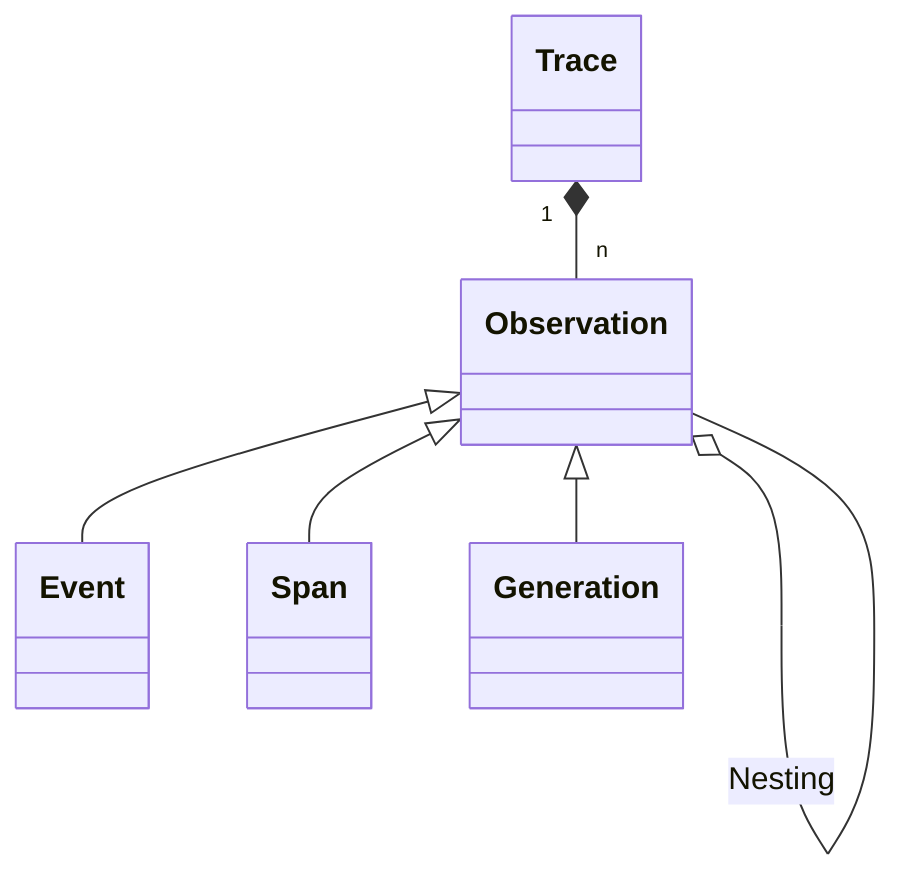
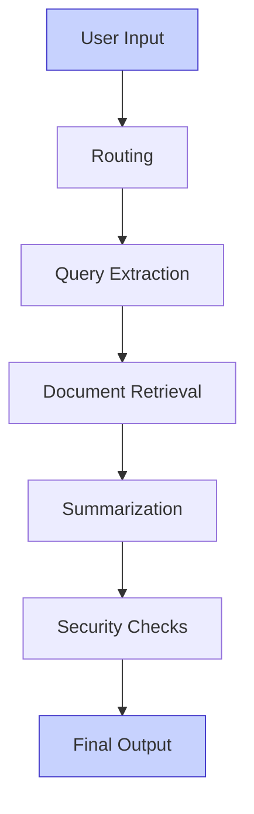

# **Module 3:** Tracing

Having introduced LLMOps and the importance of monitoring in Module 1, and different architectual patterns in Module 2, let's take a **closer look at tracing** and how it helps you manage multi-step LLM applications.

<Frame className="my-10" fullWidth>

</Frame>

## Recap: What is a trace/span and how is it used in LLM applications?

A `trace` typically represents a single request or operation.
It contains the overall input and output of the function, as well as metadata about the request, such as the user, the session, and tags.
Usually, _a trace corresponds to a single api call of an application_.

Each trace can contain multiple `observations` to log the individual steps of the execution.

- Observations are of different types:
  - `Events` are the basic building blocks. They are used to track discrete events in a trace.
  - `Spans` represent durations of units of work in a trace.
  - `Generations` are spans used to log generations of AI models. They contain additional attributes about the model, the prompt, and the completion. For generations, [token usage and costs](/docs/model-usage-and-cost) are automatically calculated.

**Hierarchical structure of traces in Langfuse**

**Example trace in Langfuse UI**

**Example trace in Langfuse UI**

## Why is LLM Tracing important?

As applications grow in sophistication, the potential points of failure multiply, impacting quality, cost, and latency. Without a robust LLMOps setup, it becomes nearly impossible to identify and address these issues.

By adding observability, you can gain real-time insights into the performance and behavior of their LLM applications. This enables you to pinpoint latency bottlenecks, understand the root causes of errors, and continuously refine your systems based on actionable data.

**Multiple Points of Failure**

In a typical multi-step LLM application, various components interact to deliver a final output, such as:

* Routing  
* Query extraction  
* Tool Calls  
* Document retrieval  
* Summarization  
* Security checks

Each step can become a bottleneck, affecting the overall performance. For example, a delay in query embedding can cascade, increasing the latency of the entire system. This can become even more complex when we look at AI agents with chained reasoning steps and multiple tool calls. 

*Example of a multi-step LLM application:*

Given the non-deterministic nature of multi-step LLM applications, continuous iteration and improvement are necessary. As new features are added and workloads change, you must frequently revisit and refine your systems.

## Why is Agent Tracing important?

AI agents often **call multiple tools** or make multiple LLM requests to solve a single task. That complexity amplifies the need of tracing:

**Debugging and Edge Cases:**

Agents use multiple steps to solve complex tasks, and inaccurate intermediary results can cause failures of the entire system. [Tracing](/docs/tracing) these intermediate steps and testing your application on known edge cases is essential.

When deploying LLMs, some edge cases will always slip through in initial testing. A proper analytics set-up helps identify these cases, allowing you to add them to future test sets for more robust agent evaluations. Evaluation [Datasets](/docs/datasets/overview) allows you to collect examples of inputs and expected outputs to benchmark new releases before deployment. Datasets can be incrementally updated with new edge cases found in production and integrated with existing CI/CD pipelines.

**Tradeoff of Accuracy and Costs:**

LLMs are stochastic by nature, meaning they are a statistical process that can produce errors or hallucinations. Calling language models multiple times while selecting the best or most common answer can increase accuracy. This can be a major advantage of using agentic workflows.

However, this comes with a cost. The tradeoff between accuracy and costs in LLM-based agents is important, as higher accuracy often leads to increased operational expenses. Often, the agent decides autonomously how many LLM calls or paid external API calls it needs to make to solve a task, potentially leading to high costs for single-task executions. Therefore, it is important to monitor model usage and costs in real-time.

## What to Trace?

<Frame className="my-10">

</Frame>

Modern LLM applications are multi‑layer systems—user requests flow through application logic, optional tool calls, and finally one or more LLM calls. **Observability** therefore means capturing metrics at *every* layer and correlating them across requests, users, and releases. The diagram above highlights the main buckets you should instrument; below is an overview what each represents and *why it matters*.

| Layer | Metric | Why It Matters | Typical Questions Answered |
| :---- | :---- | :---- | :---- |
| **LLM** | **Input / Output payloads** | Enables root‑cause analysis of hallucinations or policy violations. | *"Did unsafe content originate from user input or the model?"* |
| **LLM** | **Cost / Token usage** | LLM pricing is volume‑based; tracing tokens per request makes optimisation concrete. | *"Which prompts burn the most tokens per session?"* |
| **LLM / Application** | **Error rate & error taxonomy** | Quantifies reliability and pinpoints whether failures stem from the provider, quota limits, or bad inputs. | *"Are timeout errors spiking after the last prompt change?"* |
| **LLM / Application** | **Latency (p50 / p95 / p99)** | Directly impacts user experience and cost; long tails often hide in p99. | *"Does adding a tool call increase end-to-end latency beyond 1 s?"* |
| **Application** | **Tools:** (RAG look‑ups, function calls, DB queries) | Tools often dominate latency and can cascade errors back to the model. | *"Is the vector store behind our RAG pipeline timing out?"* |
| **Application** | **Custom spans & business KPIs** | Correlates model behaviour with app‑level outcomes (e.g., conversion) and flags regressions early. | *"Did yesterday's deploy hurt onboarding completion?"* |
| **Application** | **Environment, release version, feature flags** | Makes every trace searchable and comparable across A/B tests. | *"Do we see higher latency only in EU region?"* |
| **Users** | **Explicit thumbs‑up/down, implicit dwell‑time** | Feeds human‑in‑the‑loop evaluation and drives continuous improvement. | *"Are users more satisfied after we simplified the prompt?"* |
| **Users** | **Multi‑turn conversation context & duration** | Lets you slice metrics by journey stage and detect session‑level anomalies. | *"Which sessions hit the cost guardrail?"* |
| **Users** | **Cohorts, frequency, retention** | Maps model performance to real customer impact and prioritises fixes. | *"Do power users experience more errors than newcomers?"* |

## How to Instrument your App?

To gather tracing data, you'll need to **instrument** your code—either by using a **native integration** for your framework or manually sending trace data via Langfuse's SDKs or REST API.

<Callout type="info" emoji="🪢">
This chapter focuses on what to track and why. For detailed instructions on sending these metrics to Langfuse—via SDKs, OTEL exporters, or the REST API—see the [Langfuse documentation](/docs/integrations/overview).*
</Callout>

To help you choose the right entry point, here is an **overview** of the most common ways teams instrument their applications:

1. **SDKs**  
   Use the Langfuse SDK for Python and TypeScript when you want to annotate business logic or pass custom metadata. Start here if you control the application code. See the [SDK overview](/docs/sdk/overview).
2. **Framework integrations – drop-in instrumentation**  
   If you already rely on higher-level stacks such as LangChain, LlamaIndex, Haystack, Autogen, or Instructor, native integrations are available to capture the framework's internal graph of tool calls and LLM requests. See all options under [Integrations](/docs/integrations/overview).
3. **OpenTelemetry (OTEL) – vendor-neutral pipelines**  
   Organisations that standardise on OTEL can forward existing spans to Langfuse via an OTLP exporter, adding a few Langfuse-specific attributes on the way. Follow the guide in [OpenTelemetry](/docs/opentelemetry/get-started).
4. **Proxy-based capture – zero code changes**  
   For situations where you cannot touch the source code, run your OpenAI-compatible traffic through a [LiteLLM proxy](/docs/integrations/litellm/tracing) with the Langfuse audit module enabled. This automatically records every request and response.

These approaches are **composable**: you can combine them to get the best of each approach.

Langfuse supports many popular frameworks:   

<Frame className="my-10">

</Frame>

## Get Started with Tracing in Langfuse

Key benefits

  
- **Full context:** Capture the complete execution flow including API calls, context, prompts, parallelism and more
- **Conversation/session view:** In multi-turn conversations, group interactions into sessions
- **User tracking:** Add your own identifiers to inspect traces from specific users
- **Cost tracking:** Monitor model usage and costs across your application
- **Quality insights:** Collect user feedback and identify low-quality outputs
- **Low overhead:** Designed for production with minimal performance impact
- **Best-in-class SDKs:** We offer best-in-class SDKs for Python, JS/TS for easy integration
- **Framework support:** Integrated with popular frameworks like OpenAI SDK, LangChain, and LlamaIndex
- **Multi-modal:** Support for tracing text, images and other modalities
- **Open source:** Fully open source with public API for custom integrations

import TracingOverview from "@/components-mdx/tracing-overview-gifs.mdx";

<TracingOverview />

<Callout type="info" emoji="📚">
Further reading:

- **Langfuse Integrations**, [docs](/docs/integrations/overview)
- **Traceability and Observability in Multi-Step LLM Systems**, [webinar](/guides/videos/webinar-observability-llm-systems) _by Marc Klingen_
- **The OSS LLMOps Stack**, [page](https://oss-llmops-stack.com) _by LiteLLM and Langfuse_

</Callout>

Once you have instrumented your LLM application and successfully ingested data to Langfuse, you can use this data to evaluate your application and make it ready for production. 