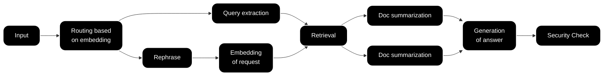
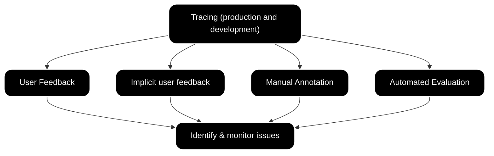

## **Module 4:** Evaluation

Having established a strong tracing foundation, it's time to examine **evaluation**—the process of measuring how well your LLM (or agent) performs and how to evolve it over time.

Evaluating LLMs can feel like trying to untangle a giant ball of yarn—there's a lot going on, and it's often not obvious which thread to pull first. From wrangling unpredictable user inputs to picking the right metrics, the process can be overwhelming. But don't panic\! In this post, we'll walk through some tried-and-true best practices, common pitfalls, and handy tips to help you benchmark your LLM's performance. Whether you're just starting out or looking for a quick refresher, these guidelines will keep your evaluation strategy on solid ground.

### Evaluation Challenges

When it comes to LLMs, "evaluation" is more than just a single metric or one-time test. Their outputs can be astonishingly diverse—sometimes correct, sometimes creative, and sometimes surprisingly off-base.

One major hurdle is defining clear evaluation goals. Traditional software metrics (like error rates) may not translate well when your model might encounter any question under the sun. You'll want to pin down what "good" looks like—whether it's accuracy, helpfulness, or creativity—before you even begin.

Because LLMs generate text rather than just classifying it, subjective interpretation creeps into the equation. Deciding how to measure factors like "clarity" or "coherence" can be tricky without well-defined rubrics or specialized metrics.

And then there's the operational side of evaluation:

- **Cost and Latency:** Testing at scale (especially with human annotators) can run up costs quickly. Automated approaches may be faster, but they're not always reliable enough on their own.  
- **Trust in Automated Tools:** Automated evaluators (including ones powered by smaller models) can drift or fail in unexpected ways. Keeping them aligned with real human perspectives takes constant upkeep.  
- **Cross-Team Collaboration:** Getting engineers, data scientists, product managers, and domain experts to work in sync is crucial. Without a clear process or shared vocabulary, you risk chaotic handoffs and scattered efforts.

**Example: Simplified Customer Support RAG Chat**  

When you're dealing with a workflow that spans multiple steps—like the above RAG pipeline—each stage needs its own evaluation criteria. Otherwise, you'll struggle to pinpoint exactly where things go wrong (or right).

### Data Model for Evaluation – Traces

To make sense of all these moving parts, it helps to have an organized way to record exactly what's happening at each step. That's where traces come in. Traces capture detailed logs of user interactions, intermediate steps, and final outputs, giving you a treasure trove of data for diagnosing issues and measuring performance over time.

{" "}

<Frame className="max-w-sm">
  
</Frame>

_Example of a trace in Langfuse](https://cloud.langfuse.com/project/cloramnkj0002jz088vzn1ja4/traces/8ed12d68-353f-464f-bc62-720984c3b6a0?display=graph)_

* **Pinpoint Failures:** By following a trace from input to output, you can spot where the model (or a sub-component) stumbles.  
* **Quantify Performance:** Compare model outputs against ground truths or reference answers.  
* **Accelerate Iteration:** With detailed traces, it's easy to see which inputs cause the biggest problems and quickly focus your tuning efforts there.

### Evaluation Workflow

The continuous evaluation loop begins *offline* with building or curating test datasets that range from "happy path" scenarios to adversarial inputs, ensuring robust coverage of potential user interactions. 

Next, teams run experiments by iterating on models, prompts, and any relevant tools or logic, followed by a thorough evaluation stage—this can include both manual annotation for nuanced judgment calls and automated methods for speed and scale. 

Once these experiments meet the necessary quality and safety criteria, the changes are deployed alongside guardrails that filter inputs or outputs in real time. 

Once the application is in production, we continuously capture data about actual performance and user behavior, while monitoring tools support debugging and manual review to surface any unexpected issues. 

Whenever new problems or edge cases are identified, they are funneled back into the test dataset so that future experiments can address them proactively, creating a self-sustaining feedback loop that improves the system with each iteration.

Now let's take a closer look at online and offline evaluations.

#### **Offline Evaluation:**

Offline evaluation means that you are testing your application during development state. You'll typically run your model on curated datasets—maybe as part of your CI pipeline or local dev tests. Smaller datasets are great for quick, "gut check" experiments; larger ones provide a broader sweep of performance indicators. The main challenge is making sure these test sets stay relevant and actually resemble what you'll see in the wild.

The image below shows an example of a dataset in Langfuse with inputs and expected outputs:  

<Frame className="my-10" fullWidth>
  
</Frame>

For instance, if you built a math word-problem solving application, you might have a [test dataset](https://huggingface.co/datasets/gsm8k) of 100 problems with known answers which you all feed into your application. Once your agent answered all math questions, you compare the results with the known answers and calculate the accuracy of the agent. You then run this test with different settings (e.g. add calculator tool, chain of thought prompting, larger LLM) and compare the results. 

The key challenge with offline eval is ensuring your test dataset is comprehensive and stays relevant – your application might perform well on a fixed test set but encounter very different queries in production. Therefore, you should keep test sets updated with new edge cases and examples that reflect real-world scenarios​. A mix of small "smoke test" cases and larger evaluation sets is useful: small sets for quick checks and larger ones for broader performance metrics​.

For an end-to-end example on running Dataset experiments in Langfuse, check out [this cookbook](https://langfuse.com/docs/integrations/langchain/example-langgraph-agents#offline-evaluation). 

#### **Online Evaluation:**

Besides evaluating your application during development, you can also evaluate your app while it runs in production. 

For example, you might track success rates, user satisfaction scores, or other metrics on live traffic. The advantage of online evaluation is that it captures things you might not anticipate in a lab setting – you can observe model drift over time (if the agent's effectiveness degrades as input patterns shift) and catch unexpected queries or situations that weren't in your test data​. It provides a true picture of how the agent behaves in the wild.

Online evaluation often involves collecting implicit and explicit user feedback, as discussed, and possibly running shadow tests or A/B tests (where a new version of the agent runs in parallel to compare against the old). The challenge is that it can be tricky to get reliable labels or scores for live interactions – you might rely on user feedback or downstream metrics (like did the user click the result).

The image below shows an example of a live LLM-as-a-Judge Evaluator in Langfuse that scores new traces for toxicity:  

<Frame className="my-10" fullWidth>
  
</Frame>

### Common Evaluation Metrics

For both online and offline evaluations, it is important to know which datapoints you would like to collect and use as evaluation metrics. No single method will capture everything about your model's behavior, so it often pays to mix and match. 

Below are some of the most common metrics to track: 

#### **User Feedback:**

Direct feedback—like user ratings or open-ended comments—offers the clearest signal of whether your LLM is hitting the mark. However, collecting and organizing these insights at scale can be expensive and time-consuming.

Example of user feedback captured in ChatGPT:  

{" "}

<Frame className="frame-lg" fullWidth>
  
</Frame>

#### **Implicit User Feedback (Human-in-the-Loop):**

Instead of waiting for explicit ratings, you can infer quality from user behavior: Did they ask the same question again? Did they click on recommended links? Though it's usually easier to gather, the signal can be noisy and needs careful interpretation.

#### **Manual Annotation:**

Having experts (or crowdworkers) label or grade outputs can provide deep insights, especially for complex tasks. The downside is cost and time: manual annotation doesn't scale easily.  
Example of a manual annotation workflow in Langfuse:

{" "}

<Frame className="my-10" fullWidth>
  
</Frame>

#### **Automated Evaluation:**

Using metrics like precision, recall, F1-score, or specialized generative metrics can give a quick, numerical snapshot of performance. Tools like OpenAI Evals, LangChain Evals, and RAGAS fall in this bucket. These are fast and repeatable but must be validated against human judgment to avoid misleading conclusions.

*Example of different automated evaluation scores over time in Langfuse:*  

{" "}

<Frame className="max-w-sm">
  
</Frame>

Traces are the underlying thread across all these methods—by systematically logging interactions, you create a structured record that each evaluation technique can draw from.

### Automated Evaluation Techniques

For certain applications—like extraction and classification tasks—precision, recall, and F-score offer clear, quantifiable measures. But not all tasks are that straightforward, especially when an LLM is expected to generate paragraphs of text or whole chat conversations.

#### **LLM-as-a-Judge Approaches:**

You can enlist another machine learning model—or even a specialized LLM-based evaluator (sometimes called "model based evals")—to score outputs. These can be flexible, but there's always the risk of propagating the same biases or blind spots. Calibrating them against human-annotated samples helps. Find out more on using LLM-as-a-Judge evals [here](https://langfuse.com/docs/scores/model-based-evals).

#### **Non-model-based Approaches:**

In some cases, simpler rule-based checks (like regex patterns) can be surprisingly effective. They're cheap and transparent but won't scale to more nuanced tasks.

Ultimately, common toolkits like built in LLM-as-a-Judge evals or external libraries like [OpenAI Evals](https://github.com/openai/evals) and [RAGAS](https://docs.ragas.io/en/stable/) help streamline the setup for automated checks. Still, every application has its own quirks. Tailored evaluators or custom heuristics often deliver the best insights if you invest the time to build them correctly.

### Application-Specific Challenges

What makes LLM evaluation both fascinating and challenging is how different each use case can be:

#### **Retrieval-Augmented Generation (RAG):**

Because you're evaluating both the retrieval step and the generative step, it's helpful to measure them separately. For example, you might track relevance and precision for document retrieval, then apply generative metrics (like RAGAS) to the summarized output. (Guide on using RAGAS [here](https://langfuse.com/guides/cookbook/evaluation_of_rag_with_ragas))

#### **Agent-Based LLM Applications:**

Here, the model isn't just producing text—it's also making decisions or taking actions based on user inputs. Evaluating such agents usually involves simulating interactive conversations and carefully checking each intermediate decision. Human-in-the-loop feedback can be especially helpful to confirm the agent's logic or to flag any odd behavior.

#### **Voice Agent Evaluation:**

Voice-based applications bring unique challenges, as they combine speech recognition, synthesis, and interactive dialogue. Evaluating these agents often requires assessing both the conversational dynamics and the audio processing performance. For a comprehensive overview of best practices and challenges in this area, see our dedicated guide: [Evaluating and Monitoring Voice AI Agents](https://langfuse.com/blog/2025-01-22-evaluating-voice-ai-agents).

### LLM Red Teaming / Security

Another aspect of evaluation is Red Teaming. In the previous section we focused on optimizing your application. This part shows how to secure your application against attacks and edge cases. 

Protecting against security risks and attacks is becoming increasingly important for ensuring LLM apps are production ready. Not only do LLM applications need to be secure to protect users' private and sensitive information, they also need ensure a level of quality and safety of responses to maintain product standards.

The [OWASP Top 10](https://owasp.org/www-project-top-10-for-large-language-model-applications/) list is a useful resource on the topic. It provides a consensus of the most critical security risks for LLM applications.

In the video below, we walk through an example of how to use the open-source security library LLM Guard, and how to integrate Langfuse to monitor and protect against common security risks.  

<CloudflareVideo
  videoId="3a89dd733399f0c9da4aa5ac9da80d78"
  title="LLM Security Monitoring with Langfuse"
  aspectRatio={16 / 9}
  className="mt-6"
  posterStartTime={112}
/>

LLM Security can be addressed with a combination of

* LLM Security libraries for run-time security measures  
* Langfuse for the ex-post evaluation of the effectiveness of these measures

#### **Run-time security measures with LLM security libraries**

There are several popular security libraries that can be used to mitigate security risks in LLM-based applications. These include: [LLM Guard](https://llm-guard.com/), [Prompt Armor](https://promptarmor.com/), [NeMo Guardrails](https://github.com/NVIDIA/NeMo-Guardrails), [Microsoft Azure AI Content Safety](https://azure.microsoft.com/en-us/products/ai-services/ai-content-safety), [Lakera](https://www.lakera.ai/). These libraries help with security measures in the following ways:

1. Catching and blocking a potentially harmful or inappropriate prompt before sending to the model  
2. Redacting sensitive PII before being sending into the model and then un-redacting in the response  
3. Evaluating prompts and completions on toxicity, relevance, or sensitive material at run-time and blocking the response if necessary  
   

#### **Asynchronous monitoring and evaluation of security measures with Langfuse**

Use Langfuse [tracing](https://langfuse.com/docs/tracing) to gain visibility and confidence in each step of the security mechanism. These are common workflows:

1. Investigate security issues by manually inspect traces.  
2. Monitor security scores over time in the Langfuse Dashboard.  
3. Evaluate effectiveness of security measures. Integrating Langfuse [scores](https://langfuse.com/docs/scores) into your team's workflow can help teams identify which security risks are most prevalent and build more robust tools around those specific issues. There are two main workflows to consider:  
   * [Annotations (in UI)](https://langfuse.com/docs/scores/annotation). If you establish a baseline by annotating a share of production traces, you can compare the security scores returned by the security tools with these annotations.  
   * [Automated evaluations](https://langfuse.com/docs/scores/model-based-evals). Langfuse's model-based evaluations will run asynchronously and can scan traces for things such as toxicity or sensitivity to flag potential risks and identify any gaps in your LLM security setup. Check out the docs to learn more about how to set up these evaluations.  
4. Track latency to balance tradeoffs. Some LLM security checks need to be awaited before the model can be called, others block the response to the user. Thus they quickly are an essential driver of overall latency of an LLM application. Langfuse can help dissect the latencies of these checks within a trace to understand whether the checks are worth the wait.

#### **Example Workflow: Anonymizing Personally Identifiable Information (PII)**

We redact and un-redact sensitive information using a security library before and after it is fed into the model. We wrap the whole process with the Langfuse [observe decorator](https://langfuse.com/docs/sdk/python/decorators) to trace and monitor the security process. In the following example below we use the open source library [LLM Guard](https://llm-guard.com/), an open-source security tool. All examples easily translate to other libraries.

Exposing Personally Identifiable Information (PII) to models can pose security and privacy risks, such as violating contractual obligations or regulatory compliance requirements, or mitigating the risks of data leakage or a data breach.

The example below shows a simple application that summarizes a given court transcript. For privacy reasons, the application wants to anonymize PII before the information is fed into the model, and then un-redact the response to produce a coherent summary.

Run the [end-to-end cookbook](https://langfuse.com/docs/security/example-python) or check out our [documentation](https://langfuse.com/docs/security/overview).

### Getting Started with LLM Evaluation

<Callout type="info" emoji="📚">
Further reading:

- **Evaluating the Effectiveness of LLM-Evaluators (aka LLM-as-Judge)**, [blog post](https://eugeneyan.com/writing/llm-evaluators/), _by Eugene Yan_
- **AI Agent Observability & Evaluation**, [course](https://huggingface.co/learn/agents-course/bonus-unit2/introduction), _by Hugging Face_
- **Your AI Product Needs Evals**, [blog post](https://hamel.dev/blog/posts/evals/), _by Hamel Husain_
- **Creating a LLM-as-a-Judge That Drives Business Results**, [blog post](https://hamel.dev/blog/posts/llm-judge/), _by Hamel Husain_
- **Evaluating Voice AI Agents**, [blog post](/blog/2025-01-22-evaluating-voice-ai-agents) and [video](https://www.youtube.com/watch?v=hPrPqry1yQQ), _by Marc Klingen and Brooke Hopkins_

</Callout>

Evaluating LLMs is never a one-and-done task. As your model and user base evolve, your evaluation strategies need to keep pace. By combining offline benchmarks with real-time insights, leveraging traces, and staying open to new techniques, you'll be well on your way to building more reliable, impactful LLM applications.

