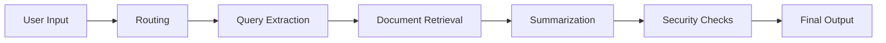
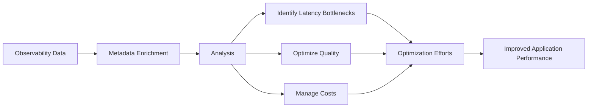
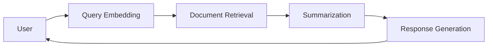
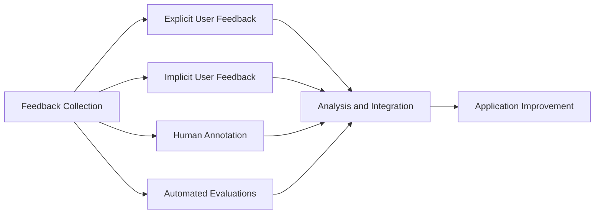
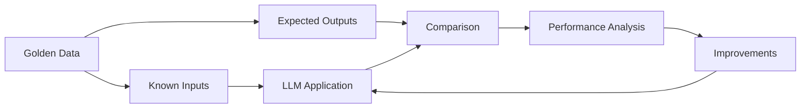

import { BlogHeader } from "@/components/blog/BlogHeader";

<BlogHeader
  title="Observability in Multi-Step LLM Systems"
  description="Optimize multi-step LLM systems with advanced observability, feedback, and testing strategies for better performance and reliability."
  date="October 7, 2024"
  authors={["marcklingen"]}
/>

Managing the complexity of Large Language Model (LLM) applications requires a focus on maintaining high performance, reliability, and efficiency. As these apps become **increasingly complex**, they introduce multiple points of failure that can affect quality, cost, and latency.

This is where [observability](/docs/tracing) and traceability come into play. By implementing advanced techniques for monitoring and analyzing LLM systems, developers can gain deep **insights into their applications**, identify bottlenecks, and continuously improve their performance.

This post shows strategies to enhance traceability and observability in **multi-step LLM systems**, including the importance of observability, feedback collection methods, and rigorous application testing. These insights will help optimize LLM applications for better quality, cost-efficiency, and latency.

<Callout>
  **TL;DR:** Key takeaways include the necessity of observability in complexLLM
  systems to identify and resolve bottlenecks, enhance performance, and ensure
  reliability. Leveraging data and feedback, along with rigorous testing using
  "golden data," supports continuous improvement and optimization of these
  complex applications.
</Callout>

## Why is Observability Crucial for Complex LLM Apps?

As these systems grow in sophistication, the **potential points of failure multiply**, impacting quality, cost, and latency. Without a robust observability framework, it becomes nearly impossible to identify and address these issues effectively.

By implementing comprehensive observability, developers gain real-time insights into the performance and behavior of their LLM applications. This enables them to pinpoint **latency bottlenecks**, understand the **root causes of errors**, and continuously refine their systems based on **actionable data**.

### Multiple Points of Failure

In a typical multi-step LLM application, various components interact to deliver a final output, such as:

- Routing
- Query extraction
- Document retrieval
- Summarization
- Security checks

Each step can become a **bottleneck**, affecting the overall performance. For example, a delay in query embedding can cascade, increasing the latency of the entire system.

_Example of a multi-step LLM application._

Given the intricate nature of multi-step LLM applications, continuous **iteration and improvement** are necessary. As new features are added and workloads change, developers must frequently revisit and refine their systems.

Through [**monitoring and analysis**](/docs/analytics/overview), developers can transform complex LLM systems into robust, high-performing applications.

## Leveraging Observability Data

Observability data is not just about monitoring application performance; it's about gaining deeper insights that drive meaningful optimizations.
By attaching rich **metadata** to observability data, developers can unlock information that enhances their understanding of how their LLM applications behave under various conditions.

### Attaching Metadata

[Metadata](/docs/tracing-features/metadata), such as user IDs, request contexts, and operational metrics adds valuable context to observability data. This enriched data allows for more granular analysis, enabling developers to **correlate specific behaviors** with user actions or system states.

### Optimization Efforts

Observability data, enriched with metadata, provides a holistic view of the application's performance. This allows developers to:

- **Identify Latency Bottlenecks:** By analyzing trace data, developers can pinpoint specific steps that are causing [delays](/changelog/2024-06-12-timeline-view) and focus their optimization efforts there.

- **Optimize Quality:** Detailed [error metrics](/integrations/model-providers/openai-py) and [user feedback](/docs/scores/user-feedback) data help in refining the application's response generation processes, reducing inaccuracies, and improving overall quality.

- **Manage Costs:** By understanding the resource consumption of each application component, developers can optimize their [infrastructure usage](/docs/model-usage-and-cost), balancing performance and cost-effectiveness.

In essence, leveraging observability data with rich metadata transforms it from a simple monitoring tool into a powerful engine for continuous improvement.

## Resolving Latency Bottlenecks

In multi-step LLM systems, **latency bottlenecks** can significantly degrade application performance, leading to slow response times and subpar user experience. Identifying and resolving these bottlenecks is crucial for maintaining the efficiency and effectiveness of your LLM applications.

### Techniques to Spot Latency Bottlenecks

| Technique                   | Description                                                                                                                                                                                                                                       |
| --------------------------- | ------------------------------------------------------------------------------------------------------------------------------------------------------------------------------------------------------------------------------------------------- |
| **Detailed Tracing**        | Use detailed [tracing](/docs/tracing) to monitor each step of your LLM application. By capturing spans and traces, you can observe the time taken for each component, from query routing to document retrieval and response generation.           |
| **Latency Metrics**         | Collect and analyze latency metrics for each step in the application process. This helps in identifying which specific steps are contributing to delays. Metrics like time-to-first byte (TTFB) and total execution time are particularly useful. |
| **Visualization Tools**     | Employ [visualization](/changelog/2024-06-12-timeline-view) tools to map out the application's execution flow. Visual timelines and aggregated trace views can help you quickly spot where delays are occurring.                                  |
| **Load Testing**            | Conduct load testing to simulate high-traffic conditions and observe how your application performs under stress. This can reveal bottlenecks that may not be apparent under normal conditions.                                                    |
| **Asynchronous Processing** | Where possible, use asynchronous processing to handle tasks that do not need to be completed immediately. This can help reduce the perceived latency for end-users.                                                                               |

### Examples of Latency Impact

- **Query Embedding Delays:** If the embedding process for a user query takes too long, it can delay the entire response generation process, leading to slow response times.

- **Document Retrieval Slowdowns:** Slow retrieval of relevant documents can create a bottleneck, particularly in RAG (Relevance-Aware Generative) systems, where timely access to accurate information is critical.

- **Inefficient Summarization:** Delays in summarizing retrieved documents can add to the overall latency, affecting the application's ability to provide quick and concise responses.

By systematically identifying and addressing these latency bottlenecks, developers can enhance the performance of their LLM applications. Ensuring that each component of the application runs smoothly and efficiently will result in a more responsive and satisfying user experience.

[Example Trace in Langfuse](https://cloud.langfuse.com/project/cloramnkj0002jz088vzn1ja4/traces/19f771eb-4b93-4b1d-8bb4-43f4ce740392?display=timeline)

## Collecting Feedback

Feedback is essential for the continuous improvement of LLM applications. By systematically collecting and analyzing feedback, developers can make informed adjustments that enhance the performance and reliability of their systems. Here, we explore four effective methods for gathering feedback and discuss how to integrate this feedback into the development process.

### Four Types of Feedback

| Method                                                      | Definition                                                                                                    | Benefits                                                                      | Challenges                                                                                   |
| ----------------------------------------------------------- | ------------------------------------------------------------------------------------------------------------- | ----------------------------------------------------------------------------- | -------------------------------------------------------------------------------------------- |
| **[Explicit User Feedback](/docs/scores/user-feedback)**    | Direct feedback from users, typically through ratings, comments, or surveys.                                  | Provides clear, actionable insights directly from the end-users.              | Often has low response rates and can be biased or unrepresentative of the broader user base. |
| **[Implicit User Feedback](/docs/scores/user-feedback)**    | Indirect feedback inferred from user interactions, such as clicks, time spent on tasks, or abandonment rates. | High frequency and less intrusive, providing a broad view of user behavior.   | Requires sophisticated analytics to interpret correctly and can sometimes be ambiguous.      |
| **[Human Annotation](/docs/scores/annotation)**             | Manual review and annotation of application outputs by domain experts or trained annotators.                  | High accuracy and contextually rich feedback.                                 | Time-consuming and expensive, making it less scalable for large datasets.                    |
| **[Automated Evaluations](/docs/scores/model-based-evals)** | Algorithmic assessments of application performance based on predefined criteria and metrics.                  | Scalable and relatively cheap, enabling continuous monitoring and evaluation. | May lack nuance and fail to capture complex or context-specific issues.                      |

### Steps to Integrate Feedback

<Steps>

#### Centralize Feedback Collection

Use a unified platform to gather and store all types of feedback. This ensures that data is easily accessible for analysis and action.

#### Regularly Review Feedback

Schedule regular reviews of collected feedback to identify trends, recurring issues, and areas for improvement. This can be done weekly or bi-weekly, depending on the volume of feedback.

#### Prioritize Feedback-Driven Actions

Prioritize issues based on the impact and frequency of feedback. Address high-impact problems first to maximize the benefits of your improvements.

#### Iterative Development

Implement changes iteratively, using feedback to guide each development cycle. After deploying updates, continue to collect and analyze feedback to assess the effectiveness of the changes.

#### Close the Feedback Loop

Communicate back to users about the actions taken based on their feedback. This encourages ongoing participation and demonstrates a commitment to continuous improvement.

</Steps>

By effectively collecting and utilizing feedback, developers can ensure that their LLM applications are constantly evolving to meet user needs and perform at their best. This improvement cycle is vital for maintaining the relevance and efficiency of complex LLM systems.

## Testing LLM Applications

Effective [testing](/docs/datasets) is fundamental to the development and maintenance of robust LLM applications. One of the most reliable methods for testing these applications is by using [datasets](/docs/datasets/overview) of expected inputs and outputs, often referred to as "golden data."

### The Concept of "Golden Data"

Golden data are curated datasets with known inputs and expected outputs, serving as benchmarks for LLM performance. By comparing actual outputs to expected results, developers can spot discrepancies and areas for improvement. This ensures consistent, reliable testing, preventing errors or performance degradation from updates.

### Steps for Creating Datasets

<Steps>

#### Define Test Scenarios

Identify the key scenarios and use cases that the LLM application needs to handle. These should cover a broad range of typical user interactions and edge cases.

#### Curate Representative Data

Collect a diverse set of inputs that reflect real-world usage. This can include historical data, synthetically generated inputs, and manually crafted test cases to cover specific edge cases.

#### Determine Expected Outputs

For each input, define the expected output. This may involve manual annotation by experts or the use of predefined rules to generate the correct responses.

#### Organize and Label Data

Structure the datasets in a clear and organized manner, labeling each input-output pair. Ensure that the data is easily accessible and well-documented.

#### Automate Testing

Implement automated testing frameworks that can run the LLM application on the golden data. These frameworks should compare actual outputs against the expected results and generate detailed reports on any discrepancies.

#### Regularly Update Datasets

Continuously refine and expand the golden data to include new scenarios and use cases as the application evolves. Regular updates help maintain the relevance and accuracy of the testing process.

</Steps>

### Steps to use Test Results for Further Development

<Steps>

#### Analyze Test Results

Carefully review the test results to identify patterns and recurring issues. Pay particular attention to areas where the actual outputs consistently deviate from the expected results.

#### Prioritize Issues

Rank the identified issues based on their impact and frequency. Prioritize high-impact problems that affect critical functionality or user experience.

#### Implement Improvements

Use the insights gained from the test results to guide development efforts. Focus on resolving the identified issues and optimizing the application's performance.

#### Iterative Testing

After implementing changes, run the application through the golden data again to verify that the issues have been resolved. This iterative process helps ensure that updates improve the application without introducing new problems.

#### Feedback Integration

Combine test results with feedback from users and other sources to gain a comprehensive understanding of the application's performance. This holistic approach ensures that improvements are aligned with user needs and expectations.

</Steps>

By testing LLM applications using golden data, developers can ensure that their systems meet high standards of accuracy and reliability. This methodical approach to testing not only helps in identifying and fixing issues but also drives continuous optimization, making the LLM applications more robust and effective over time.

## Conclusion

As LLM applications continue to grow in complexity, the need for robust **traceability and observability** becomes ever more critical. Implementing these practices allows developers to gain deep **insights** into their systems, identify and resolve **latency bottlenecks**, and continuously improve the **quality** and **performance** of their applications.

By leveraging observability data and attaching **metadata**, developers can perform detailed analyses and make informed optimizations. Collecting and utilizing feedback through various methods—**explicit user feedback, implicit user feedback, human annotation, and automated evaluations**—provides a comprehensive understanding of the application's performance and areas for enhancement.

Additionally, testing LLM applications using **datasets of expected inputs and outputs**, or **"golden data,"** ensures that changes and updates are thoroughly vetted for accuracy and reliability.

## Getting Started

To instrument your AI app and get started with observability, traceability, and experimentation, check out the [Langfuse quickstart guide](/docs/get-started).
