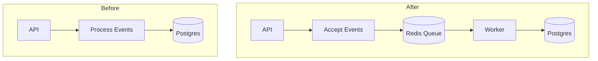

import { BlogHeader } from "@/components/blog/BlogHeader";
import { ProductUpdateSignup } from "@/components/productUpdateSignup";
import Link from "next/link";

<BlogHeader
  title="From Zero to Scale: Langfuse's Infrastructure Evolution"
  description="A deep dive into how we evolved Langfuse's infrastructure from a simple prototype to a scalable observability platform."
  authors={["steffenschmitz", "maxdeichmann"]}
/>

Langfuse, the open-source LLM observability platform, emerged from the Y Combinator Winter 2023 batch. After building many LLM applications ourselves and realizing that it is hard to go from demo to production, we worked closely with a few of our batchmates to quickly develop a v0 LLM observability platform.

Initially, we focused on getting a few core features right: SDKs were asynchronous, Langfuse was based on tracing, and all components were open source and easily self-hostable. The first version was written on NextJs, Vercel, and Postgres. Little did we know we would rapidly evolve from an experiment to processing tens of thousands of events per minute.

Our recent V3 release marks a significant milestone in ensuring Langfuse can scale for all of our users. We have piloted many of these changes on Langfuse Cloud already, and the v3 release now also makes them available to self-hosting users, such as online evaluations, async/queued ingestion, and cached prompts.

In this post, we will walk you through the scaling challenges we faced while building Langfuse and how our “hypothesis - experiment - feedback” loop helped us arrive at Langfuse v3. If you are interested in solving similar challenges with us - we are hiring in Berlin!

## Status Quo

Before embarking on this journey, this was our architecture. A single container and a Postgres database. It was incredibly simple to run and self-host, but it was also incredibly hard to scale.

import ArchitectureDiagramV2 from "@/components-mdx/architecture-diagram-v2.mdx";

  <ArchitectureDiagramV2 />

## Challenges

We faced a couple of core challenges that led us to rethink our architecture. These are the most important ones:

### Challenge 1: Building a Resilient High-Throughput Ingestion Pipeline

> Goal: Ingestion API needs to accept high volumes of events and maintain consistently low latency under unpredictable load patterns.

The core of Langfuse's observability platform relies on efficient event data collection through our SDKs and API. While we designed these SDKs to minimize performance impact on our users' applications, the ingestion server-components faced significant challenges as we scaled:

Initial Pain Point: By summer 2023, spiky traffic patterns led to response times on our ingestion API spiking up to 50 seconds.

Critical Requirement: Our ingestion API needs to maintain consistently low latency to ensure smooth event flushing from the SKDs. Otherwise, our user’s applications might be impacted negatively.

The challenge wasn't just about handling high volumes of data—it was about maintaining reliability under unpredictable load patterns while ensuring minimal impact on our users' application performance.
This technical hurdle became our first major scaling challenge, pushing us to rethink our ingestion architecture to handle traffic spikes more gracefully.

### Challenge 2: Optimizing Prompt Delivery for Production Workloads

> Goal: Prompts API needs to be highly available and performant at all times.

A critical feature of Langfuse is our Prompt Management System, allowing users to define prompts through our UI and retrieve them via SDKs - doing away with the need to re-deploy your application to change a prompt.

While tracing is asynchronous and non-blocking, prompts are in the critical path of LLM applications. This made a seemingly straightforward functionality a complex performance challenge: During high ingestion periods, our p95 latency for prompt retrieval spiked to 7 seconds. The situation demanded an architectural solution that could maintain consistent low-latency performance, even under heavy system load from other operations.

### Challenge 3: Fast analytical reads (Dashboards, Table Filters)

> Goal: Dashboards and table filters need to work for large-scale observability data.

Our initial database choice of Postgres served us well in the early days, but as our largest customers began pushing more observability data through the system, we hit significant performance bottlenecks. Despite optimizing queries, our dashboards and table filtering operations became painfully slow for enterprise users. With LLM analytical data often consisting of large blobs, row-oriented storage was too heavy on disk when scanning through millions of rows. The irony wasn't lost on us - the very customers who needed our analytics capabilities the most were experiencing the worst performance. This growing pain signaled that our initial architecture, while perfect for rapid development, needed a fundamental rethink to handle enterprise-scale analytical workloads.

### Challenge 4: Easy to self-host

> Goal: Langfuse must be easy to self-host, but also scalable with little operational effort.

Building Langfuse as an open-source project was a deliberate choice. Our vision was simple: anyone should be able to explore Langfuse with a simple `docker-compose up`, but at the same time Langfuse must be able to serve enterprise-scale deployments with hundreds of users and thousands of LLM interactions per minute. This approach reflects our own preferences as developers - we value solutions that are easy to evaluate and deploy.

However, building a production-grade open-source observability platform comes with distinct challenges:

- Universal Deployability: Our infrastructure needs to work seamlessly across diverse environments, from a developer's laptop to deployments on different hyperscalers
- Open-Source Dependencies: We're committed to using only open-source components to ensure unrestricted self-hosting capabilities
- Zero-Touch Operations: Enterprise users require automated maintenance and upgrade paths - manual intervention is too error prone and not scalable.

This balance between simplicity and enterprise-readiness has shaped our architectural decisions, pushing us to create a solution that's both accessible and scalable.

## New building blocks

To address these challenges, we added multiple building blocks to our stack. In this post, we take you on our journey of how we iterated on our stack.

### Building Block 1: Asynchronous Processing of ingestion data

#### From sync to async processing

We started out with an ingestion pipeline which receives a number of events per API call, iterates over them, and processes each event individually. During processing, we first search for a historic row with the same ID, tokenise prompts and completions of LLM calls, calculate cost, and upsert the event in our database.
When looking into our telemetry, we realized we had two major bottlenecks: Postgres IOPS exhaustion and CPU consumption when tokenising large strings. Both of these are a risk to the uptime and latency of our application. In the worst cases, we lost events and returned HTTP 500 errors on our ingestion API.

When considering a solution, we realized that simply increasing the number of containers would not be effective. We often experience significant spikes in ingested traffic when individual users run large-scale batch jobs. As a result, API traffic from our users is highly unpredictable, and container instances cannot scale quickly enough to manage these spikes. We ultimately decided to route all our ingestion traffic through a message queue in Redis. Unlike Kafka, Redis is easily self-hostable and can scale to meet our requirements. Another Langfuse container will then consume this data asynchronously and apply rate limiting to reduce the load on our database and the CPU usage of the container. With this change, we created a lightweight ingestion endpoint that only checks for authentication and body formats. The other container will handle the more intensive tasks of tokenizing and writing to the database.

#### Write to Clickhouse

We only did the steps above because we needed to improve our API performance short term. However, the job was not finished yet. Even if the worker container is doing all the processing asynchronously, we still needed many IOPS to operate the logic of our ingestion pipeline. Self-hosting users reached out to us about this issue as well. At the same time, we had the challenge of improving the API latencies of our read queries. We eventually decided to migrate our tracing data from Postgres to Clickhouse. Clickhouse is an OLAP database, which is used by many new starters in the observability space, has an Apache License, and we observed outstanding performance in our Proof of Concepts. Its column-oriented storage layout was a better fit for the analytical queries that we expected, while still performing well for single-row lookups with large binary columns. Yet, adopting it in production was not easy at all.

Our SDKs are designed to send updates to our backend for a given object ID. Single row reads and updates in Postgres are fast and easy, while every row update in ClickHouse is an immensely expensive operation. We transition our updates into new inserts and use ClickHouse’s ‘’’ReplacingMergeTree’’’ table engine to eventually deduplicate rows in the background.
This implies that we always need to get the latest state of a row, apply the update, and write it back to Clickhouse.

We analyzed our traffic and realized that 90% of all updates arrive in our database within 10 seconds. This means that we had to watch out for concurrency and data consistency. Unfortunately, we were not able to write the system by reading from Clickhouse and then applying the update on an old record found in Clickhouse. Clickhouse is only read-after-write consistent when using the “select_sequential_consistency” setting which is prohibitively expensive. This setting ensures that all data is synced across Clickhouse nodes before returning a result to a query. Hence, there would be no guarantee to read existing data from Clickhouse. Also, two events could be processed concurrently for the same ID. It could happen, that we would lose data as we could process a second event without reading the original create event.
To mitigate this, we decided to cache all our ingestion events, as soon as they were acknowledged from our ingestion API in Redis. We would then send an event to our worker container, which would get all events for an object ID and reliably create the new Clickhouse row. We went ahead and coded up the new ingestion pipeline and started processing events in parallel to our Postgres ingestion pipeline.
We quickly ran into network capacity limitations on AWS ElastiCache even on a very large instance. Another disadvantage of Redis is the in-memory architecture and ephemeral nature of things being written into it. Introducing S3 as a persistent storage for events allowed us to only keep references in Redis. Other benefits include the ability to replay events in case of errors and - to our surprise - significantly reducing the CPU usage of our web containers as serializing events for Redis was an expensive operation. Kafka may have been a better fit for the ingestion case, but with Redis’s caching capabilities and S3 for our new multi-modal features, we preferred to keep fewer components.
With these changes, we managed to consistently insert data into Clickhouse and at scale.

### Building Block 2: Caching + Decoupled Infrastructure

While solving the data ingestion problem into Clickhouse, we still needed to improve the situation for our users using our prompt management feature.
When analysing our observability data, we realized that the prompts API had issues for multiple reasons: high ingestion traffic could exhaust the database IOPS or CPU of our containers.

First, we tried to avoid round-trips to our Postgres database to retrieve prompts. Here, we really observed the power of Redis as a cache and the impact it can have. As we know when prompts are updated, we can efficiently invalidate the cache without risking stale results.

Second, we separate the latency and availability sensitive infrastructure (prompts, but also authentication) into a dedicated deployment. Using LoadBalancer rules and dedicated TargetGroups for specific endpoints in AWS ECS allowed us to separate the ingestion traffic from the remainder of the application. An amazing side-effect was also the added observability that dedicated routes allow for. This configuration is not part of our self-hoster stack, but can be emulated across all major cloud vendors and Kubernetes if required.

With these two changes, we managed to bring the p99 of our prompts API from 7 seconds to 100 ms.

Third, we updated our SDKs to use zero-latency prompt fetching. If a version of a prompt was previously retrieved from the API, we use that version for the next LLM call and perform the call to Langfuse’s API in the background. This way, we removed prompts from the critical path of our user’s applications.

### Building Block 3: OLAP Database + Query Optimization

The last piece for the transition towards Langfuse V3 was to optimize read queries and arrive at consistently low latencies for all our users. As we started working on this, we were already writing data to Clickhouse in parallel to Postgres. This helped us to be able to experiment with the way we store and retrieve data from Clickhouse. There were multiple stages at which we thought that we got it right, but then more data arrived.

Initially, we set out that all calls for data within the past week, including single-record lookups should complete within 1s for the p99 and for more than a week of data, we considered 4s to be acceptable. In addition to our regular tracing in Datadog, we built a framework to emit the Postgres and ClickHouse read at the same time and measure their latency differences. Seeing the consistent and improved results gave us confidence that we were on the right track.

The first thing we had to get right were the table schemas, partitioning, and ordering keys of our data. Changing those required a full table rewrite, i.e. every update could take days. Conversations with other ClickHouse users and the ClickHouse docs made us decide early on that the projectId and date would be the first two columns of our ordering key. We expanded that to include the item id with skip indexes on columns that were frequently used for filtering. Other than Postgres, ClickHouse does not allow you to keep B-Tree indexes for efficient row lookups. One must always try to search through the data based on the disk layout.

Joins were the second thing that we had to optimize. Our traces to observation joins took multiple seconds and frequently exhausted all available memory on our ClickHouse nodes. We learned that ClickHouse struggles to effectively filter the right side of a join. We dropped joins wherever possible, and manually pushed down filters as far as possible through the use of Common Table Expressions (CTEs). In some cases, we added additional information like timestamps to our frontend API calls to make better use of the ordering key for single trace and observation lookups.

Those were the challenges that we anticipated - from here on we go into some of the idiosyncracies of ClickHouse. First, we had to find a way to deduplicate data within our ReplacingMergeTree. While ClickHouse eventually deduplicates rows, we observed many duplicates within the first minutes and hours after insertion which made our metrics and dashboards for shorter timeframes near unusable. Using the FINAL keyword helped, but led to other surprises - more resources consumed during queries and not using any of our skip index optimizations. We relied on a mix of deduplication by write timestamp (order by with limit by), FINAL keywords, and distinct aggregations to arrive at reliable metrics, tables, and views.

Spending a lot of research on schema design had a big payoff in our ClickHouse migration. We only needed minor adjustments throughout the whole process and got away with a single data import from Postgres into ClickHouse. For the remaining optimizations, iterating quickly paid off as we could never predict what would work for our specific use case. Great observability and a solid experimentation framework provided quick feedback to iterate and form a new hypothesis on. The old adage repeats - spend time thinking about things that are hard to change, but move quickly if you can.

Resulting improvements in performance across frontend and backend API calls which was previously driven by outliers in large projects:

<Frame border>
  
</Frame>

## Conclusion

All in all, we are extremely happy with the Langfuse v3 release. Positive feedback from cloud users, high adoption among self-hosters in the first week, and a small list of issues prove that we took many right turns throughout the project. Testing new ideas quickly and being guided by a strong hypothesis with clear data allowed us to make relentless progress.

Nevertheless, we often got timeliness wrong throughout the whole project. For future projects, we want to limit scope to at most a month and introduce more milestones along the way. In addition, we had key personnel being distracted with ongoing incidents and bug fixes. Sharing the on-call load and making room for undistracted work is key to making progress on hard things.

Things that we will retain are the data driven culture, a simple way to run experiments on (subsets) of production data, and great observability across the full stack. Those help us to deliver the most bang of each hour spent and continue to delight our customers - self-hosted and cloud ones.

## Don't Miss Out

<Steps>

### Self-hosting docs

Host the new V3 release of Langfuse on your own infrastructure. Follow the [self-hosting docs](/self-hosting) to get started.

### We are hiring

<Frame className="max-w-80"></Frame>

We are hiring in Berlin! If you are interested in solving similar challenges with us - [apply here](/careers).

### GitHub

<Link href="https://github.com/langfuse/langfuse" target="_blank">
  
</Link>

⭐️ [Star us](https://github.com/langfuse/langfuse/) on GitHub & see _all_ of our releases!

### Channels

[Twitter](https://x.com/langfuse) and [LinkedIn](https://www.linkedin.com/company/langfuse/) will be our main channels for launching a new feature every day.

You can subscribe to our mailing list for daily updates:

<ProductUpdateSignup source="launch-week-2" className="my-2" />

### Chat with the community on Discord

Join the community of over 2,000 members on [Discord](/discord) for banter and to talk directly to the team.

</Steps>

## Learn More About Langfuse

import { FileCode, BookOpen, Video, Users, Joystick } from "lucide-react";

<Cards num={2}>
  <Card title="Docs" href="/docs" icon={<BookOpen />} arrow />
  <Card title="Quickstart" href="/docs/get-started" icon={<FileCode />} arrow />
  <Card title="Interactive Demo" href="/docs/demo" icon={<Joystick />} arrow />
  <Card title="About Us" href="/about" icon={<Users />} arrow />
</Cards>
