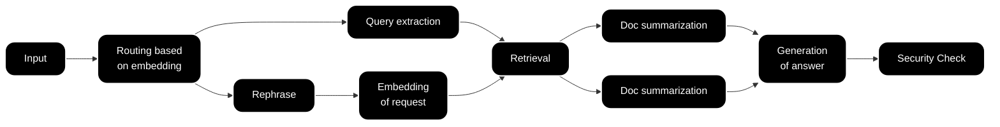
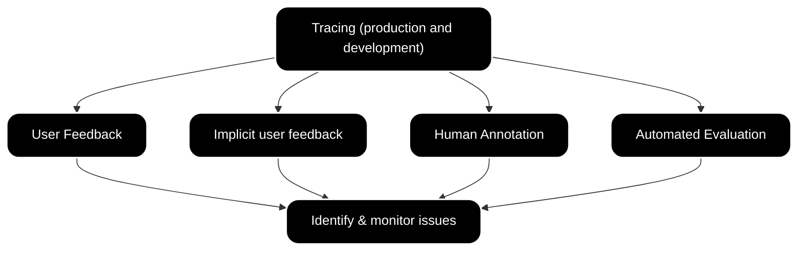

import { BlogHeader } from "@/components/blog/BlogHeader";

<BlogHeader
  title="LLM Evaluation 101: Best Practices, Challenges & Proven Techniques"
  description="Explore proven strategies for LLM evaluation — from offline and online benchmarking – this post briefs you on the state of the art."
  image="/images/blog/2025-03-04-llm-evaluation/blog-post-llm-evaluation.png"
  authors={["jannikmaierhoefer"]}
/>

Evaluating large language models can feel like trying to untangle a giant ball of yarn—there’s a lot going on, and it’s often not obvious which thread to pull first. From wrangling unpredictable user inputs to picking the right metrics, the process can be overwhelming. But don’t panic! In this post, we’ll walk through some tried-and-true best practices, common pitfalls, and handy tips to help you benchmark your LLM’s performance. Whether you’re just starting out or looking for a quick refresher, these guidelines will keep your evaluation strategy on solid ground.

## Evaluation Challenges

When it comes to LLMs, "evaluation" is more than just a single metric or one-time test. Their outputs can be astonishingly diverse—sometimes correct, sometimes creative, and sometimes surprisingly off-base.

One major hurdle is **defining clear evaluation goals**. Traditional software metrics (like error rates) may not translate well when your model might encounter any question under the sun. You’ll want to pin down what “good” looks like—whether it’s accuracy, helpfulness, or creativity—before you even begin.

Because LLMs generate text rather than just classifying it, **subjective interpretation** creeps into the equation. Deciding how to measure factors like “clarity” or “coherence” can be tricky without well-defined rubrics or specialized metrics.

And then there’s the **operational side** of evaluation:

**Cost and Latency:** Testing at scale (especially with human annotators) can run up costs quickly. Automated approaches may be faster, but they’re not always reliable enough on their own.  
**Trust in Automated Tools:** Automated evaluators (including ones powered by smaller models) can drift or fail in unexpected ways. Keeping them aligned with real human perspectives takes constant upkeep.  
**Cross-Team Collaboration:** Getting engineers, data scientists, product managers, and domain experts to work in sync is crucial. Without a clear process or shared vocabulary, you risk chaotic handoffs and scattered efforts.

### Example: Simplified Customer Support RAG Chat

When you’re dealing with a workflow that spans multiple steps—like the above RAG pipeline—each stage needs its own evaluation criteria. Otherwise, you’ll struggle to pinpoint exactly where things go wrong (or right).

## Data Model for Evaluation – Traces

To make sense of all these moving parts, it helps to have an organized way to record exactly what’s happening at each step. That’s where **traces** come in. Traces capture detailed logs of user interactions, intermediate steps, and final outputs, giving you a treasure trove of data for diagnosing issues and measuring performance over time.

{" "}

<Frame className="max-w-sm">
  
</Frame>

_Example of a trace in Langfuse](https://cloud.langfuse.com/project/cloramnkj0002jz088vzn1ja4/traces/8ed12d68-353f-464f-bc62-720984c3b6a0?display=graph)_

**Pinpoint Failures:** By following a trace from input to output, you can spot where the model (or a sub-component) stumbles.  
**Quantify Performance:** Compare model outputs against ground truths or reference answers.  
**Accelerate Iteration:** With detailed traces, it’s easy to see which inputs cause the biggest problems and quickly focus your tuning efforts there.

## Online vs. Offline Evaluation

Effective LLM evaluation usually blends **offline (development/test)** and **online (production)** methods, each catching different types of errors and insights.

**Offline Evaluation:**  
 You’ll typically run your model on curated datasets—maybe as part of your CI pipeline or local dev tests (Read more on datasets [here](/docs/datasets/overview)). Smaller datasets are great for quick, “gut check” experiments; larger ones provide a broader sweep of performance indicators. The main challenge is making sure these test sets stay relevant and actually resemble what you’ll see in the wild.

The image below shows an example of a dataset in Langfuse with inputs and expected outputs:

<Frame className="my-10" fullWidth>
  
</Frame>

**Online Evaluation:**  
 Running evaluations in a live environment lets you spot issues like model drift (where performance gradually degrades over time) or unexpected user queries you never anticipated. But gathering feedback in production can be tricky; you need solid data capture processes and a clear plan for feeding these insights back into your development cycle.

The image below shows an example of a live LLM-as-a-Judge Evaluator in Langfuse that scores new traces for toxicity:

<Frame className="my-10" fullWidth>
  
</Frame>

A balanced approach—where you do regular offline benchmarking and maintain some form of continuous production monitoring—tends to yield the most robust results.

## Common Evaluation Techniques

No single method will capture everything about your model’s behavior, so it often pays to mix and match.

**User Feedback:**  
 Direct feedback—like user ratings or open-ended comments—offers the clearest signal of whether your LLM is hitting the mark. However, collecting and organizing these insights at scale can be expensive and time-consuming.

Example of user feedback captured in ChatGPT:

{" "}

<Frame className="frame-lg" fullWidth>
  
</Frame>

**Implicit User Feedback (Human-in-the-Loop):**  
 Instead of waiting for explicit ratings, you can infer quality from user behavior: Did they ask the same question again? Did they click on recommended links? Though it’s usually easier to gather, the signal can be noisy and needs careful interpretation.

**Human Annotation:**  
 Having experts (or crowdworkers) label or grade outputs can provide deep insights, especially for complex tasks. The downside is cost and time: human annotation doesn’t scale easily.

Example of a human annotation workflow in Langfuse:

{" "}

<Frame className="my-10" fullWidth>
  
</Frame>

**Automated Evaluation:**  
 Using metrics like precision, recall, F1-score, or specialized generative metrics can give a quick, numerical snapshot of performance. Tools like OpenAI Evals, LangChain Evals, and RAGAS fall in this bucket. These are fast and repeatable but must be validated against human judgment to avoid misleading conclusions.

Example of different automated evaluation scores over time in Langfuse:

{" "}

<Frame className="max-w-sm">
  
</Frame>

Traces are the underlying thread across all these methods—by systematically logging interactions, you create a structured record that each evaluation technique can draw from.

## Automated Evaluation Techniques

For certain applications—like extraction and classification tasks—**precision, recall, and F-score** offer clear, quantifiable measures. But not all tasks are that straightforward, especially when an LLM is expected to generate paragraphs of text or whole chat conversations.

**LLM-as-a-Judge Approaches**:  
You can enlist another machine learning model—or even a specialized LLM-based evaluator (sometimes called “model based evals”)—to score outputs. These can be flexible, but there’s always the risk of propagating the same biases or blind spots. Calibrating them against human-annotated samples helps. Find out more on using LLM-as-a-Judge evals [here](/docs/scores/model-based-evals).

**Non-model-based Approaches**:  
In some cases, simpler rule-based checks (like regex patterns) can be surprisingly effective. They’re cheap and transparent but won’t scale to more nuanced tasks.

Ultimately, common toolkits like built in LLM-as-a-Judge evals or external libraries like [OpenAI Evals](https://github.com/openai/evals) and [RAGAS](https://docs.ragas.io/en/stable/) help streamline the setup for automated checks. Still, every application has its own quirks. Tailored evaluators or custom heuristics often deliver the best insights if you invest the time to build them correctly.

## Application-Specific Challenges

What makes LLM evaluation both fascinating and challenging is how different each use case can be:

**Retrieval-Augmented Generation (RAG):**  
 Because you’re evaluating both the retrieval step and the generative step, it’s helpful to measure them separately. For example, you might track relevance and precision for document retrieval, then apply generative metrics (like RAGAS) to the summarized output. (Guide on using RAGAS [here](/guides/cookbook/evaluation_of_rag_with_ragas))

**Agent-Based LLM Applications:**  
 Here, the model isn’t just producing text—it’s also making decisions or taking actions based on user inputs. Evaluating such agents usually involves simulating interactive conversations and carefully checking each intermediate decision. Human-in-the-loop feedback can be especially helpful to confirm the agent’s logic or to flag any odd behavior.

**Voice Agent Evaluation:**  
 Voice-based applications bring unique challenges, as they combine speech recognition, synthesis, and interactive dialogue. Evaluating these agents often requires assessing both the conversational dynamics and the audio processing performance. For a comprehensive overview of best practices and challenges in this area, see our dedicated guide: [Evaluating and Monitoring Voice AI Agents](/blog/2025-01-22-evaluating-voice-ai-agents).

## Getting Started with LLM Evaluation

If you’re just dipping your toes into LLM evaluation—or need a refresher—here’s a straightforward way to kick off:

<Steps>

### Collect Data

Use traces or structured logs from real interactions or test runs. This is your source of truth.

### Experiment with Different Methods

Don’t rely on just one technique. Try human annotation, automated metrics, user feedback—even pairwise comparisons if that fits your use case.

### Set Baselines

Establish performance benchmarks (even if they’re rough) so you can see progress or detect regressions over time.

### Pick Your Environment

Decide whether to run initial tests offline for quick iteration or go straight to production for immediate, real-world feedback.

### Close the Loop

Feed learnings from production back into development. In other words, if you spot new failure modes in the wild, incorporate them into your offline test sets.

</Steps>

For more in-depth guidance on setting up your evaluation workflows with Langfuse, check out the [evaluation docs](https://langfuse.com/docs/scores/overview). It’s packed with best practices and step-by-step instructions for capturing traces, running tests, and refining your pipeline.

## Final Thoughts

Evaluating LLMs is never a one-and-done task. As your model and user base evolve, your evaluation strategies need to keep pace. By combining offline benchmarks with real-time insights, leveraging traces, and staying open to new techniques, you’ll be well on your way to building more reliable, impactful LLM applications.
