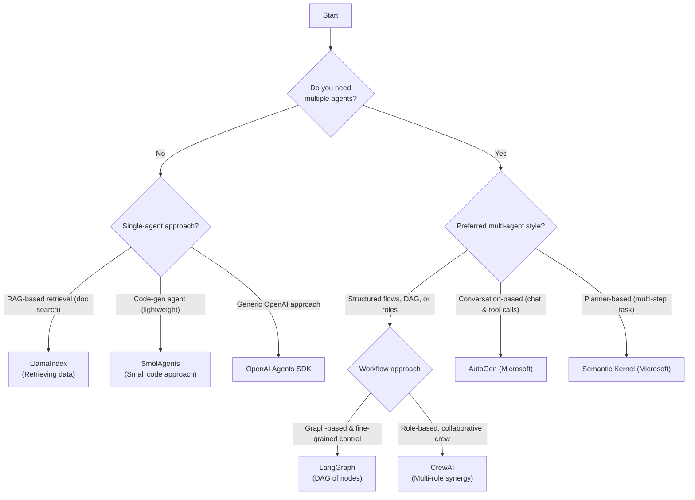

import { BlogHeader } from "@/components/blog/BlogHeader";

<BlogHeader
  title="Open-Source AI Agent Frameworks: Which One Is Right for You?"
  description="Explore the leading open-source AI agent frameworks—LangGraph, OpenAI Agents SDK, Smolagents, CrewAI, AutoGen, Semantic Kernel, LlamaIndex agents, Strands Agents, and Pydantic AI agents. Compare features, learn when to use each, and see how to track agent behavior with Langfuse"
  date="March 19, 2025"
  authors={["jannikmaierhoefer"]}
/>

Building AI agents used to be a patchwork of scripts, prompt engineering, and trial-and-error. Today, there is a growing landscape of open-source frameworks designed to streamline the process of creating agents that reason, plan, and execute tasks autonomously. This post offers an in-depth look at some of the leading open-source AI agent frameworks out there: **LangGraph, the OpenAI Agents SDK, Smolagents, CrewAI, AutoGen, Semantic Kernel, LlamaIndex agents, Strands Agents, and Pydantic AI agents**. By the time you finish reading, you should have a clearer view of each framework's sweet spot, how they differ, and where they excel in real-world development.

One of the biggest challenges in agent development is striking the right balance between giving the AI enough autonomy to handle tasks dynamically and maintaining enough structure for reliability. Each framework has its own philosophy, from explicit graph-based workflows to lightweight code-driven agents. We'll walk through their core ideas, trace how they might fit into your workflow, and examine how you can integrate them with monitoring solutions like Langfuse ([GitHub](https://github.com/langfuse/langfuse)) to evaluate and debug them to make sure they perform in production.

## 🦜 LangGraph

[LangGraph](https://github.com/langchain-ai/langgraph) extends the well-known [LangChain](https://github.com/langchain-ai/langchain) library into a graph-based architecture that treats agent steps like nodes in a directed acyclic graph. Each node handles a prompt or sub-task, and edges control data flow and transitions. This is helpful for complex, multi-step tasks where you need precise control over branching and error handling. LangGraph's DAG philosophy makes it easier to visualize or debug how decisions flow from one step to another, and you still inherit a ton of useful tooling and integrations from LangChain.

<CloudflareVideo videoId="dbe2ea8e8d64f27126a3734fa51cd0e7" gifStyle />
_[Example trace in Langfuse](https://cloud.langfuse.com/project/cloramnkj0002jz088vzn1ja4/traces/a8b0cc9e-da3b-485f-a642-35431a6f9289)_

[How to trace LangGraph agents with Langfuse →](/guides/cookbook/integration_langgraph)

Developers who prefer to model AI tasks in stateful workflows often gravitate toward LangGraph. If your application demands robust task decomposition, parallel branching, or the ability to inject custom logic at specific stages, you might find LangGraph's explicit approach a good fit.

## OpenAI Agents SDK

The [OpenAI Agents SDK](https://github.com/openai/openai-agents-python) is the latest entrant in the field. It packages OpenAI's capabilities into a more structured toolset for building agents that can reason, plan, and call external APIs or functions. By providing a specialized agent runtime and a straightforward API for assigning roles, tools, and triggers, OpenAI aims to simplify multi-step or multi-agent orchestration. While it's still evolving, developers appreciate the familiar style of prompts and the native integration with OpenAI's model endpoints.

<CloudflareVideo videoId="1b048205cbf89ad4f14adf6248e970f7" gifStyle />
_[Example trace in Langfuse](https://cloud.langfuse.com/project/cloramnkj0002jz088vzn1ja4/traces/019593c74429a6d0489e9259703a1148?timestamp=2025-03-14T08%3A31%3A04.745Z&observation=e83609282c443b0d)_

[How to trace the OpenAI Agents SDK with Langfuse →](/integrations/frameworks/openai-agents)

If you are already deep into OpenAI's stack and want an officially supported solution to spin up agents that utilize GPT-4o or GPT-o3, the OpenAI Agents SDK might be your first stop.

## 🤗 Smolagents

Hugging Face's [smolagents](https://github.com/huggingface/smolagents) takes a radically simple, code-centric approach. Instead of juggling complex multi-step prompts or advanced orchestration, smolagents sets up a minimal loop where the agent writes and executes code to achieve a goal. It's ideal for scenarios where you want a small, self-contained agent that can call Python libraries or run quick computations without building an entire DAG or multi-agent conversation flow. That minimalism is the chief selling point: you can define a few lines of configuration and let the model figure out how to call your chosen tools or libraries.

<Frame fullWidth>
  
</Frame>

_[Example trace in Langfuse](https://cloud.langfuse.com/project/cloramnkj0002jz088vzn1ja4/traces/ce5160f9bfd5a6cd63b07d2bfcec6f54?timestamp=2025-02-11T09%3A25%3A45.163Z&display=details)_

[How to trace smolagents with Langfuse →](/integrations/frameworks/smolagents)

If you value fast setup and want to watch your AI generate Python code on the fly, smolagents provides a neat solution. It handles the "ReAct" style prompting behind the scenes, so you can focus on what the agent should do rather than how it strings its reasoning steps together.

## CrewAI

[CrewAI](https://github.com/crewAIInc/crewAI) is all about role-based collaboration among multiple agents. Imagine giving each agent a distinct skillset or personality, then letting them cooperate (or even debate) to solve a problem. This framework offers a higher-level abstraction called a "Crew," which is basically a container for multiple agents that each has a role or function. The Crew coordinates workflows, allowing these agents to share context and build upon one another's contributions. I like CrewAI as it is easy to configure while still letting you attach advanced memory and error-handling logic.

<Frame fullWidth>
  
</Frame>
_[Example trace in Langfuse](https://cloud.langfuse.com/project/cloramnkj0002jz088vzn1ja4/traces/3b485ea0d723bab3e5e53e72c6b10a71?timestamp=2025-02-24T10%3A34%3A30.423Z&observation=0c53ff94ec9c3da9)_

[How to trace CrewAI agents with Langfuse →](/integrations/frameworks/crewai)

If your use case calls for a multi-agent approach—like a "Planner" agent delegating tasks to a "Researcher" and "Writer" agent—CrewAI makes that easy. The built-in memory modules and fluid user experience have led to growing adoption where collaboration and parallelization of tasks are important.

## AutoGen

[AutoGen](https://github.com/microsoft/autogen), born out of Microsoft Research, frames everything as an asynchronous conversation among specialized agents. Each agent can be a ChatGPT-style assistant or a tool executor, and you orchestrate how they pass messages back and forth. This asynchronous approach reduces blocking, making it well-suited for longer tasks or scenarios where an agent needs to wait on external events. Developers who like the idea of "multiple LLMs in conversation" may find AutoGen's event-driven approach nice, especially for dynamic dialogues that need real-time concurrency or frequent role switching.

<Frame fullWidth>
  
</Frame>
_[Example trace in Langfuse](https://cloud.langfuse.com/project/cloramnkj0002jz088vzn1ja4/traces/df850ab499107d4348584cf5933baabd?timestamp=2025-02-04T16%3A55%3A51.660Z&observation=286c648acb0105c2)_

[How to trace AutoGen agents with Langfuse →](/integrations/frameworks/autogen)

AutoGen is good if you're building an agent that heavily relies on multi-turn conversations and real-time tool invocation. It supports free-form chat among many agents and is backed by a research-driven community that consistently introduces new conversation patterns.

## Semantic Kernel

[Semantic Kernel](https://github.com/microsoft/semantic-kernel) is Microsoft's .NET-first approach to orchestrating AI "skills" and combining them into full-fledged plans or workflows. It supports multiple programming languages (C#, Python, Java) and focuses on enterprise readiness, such as security, compliance, and integration with Azure services. Instead of limiting you to a single orchestrator, you can create a range of "skills," some powered by AI, others by pure code, and combine them. This design makes it popular among teams that want to embed AI into existing business processes without a complete rewrite of their tech stack.

<Frame fullWidth>
  
</Frame>
_[Example trace in Langfuse](https://cloud.langfuse.com/project/cloramnkj0002jz088vzn1ja4/traces/14c7a9f1cc0d7ff16ac1a057a3d45be9?timestamp=2025-02-04T18%3A00%3A53.475Z&observation=cb3f0fb8a2369414)_

[How to trace Semantic Kernel with Langfuse →](/integrations/frameworks/semantic-kernel)

If you want a more formal approach that merges AI with non-AI services, Semantic Kernel is a strong bet. It has a structured "Planner" abstraction that can handle multi-step tasks, making it well-suited for mission-critical enterprise apps.

## 🦙 LlamaIndex Agents

[LlamaIndex](https://github.com/run-llama/llama_index) started as a retrieval-augmented generation solution for powering chatbots with large document sets. Over time, it added agent-like capabilities to chain queries and incorporate external knowledge sources. LlamaIndex agents are good when your primary need is to retrieve data from local or external stores and fuse that information into coherent answers or actions. The tooling around indexing data, chunking text, and bridging your LLM with a knowledge base is top-notch, and that data-centric approach extends into the agent layer.

<Frame fullWidth>
  
</Frame>
_[Example trace in Langfuse](https://cloud.langfuse.com/project/cloramnkj0002jz088vzn1ja4/traces/f2bb3e13-aafb-41a0-a852-efd20f12a4f4?timestamp=2025-02-13T16%3A03%3A09.705Z)_

[How to trace LlamaIndex Agents with Langfuse →](/integrations/frameworks/llamaindex-workflows)

If you're solving data-heavy tasks—like question answering on private documents, summarizing large repositories, or building a specialized search agent—LlamaIndex agents could be exactly what you need. The development experience feels intuitive if you've already used LlamaIndex for retrieval, and it pairs nicely with other frameworks that focus on orchestration.

## Strands Agents

[Strands Agents SDK](https://strandsagents.com) is AWS's toolkit for building AI agents that can tap into **Amazon Bedrock** and other AWS services. It puts a strong focus on production readiness by shipping first-class OpenTelemetry tracing and native integrations with Bedrock models. That means you get end-to-end observability out of the box while still enjoying a clean, declarative API for defining agent behavior.

<Frame fullWidth>
  
</Frame>

_[Example trace in Langfuse](https://cloud.langfuse.com/project/cloramnkj0002jz088vzn1ja4/traces/c9d6f01342ca664464b2e56f649d9da4?timestamp=2025-05-17T13%3A22%3A14.561Z&display=details)_

[How to trace Strands Agents with Langfuse →](/integrations/frameworks/strands-agents)

If you are already running on AWS or want tight coupling with Bedrock's model catalog, Strands Agents gives you a production-grade starting point that pairs nicely with Langfuse's observability pipeline.

## 🐍 Pydantic AI Agents

[Pydantic AI](https://pydantic-ai.readthedocs.io/en/latest/) brings Pydantic's famous **type safety** and ergonomic developer experience to agent development. You define your agent's inputs, tool signatures, and outputs as Python types, and the framework handles validation plus OpenTelemetry instrumentation under the hood. The result is FastAPI-style DX for GenAI applications.

<Frame fullWidth>
  
</Frame>

_[Example trace in Langfuse](https://cloud.langfuse.com/project/cloramnkj0002jz088vzn1ja4/traces/25f4bdeebaab60e6e1bee7e8469554bc?timestamp=2025-06-06T14%3A39%3A55.786Z&display=details)_

[How to trace Pydantic AI with Langfuse →](/integrations/frameworks/pydantic-ai)

If you're a Python developer who values explicit type contracts, tests, and quick feedback loops, Pydantic AI offers a lightweight yet powerful path to building production-ready agents with minimal boilerplate.

## Comparison Table

| **Framework**                                                                      | **Core Paradigm**                    | **Primary Strength**                         | **Best For**                                                                           |
| ---------------------------------------------------------------------------------- | ------------------------------------ | -------------------------------------------- | -------------------------------------------------------------------------------------- |
| **[LangGraph](https://www.langchain.com/langgraph)**                               | Graph-based workflow of prompts      | Explicit DAG control, branching, debugging   | Complex multi-step tasks with branching, advanced error handling                       |
| **[OpenAI Agents SDK](https://openai.github.io/openai-agents-python/)**            | High-level OpenAI toolchain          | Integrated tools such as web and file search | Teams relying on OpenAI's ecosystem who want official support & specialized features   |
| **[Smolagents](https://huggingface.co/docs/smolagents/en/index)**                  | Code-centric minimal agent loop      | Simple setup, direct code execution          | Quick automation tasks without heavy orchestration overhead                            |
| **[CrewAI](https://www.crewai.com/)**                                              | Multi-agent collaboration (crews)    | Parallel role-based workflows, memory        | Complex tasks requiring multiple specialists working together                          |
| **[AutoGen](https://microsoft.github.io/autogen/stable/)**                         | Asynchronous multi-agent chat        | Live conversations, event-driven             | Scenarios needing real-time concurrency, multiple LLM "voices" interacting             |
| **[Semantic Kernel](https://learn.microsoft.com/en-us/semantic-kernel/overview/)** | Skill-based, enterprise integrations | Multi-language, enterprise compliance        | Enterprise settings, .NET ecosystems, or large orgs needing robust skill orchestration |
| **[LlamaIndex Agents](https://www.llamaindex.ai/)**                                | RAG with integrated indexing         | Retrieval + agent synergy                    | Use-cases that revolve around extensive data lookup, retrieval, and knowledge fusion   |
| **[Strands Agents](https://strandsagents.com)**                                  | AWS-centric agent toolkit            | Native Bedrock & AWS integrations           | AWS-hosted or serverless agent applications needing deep Bedrock support              |
| **[Pydantic AI](https://pydantic-ai.readthedocs.io/en/latest/)**                 | Type-safe Python agent framework     | Strong type safety & FastAPI-style DX       | Python developers wanting structured, validated agent logic                          |

As you can see there are very different approaches to these agent frameworks. Graph-based solutions like LangGraph give you precise control, while conversation-based solutions like AutoGen give you natural, flexible dialogues. Role-based orchestration from CrewAI can tackle complex tasks through a "cast" of specialized agents, whereas Smolagents is ideal for minimal code-driven patterns. Semantic Kernel is positioned in the enterprise space, and LlamaIndex Agents shine for retrieval-centric applications. The OpenAI Agents SDK appeals to users already confident in the OpenAI stack. Strands Agents and Pydantic AI are tailored for AWS and Python environments.

## When to Use Each Framework

Rather than prescribing a specific tool, it's more important to focus on the high-level variables that should guide your decision:

- **Task Complexity and Workflow Structure:**  
  Determine whether your task is simple or requires complex, multi-step reasoning. Complex workflows may benefit from explicit orchestration (like a graph-based or skill-based approach), whereas simpler tasks might be well served by a lightweight, code-centric solution.

- **Collaboration and Multi-Agents:**  
  Check if your project needs multiple agents with distinct roles interacting in a coordinated way. Multi-agent collaboration might require an architecture that supports asynchronous conversations and role delegation.

- **Integrations:**  
  Consider the environments and systems your agents need to interact with. Some frameworks provide easier integration for tool calling, while others are designed for rapid prototyping and minimal setup.

- **Performance and Scalability**  
  Think about the performance demands of your application. High concurrency and real-time interactions may necessitate an event-driven architecture. Observability tools become crucial here, allowing you to trace agent behavior and optimize performance over time.

Below's a Mermaid flowchart outlining some of the key decision. However, please note that this is not an exhaustive list and framework abilities might overlap (e.g. OpenAI Agents SDK can be used for multi-agent workflows).

## Why Agent Tracing and Observability Matter

Agent frameworks involve a lot of moving parts. Each agent can call external APIs, retrieve data, or make decisions that branch into new sub-tasks. Keeping track of what happened, why it happened, and how it happened is vital, especially in production.

Observability tools like [Langfuse](/) let you capture, visualize, and analyze agent "traces" so you can see each prompt, response, and tool call in a structured timeline. This insight makes debugging far simpler and helps you refine prompts, measure performance, and ensure your AI behaves as expected.

If you'd like to learn more about evaluating AI agents, check out [this guide](/integrations/frameworks/openai-agents)
