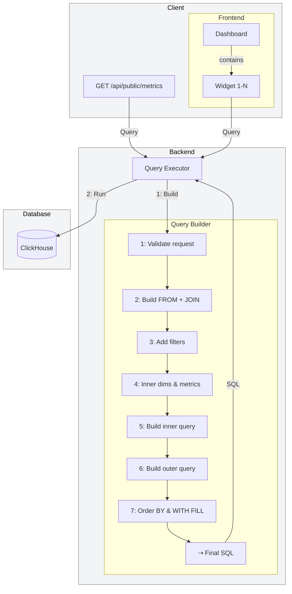

import { BlogHeader } from "@/components/blog/BlogHeader";

<BlogHeader
  title="How we Built Scalable & Customizable Dashboards"
  description="A technical deep dive into the core abstractions and architecture"
  authors={["steffenschmitz"]}
  image="/images/blog/2025-05-21-customizable-dashboards/og.png"
  date="May 21, 2025"
/>

On Day 3 of [Langfuse Launch Week 3](/blog/2025-05-19-launch-week-3), we introduce **customizable dashboards** ([docs](/docs/analytics/custom-dashboards.mdx)): a powerful way to visualize LLM usage directly within the Langfuse UI.
Whether you want to track latency trends, monitor user feedback, or correlate cost with performance, our new dashboards let you build the charts you need - right where you need them.
And for those who prefer working in their own analytics stack, we've made the same querying capabilities available via our API ([docs](/pages/docs/analytics/metrics-api.mdx)).

<div className="bg-card p-4 rounded w-full border my-3">

For context: quick demo of the finished product

<iframe
  width="100%"
  src="https://www.youtube-nocookie.com/embed/z6g9xmciaBE"
  title="Custom Dashboard Launch Video"
  frameBorder="0"
  allow="accelerometer; autoplay; clipboard-write; encrypted-media; gyroscope; picture-in-picture"
  className="aspect-video rounded border mt-3"
  allowFullScreen
></iframe>

</div>

In this post, I'll take you behind the scenes: from our product thinking to the technical implementation, testing, and rollout—and share the lessons we learned in building flexible, real-time insights into your LLM pipelines.

## Motivation

Customizable dashboards were among the [most requested](https://github.com/orgs/langfuse/discussions/1011) features within Langfuse.
Early on, we had the home screen dashboard that showed users metrics we believed to be relevant and accurate.
We expanded that over time based on feedback about the charts users wanted to see.
The dashboard grew quite long, and we found that charts were relevant but not necessarily to the same kind of users.
A product manager wants to understand which score specific traces receive, while a developer wants to see latencies, error rates, and costs.

We realized that we needed to provide dashboards that were adaptable to the needs of different users and personas.
This involved the ability to create multiple dashboards, a variety of charts and insights, and a flexible query engine.
While exploring custom dashboards, we found that within our data model and constraints, this would become quite complex.

Therefore, we included custom dashboards as part of the Superday in our interview process and had many candidates design their version of the dashboard and share their thoughts.
That's how this became the most specced feature we have ever had at Langfuse.
Early in March, I set out to finally implement it and now, I'll take you on the journey showing how I completed the feature that we are launching today.

## Architecture: Building for Flexibility, Performance, Maintainability

Dashboards are built on top of 3 major components:

1. Database/metrics Abstraction
2. Query Builder
3. Dashboard Builder

Let's dive into each of these and show how we can use them to build the dashboards.

<div className="bg-card p-4 rounded w-full border max-w-lg mx-auto mt-10 mb-3">

**Architecture diagram**



</div>

### Database Abstraction

Before we could start the dashboard, we had to decide how to abstract our data model.
Directly exposing our database felt like the wrong move as this would lock us from updating the data model and may not fit the mental model of our customers.
Therefore, we decided to build custom dashboards around the [tracing data model](/docs/tracing-data-model.mdx).

For this purpose, we created a virtual data model that contains the full definition of what we expose.
It is used to fill the frontend, including units and documentation, and also used for validations on the backend.
Below, you can find an excerpt of the Trace definition.

```ts filename="Virtual Data Model"
export const traceView: ViewDeclarationType = {
  name: "traces",
  description:
    "Traces represent a group of observations and typically represent a single request or operation.",
  dimensions: {
    name: {
      sql: "name",
      type: "string",
      // include documentation
      description:
        "Name assigned to the trace (often the endpoint or operation).",
    },
    userId: {
      sql: "user_id",
      alias: "userId",
      type: "string",
      description: "Identifier of the user triggering the trace.",
    },
  },
  measures: {
    count: {
      sql: "count(*)", // measures can be columns or expressions
      alias: "count",
      type: "integer",
      description: "Total number of traces.",
      unit: "traces", // units used for charts and documentation
    },
    latency: {
      sql: "date_diff('millisecond', min(observations.start_time), max(observations.end_time))",
      alias: "latency",
      type: "integer",
      relationTable: "observations", // indicates that join is needed
      description:
        "Elapsed time between the first and last observation inside the trace.",
      unit: "millisecond",
    },
  },
  tableRelations: {
    observations: {
      name: "observations",
      joinConditionSql:
        "ON traces.id = observations.trace_id AND traces.project_id = observations.project_id",
      timeDimension: "start_time", // all tables are filtered by time for performance
    },
  },
  segments: [],
  timeDimension: "timestamp",
  baseCte: `traces FINAL`,
};
```

This declarative definition helps us to decouple the database from the request schema and enables us to quickly define new measures and dimensions.

### Query Builder

The hardest challenge around the dashboards, and something we knew right away, was **getting the query builder right**.
I think representing dashboard configurations within the database is a solved problem, as is having charts on the front end that render nicely, are responsive, and look good on different screens (s/o to all the great libraries for this).

We introduced ClickHouse back in November of last year, and this was the first unlock we needed to get this done (learn more about this change in our [v3 infra blog post](/blog/2024-12-langfuse-v3-infrastructure-evolution)).
The second challenge was figuring out the data model and how to generate queries reliably while staying flexible.

Within our data model, we often see that observations need to be aggregated at the trace, user, or session level.
In the typical OLAP cube model - common across visualization tools - those **multi-level aggregations** are not natively supported or are complex to define.

In addition, the dashboard must be **responsive**, and look good on all screens and devices.
We need a good data model to represent the individual charts and the overall dashboard, making a good trade-off between reuse and understandability of how things work.

Langfuse is developing rapidly, so we need to ensure that the created dashboards are **decoupled from the data model**.
This will prevent the charts from breaking as we modify the underlying data layer.

With those constraints in mind, the challenge was to accept a flexible, domain-specific JSON and translate it.
We thought about how we would query this endpoint.
The typical OLAP cube model came in really handy here, and we tried to stick to it as much as possible.
We settled onto the following input format:

```ts filename="Query Language"
{
  "view": string,
  "dimensions": [
    {
      "field": string
    }
  ],
  "metrics": [
    {
      "measure": string,
      "aggregation": string
    }
  ],
  "filters": [],
  "timeDimension": {
    "granularity": string
  },
  "fromTimestamp": string,
  "toTimestamp": string,
  "orderBy": []
}
```

After multiple iterations, we settled on a generic query pattern that pre-computes the necessary metrics at the entity level and then performs an additional set of aggregations on the entity to produce the final result.
Schematically the query looks like this:

```ts filename="Target Query Schema"
SELECT
  <...dimensions>,
  <...metrics.map(metric => `${metric.aggregation}(${metric.alias})`>
FROM (
   SELECT
     <baseCte>.project_id,
     <baseCte>.id
     <...dimensions.map(dimension => `any(${dimension.sql}) as ${dimension.alias}`>,
     <...metrics.map(metric => `${metric.sql} as ${metric.alias || metric.sql}`>
   FROM <baseCte>
   (...tableRelations.joinConditionSql)
   WHERE <...filters>
   GROUP BY <baseCte>.project_id, <baseCte>.id
)
GROUP BY <...dimensions>
ORDER BY <fields with directions>
```

Within our execution flow, we transformed the input in multiple steps to consistently arrive at the valid, final query.

To test this, we created our own query playground where you could input a JSON statement, and it would compile and execute a corresponding query.
Using these features, we started to replace the queries we used for our legacy/static home screen dashboard to verify that the query builder was sufficiently flexible and performant.

We saw that the queries would execute at scale with a lot of flexibility.
Given that we had already covered a lot of ground within those dashboards, seeing them run well and scale effectively even across longer time horizons gave us the confidence that we were on the right track and could proceed to build the remaining features.
At this point, the power of ClickHouse came in really handy because initially, we optimized for development speed, focusing on understanding what is going on within the query builder.

### Dashboard Builder

In addition, we had to decide whether we wanted to embed all the widgets within the dashboards, meaning that they only live and exist within the scope of a single dashboard, or if we wanted to allow some reuse between the widgets.
We found that the reuse option seemed very tempting, as it allows you to have a single source of truth on charts.
One expert could create a score and a corresponding score widget, which can then be reused across multiple dashboards.
I have seen in the past, with many companies, that the replication of things across dashboards either led to a lack of maintenance where items would get out of date or where a misunderstanding of the metric created multiple widgets with separate meaning.

```ts filename="Dashboard Data Model"
model Dashboard {
  id          String @id @default(cuid())
  name        String @map("name")
  description String @map("description")
  // { "widgets: [ {"x": 0, "y": 0, "id": "cuid", "type": "widget", "x_size": 6, "y_size": 6, "widgetId": "cuid"}, { ... } ] }
  definition  Json   @map("definition")
}

model DashboardWidget {
  id          String @id @default(cuid())
  name        String @map("name")
  description String @map("description")

  view        String @map("view")
  dimensions  Json   @map("dimensions")
  metrics     Json   @map("metrics")
  filters     Json   @map("filters")

  chartType   String @map("chart_type")
  chartConfig Json   @map("chart_config")
}
```

## Delivery & Launch

### Creating the Beta

Based on the specification we created above, we started vibe-coding an initial version of the feature.
Tools like Claude Code, Cursor, and Windsurf came in really handy in creating the necessary functionality.
We had a clear idea of what the final query should look like, what the test cases should cover, and how the interface should be designed.
In this situation, prompting works really well.

Overall, this is something we frequently use here at Langfuse (see [post on how we use LLMs](/blog/2025-04-24-how-we-use-llms-to-scale-langfuse)).
We understand the topic deeply, create a design or mental model of how it should work, and then have AI help us write the code for it.
This approach allows our team of eight people to scale to tens of thousands of users and billions of events.

Our next use of the AI agent was toward creating unit tests. Initially, we focused on creating valid queries.
Then, we wanted to create correct queries, meaning that we created a known set of test data and validated that they produce the correct results.
After that, we compared the results to our existing dashboard logic to reproduce our home dashboard functionality.
Finally, we went deep on SQL injection tests to ensure that any variety of user inputs are caught and not forwarded to the database if the input might be malicious.
This is fundamental for a feature like custom dashboards and a non-negotiable for us.
If you want to see the total size of the tests we created, which are much larger than the feature overall, head over to our [repo](https://github.com/langfuse/langfuse/blob/main/web/src/__tests__/queryBuilderDashboards.servertest.ts).

Once the backend powered our home dashboards, we began building the UI.
Here, we reused as many fully functional libraries as possible, giving a shout-out to the shadcn/charts, Recharts, and React Grid Layout.
We started with a basic prototype of how the widget builder can work - focusing on its responsiveness, rendering, and ensuring that a single component functions well and that users can understand the flow.
From there, we explored how to render multiple components and how to save the configurations within the database.

Even though I am historically more of a platform developer, it was easy enough to get into it and flesh this out end-to-end, and the reviews from the other maintainers helped me avoid the biggest mistakes.
We see AI as a significant enabler for engineers to be faster and build more things across a wider domain (embrace end-to-end product engineering).
However, we still recognize the need for human interaction and expert reviews to prevent creating excessive technical debt.
It is always important to understand what you are doing and what is happening in order to keep the management model intact.

### Test and Launch

With this early version in place, we decided to create a beta release and share custom dashboards with our users on the cloud product.
Why cloud only and not for self-hosted deployments, you may ask?
Because here we were confident that we could still change the data model, the interface, and how we store dashboards, in the worst case, manually.
We didn't want to risk users having to mutate data within Postgres and ClickHouse on their own if necessary.

After seeing the data from the first week and confirming that the behavior worked well, we also pushed the release for our open-source self-hosters so they could get started building their dashboards.

Right after the launch, feedback started coming in about which charts users wanted to see, what other functionality they wanted to use, and which parts of the dashboards were unintuitive.
Fortunately for us, performance was rarely a concern.
The focus was more on seeing more, visualizing more, and overall making the feature more complete.

Many of the features that users wished for are included in today's release. These include:

- Additional chart components.
- Resizable and movable widgets within the dashboard screen.
- The ability to rename components.
- More tooling support when creating a new widget to reduce friction.

In addition, we are launching **Langfuse-managed Dashboards**, which consists of topic-focused dashboards that we believe are useful given the data users have.
You can use them as they are and receive the latest updates with each new release, or clone them into your repository and modify them to your liking.

## Try it Today

We're excited to see what users will build using the new dashboarding functionality.
In the coming days and weeks, we will release additional chart types, with tables and pivot tables high on our list.
Please share any feedback you might have with us on [GitHub](https://github.com/orgs/langfuse/discussions/1011).
We will also continue adding improvements, more metrics, and more data to the dashboards.
One likely candidate for future development is the experiments feature.
This will allow you to observe your offline activities together with your online evaluations and cross-correlate the results.
Stay tuned.

## Don't Miss Out

<Steps>

### We are hiring

We are hiring in Berlin! If you are interested in solving similar challenges with us - [apply here](/careers).

<Frame className="max-w-80"></Frame>

### Channels

[Twitter](https://x.com/langfuse) and [LinkedIn](https://www.linkedin.com/company/langfuse/) will be our main channels for launching a new feature every day during [launch week](/blog/2025-05-19-launch-week-3).

### Chat with the community on Discord

Join the community of over 2,000 members on [Discord](/discord) for banter and to talk directly to the team.

</Steps>

## Learn More About Langfuse

import { FileCode, BookOpen, Video, Users, Joystick } from "lucide-react";

<Cards num={2}>
  <Card title="Docs" href="/docs" icon={<BookOpen />} arrow />
  <Card title="Quickstart" href="/docs/get-started" icon={<FileCode />} arrow />
  <Card title="Interactive Demo" href="/docs/demo" icon={<Joystick />} arrow />
  <Card title="About Us" href="/about" icon={<Users />} arrow />
</Cards>
