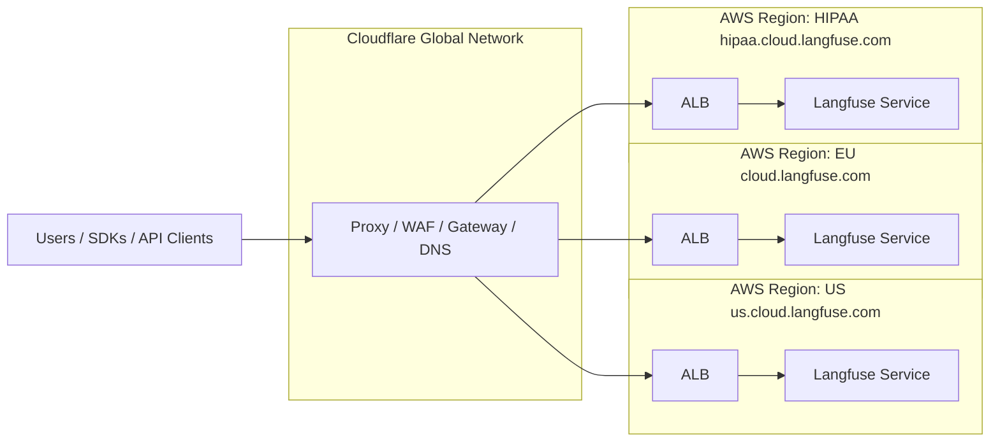

import { BlogHeader } from "@/components/blog/BlogHeader";

<BlogHeader
  title="Incident Report for Nov 18, 2025"
  description="Postmortem for the outage which caused multiple hours of downtime."
  authors={["maxdeichmann"]}
/>

As an infrastructure provider for LLM observability, evaluations, and prompt management, ensuring continuous availability for our customers is our top priority. We hold ourselves accountable for the reliability of our service.

On November 18th, our customers experienced a [multi-hour service outage](https://status.langfuse.com/incident/768837) (11:33am UTC - 02:40pm UTC) due to a global [Cloudflare outage](https://blog.cloudflare.com/18-november-2025-outage/). All API and UI traffic to Langfuse, including ingestion and prompt management, is routed through the Cloudflare proxy to our AWS Application Load Balancers (ALBs). During the outage, the Cloudflare proxy terminated all incoming requests with a 500 error code, preventing our infrastructure from serving those requests.

We clearly did not meet our own expectations regarding the reliability of our infrastructure.

## Incident Overview

During the [Cloudflare incident](https://www.cloudflarestatus.com/incidents/8gmgl950y3h7), calls to the Langfuse API and UI did not reach our infrastructure and returned error messages. We were first alerted to the incident at 11:33am UTC when our synthetic API tests detected that our health endpoints had stopped responding. At 11:48am UTC, Cloudflare acknowledged the incident on their status page. We observed intermittent service recovery, but most requests failed until full resolution around 2:40pm UTC.

Through this incident, we identified an overreliance on Cloudflare infrastructure, both within our internal systems and across our vendors. We were only able to report the incident on our status page at 12:11pm UTC, as our status page provider was also inaccessible due to the Cloudflare outage.

We were unable to take immediate mitigating actions as Cloudflare acts as our registrar, DNS management tool, and proxy/gateway/WAF. Downtime of the Cloudflare dashboard prevented us from changing DNS or proxy settings for Langfuse Cloud domains. During a period of partial access to the Cloudflare dashboard, we considered removing Cloudflare proxying and directing traffic directly to our AWS ALBs. However, we decided against this as we saw traffic resuming and lacked test data on the potential fallout of such a change. With static assets not being cached, differing TLS requirements, and other potential unknowns, an unplanned and untested routing update was deemed too risky. In retrospect, this might have increased availability during the incident, but given the data available at the time, we stand by our decision to keep Cloudflare proxying active.

As a temporary mitigation for users, we published DNS-based bypasses of the Cloudflare proxy to our AWS ALBs at 02:06pm UTC on our status page.

<Frame className="mt-6">
  
</Frame>

  _Uptime in UTC+1 from 12:00pm to 04:00pm for our US environment. (The charts
  for the other data regions are effectively the same as they are all fronted by
  the same global Cloudflare network)_

## Infrastructure Architecture

The following diagram illustrates our current infrastructure setup, showing how Cloudflare acts as a global proxy/WAF/gateway in front of our AWS infrastructure across all three regions (EU, US, and HIPAA). During the incident, this became a single point of failure.

## Moving Forward

We are dedicated to providing a reliable and resilient service. While our alerting and incident handling were effective throughout this event, the nature of the outage limited our ability to act on our insights. Consequently, we will review our dependency on single vendors across both our own infrastructure and that of our suppliers.

Having Cloudflare as a single point of failure without available mitigations is unacceptable. We will take measures to diversify and reduce our reliance on Cloudflare as a proxy, CDN, and WAF, and review its function as our registrar and DNS management solution.

Additionally, we will review supporting communication tools, such as our status page vendor, to ensure their infrastructure is decoupled from Langfuse Cloud's sub-providers.

We apologize for the impact this outage had on our users and thank you for your trust and patience.
