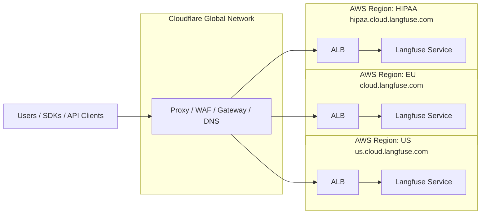

import { BlogHeader } from "@/components/blog/BlogHeader";

<BlogHeader
  title="Incident Report for Nov 18, 2025"
  description="Postmortem for the outage which caused multiple hours of downtime."
  authors={["maxdeichmann"]}
/>

On November 18th, Langfuse Cloud experienced a [multi-hour outage](https://status.langfuse.com/incidents/01KAGW71ZPD2WTXCFZQBGV7EHH) from 11:33am to 2:40pm UTC due to a global [Cloudflare incident](https://blog.cloudflare.com/18-november-2025-outage/). All API and UI traffic was unavailable during this period.

This outage was unacceptable. While the root cause was a third-party infrastructure failure, we take full responsibility for our architecture's single point of failure. This report details what happened, our response, and the concrete steps we're taking to prevent similar incidents.

## What Happened

All API and UI traffic to Langfuse, including ingestion and prompt management, is routed through the Cloudflare proxy to our AWS Application Load Balancers (ALBs). During the Cloudflare outage, the proxy terminated all incoming requests with a 500 error code, preventing our infrastructure from serving those requests.

## Incident Overview

During the [Cloudflare incident](https://www.cloudflarestatus.com/incidents/8gmgl950y3h7), calls to the Langfuse API and UI did not reach our infrastructure and returned error messages. We were first alerted at 11:33am UTC when our synthetic API tests detected that our health endpoints had stopped responding. At 11:48am UTC, Cloudflare acknowledged the incident on their status page. We observed intermittent service recovery, but most requests failed until full resolution around 2:40pm UTC.

Through this incident, we identified an overreliance on Cloudflare infrastructure, both within our internal systems and across our vendors. We could only report the incident on our status page at 12:11pm UTC, as our status page provider was also inaccessible due to the Cloudflare outage.

## Response and Mitigation Attempts

We were unable to take immediate mitigating actions as Cloudflare acts as our registrar, DNS management tool, and proxy/gateway/Web Application Firewall (WAF). Downtime of the Cloudflare dashboard prevented us from changing DNS or proxy settings for Langfuse Cloud domains.

During a period of partial access to the Cloudflare dashboard, we considered removing Cloudflare proxying and directing traffic directly to our AWS ALBs. However, we decided against this change for several reasons. We observed traffic beginning to resume, and we lacked test data on the potential impact of such a major routing change. With static assets not being cached, differing TLS requirements, and other potential unknowns, we deemed an unplanned and untested routing update too risky during an active incident.

In retrospect, this change might have increased availability during the incident. However, given the partial recovery we were observing and the risks of an untested configuration change, we stand by our decision to keep Cloudflare proxying active.

As a temporary mitigation, we published DNS-based bypasses of the Cloudflare proxy to our AWS ALBs at 02:06pm UTC on our status page for customers requiring immediate access.

<Frame className="mt-6">
  
</Frame>

  _Uptime in UTC+1 from 12:00pm to 04:00pm for our US environment. (The charts
  for the other data regions are effectively the same as they are all fronted by
  the same global Cloudflare network)_

## Timeline (UTC)

- **11:33** — Synthetic API tests detected that health endpoints stopped responding; automated alerts triggered
- **11:48** — Cloudflare acknowledged the incident on their [status page](https://www.cloudflarestatus.com/incidents/8gmgl950y3h7)
- **12:00** — Observed intermittent service recovery patterns across regions
- **12:11** — Successfully posted incident report on our [status page](https://status.langfuse.com/incident/768837) (delayed due to status page provider also being affected by Cloudflare outage)
- **~12:30** — Gained partial access to Cloudflare dashboard; evaluated removing Cloudflare proxying to route directly to AWS ALBs
- **~13:00** — Decided against configuration changes due to observed recovery patterns and risks of untested modifications
- **14:06** — Published DNS-based bypasses to AWS ALBs on status page as temporary mitigation for customers requiring immediate access
- **14:40** — Observed full service resolution; monitoring confirmed stable recovery across all regions
- **15:00** — Incident closed; continued monitoring maintained

## Infrastructure Architecture

The following diagram illustrates our current infrastructure setup, showing how Cloudflare acts as a global proxy/WAF/gateway in front of our AWS infrastructure across all three regions (EU, US, and HIPAA). During the incident, this became a single point of failure.

## Impact

The incident had the following impact on Langfuse Cloud:

**Observability and Tracing**

Most traces during the incident never reached our ingestion endpoints and are permanently lost. Only events accepted with 2xx status codes are or will be processed; those that returned errors (5xx) are lost and cannot be replayed.

**Prompt Management**

Long-running services maintained access to prompts via SDK-level caching. However, new deployments or restarts of applications led to downtime as the Langfuse Prompt Management API was unavailable during the incident.

**User Interface**

The Langfuse UI was mostly inaccessible during the incident, preventing users from monitoring their applications, reviewing traces, or managing prompts.

## Moving Forward

Having Cloudflare as a single point of failure without available mitigations is unacceptable. We are taking the following concrete actions:

**Infrastructure Diversification**

- Assess alternatives for WAF and proxy functionality without relying on Cloudflare's infrastructure
- Review and potentially migrate DNS management

**Communication Systems**

- Migrate our status page to a provider with infrastructure decoupled from Cloudflare

Thousands of teams rely on Langfuse to monitor and improve their LLM applications. This incident caused significant downtime and disruption for our users. We sincerely apologize for the impact this outage had and thank you for your continued trust and patience as we work to ensure this doesn't happen again.
