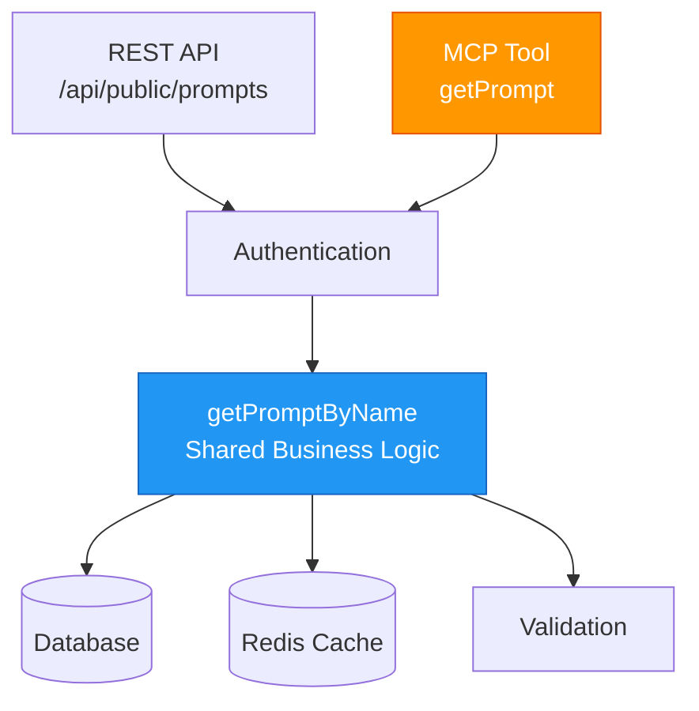
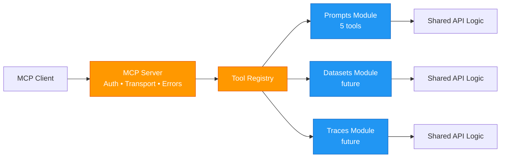

import { BlogHeader } from "@/components/blog/BlogHeader";

<BlogHeader
  title="Building Langfuse's MCP Server: Code Reuse and Developer Experience"
  description="How we built a production MCP server by reusing existing API logic, creating better abstractions, and learning what matters for LLM tool usage."
  authors={["Michael"]}
/>

The Model Context Protocol (MCP) enables AI assistants to interact directly with external tools and data sources. We built an MCP server for Langfuse to let developers manage prompts from their AI coding assistants without context switching. 

This post covers the technical decisions and implementation details of our MCP server.

## Scoping: Starting with Prompt Management

For our initial release, we scoped the MCP server to prompt management through five tools: 

1. get
2. list
3. create text
4. create chat 
5. update labels

This enables AI assistants to manage prompts in your Langfuse projects directly from their coding environment.

We plan to extend this pattern to traces, observations, datasets, evaluations, and more. Each new feature follows the same approach: reuse existing business logic, register tools through the feature module system, ship.

## Architecture: Same Logic, Different Entry Point

As a small team, we prioritize maintainability and consistency across all surfaces. 

To launch with an initial MVP, we focused on prompt management where we already had five REST endpoints handling authentication, validation, database access, caching, and rate limiting. Rather than duplicating this logic for MCP, we designed MCP tools to call the same business logic functions.

Here's what this looks like in practice. Our REST API endpoint for fetching prompts:

```typescript
// REST API: /api/public/prompts
export default async function handler(req, res) {
  // ... authentication, rate limiting ...

  const prompt = await getPromptByName({
    promptName: searchParams.name,
    projectId: authCheck.scope.projectId,
    version: searchParams.version,
  });

  return res.status(200).json(prompt);
}
```

Our MCP tool for the same operation:

```typescript
// MCP Tool: getPrompt
export const [getPromptTool, handleGetPrompt] = defineTool({
  name: "getPrompt",
  description: "Fetch a specific prompt by name...",
  handler: async (input, context) => {
    const prompt = await getPromptByName({
      promptName: input.name,
      projectId: context.projectId,  // From MCP auth
      version: input.version,
    });

    return prompt;
  },
});
```

*([View the actual implementation on GitHub](https://github.com/langfuse/langfuse/blob/main/web/src/features/mcp/features/prompts/tools/getPrompt.ts))*

Same `getPromptByName()` function. Same validation. Same database queries. Same caching. Different entry points.



This pattern extends to all operations. Our `createTextPrompt` MCP tool calls the same `createPrompt()` action as `POST /api/public/prompts`. Write operations use the same audit logging, database transactions, and error handling.

Changes to business logic automatically apply to both interfaces. When we optimize prompt caching or fix a validation bug, both APIs benefit. When we add a new field to prompts, one change propagates everywhere.

## Making Tools Easy: The defineTool Helper

Writing MCP tools involves several repetitive tasks:
- Convert Zod schemas to JSON Schema for the protocol
- Validate inputs at runtime
- Handle errors and format them for users
- Add metadata and annotations

We built `defineTool()` to handle all of this:

```typescript
export const [getPromptTool, handleGetPrompt] = defineTool({
  name: "getPrompt",
  description: [
    "Fetch a specific prompt by name with optional label or version.",
    "",
    "Retrieval options:",
    "- label: Get prompt with specific label (e.g., 'production', 'staging')",
    "- version: Get specific version number (e.g., 1, 2, 3)",
    "- neither: Returns 'production' version by default",
  ].join("\n"),

  // Base schema: used for JSON Schema generation (clean, no refinements)
  baseSchema: z.object({
    name: z.string().describe("The prompt name"),
    label: z.string().optional(),
    version: z.number().optional(),
  }),

  // Full schema: used for runtime validation (with refinements)
  inputSchema: z.object({
    name: z.string(),
    label: z.string().optional(),
    version: z.number().optional(),
  }).refine(
    (data) => !(data.label && data.version),
    { message: "Cannot specify both label and version" }
  ),

  handler: async (input, context) => {
    const prompt = await getPromptByName({ ... });
    return prompt;
  },

  readOnlyHint: true,
});
```
*([View defineTool implementation on GitHub](https://github.com/langfuse/langfuse/blob/main/web/src/features/mcp/core/define-tool.ts))*

**Why two schemas?** MCP requires JSON Schema for tool definitions, but JSON Schema can't express cross-field validations like "label and version are mutually exclusive." Zod refinements handle this at runtime. We generate JSON Schema from the base schema (without refinements) for the protocol, then validate with the full schema (with refinements) when the tool is called.

`defineTool` returns two things:
1. **Tool definition**: JSON Schema for the MCP protocol
2. **Wrapped handler**: Validates inputs, catches errors, formats responses

Adding new tools is straightforward: define schemas, write handler, register.

## Tool Descriptions: Writing for LLMs

Tool descriptions require balancing brevity with clarity. LLMs use them to decide when and how to use tools. We had to experiment and iterate to find the right balance.

| Style | Example | Issue |
| --- | --- | --- |
| Too brief | "Get a prompt" | LLM lacks context about labels, versions, or defaults |
| Too verbose | "This tool retrieves prompts from the Langfuse database. Prompts are templates used in LLM applications. They can have multiple versions identified by numeric version numbers or semantic labels like production and staging. The prompt management system supports..." | Wastes context window, reduces comprehension |

Clear purpose, key options, important constraints, and examples work best. We test descriptions with LLMs and refine based on observed behavior. Does it select the right tool? Does it pass correct parameters? Do error messages enable recovery?

For example, here's how the `getPrompt` description evolved:

| Iteration | Description | Observed behavior |
| --- | --- | --- |
| First | Fetch a prompt by name | LLM didn't know versions existed, always requested prompts without specifying which version |
| Second | Fetch a prompt by name. Supports version and label parameters for retrieving specific versions. | LLM sometimes tried using both version and label simultaneously, causing errors |
| Current | Fetch a specific prompt by name with optional label or version parameter. Cannot specify both label and version - they are mutually exclusive. | LLM correctly handles the mutual exclusivity constraint |

## Authentication: Choosing BasicAuth

MCP supports various auth patterns. We chose BasicAuth with our existing API keys: `publicKey:secretKey` encoded in base64.

Why BasicAuth?
- **Fits existing infrastructure:** We already issue project-scoped API key pairs
- **Standard and simple:** Works with all HTTP clients, no custom flows
- **Per-project isolation:** Each project gets separate keys, clean security boundary

We explicitly block organization-level keys and Bearer tokens for MCP. Each MCP session has clear, limited permissions through project-scoped keys. We might change this in the future, but for now this mirrors our public API authentication.

Rate limiting and usage tracking use the same infrastructure as our REST API: same `RateLimitService`, same Redis-backed counters.

## The Details That Matter

Implementing the MCP server, we had to deal with a few technical implementation details. 

### Stateless Per-Request Servers

We create a fresh MCP server instance for each request. Context (project ID, auth scope) is captured in closures. After the request completes, we discard the server.

This approach simplifies our architecture. No session storage. No session cleanup. Each request is independent. Horizontal scaling is straightforward. Container switchovers during continuous deployment work seamlessly.

We took inspiration from [Sentry's stateless MCP implementation](https://docs.sentry.io/product/sentry-mcp/) when designing this pattern.

### Error Handling: User vs Server Errors

MCP responses need proper error codes. We distinguish:

**User input errors** (invalid parameters, missing prompts) → `InvalidRequest` error code, helpful message
**Server errors** (database timeout, service down) → `InternalError` code, sanitized message, logged for monitoring

User errors return full details. Server errors return sanitized messages and log to our monitoring systems.

Our error formatter handles this automatically:

```typescript
export function formatErrorForUser(error: unknown): McpError {
  if (isUserInputError(error)) {
    return new McpError(ErrorCode.InvalidRequest, error.message);
  }

  if (isApiServerError(error)) {
    logger.error("MCP Server Error", { ... });
    return new McpError(
      ErrorCode.InternalError,
      "An internal error occurred. Please try again."
    );
  }

  // ... handle other error types
}
```

*([View error handling on GitHub](https://github.com/langfuse/langfuse/blob/main/web/src/features/mcp/core/error-formatting.ts))*

### Feature Modules: Self-Contained and Extensible

We wanted to launch the MCP server with support for prompts. At the same time, we wanted it to be easy to extend to add future tools from our public API.

Therefore, we designed the MCP server to handle protocol scaffolding (authentication, transport, error handling) while keeping feature domains self-contained and isolated.

Each feature module packages its tools independently:

```typescript
// Feature modules are self-contained
export const promptsFeature: McpFeatureModule = {
  name: "prompts",
  description: "Manage Langfuse prompts",
  tools: [
    { definition: getPromptTool, handler: handleGetPrompt },
    { definition: listPromptsTool, handler: handleListPrompts },
    { definition: createTextPromptTool, handler: handleCreateTextPrompt },
    { definition: createChatPromptTool, handler: handleCreateChatPrompt },
    { definition: updatePromptLabelsTool, handler: handleUpdatePromptLabels },
  ],
};

// Features register at startup
toolRegistry.register(promptsFeature);
```

*([View the registry implementation on GitHub](https://github.com/langfuse/langfuse/blob/main/web/src/features/mcp/server/registry.ts))*

The MCP server queries the registry dynamically. To add datasets, traces, or evaluations support, we create a new feature module with its tools and register it. The core server logic remains unchanged.



This separation enables parallel development. A developer adding dataset operations doesn't touch the MCP server or prompt features. They build a self-contained module that integrates through the registry interface.

### Monitoring: The SSE Gotcha

MCP uses Server-Sent Events (SSE) for real-time communication. SSE connections can remain open for extended periods. In APM tools like DataDog, long-lived connections skew aggregate request duration metrics.

A 2-second REST API endpoint and a 30-minute open SSE connection appear identical in duration-based metrics, distorting API performance dashboards. (Sorry, Max, for those midnight pager-duty alerts!)

We created a dedicated monitoring group for MCP endpoints with separate dashboards and alerting thresholds. This prevents long-tail SSE connections from affecting REST API performance measurements.

We also instrument key operations with OpenTelemetry spans (`mcp.prompts.get`, `mcp.prompts.create_text`) for detailed observability.

## Key Takeaways

If you're building an MCP server:

**Reuse existing business logic.** Share functions, validation, and error handling between MCP and REST APIs rather than duplicating code.

**Build abstractions for repetitive tasks.** Our `defineTool` helper handles schema conversion, validation, and error wrapping, reducing boilerplate.

**Test tool descriptions with LLMs.** Observe tool selection and parameter passing. Refine descriptions based on actual behavior.

**Account for SSE characteristics in monitoring.** Long-lived connections affect APM metrics differently than request-response APIs. Use separate monitoring groups.

**Reference existing implementations.** [Linear's MCP server](https://linear.app/docs/mcp) and [Sentry's implementation](https://docs.sentry.io/product/sentry-mcp/) provide useful implementation patterns.

The best way to add new capabilities is often to expose existing functionality through new interfaces.

---

## Resources

**Langfuse:**
- [MCP Documentation](https://langfuse.com/docs/api-and-data-platform/features/mcp-server)
- [GitHub Repository](https://github.com/langfuse/langfuse)

**MCP Ecosystem:**
- [Protocol Specification](https://modelcontextprotocol.io/)
- [Linear's Implementation](https://linear.app/docs/mcp)
- [Sentry's Implementation](https://docs.sentry.io/product/sentry-mcp/)

---

**We're hiring!** Langfuse is growing our engineering team. If you care about building production-quality developer tools and working on the cutting edge of LLM observability, [check out our open positions](https://langfuse.com/careers).
