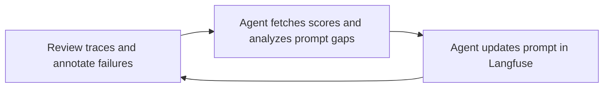

import { BlogHeader } from "@/components/blog/BlogHeader";

<BlogHeader
  title="Using Agent Skills to Automatically Improve your Prompts"
  description="Use the Langfuse API skill to analyze trace feedback and iteratively improve your prompts."
  date="February 13, 2026"
  authors={["lotteverheyden"]}
/>

import { Callout } from "nextra/components";
import { Frame } from "@/components/Frame";

This guide demonstrates how you can use an AI agent and the [Langfuse API skill](https://github.com/langfuse/skills) to iteratively improve your prompts. You annotate a handful of traces in Langfuse, then let the agent fetch your feedback, analyze the patterns, and propose prompt changes. It's a fast way to get from a rough first prompt to something more robust. It will get you from 10% to 70% before you invest in more structured evaluation like datasets and automated scoring.

We'll walk through the full loop using an example: a chatbot that searches past GitHub discussions in the Langfuse repository. We'll use Claude with the Langfuse API skill as the AI agent.

## Prerequisites

**An LLM application with Langfuse tracing set up**. If your application is not instrumented yet, you can take a look at the [tracing get started page](/docs/observability/get-started) to set it up. 

**An AI agent with the Langfuse API skill installed**. You can use any AI agent, we'll use Claude with the Langfuse API skill in this guide. You can follow the installation instructions on the [Langfuse API skill page](https://github.com/langfuse/skills/tree/main/skills/langfuse-api).

**Your prompt managed in Langfuse Prompt Management (optional)**. This guide manages the prompt in Langfuse, but you can also manage the prompt elsewhere. If you'd like to have your prompt in Langfuse, you can follow the instructions on the [Langfuse Prompt Management page](/docs/prompt-management/get-started).


## Context on the Workflow

Before diving into the walkthrough, here's a quick overview of the workflow and the example application we'll be using.

### The Concept

The workflow is a loop with three steps: you look at traces, annotate the ones that are off, and then hand your annotations to an AI agent that analyzes them and updates the prompt. Then you run the app again and repeat until the obvious issues are gone.



### The Example Application

We're using a chatbot that searches GitHub discussions in the [Langfuse repository](https://github.com/langfuse/langfuse/discussions) to help users find whether their bug or feature request has already been  in the past. 

<Frame>
  
</Frame>

It fetches its system prompt from Langfuse, searches Github multiple times with different queries, evaluates the results and responds with the issues that are relevant. Every interaction produces a trace in Langfuse.

```python
from langfuse import Langfuse, get_client, observe
from langfuse.openai import OpenAI


# using the @observe decorator to trace the function
@observe(name="github-issue-search-bot", capture_input=False)
def handle_turn(client: OpenAI, console: Console, messages: list):
    # Take the user's message as the trace input instead of the function's input parameters
    get_client().update_current_trace(input=messages[-1]["content"])

    while True:
        # This call is automatically traced by the Langfuse OpenAI wrapper
        response = client.chat.completions.create(
            model="gpt-4o-mini",
            messages=messages,
            tools=TOOLS, # tools are defined earlier in the code
        )
        choice = response.choices[0].message
        messages.append(choice)
        if not choice.tool_calls:
            break
        tool_results = handle_tool_calls(console, choice.tool_calls)
        messages.extend(tool_results)

    return choice.content

def main():
    langfuse = Langfuse()
    # Fetch the prompt from Langfuse 
    prompt = langfuse.get_prompt("github-issue-search", label="production")
    system_prompt = prompt.compile()
    messages = [{"role": "system", "content": system_prompt}]
    # ... conversation loop
```

{/* TODO: link to the full example repository */}


## Let's Dive In

Before you start, you need to have some traces to work with. If your application isn't live yet, you can manually enter a few inputs to start with. In my case, I ran the chatbot with about 10 different inputs to cover a range of cases: feature requests, bug reports, off-topic questions, and some that were intentionally vague. 

<Frame>
  
</Frame>

### Go Through your Traces and Annotate

Looking at the traces, there are likely a few things you notice right away. Some are clear mistakes, in other cases you only realize you want a different behavior while reading the trace. You'll have many scattered feedback points, which you want to write down somewhere so you have a log of things to tackle.

You can do this in Langfuse with **scores and comments**. I like to create a few [score configs](/faq/all/manage-score-configs) for the broad categories of mistakes I see. In my specific case, after looking through about 10 traces, three categories emerged that I created score configs for:

- **`response-not-relevant`**: the bot returned results, but they didn't actually answer the user's question
- **`outside-response-scope`**: the bot tried to help with something it shouldn't have, or made claims it couldn't verify
- **`bad-search-results`**: the search queries themselves were off, missing obvious keywords

> You need to create score configs in order to manually annotate your traces with these scores. See [manual scores via UI](/docs/evaluation/evaluation-methods/scores-via-ui) and [how to create and manage score configs](/faq/all/manage-score-configs) for details.

Every time you notice something, annotate the trace with the relevant score and add your specific feedback as a comment. The score gives Claude the category, the comment gives it the reason why, which is what you want Claude to address later on.

<Frame>
  
</Frame>

Here are a few examples:

| User input | Score | Comment |
|---|---|---|
| "Can I export my traces as CSV?" | `response-not-relevant` | "The tickets found clearly confirm CSV export exists, but the bot gave a vague answer instead of just saying yes." |
| "What's the weather today?" | `outside-response-scope` | "Off-topic question. Should have said this is outside its scope instead of trying to answer." |
| "I want to set up automated alerts when my LLM's latency exceeds a threshold" | `bad-search-results` | "Only searched for 'latency', missed 'alerts' entirely. There are relevant issues about automated alerts that it didn't find." |

You don't need to score every trace. Just the ones where something is clearly off. I scored 8 out of roughly 10.


### Analyze with Claude

After some time, you'll have a good collection of feedback to work with. Where in the past you might have manually started working through these points, you can now ask Claude to do a lot of the heavy lifting.

I asked it to fetch my scores:

```
Retrieve all scores that were created today. For each score, include the score
name, any comments left on the score, and the full content of the linked trace.
```

Claude pulls in everything via the Langfuse API and comes back with a structured summary:

> **Claude:** Here's a summary of all **8 annotation scores** from today. They fall into 3 score categories:
>
> **`response-not-relevant` (4 scores)**
>
> | # | User Input | Your Comment |
> |---|---|---|
> | 1 | "Tracing doesn't work" | Chatbot assumes open issue status = unresolved bug. It can't assume issues are ongoing based on ticket status alone. Sometimes an issue stays open because the user didn't explicitly confirm that it's resolved. |
> | 2 | "Can I export my traces as CSV?" | The tickets found clearly confirm CSV export exists, but the bot gave a vague answer instead of just saying yes. |
> | 3 | "I want to compare prompt versions side by side" | First result was relevant, second was an unrelated bug report. Don't surface vaguely related bug tickets for feature requests. |
> | 4 | "I want to track cost per user per day and set budget alerts" | Listed loosely related cost bugs instead of recognizing there's no matching ticket. Should have said so and suggested opening one. |
>
> **`outside-response-scope` (3 scores)**
>
> | # | User Input | Your Comment |
> |---|---|---|
> | 5 | "It would be great to have a dark mode" | Found no results but claimed "there have been discussions about dark mode in the past." That's made up. |
> | 6 | "I want to track cost per user per day and set budget alerts" | Tool calls failed but the bot gave generic advice instead of telling the user it can't reach GitHub right now. |
> | 7 | "What's the weather today?" | Off-topic question. Should have said this is outside its scope instead of trying to answer. |
>
> **`bad-search-results` (1 score)**
>
> | # | User Input | Your Comment |
> |---|---|---|
> | 8 | "I want to set up automated alerts when my LLM's latency exceeds a threshold" | Only searched for "latency", missed "alerts" entirely. There are relevant issues about automated alerts that it didn't find. |

Now ask Claude to look at the prompt itself:

```
Fetch the prompt linked to these traces. What gaps in this prompt could be
causing these issues?
```

Because our prompt is linked to the traces, Claude can fetch the correct version and analyze it. Here's the prompt it fetched (version 1):

> You are a helpful assistant that searches past GitHub issues in the Langfuse repository (langfuse/langfuse) to help users find whether their question, bug, or feature request has already been reported.
>
> When a user describes a problem or idea:
> 1. Think about what keywords and phrases would match relevant issues.
> 2. Use the search_issues tool to search. Call it multiple times with different queries to get better coverage (e.g. try synonyms, related terms, error messages).
> 3. Summarize what you found. Always include the issue number, title, state (open/closed), and URL so users can check directly.
> 4. If nothing relevant was found, let the user know it appears to be a new topic and encourage them to open an issue.
>
> Be concise but thorough.

Claude maps each annotated issue back to a specific gap:

> **Claude:** Here's what I see that could cause the annotated issues:
>
> **1. No scope guardrail** _(scores 5, 6, 7: `outside-response-scope`)_
> The prompt says "you are a helpful assistant" with no instruction to stay within scope. When asked "what's the weather?", it tried to help. It needs an explicit instruction to only handle Langfuse-related queries.
>
> **2. No guidance on tool failure** _(score 6)_
> There's no instruction for what to do when `search_issues` fails or returns errors. The bot fell back to generic advice instead of transparently telling the user the tool is unavailable.
>
> **3. No instruction to interpret results critically** _(scores 1, 2, 3, 4)_
> The prompt says "summarize what you found" but doesn't tell the bot to evaluate relevance. It lists everything it gets back, even tangentially related bug tickets for a feature request.
>
> **4. No instruction to synthesize an answer** _(score 2)_
> For the CSV export question, the tickets clearly showed CSV export exists, but the bot didn't draw that conclusion. It needs to answer the user's question first, then cite supporting issues.
>
> **5. No guidance on unverified claims** _(score 5)_
> When no results were found for dark mode, the bot invented "there have been discussions in the past." It needs to only state what it can verify from search results.
>
> **6. Search strategy is underspecified** _(score 8)_
> For the alerts query, the bot only searched "latency" and missed "alerts." It needs to decompose the user's request into its distinct concepts and search for each independently.

Six concrete issues, each traced back to your annotations. This kind of analysis across multiple traces would take a while to do by hand.

### Improve the prompt

You can iterate on the issues Claude identified if you don't completely agree with them. Once you're happy with it, you can go into improving the prompt.

```
Propose updates to this prompt that addresses the issues above. Keep it concise;
group related issues into single instructions where possible.
```

Claude will propose a revised prompt. Once you agree with all changes, you can update the prompt. You can ask Claude to update the prompt in Langfuse for you.

```
Update the prompt in Langfuse.
```

> **Claude:** Done. The updated prompt is live as **version 2** of `github-issue-search`, with the `production` and `latest` labels applied.

Here's what the diff looks like in Langfuse:

<Frame fullWidth>
  
</Frame>

### Keep iterating

You can keep doing iterations of this loop until you don't see any obvious issues. In my case, I did about 3 iterations, after which I was consistently getting good results on my small set of traces. 

## Variations

In this guide we manually annotated traces, but the same approach works with different sources of feedback:

- **User feedback from production**: If your app collects [user feedback (thumbs up/down, ratings, comments)](/docs/observability/features/user-feedback), you can fetch those via the API and use them in the same way. Be selective though: not all user feedback is actionable, so you may want to filter for feedback you actually agree with before handing it to the agent.
- **Annotation queues**: If your team reviews traces through [Langfuse annotation queues](/docs/evaluation/evaluation-methods/annotation-queues), you can fetch scores from a specific queue to work with a curated set of annotations.
- **Experiment results**: After running an [experiment](/docs/evaluation/experiments), you can fetch the scores and comments from that run. 

## What's next

At some point, it will make sense to do more structured evaluation, to make sure your prompt changes are not causing any regressions on earlier cases. 

One natural next step is to [build a dataset](/docs/evaluation/datasets) out of the traces you annotated, so you can rerun your new prompts against this fixed set of cases. You can do this using the AI agent skill too, or you can use the Langfuse UI to create a dataset. Later, you can then:

- **Run experiments**: Use [Langfuse experiments](/docs/evaluation/experiments) to compare prompt versions on your dataset, measuring accuracy, cost, and latency side by side.
- **Automate scoring**: Set up [LLM-as-judge evaluators](/docs/evaluation/evaluation-methods/llm-as-judge) for your score categories, so you don't have to review every trace yourself.
