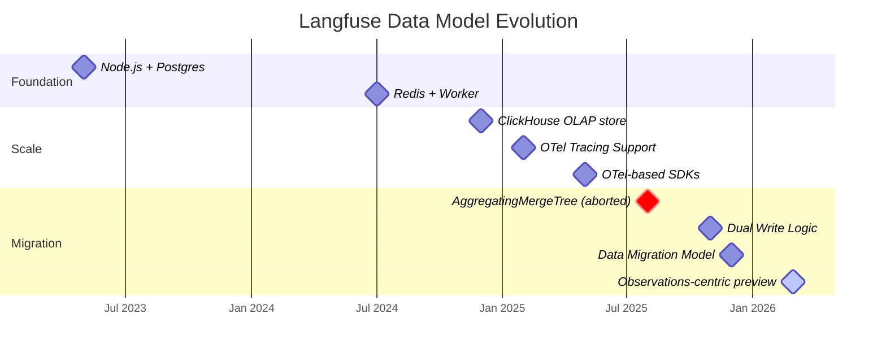
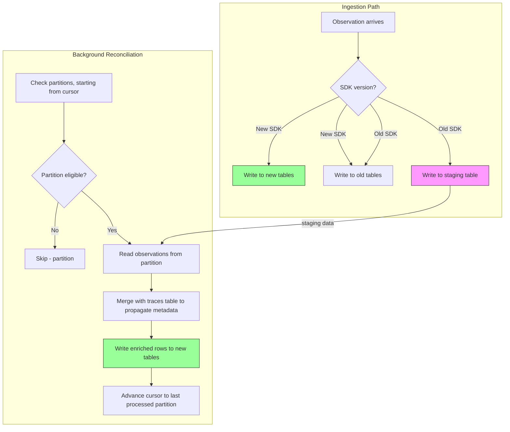

import { BlogHeader } from "@/components/blog/BlogHeader";

<BlogHeader
  title="Simplifying Langfuse for Scale"
  description="A deep dive into how we moved Langfuse to an observations-first data model."
  authors={["steffenschmitz", "valeriy", "maxdeichmann"]}
  image="/images/blog/2026-03-10-simplify-langfuse-for-scale/og.jpg"
/>

Langfuse is building the open source LLM engineering platform to help teams build production-grade LLM applications faster.
In December 2024, we released Langfuse [V3](https://langfuse.com/blog/2024-12-langfuse-v3-infrastructure-evolution) where we moved all tracing data from Postgres to ClickHouse.

Today, we are sharing a major next step in product performance and making the product simpler: our shift to an observations-centric data model.
For the rollout summary and upgrade guidance, see the [changelog post](/changelog/2026-03-10-simplify-for-scale).
It is live in Beta on Langfuse Cloud across all regions.
We are still working on the upgrade path for self-hosters and will eventually release it as a V4 major version.

With this change, we are moving to an observation-centric data model based on a new, wide, (mostly) immutable ClickHouse table.
This eliminates joins and deduplication at read-time and optimizes for the most performant ClickHouse access patterns.
Initial table loads go from seconds to milliseconds for longer durations, and dashboard charts for large projects support move from 10s of seconds to seconds.

<Frame className="flex-1">
  
</Frame>

## Growing Pain

At our initial scale, carrying our Postgres access patterns over to ClickHouse worked well enough.
By the second half of 2025, that approach had become costly.
We were working against our own data model: large users could view only a few days of data in their dashboards, listing recent traces took seconds, and some users saw high latencies and error rates on our public APIs.

### The Cost of Updates

Two years ago, LLM API calls had high latencies and users wanted to see prompts to LLMs in our UI as early as possible.
Hence, we designed the SDKs to send multiple events: one event for the invocation of the LLM API, another one for the response of the LLM, and maybe even further ones in case users update some metadata.
Seeing inputs early was convenient, so we flushed them quickly and patched outputs and metadata as they arrived. At a lower scale, this was perfectly feasible.

In Langfuse V2 we used Postgres, where this translated to straightforward upserts.
When we moved to ClickHouse in December 2024, ReplacingMergeTree was the main option for handling updates, and it required writing full-row replacements rather than updating individual fields.
We insert a new row with the same identifier and the new properties.
At the time, ClickHouse had not yet introduced lightweight updates or the [CoalescingMergeTree](https://clickhouse.com/docs/engines/table-engines/mergetree-family/coalescingmergetree), which could have been potential alternatives for us.

Implementing updates with a ReplacingMergeTree came at a higher read-time cost at an increasing scale.
ClickHouse's ReplacingMergeTree pushes deduplication to background merges, so to guarantee correctness at read-time we had to deduplicate any rows not yet merged during the read itself.
Scanning billions of records to surface only the latest version of each row \- before a single result can be returned \- consumed lots of CPU and memory, and resulted in high API latencies across Langfuses for long query durations.
Using deduplication options like `LIMIT BY`, `FINAL`, and aggregations got significantly faster in ClickHouse since our adoption, but remained a hidden tax on query performance.
Every query touching historical data carried this overhead.

In 2025 we switched from our proprietary ingestion to OpenTelemetry.
First released as an endpoint in January, we then migrated all of our first-party SDKs over to OpenTelemetry protocols over the summer.
By now, roughly 60% of all observations in Langfuse Cloud come via the OpenTelemetry endpoint.
As OpenTelemetry spans are immutable, all observations ingested into Langfuse are immutable.
These observations carry trace-level data which update the trace table, though.

For self-hosting users with OpenTelemetry-only clients, this unlocked read-time optimizations where we could skip the deduplication on our `observations` table.

### The Cost of Joins

Our original two-entity model split data across two tables: `traces` and `observations`.
Traces held their own inputs and outputs and shared metadata \- `user_id`, `session_id`, `tags` \- while observations recorded single operations within a trace such as LLM API calls or tool invocations.

Answering "What's the total cost for this user?" or "How many LLM calls happened in this session?" required joining two tables with billions of records.
Early on this was manageable.
At scale, such joins are expensive in any database and became a persistent ceiling on what large projects could query from their history.
With different join algorithms like `grace_hash_joins` and improvements around join reordering and filter push-downs we found them to work reliably within ClickHouse, but could not reach the response times we desired.
We figured we should avoid the join cost of combining `traces` and `observations` altogether by denormalizing into a single table.

While growing 19x in terms of data processed through the year, our ClickHouse node-sizes grew from 16 GiB nodes to 236 GiB nodes (a 14.75x increase).
Still, some queries on longer durations produced out of memory terminations.
Eventually, we knew that adding more compute would not be a feasible strategy to handle the growth.

### Our AWS S3 bill

To support updates using the ReplacingMergeTree strategy, we used S3 as a raw event store.
Each update contains only the diff to the previous record and we stored them on a consistent prefix.
On read, we listed, fetched, and merged all files under that prefix into a final row.
This worked as S3 scales very well and is read-after-write consistent.
Yet the S3 API calls were costly for us and our self-hosting users.
We decided on this option within the V3 go-live, as adding a different database such as Cassandra to our stack would have made Langfuse even more complex for self-hosters.
In addition, scaling linearly with throughput is a nice property compared to fixed infrastructure components.

The first win on cost reduction came with OpenTelemetry spans.
Because spans are immutable, we could write an entire batch as one object and fetch it as one \- no merging required.
Trace-level attributes still followed the original path, but that optimization alone cut S3 costs by \~85% for some self-hosters and for OpenTelemetry-only projects.
Also on Langfuse Cloud, we have seen a decline in relative S3 cost as users adopted the new SDKs.

## A Shift to Immutability

<Frame className="flex-1">
  
</Frame>

Note: We intend to overlay growth with the timeline chart.

### Experiments with AggregatingMergeTrees

Before deciding to denormalize trace attributes to spans, we tried to cut S3 costs and improve performance while keeping the two-table structure.
AggregatingMergeTrees in ClickHouse looked promising: move trace updates off S3 and into native ClickHouse aggregation, while making Otel-native observations immutable.

Initially, we used an ordering key in ClickHouse that included `project_id, toDate(timestamp), trace_id`.
This allowed us to effectively prune by timeframe and join the traces table effectively with observations as they share common properties in the ordering key.
Once traces span multiple days, we observed inconsistencies, though. Some properties were present on one day and some on the next day. Resolving those required additional aggregations which became expensive at scale across days.

Next, we used `project_id, trace_id` as the ordering key in combination with different TTLs on tables. E.g., we used `traces_amt_3d`, `traces_amt_7d`, and more.
Depending on the user-selected timeframe we would pick the appropriate one. This reduced inconsistency, but costs stepped up significantly once a query crossed over to the next boundary.

We were close to shipping this when we pulled the plug.
Optimizing cost while preserving the same experience wasn't the right framing.
Simplifying the model was.

### Why We Moved Away from Updates

We created a board with all database access patterns and how expensive they were.
We then tried to come up with a number of solutions to break the expensive query patterns.
The deduplication-based approaches available to us at the time all shared the same trade-off: the database had to scan enough data to confirm no newer row existed before producing results.
At hundreds of gigabytes and billions of records, that scan took longer than users could wait.

Since then, ClickHouse has continued to improve `FINAL` performance and introduced new options like lightweight updates.
But at our scale, we were looking for every possible advantage: every reduction in cost, every millisecond off query latency.
The most optimal path for us was a design that avoided update overhead entirely.

Immutable records gave us exactly that.
With no duplicates, the ordering key becomes authoritative - data can be streamed in disk order, and ClickHouse's MergeTree optimizations apply fully.
Table load times dropped from seconds to tens of milliseconds.

One caveat: not every update had to disappear.
For parts of our workload where update volume is manageable - like bookmarking a trace or publishing from the UI - ClickHouse's lightweight updates provide an ergonomic and simple solution without needing to use ReplacingMergeTree and handle read-time deduplication.

### From Two Tables to One

Eliminating joins meant putting everything in one table.
The challenge: `user_id`, `session_id`, `tags`, and other trace-level attributes arrive at different moments across a trace's lifecycle.
Getting them onto every observation record, in real time, required rethinking how data propagates.

We ruled out staging tables and batch jobs as a long-term strategy.
They would have broken the real-time data availability that engineers depend on when debugging.
The solution is a new propagation method in our SDKs, designed around OpenTelemetry’s Context and Baggages.
For users on older SDK versions, the existing tables provide immediate access and a delayed propagation populates data into the new format.

The query benefits are direct.
Filtering by `user_id` is now a column filter on one table.
Aggregating by `session_id` is a GROUP BY.
No join planner, no cross-table scan, just ClickHouse doing what it does well.

<Frame className="flex-1">
  
</Frame>

### Traces: From Entity to Correlation Identifier

The most visible product change in V4 is the shift to an observations-first UI.
For many users, the traces table was the primary entry point for debugging.
We think that was a limitation of the old model rather than the right default.

With thousands of observations in a single agentic trace, an observations-first view is more useful: filter for root spans, drill into a specific agent, or scan all activity across your application.
With faster load times, expanded filter capabilities, and saved views this becomes a superior experience to understand your application.
The `trace_id` becomes a correlation handle—like `session_id` or `user_id`—rather than its own top-level entity.
This also resolves a long-standing source of confusion around the two-entity model.

## Road to V4: Implementation Hurdles

### Dual Write

Before migrating the historic data, we had to write all incoming records into the old and new format.
The problem: live ingestion, where trace metadata can arrive *after* the first spans of a trace.
We needed strong write consistency across all observation records, server-side, without breaking existing SDK contracts.

We evaluated per-event delays, shared metadata stores (Cassandra, DynamoDB), and S3-based reprocessing.
Each introduced new infrastructure, new cost models, new scaling patterns.

The solution: a staging table that receives all incoming observations and trace records, plus a micro-batch job that joins trace metadata onto observations every 3 minutes with a 5-minute delay.
Based on observed data distributions, this window captures the correct metadata for the vast majority of traces while keeping data available quickly.
For newly incoming spans, the full data is propagated, but past spans remain as they are.

Early results were strong.
Then individual records went missing.
The culprit: frequent partition deletions with TTLs created large numbers of dead parts in ClickHouse's metadata store (Keeper), which slowed part propagation across nodes.
In the worst cases, individual nodes were learning about new data 25 minutes after insertion.
Working with the ClickHouse team directly, we identified the root cause, shipped a mitigation, and got a patch upstream.

A separate issue: propagation job runtimes drifted from 25–45 seconds per run to multiple minutes.
This correlated with a materialized view we have added on the destination table, which removed insert parallelization by default.
Removing that bottleneck brought runtimes back to \~45 seconds. `parallel_view_processing=1` worked like magic here.
`EXPLAIN PIPELINE graph-1 … FORMAT LineAsString` and a corresponding graphviz editor are some of our new best friends when debugging query performance.

  

    <Frame className="flex-1">
      
    </Frame>
    <Frame className="flex-1">
      
    </Frame>
  

  Insert pipeline without and with `parallel_view_processing` enabled.

### Data Migration

Moving petabytes of data between table structures is harder than it looks.
The obvious approach \- `INSERT INTO events SELECT * FROM observations JOIN traces` \- was slow, expensive, and had a long feedback cycle when errors surfaced.
We tuned query parameters, enabled disk spilling, and tried chunked inserts. None of it was fast or durable enough.

We even wrote a Rust tool that loaded observation chunks into memory, fetched matching traces, and wrote merged events and then ran it on a 100-core, 1.5 TB-memory EC2 instance.
The network became the bottleneck, which was worse for throughput than memory.

What worked: duplicating the raw tables with a new ordering key, freezing the new tables (stopping merges to prevent part modifications in ClickHouse), then processing one part at a time.
This lets us scale concurrency, keep memory bounded, and resume from any checkpoint.
With the part-freeze we could be sure that background merges don’t produce new parts which may lead to duplicate processing.
The [background migration](https://langfuse.com/self-hosting/upgrade/background-migrations) framework we built for V3 handled coordination and progress tracking.
We fetched a full part list ahead of time and concurrently processed and replicated up to 15 parts at the same time.
This approach moved us from per-partition concurrency to per-part concurrency and we could quadruple our throughput while increasing stability at the same time.

### Why Were We Still Slow?

With the new data model in place, queries were 2-3 times faster.
Better, but well below the 10–20x improvements we expected.
Digging in with ClickHouse engineers surfaced three issues:

**Part count was too high.** Partitions had \~1,000 parts where 150–200 is typical. This fragmented data and made scans inefficient. ClickHouse needed to process too many file reads to scan large amounts of data efficiently.

**Index files were too large.** Granule size was capped by the default size limit, making the index denser than necessary. Increasing the maximum granule size kept the index sparse, improved lookup speed, and allowed for better data pruning. We kept the default of 8192 rows, but moved from 10MiB per granule to 64MiB per granule as the maximum size.

**Row size was limiting merge progress.** Some parts stalled around \~100 GiB, close to the 150 GiB merge size limit, so further merges didn't trigger. Dropping redundant data (raw event copies, duplicate metadata representations) reduced row size, increased records per part, and unblocked merges.

The final piece was a new derived table.
A materialized view forwards all incoming event data, truncating large metadata, input, and output fields, into a separate ClickHouse table.
The core table handles all dashboard and table-loading queries; the full table is only hit for individual record retrieval.
With storage being relatively cheap, maintaining multiple synchronized representations became a practical tuning tool.

**These changes together delivered the benchmarks we'd been targeting.**

### New APIs

Our existing public APIs had patterns that worked at small scale and became liabilities at large scale.
`GET /api/public/traces` and `GET /api/public/traces/:id` pulled in related scores and observations with limited pagination and no required time filter, meaning any call could trigger a full-table scan.
We kept adding opt-in improvements to keep our API contracts: field selection, deduplication opt-outs.
But the defaults remained dangerous.

Our V2 of the `observations` and `metrics` APIs draws a clean line.
The new observations and metrics endpoints ([launched in public beta](https://langfuse.com/changelog/2025-12-17-v2-metrics-and-observations-api)) read from a single table, require time-based filters, support fine-grained field selection, and use token-based pagination that works with ClickHouse's data pruning rather than against it.
Most customers who switched saw immediate performance improvements.

The V1 APIs aren't going away. But V2 is the path forward.

## V4 Open Source and Self-Hosters

Today's launch is for Langfuse Cloud.
We know self-hosters are waiting \- some of our largest projects are on self-hosted infrastructure.
We're working through automated migration tooling and validating the dual-write setup for open-source ClickHouse deployments.
Migration guides and a V4 release for self-hosters will follow in the coming weeks.
