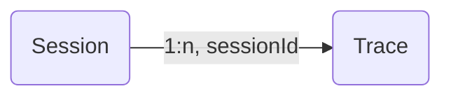

import { ChangelogHeader } from "@/components/changelog/ChangelogHeader";

<ChangelogHeader />

**Traces can now be grouped together to form a session:** Add a `sessionId` string when creating/updating a trace. All traces with the same `sessionId` will be grouped together.

_Example session spanning multiple traces_
<Frame border fullWidth>
  
</Frame>

## Other features

- Publish a session to share with others as a public link
- Bookmark a session to easily find it later
- Manually evaluate sessions by adding `scores` from the Langfuse UI

See [our docs](/docs/sessions) for more information.
