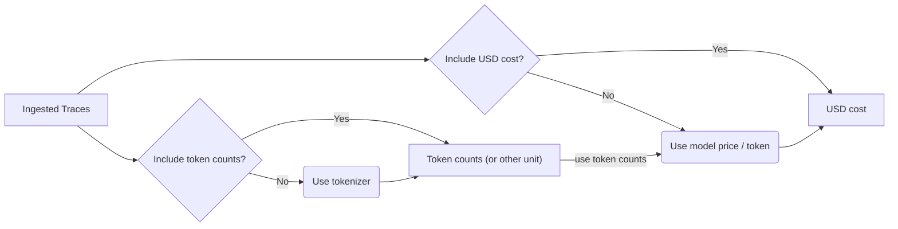

import { ChangelogHeader } from "@/components/changelog/ChangelogHeader";

<ChangelogHeader />

[Usage and cost tracking](/docs/model-usage-and-cost) of LLM completions is a core feature of Langfuse [Tracing](/docs/tracing/overview). Since the initial release of Langfuse, tons of new models were released and many users rely on fine-tuning for their applications. Until now, only a fixed list of models was supported natively by Langfuse with no way to extend/override cost or token usage.

In this major release, we have reworked the pricing and usage tracking for the entire model to achieve the following:

1. Quickly support newly emerging models.
2. Track changes in model prices.
3. Add custom models/prices at the project level.
4. Override token usage and USD cost through the API when ingesting traces.

### How it works



#### Model definition

If the `model` of a `generation` is known, Langfuse will try to use the right tokenizer and price information to derive usage and cost for you.

[See docs](/docs/model-usage-and-cost) for a detailed explanation of how model definitions work and how you can add your own.


#### Ingestion

However, you can optionally also ingest both data points yourself:

```python
langfuse.generation(
  model="gpt-3.5-turbo",
  input=[{role: "system", text:"You are a helpful assistant."},
         {role: "user", text:"What is the weather like today?"}],
  output="The weather is sunny today.",
  ...
  usage:{
    # Optional: token/character usage, see docs for details
    input: 100,
    output: 20,
    unit: "TOKENS" # or "CHARACTERS", "MILLISECONDS", "SECONDS", or "IMAGES"

    # Optional: cost, see docs for details
    input_cost: 0.047,
    output_cost: 0.0094,
  }
  ...
)
```

### API and UI

We updated the API and UI to include usage and cost on most endpoints. Let us know on [GitHub](/issue) if you are still missing this information on any endpoint you use.

### Upgrade path

[Langfuse Cloud](/docs/deployment/cloud): No action is required.

If you [self-host](/docs/deployment/self-host) Langfuse, new model/price definitions are applied to all newly ingested traces. You need to run a [migration script](/docs/deployment/self-host#migrate-models) to apply them to your existing data in Langfuse.

### More details

Check out the full [documentation](/docs/model-usage-and-cost) for more details on how to use this feature.
