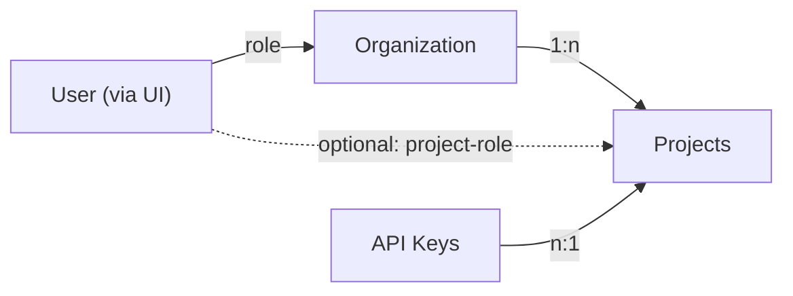

# Role-Based Access Controls in Langfuse

The role-based access control (RBAC) in Langfuse is based on organizations, projects, and roles:

- `Organizations` are the top-level entities that contain projects.
- `Projects` group all Langfuse data to allow for fine-grained role-based access control (RBAC).
- `Roles` define the permissions of users within an organization and project:
  - By default, users get assigned a role on the organizational level.
  - For more fine-grained control, users can be assigned project-roles. This is useful when you want to differentiate permissions for different projects within the same organization.

`API Keys` are used to authenticate with the Langfuse API. They are associated with a project and can be used to access the project's data programmatically. API keys are not tied to a user.

## Access Organizations and Projects

You can easily switch between organizations and projects using the dropdowns in the top navigation bar.

<CloudflareVideo
  videoId="547bdf07e1b53dc60c0690f43c7e058a"
  gifStyle
  aspectRatio={768 / 452}
  className="max-w-sm"
/>

## Roles and Scopes

- `Owner`: has all permissions
- `Admin`: can edit the project settings and grant access to other users
- `Member`: can view all metrics & create scores, but cannot configure the project
- `Viewer`: view-only access to the project and organization, most of the configuration is hidden
- `None`: no default access to the organization, to be used when user should have access to a single project only

import {
  Accordion,
  AccordionContent,
  AccordionItem,
  AccordionTrigger,
} from "@/components/ui/accordion";

export function RolePermissionTable({ roleScopes }) {
  return (
    

      {Object.entries(roleScopes).map(([role, scopes]) => (
        

          
{role}

          {scopes
            .sort((a, b) => a.localeCompare(b))
            .map((scope) => (
              

                {scope}
              

            ))}
        

      ))}
    

  );
}

<Accordion type="single" collapsible>
  <AccordionItem value="organization-scopes">
    <AccordionTrigger>Organization-level scopes</AccordionTrigger>
    <AccordionContent className="overflow-x-auto">
      <RolePermissionTable
        roleScopes={{
          OWNER: [
            "projects:create",
            "projects:transfer_org",
            "organization:update",
            "organization:delete",
            "organizationMembers:CUD",
            "organizationMembers:read",
            "langfuseCloudBilling:CRUD",
          ],
          ADMIN: [
            "projects:create",
            "projects:transfer_org",
            "organization:update",
            "organizationMembers:CUD",
            "organizationMembers:read",
          ],
          MEMBER: ["organizationMembers:read"],
          VIEWER: [],
          NONE: [],
        }}
      />
    </AccordionContent>
  </AccordionItem>
  <AccordionItem value="project-scopes">
    <AccordionTrigger>Project-level scopes</AccordionTrigger>
    <AccordionContent className="overflow-x-auto">
      <RolePermissionTable
        roleScopes={{
          OWNER: [
            "project:read",
            "project:update",
            "project:delete",
            "projectMembers:read",
            "projectMembers:CUD",
            "apiKeys:read",
            "apiKeys:CUD",
            "integrations:CRUD",
            "objects:publish",
            "objects:bookmark",
            "objects:tag",
            "traces:delete",
            "scores:CUD",
            "scoreConfigs:CUD",
            "scoreConfigs:read",
            "datasets:CUD",
            "prompts:CUD",
            "prompts:read",
            "models:CUD",
            "evalTemplate:create",
            "evalTemplate:read",
            "evalJob:CUD",
            "evalJob:read",
            "evalJobExecution:read",
            "llmApiKeys:read",
            "llmApiKeys:create",
            "llmApiKeys:delete",
            "batchExports:create",
            "batchExports:read",
            "comments:CUD",
            "comments:read",
            "annotationQueues:read",
            "annotationQueues:CUD",
            "promptExperiments:CUD",
            "promptExperiments:read",
            "auditLogs:read",
          ],
          ADMIN: [
            "project:read",
            "project:update",
            "projectMembers:read",
            "projectMembers:CUD",
            "apiKeys:read",
            "apiKeys:CUD",
            "integrations:CRUD",
            "objects:publish",
            "objects:bookmark",
            "objects:tag",
            "traces:delete",
            "scores:CUD",
            "scoreConfigs:CUD",
            "scoreConfigs:read",
            "datasets:CUD",
            "prompts:CUD",
            "prompts:read",
            "models:CUD",
            "evalTemplate:create",
            "evalTemplate:read",
            "evalJob:CUD",
            "evalJob:read",
            "evalJobExecution:read",
            "llmApiKeys:read",
            "llmApiKeys:create",
            "llmApiKeys:delete",
            "batchExports:create",
            "batchExports:read",
            "comments:CUD",
            "comments:read",
            "annotationQueues:read",
            "annotationQueues:CUD",
            "promptExperiments:CUD",
            "promptExperiments:read",
            "auditLogs:read",
          ],
          MEMBER: [
            "project:read",
            "projectMembers:read",
            "apiKeys:read",
            "objects:publish",
            "objects:bookmark",
            "objects:tag",
            "scores:CUD",
            "scoreConfigs:CUD",
            "scoreConfigs:read",
            "datasets:CUD",
            "prompts:CUD",
            "prompts:read",
            "evalTemplate:create",
            "evalTemplate:read",
            "evalJob:read",
            "evalJob:CUD",
            "evalJobExecution:read",
            "llmApiKeys:read",
            "batchExports:create",
            "batchExports:read",
            "comments:CUD",
            "comments:read",
            "annotationQueues:read",
            "annotationQueues:CUD",
            "promptExperiments:CUD",
            "promptExperiments:read",
          ],
          VIEWER: [
            "project:read",
            "prompts:read",
            "evalTemplate:read",
            "scoreConfigs:read",
            "evalJob:read",
            "evalJobExecution:read",
            "llmApiKeys:read",
            "comments:read",
            "annotationQueues:read",
            "promptExperiments:read",
          ],
          NONE: [],
        }}
      />
    </AccordionContent>
  </AccordionItem>
</Accordion>

## Managing users

### Add a new user to an organization

In the organization settings, you can add users via their email address and assign them a role. They will receive an email notification and will be able to access the organization once they log in. Users who do not have a Langfuse account yet, will be listed as pending invites until they sign up.

### Changing user roles

Any user with the `members:CUD` permission can change the role of a user in the organization settings. This will affect the user's permissions across all projects in the organization. Users can only assign roles that are lower or equal to their own role.

## Managing Projects

### Add a new project

Any user with the `projects:create` permission can create a new project within a Langfuse organization.

### Transfer a project to another organization

Only users with the `projects:transfer_organization` permission can transfer a project to another organization. This will remove the project from the current organization and add it to the new one. Access to the project will depend on the roles configured in the new organization.

During this process, no data will be lost, all project settings, data, and configurations will be transferred to the new organization. The project remains fully operational as API keys, settings (except for access management), and data will remain unchanged and associated with the project. All features (e.g. tracing, prompt management) will continue to work without any interruption.

## Project-level roles

<AvailabilityBanner
  availability={{
    hobby: "not-available",
    core: "not-available",
    pro: "team-add-on",
    enterprise: "full",
    selfHosted: "ee",
  }}
/>

Users by default inherit the role of the organization they are part of. For more fine-grained control, you can assign a user a role on the project level. This is useful when you want to differentiate permissions for different projects within the same organization.

If a project-level role is assigned, it will override the organization-level role for that project.

If you want to give a user access to only certain projects within an organization, you can set their role to `None` on the organization level and then assign them a role on the project level.

## GitHub Discussions

import { GhDiscussionsPreview } from "@/components/gh-discussions/GhDiscussionsPreview";

<GhDiscussionsPreview labels={["feat-rbac"]} />
