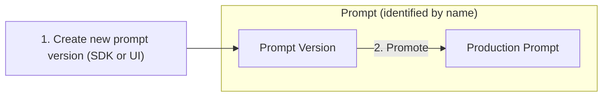

import { Callout } from "nextra-theme-docs";
import { CloudflareVideo } from "@/components/Video";

# Prompt Management

Use AssistMe to effectively manage and version your prompts. This allows you to iterate quickly, publish new prompt versions without redeploying your app, and track metrics by version.

## How to use AssistMe for prompt management

The workflow for managing prompts in AssistMe includes the following steps:

### Create / Update prompts

**Create**

<Frame border fullWidth>
  
</Frame>

**Update**

Use the edit button in the AssistMe UI or create a new prompt version via the SDKs with the same name.

### Promote prompt to production

Set a prompt version to `active` when creating. In the AssistMe UI, you can promote a prompt version to production:

<Frame border fullWidth>
  
</Frame>

