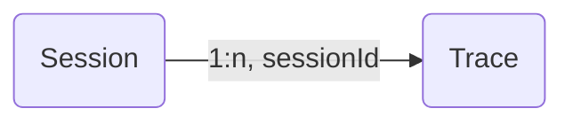

# Sessions

Many interactions with LLM applications span multiple traces. `Sessions` in AssistMe are a way to group these traces together and see a simple **session replay** of the entire interaction. Get started by adding a `sessionId` when creating a trace.

{/* _Example session spanning multiple traces_

<Frame border fullWidth>
  
</Frame> */}

## How it works



Add a `sessionId` when creating/updating a trace. This can be any string that you use to identify the session. All traces with the same `sessionId` will be grouped together.

<Tabs items={["API"]}>
  <Tab>
 
  ```bash
  curl --location 'http://staging.assistme.chat/api/v1/traces' \
  --header 'Content-Type: application/json' \
  --header 'Accept: application/json' \
  --header "Authorization: Bearer {AssistMe_public_key}"
  --data '{
    "traceId": "<string>",
    "name": "<string>",
    "value": "<integer>",
    "sessionId": "<integer>",
    "observationId": "<optional_string>"
  }'
  ```
 
  </Tab>


</Tabs>


## Other features

- Bookmark a session to easily find it later
- Manually evaluate sessions by adding `scores` from the AssistMe UI
