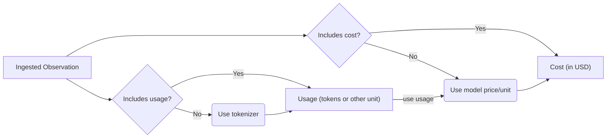

# Model Usage & Cost

Across AssistMe, usage and cost are tracked for LLM generations:

- **Usage**: token/character counts
- **Cost**: USD cost of the generation

Both usage and cost can be either

- [**ingested**](#ingest) via API or integrations
- or [**inferred**](#infer) based on the `model` parameter of the generation. AssistMe comes with a list of predefined popular models and their tokenizers including OpenAI, Anthropic, and Google models.

Ingested usage and cost are prioritized over inferred usage and cost:



## Ingest usage and/or cost [#ingest]

If available in the LLM response, ingesting usage and/or cost is the most accurate and robust way to track usage in AssistMe:

<Tabs items={["API"]}>
  <Tab>
 
  ```bash
  curl --location 'http://staging.assistme.chat/api/v1/observations' \
  --header 'Content-Type: application/json' \
  --header 'Accept: application/json' \
  --header "Authorization: Bearer {AssistMe_public_key}"
  --data '{
    "page": "<optional_string>",
    "limit": "<optional_string>",
    "name": "<optional_string>",
    "userId": "<optional_string>",
    "type": "<optional_string>",
    "traceId": "<optional_string>",
    "parentObservationId": "<optional_string>",
    "agentId": "<string>"
  }'
  ```
 
  </Tab>


</Tabs>

### Usage

If a tokenizer is specified for the model, AssistMe automatically calculates token amounts for ingested generations.

The following tokenizers are currently supported:

| Tokenizer | Package                                                                            |
| --------- | ---------------------------------------------------------------------------------- |
| `openai`  | [`js-tiktoken`](https://www.npmjs.com/package/js-tiktoken)                         |
| `claude`  | [`@anthropic-ai/tokenizer`](https://www.npmjs.com/package/@anthropic-ai/tokenizer) |

### Cost

Model definitions include prices per unit (input, output, total).

AssistMe automatically calculates cost for ingested generations if (1) usage is ingested or inferred, (2) and a matching model definition includes prices.

## Troubleshooting

**Usage and cost are missing for historical generations**. Except for changes in prices, AssistMe does not retroactively infer usage and cost for existing generations when model definitions are changed. You can request a batch job to apply new model definitions to existing generations.
